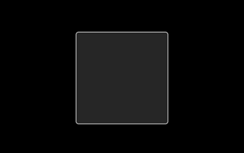

# View

The `View` class is the base class for all views. With this class you can manage the background color and images for UI components.

In this tutorial, the following subjects are covered:

[View events](#1)<br>
[Setting the Background Color](#2)<br>
[Setting the Background Image](#3)<br>

<a name="1"></a>
## View events

The following table lists the basic event provided by the `View` class:

**Table: View events**

| Input signal        | Description                                               |
| ------------------- | --------------------------------------------------------- |
| `AddedToWindow`     | Emitted after the view has been connected to the window.  |
| `FocusGained`       | Emitted when the control gets the key input focus.        |
| `FocusLost`         | Emitted when the control loses key input focus.           |
| `HoverEvent`        | Emitted when the hover input is received.                 |
| `KeyEvent`          | Emitted when the key event is received.                   |
| `LayoutDirectionChanged` | Emitted when  the layout direction property of this or a parent view is changed. |
| `Relayout`          | Emitted after the size has been set on the view during relayout. |
| `RemovedFromWindow` | Emitted after the view has been disconnected from the window. |
| `ResourcesLoaded`   | Emitted after all resources required by a view are loaded and ready. |
| `TouchEvent`        | Emitted when the touch input is received.                 |
| `VisibilityChanged` | Emitted when the visible property of this or a parent view is changed. |
| `WheelEvent`        | Emitted when the wheel event is received.                 |

<a name="2"></a>
## Setting the Background Color

You can set a background color for a UI component. To set a red background for a component:

```
View view = new View();
view.Size2D = new Size2D(200, 200);
view.BackgroundColor = Color.Red;
```

**Figure: View with a red background**


You can handle all existing views similarly. For example, to set the background color for a TextLabel:

```
TextLabel label = new TextLabel( "Hello World" );
label.BackgroundColor = Color.Red;
```

**Figure: TextLabel object with a red background**


<a name="3"></a>
## Setting the Background Image

You can set a background image of a view:

```
View view = new View();
view.BackgroundImage = "image.png";
```

**Figure: View with a background image**



## Related Information
- Dependencies
  -   Tizen 4.0 and Higher
