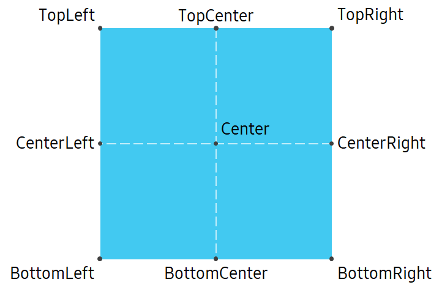
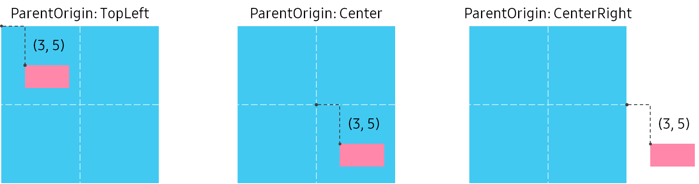
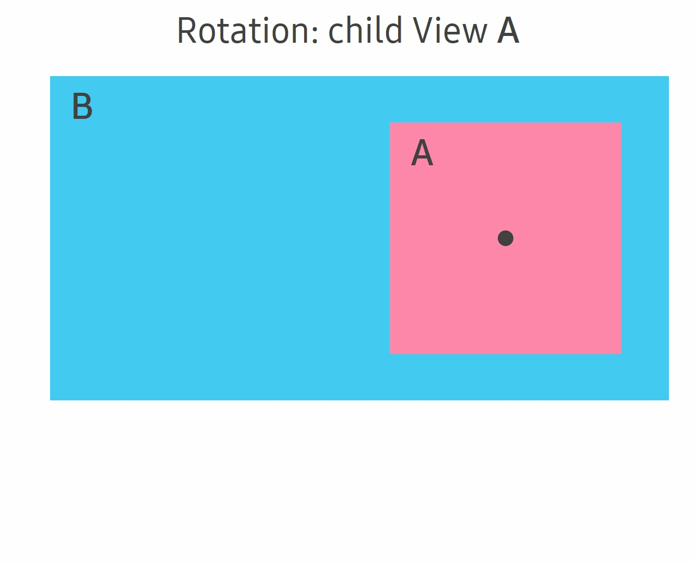
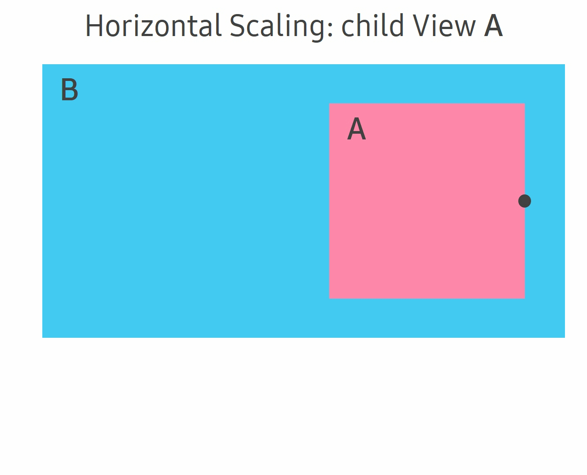

# View

[View](https://samsung.github.io/TizenFX/latest/api/Tizen.NUI.BaseComponents.View.html) is the fundamental concept for all the UI components such as `Button`, `Image`, `Text`, and so on.
`View` provides [Properties](https://samsung.github.io/TizenFX/latest/api/Tizen.NUI.BaseComponents.View.html#properties), [Methods](https://samsung.github.io/TizenFX/latest/api/Tizen.NUI.BaseComponents.View.html#methods), and [Events](https://samsung.github.io/TizenFX/latest/api/Tizen.NUI.BaseComponents.View.html#events) that are commonly used on every components. To render `View`, you must add it on [Window](https://samsung.github.io/TizenFX/latest/api/Tizen.NUI.Window.html) as a child.


<a name="1"></a>
## Transforms

`Position`, `Orientation`, and `Scale` of `View` are known as transforms.
`View` supports hierarchical structure. Therefore, `Position`, `Orientation`, and `Scale` of every `View` are affected by their parents.

The `Position` of each `View` is defined as the distance between the position of [ParentOrigin](https://samsung.github.io/TizenFX/latest/api/Tizen.NUI.BaseComponents.View.html#Tizen_NUI_BaseComponents_View_ParentOrigin) and [PivotPoint](https://samsung.github.io/TizenFX/latest/api/Tizen.NUI.BaseComponents.View.html#Tizen_NUI_BaseComponents_View_PivotPoint) of the `View`. The `ParentOrigin` is a property that defines the reference point in the parent `View`, whereas the `PivotPoint` is a property that defines the anchor point of the child. The default value for both `PivotPoint` and `ParentOrigin` is **TopLeft**. For instance, if the `Position` property of the `View` is set to (5, 3) coordinates, the `ParentOrigin` property is set to **Center**, and the `PivotPoint` property is set to **TopLeft**, then the **TopLeft** of the object is located (5, 3) coordinates away from the **Center** position of its parent's `View` object.

In addition, if the `ParentOrigin` property is changed to **BottomRight**, then the position of the **TopLeft** corner of the `View` will be located (5, 3) coordinates from the **BottomRight** corner.  

NUI provides predefined `ParentOrigin` as well as `PivotPoint` positions as shown in the following figure, and you can also use custom values for setting the position:

**Figure: Predefined positions for ParentOrigin and PivotPoint**

<table style="width:100%">
<tr>
<td style="width:100%" align="center">

</td>
</tr>
</table>

The following figure shows three cases of parent `View` and its child `View`. The parent `View` is represented by blue color and child `View` is represented by red color.
In the following examples, all of the red-colored `View` coordinates are identically located at (3, 5) of its parent coordinate system, which is based on the `ParentOrigin` property of the child `View`. `PivotPoint` is set to default **TopLeft**:

**Figure: The final position with different ParentOrigin**

<table style="width:100%">
<tr>
<td style="width:100%" align="center">

</td>
</tr>
</table>

Alternatively, you can use an arbitrary `Position` type value defined in the unit coordinates to set `ParentOrigin` without predefined values.

The `Orientation` of `View` is the rotation from its default orientation. `Scale` of `View` is the size ratio between the size to be rendered and the default size. For these two transforms, `View` is rotated and scaled around `PivotPoint`.

`Orientation` and `Scale` of `View` are also affected by the transforms of its parent. In the final calculation of `View`, `Orientation` and `Scale` of parents are first applied to the child `View` with parent's `PivotPoint`, and then `Orientation` and `Scale` of child are applied.

The following examples demonstrate the rotation and scaling that change `Orientation` and `Scale` respectively. **View A** is a child of **View B**. Therefore, transforms of **A** only affects **A**. However, the transforms of parent **B** influences its child **A**. The black dot in the figure is `PivotPoint` that is used by the transforms.

**Figure: Rotation and Scaling.**

<table style="width:100%">
<tr>
<td style="width:50%" align="center">

</td>
<td style="width:50%" align="center">

</td>
</tr>
</table>


<a name="2"></a>
## Directional navigation

NUI also provides directional navigation between each `View` using arrow keys on the keyboard. You can simply set the following properties to specify the next `FocusableView` for each direction:

- [View.UpFocusableView](https://samsung.github.io/TizenFX/latest/api/Tizen.NUI.BaseComponents.View.html#Tizen_NUI_BaseComponents_View_UpFocusableView)

- [View.DownFocusableView](https://samsung.github.io/TizenFX/latest/api/Tizen.NUI.BaseComponents.View.html#Tizen_NUI_BaseComponents_View_DownFocusableView)

- [View.LeftFocusableView](https://samsung.github.io/TizenFX/latest/api/Tizen.NUI.BaseComponents.View.html#Tizen_NUI_BaseComponents_View_LeftFocusableView)

- [View.RightFocusableView](https://samsung.github.io/TizenFX/latest/api/Tizen.NUI.BaseComponents.View.html#Tizen_NUI_BaseComponents_View_RightFocusableView)

When an arrow key is pressed and the current `View` has next `FocusableView` for that direction, the system passes focus to the next `FocusableView`. However, if the current `View` does not have the next `FocusableView` for the direction or the next `ForcusableView` is not on the window, the property returns `NULL` and no change occurs.


<a name="3"></a>
## View event

`View` provides a variety of events that are commonly used by the components. The following table lists the basic events provided by `View`:

**Table: View events**

| Event               | Description                                               |
| ------------------- | --------------------------------------------------------- |
| `KeyEvent`          | Triggered when the key input is received.                   |
| `TouchEvent`        | Triggered when the touch input is received.                 |
| `HoverEvent`        | Triggered when the hover input is received.                 |
| `WheelEvent`        | Triggered when the wheel input is received.                 |
| `FocusGained`       | Triggered when the control gets the key input focus.        |
| `FocusLost`         | Triggered when the control loses key input focus.           |
| `Relayout`          | Triggered after the size has been set on View during relayout. |
| `LayoutDirectionChanged` | Triggered when the layout direction property of View or its parent View is changed. |
| `AddedToWindow`     | Triggered after View has been connected to the window.  |
| `RemovedFromWindow` | Triggered after View has been disconnected from the window. |
| `VisibilityChanged` | Triggered when the visible property of View or parent View is changed. |
| `ResourcesLoaded`   | Triggered after all the resources required by View are loaded and ready. |

You can create custom `callback` methods with event handler for each `Event`.

Input `Event` such as `KeyEvent` and `TouchEvent` is first received on the current focused `View` to be handled. However, if the focused `View` is not having a proper event handler, then the `Event` is delivered to its parent `View` iteratively until it can be consumed.

The following code explains how to handle `Event` with a simple example of `TouchEvent`. If you touch the blue `View` then the background color is changed:

```csharp
View touchedView = new View();
touchedView.BackgroundColor = Color.Blue;
// Attach callback method
touchedView.TouchEvent += ViewTouchEventCallBack;

...

// Custom callback method
private bool ViewTouchEventCallBack(object sender, View.TouchEventArgs e)
{
    View touchedView = sender as View;
    if (e.Touch.GetState(0) == PointStateType.Down)
    {
        touchedView.BackgroundColor = Color.Red;
    }
    return true;
}
```

**Figure: TouchEvent example**


## Related information
- Dependencies
  -   Tizen 4.0 and Higher

