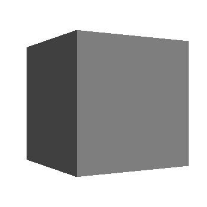
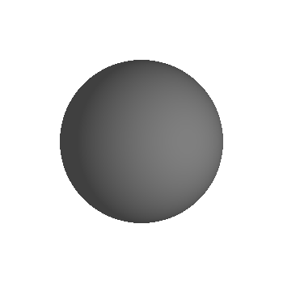
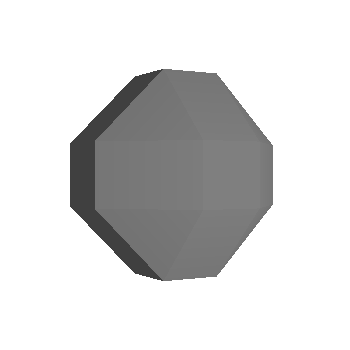
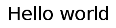

# Visuals

Visuals are the main building block for UI components. They provide reusable rendering logic that is controlled using properties and can be used by all components. They also respond to view size and color changes, and can perform clipping at the renderer level.

Every UI component has three states: `NORMAL`, `FOCUSED`, and `DISABLED`. In addition, buttons have two substates for each state: `SELECTED` and `UNSELECTED`. A visual must be defined for each state and substate. You can share the same visual across multiple states. The components's current state or substate determines which visuals are shown. For more information on styling and transitioning between state visuals, see [Styling Components with JSON](styling-controls-with-JSON.md).

NUI provides the visual types, such as the following:

-   [Border](#bordervisual)
-   [Color](#colorvisual)
-   [Gradient](#gradientvisual)
-   [Image](#imagevisual)
-   [Mesh](#meshvisual)
-   [Primitive](#primitivevisual)
-   [Text](#textvisual)
-   [Wireframe](#wireframevisual)

When you use or create a visual, you must always specify the visual type through a property map. The visual type is required to avoid ambiguity as multiple visuals can be capable of rendering the same content.

<a name="visualcreation"></a>
## Creating and Registering Visuals

To create a visual:

1.  Create a property map to set the visual properties.

    You can use property maps in two ways:

    -   Use a specific `xxxProperty` structure for the visual, such as [Tizen.NUI.ColorVisualProperty](https://developer.tizen.org/dev-guide/csapi/api/Tizen.NUI.ColorVisualProperty.html), which specifies the properties for that visual type.
    -   Use the `xxxVisual` [visual maps](#visualmap), such as `ColorVisual`.

2.  Add other required property values to the property map.

    > **Note**  
    > Add the visual type to the property map as the first entry.

3.  Create the visual in a *factory* using the property map.

    Visuals are created using the methods of the [Tizen.NUI.VisualFactory](https://developer.tizen.org/dev-guide/csapi/api/Tizen.NUI.VisualFactory.html) class:

    ```
    _colorVisual = VisualFactory.Instance.CreateVisual(colorVisual);
    ```

4.  Register the visual.

    Visuals must be registered with a unique property index, which is used for direct access to the visual. The index is used to link a view to a visual. Registering the visual also enables additional functionality, such as connecting the visual to the window. The `RegisterVisual()` method of the [Tizen.NUI.BaseComponents.CustomView](https://developer.tizen.org/dev-guide/csapi/api/Tizen.NUI.BaseComponents.CustomView.html) class stores the visual handle within the UI component.

    ```
    RegisterVisual(ColorVisualPropertyIndex, _colorVisual);
    ```

    The visuals example in this topic use property registration based on a fixed property index range. The NUI code base has been modified to perform property registration based on automatic index generation. For more information, see the [Managing Properties](creating-custom-view-controls.md#properties).

5.  Set the depth index.

    The depth index is the draw order for visuals within a view. Whenever a visual is added, the depth index increases automatically.

    > **Note**  
    > The recently registered visual is mostly always on top.


    ```
    _colorVisual.DepthIndex = ColorVisualPropertyIndex;
    ```

The examples in this topic demonstrate the recommended procedure for visual creation and registration, using explicit calls to the factory and register methods. Where specific visual assignment is possible, factory creation and registration can occur within a property. In the following example, visual factory creation and registration occur within the `Background` property:

```
textView.Background = textVisual;
```

<a name="addvisual"></a>
The `AddVisual()` method of the `Tizen.NUI.BaseComponents.VisualView` class is an example of a method that creates a visual inherently. For example, to add a visual to a view, create an instance of the [Tizen.NUI.BaseComponents.VisualView](https://developer.tizen.org/dev-guide/csapi/api/Tizen.NUI.BaseComponents.VisualView.html) class, which is derived from the [Tizen.NUI.BaseComponents.CustomView](https://developer.tizen.org/dev-guide/csapi/api/Tizen.NUI.BaseComponents.CustomView.html) class, and use the `AddVisual()` method to [add a gradient visual to it](#gradientusage):

```
/// Create new visual view and gradient visual instances
_visualView = new VisualView();
GradientVisual gradientVisualMap1 = new GradientVisual();

/// Enter the visual view properties
_visualView.ParentOrigin = ParentOrigin.TopLeft;
_visualView.PivotPoint = PivotPoint.TopLeft;
_visualView.Size2D = new Size2D(window.Size.Width, window.Size.Height);

/// Create the gradient visual

/// Add the gradient visual
_visualView.AddVisual("gradientVisual1", gradientVisualMap1);
```

<a name="visualmap"></a>
## Using Visual Maps

You can both create visuals and position, and then resize them within a control, using classes inherited from the [Tizen.NUI.VisualMap](https://developer.tizen.org/dev-guide/csapi/api/Tizen.NUI.VisualMap.html) class, which is a base class for visuals. The class encapsulates various visual properties, such as the size, offset, depth index, shader, mix color, and opacity. It also contains the transform map for the visual and provides a custom `Shader` property.

To use visual maps follow the steps:

-   You can create a property map for a visual using a `Tizen.NUI.VisualMap`-inherited class.

    The following example illustrats part of the [Tizen.NUI.ColorVisual](https://developer.tizen.org/dev-guide/csapi/api/Tizen.NUI.ColorVisual.html) class, which defines a color visual property map:

    ```
    public class ColorVisual : VisualMap

    private Color _mixColorForColorVisual = null;

    public Color Color
    {
        get
        {
            return _mixColorForColorVisual;
        }
        set
        {
            _mixColorForColorVisual = value;
            UpdateVisual();
        }
    }
    ```

-   You can create a visual from an output visual map:

    ```
    var colorMap = new ColorVisual{Color=Color.White;};
    var _colorVisual = VisualFactory.Instance.CreateVisual(colorMap.OutputVisualMap);
    RegisterVisual(ColorVisualPropertyIndex, _colorVisual);
    ```

    You can also create a visual using an output map in a control property. The following example uses the `Background` property:

    ```
    ColorVisual colorVisualMap1 = new ColorVisual();
    colorVisualMap1.Color = Color.Green;
    _visualView.Background = colorVisualMap1.OutputVisualMap;

    window.GetDefaultLayer().Add(_visualView);
    ```

-   You can position and resize visuals within a control using a visual transform property map.

    The [Tizen.NUI.VisualTransformPropertyType](https://developer.tizen.org/dev-guide/csapi/api/Tizen.NUI.VisualTransformPropertyType.html) enumeration lists the transformation properties that can be defined, such as the following:

    -   The origin and anchor points: By default, they are set to the center of the control or you can specify a different alignment using the [Tizen.NUI.Visual.AlignType](https://developer.tizen.org/dev-guide/csapi/api/Tizen.NUI.Visual.AlignType.html) enumeration values.
    -   The offset and size: By default, they are defined relative to the control size, but can also be defined as a number of pixels by specifying the offset and size policies. For example, if the `OffsetPolicy` value is `[RELATIVE, RELATIVE]` and the `SizePolicy` value is `[ABSOLUTE, ABSOLUTE]`, a visual with an `Offset` value of (0, 0.25) and a `Size` of (20, 20) is positioned at 25% above the center of the control and the size is 20 x 20 pixels.

    The following example configures a visual transform to resize an image visual to 40 x 40 pixels and center it at the beginning of the control, with a 10 pixel horizontal offset:

    ```
    OnRelayout(Vector2 viewSize, ...)

    /// Configure the image visual transform and size
    PropertyMap imageVisualTransform = new PropertyMap();
    imageVisualTransform.Add((int)VisualTransformPropertyType.Offset, new PropertyValue(new Vector2(10.0f, 0.0f)))
                        .Add((int)VisualTransformPropertyType.OffsetPolicy, new PropertyValue(new Vector2((int)VisualTransformPolicyType.Absolute, (int)VisualTransformPolicyType.Absolute)))
                        .Add((int)VisualTransformPropertyType.SizePolicy, new PropertyValue(new Vector2((int)VisualTransformPolicyType.Absolute, (int)VisualTransformPolicyType.Absolute)))
                        .Add((int)VisualTransformPropertyType.Size, new PropertyValue(new Vector2(40.0f, 40.0f)))
                        .Add((int)VisualTransformPropertyType.Origin, new PropertyValue((int)Visual.AlignType.CenterBegin))
                        .Add((int)VisualTransformPropertyType.AnchorPoint, new PropertyValue((int)Visual.AlignType.CenterBegin));
    _imageVisual.SetTransformAndSize(imageVisualTransform, size);
    ```

<a name="bordervisual"></a>
## Border Visual

The border visual renders a solid color as an internal border to the control's quad.

**Figure: Border visual**


The following table lists the supported properties. The visual type is `Border` and the visual map is `BorderVisual`.

**Table: Border visual properties**

| Property | Type | Required | Description |
|----------|------|----------|-------------|
| `Color` | `Vector4` | Yes |  The color of the border. |
| `Size` |  `float`  | Yes |   The width of the border in pixels. |
| `AntiAliasing` | `boolean` | No  |   Whether antialiasing of the border is required. |

**Usage:**

The following example illustrates how to use a `BorderVisual` visual map. The visual is created with the `AddVisual()` method.

```
private BorderVisual borderVisualMap1;

borderVisualMap1 = new BorderVisual();

borderVisualMap1.Color = Color.Red;
borderVisualMap1.BorderSize = 5.0f;

borderVisualMap1.Size = new Vector2(100.0f, 100.0f);
borderVisualMap1.Position = new Vector2(10.0f, 380.0f);
borderVisualMap1.PositionPolicy = VisualTransformPolicyType.Absolute;
borderVisualMap1.SizePolicy = VisualTransformPolicyType.Absolute;
borderVisualMap1.Origin = Visual.AlignType.TopBegin;
borderVisualMap1.AnchorPoint = Visual.AlignType.TopBegin;

_visualView.AddVisual("borderVisual1", borderVisualMap1);
```

<a name="colorvisual"></a>
## Color Visual

The color visual renders a solid color to the control's quad.

**Figure: Color visual**


The following table lists the supported properties. The visual type is `Color` and the visual map is `ColorVisual`.

**Table: Color visual properties**

| Property   | Type    | Required | Description         |
|----------|-------|--------|-------------------|
| `MixColor` |  `Vector4` | Yes      |  The color to be used. |

**Usage:**

The following example illustrates how to use a property map for a color visual. The visual is created with the factory `CreateVisual()` method.

```
private const int PROPERTY_REGISTRATION_START_INDEX = 10001000;
private const int ColorVisualPropertyIndex = PROPERTY_REGISTRATION_START_INDEX + 1;
private const int PrimitiveVisualPropertyIndex = PROPERTY_REGISTRATION_START_INDEX + 2;

private VisualBase _colorVisual;

PropertyMap colorVisual = new PropertyMap();
colorVisual.Add(Visual.Property.Type, new PropertyValue((int)Visual.Type.Color))
           .Add(ColorVisualProperty.MixColor, new PropertyValue(_color));
_colorVisual = VisualFactory.Get().CreateVisual(colorVisual);

RegisterVisual(ColorVisualPropertyIndex, _colorVisual);

/// Set the color visual depth index
_colorVisual.DepthIndex = ColorVisualPropertyIndex;
```

<a name="gradientvisual"></a>
## Gradient Visual

The gradient visual renders a smooth transition of colors to the control's quad. Both linear (left in the following figure) and radial (right in the following figure) gradients are supported.

**Figure: Gradient visual**

 

The following table lists the supported properties. The visual type is `Gradient` and the visual map is `GradientVisual`.

**Table: GradientVisualProperty properties**

| Property        | Type              | Required        | Description                              |
|---------------|-----------------|---------------|----------------------------------------|
| `StartPosition` | `Vector2`           | For linear only | The start position of the linear gradient. |
| `EndPosition`   | `Vector2`           | For linear only | The end position of the linear gradient. |
| `Center`        | `Vector2`           | For radial only | The center point of the radial gradient.        |
| `Radius`        | `float`             | For radial only | The size of the radius.                  |
| `StopOffset`    | `float` array   | No              | All the stop offsets. If not supplied, default is 0.0 and 1.0. |
| `StopColor`     | `Vector4` array  | Yes             | The color at the stop offsets. At least two are required to show a gradient. |
| `Units`         | `integer` or `string` | No              | The coordinate system.                   |
| `SpreadMethod`  | `integer` or `string` | No              | Indicates what happens if a gradient starts or ends inside bounds. |

### Units
The `Units` are used to define the coordinate system for the attributes:
 -  Start (x1, y1) and end (x2, y2) points of a line, if using a linear gradient.
 -  Center point (cx, cy) and radius (r) of a circle, if using a radial gradient.

### SpreadMethod
The `SpreadMethod` property indicates what happens if the gradient starts or ends inside the bounds of the target rectangle.

**Table: SpreadMethod values**

| Enumeration value | Description                              |
| ----------------- | ---------------------------------------- |
| `Pad`             | Default, uses the terminal colors of the gradient to fill the remainder of the quad. |
| `Reflect`         | Reflects the gradient pattern start-to-end, end-to-start, start-to-end, and so on, until the quad is filled. |
| `Repeat`          | Repeats the gradient pattern start-to-end, start-to-end, start-to-end, and so on, until the quad is filled. |

<a name="gradientusage"></a>
**Usage:**

The following example illustrates how to [add a gradient visual](#addvisual) to a [Tizen.NUI.BaseComponents.VisualView](https://developer.tizen.org/dev-guide/csapi/api/Tizen.NUI.BaseComponents.VisualView.html) class instance. The instance is a custom view, and the visual is created with the `AddVisual()` method:

```
/// Radial
_visualView = new VisualView();

GradientVisual gradientVisualMap1 = new GradientVisual();

PropertyArray stopPosition = new PropertyArray();
stopPosition.Add(new PropertyValue(0.0f));
stopPosition.Add(new PropertyValue(0.3f));
stopPosition.Add(new PropertyValue(0.6f));
stopPosition.Add(new PropertyValue(0.8f));
stopPosition.Add(new PropertyValue(1.0f));
gradientVisualMap1.StopOffset = stopPosition;

PropertyArray stopColor = new PropertyArray();
stopColor.Add(new PropertyValue(new Vector4(129.0f, 198.0f, 193.0f, 255.0f) / 255.0f));
stopColor.Add(new PropertyValue(new Vector4(196.0f, 198.0f, 71.0f, 122.0f) / 255.0f));
stopColor.Add(new PropertyValue(new Vector4(214.0f, 37.0f, 139.0f, 191.0f) / 255.0f));
stopColor.Add(new PropertyValue(new Vector4(129.0f, 198.0f, 193.0f, 150.0f) / 255.0f));
stopColor.Add(new PropertyValue(Color.Yellow));

gradientVisualMap1.StopColor = stopColor;
gradientVisualMap1.Center = new Vector2(0.5f, 0.5f);
gradientVisualMap1.Radius = 1.414f;
gradientVisualMap1.Size = new Vector2(100.0f, 100.0f);
gradientVisualMap1.Position = new Vector2(120.0f, 380.0f);
gradientVisualMap1.PositionPolicy = VisualTransformPolicyType.Absolute;
gradientVisualMap1.SizePolicy = VisualTransformPolicyType.Absolute;
gradientVisualMap1.Origin = Visual.AlignType.TopBegin;
gradientVisualMap1.AnchorPoint = Visual.AlignType.TopBegin;

_visualView.AddVisual("gradientVisual1", gradientVisualMap1);
```
<a name="imagevisual"></a>
## Image Visual

The image visual renders an image into the control's quad. There are different rendering visuals depending on the image extension:

-   [Normal (Quad) image](#normal)
-   [N-patch image](#npatch)
-   [SVG image](#svg)
-   [Animated image](#animated)

The visual type for all of them is `Image`.

<a name="normal"></a>
### Normal (Quad) Image

The normal image visual renders a raster image (such as JPG or PNG) into the control's quad.

**Figure: Normal image visual**


The following table lists the supported properties. The visual map for a normal image is `ImageVisual`.

**Table: Image visual properties**

| Property        | Type              | Required | Description                              |
|---------------|-----------------|--------|----------------------------------------|
| `URL`           | `string`            | Yes      | The URL of the image.                    |
| `FittingMode`   | `integer` or `string` | No       | Fitting options, used when re-sizing images to fit the specified dimensions. |
| `SamplingMode`  | `integer` or `string` | No       | Filtering options, used when sampling original pixels to resize images. |
| `DesiredWidth`  | `integer`               | No       | The desired image width. Uses an actual image width if not specified. |
| `DesiredHeight` | `integer`               | No       | The desired image height. Uses an actual image height if not specified. |
| `PixelArea`     | `Vector4`           | No       | The image area to be displayed. The default value is [0.0, 0.0, 1.0, 1.0]. |
| `WrapModeU`     | `integer` or `string` | No       | Wrap mode for the U coordinate.          |
| `WrapModeV`     | `integer` or `string` | No       | Wrap mode for the V coordinate.          |

**Usage:**

The following example illustrates how to use a property map for a normal image visual. The visual is created with the factory `CreateVisual()` method.

```
PropertyMap imageVisual = new PropertyMap();
imageVisual.Add(Visual.Property.Type, new PropertyValue((int)Visual.Type.Image))
           .Add(ImageVisualProperty.URL, new PropertyValue(_imageURL));
_imageVisual = VisualFactory.Get().CreateVisual(imageVisual);

RegisterVisual(ImageVisualPropertyIndex, _imageVisual);

/// Set the image visual depth index
_imageVisual.DepthIndex = ImageVisualPropertyIndex;
```

<a name="npatch"></a>
### N-Patch Image

The n-patch image visual renders an n-patch or a 9-patch image. It uses non quad geometry. Both geometry and texture are cached to reduce memory consumption, if the same n-patch image is used elsewhere.

**Figure: N-patch image visual**


The visual map for an n-patch image is `NPatchVisual`.

<a name="svg"></a>
### SVG Image

The SVG image visual renders an SVG image into the control's quad. It supports the following features from the [SVG Tiny 1.2 Specification](https://www.w3.org/TR/SVGTiny12):

-   Basic shapes
-   Paths
-   Solid color fill
-   Gradient color fill
-   Solid color stroke

The following features are not supported:

-   Gradient color stroke
-   Dash array stroke
-   View box
-   Text
-   Clip path

**Figure: SVG image visual**


The visual map for an SVG image is `SVGVisual`.

<a name="animated"></a>
### Animated Image

The animated image visual renders an animated image into the control's quad. Currently, only the GIF format is supported, but an API to enable multiple images to be displayed sequentially is being developed.

**Figure: Animated image visual**


The visual map for an animated image is `AnimatedImageVisual`.

<a name="meshvisual"></a>
## Mesh Visual

The mesh visual renders a mesh using a `.obj` file, optionally with textures provided by a `.mtl` file. The mesh is scaled to fit the control.

**Figure: Mesh visual**


The following table lists the supported properties. The visual type is `Mesh` and the visual map is `MeshVisual`.

**Table: Mesh visual properties**

| Property         | Type              | Required          | Description                              |
|----------------|-----------------|-----------------|----------------------------------------|
| `ObjectURL`      | `string`            | Yes               | The location of the `.obj` file.         |
| `MaterialURL`    | `string`            | No                | The location of the `.mtl` file. Leave blank for a textureless object. |
| `TexturesPath`   | `string`            | If using material | The path to the directory where the textures (including gloss and normal) are stored. |
| `ShadingMode`    | `integer` or `string` | No                | The type of the shading mode that the mesh uses. |
| `UseMipmapping`  | `boolean`           | No                | Whether to use mipmaps for textures. By default, `true`. |
| `UseSoftNormals` | `boolean`          | No                | Whether to average normals at each point to smoother the textures. By default it is `true`. |
| `LightPosition`  | `Vector3`           | No                | The position, in the stage space of the point light that applies lighting to the model. |

-   The `ShadingMode` property defines the shading mode type used by the mesh.

    **Table: Shading mode values**

    | Enumeration value                      | Description                              |
    |--------------------------------------|----------------------------------------|
    | `TexturelessWithDiffuseLighting`       | Simplest, one color that is lit by ambient and diffuse lighting. |
    | `TexturedWithSpecularLighting`         | Uses only the visual image textures provided with specular lighting in addition to ambient and diffuse lighting. |
    | `TexturedWithDetailedSpecularLighting` | Uses all textures provided including a gloss, normal, and texture map along with specular, ambient, and diffuse lighting. |

**Usage:**

The following example shows how to use a `MeshVisual` visual map. The visual is created in the `AddVisual()` method.

```
MeshVisual meshVisualMap1 = new MeshVisual();

meshVisualMap1.ObjectURL = resources + "/models/Dino.obj";
meshVisualMap1.MaterialtURL = resources + "/models/Dino.mtl";
meshVisualMap1.TexturesPath = resources + "/images/";
meshVisualMap1.ShadingMode = MeshVisualShadingModeValue.TexturedWithSpecularLighting;

meshVisualMap1.Size = new Size2D(400, 400);
meshVisualMap1.Position = new Position2D(-50, 600);
meshVisualMap1.PositionPolicy = VisualTransformPolicyType.Absolute;
meshVisualMap1.SizePolicy = VisualTransformPolicyType.Absolute;
meshVisualMap1.Origin = Visual.AlignType.TopBegin;
meshVisualMap1.AnchorPoint = Visual.AlignType.TopBegin;

_visualView.AddVisual("meshVisual1", meshVisualMap1);
```

<a name="primitivevisual"></a>
## Primitive Visual

The primitive visual renders a simple three-dimensional shape, such as a cube or sphere. The shape is scaled to fit the control. By default, shapes are generated with clockwise winding and back-face culling.

**Figure: Primitive visual**



The following table lists the supported properties. The visual type is `Primitive` and the visual map is `PrimitiveVisual`.

**Table: Primitive visual properties**

| Property            | Type              | Description                              |
|-------------------|-----------------|----------------------------------------|
| `Shape`             | `integer` or `string` | The shape to render.          |
| `MixColor`          | `Vector4`           | The color of the shape.                |
| `Slices`            | `integer`           | The number of slices going around the shape. |
| `Stacks`            | `integer`           | The number of layers going down the shape. |
| `ScaleTopRadius`    | `float`             | For conical frustums, the top circle scale radius. |
| `ScaleBottomRadius` | `float`             | For conical frustums, the bottom circle scale radius. |
| `ScaleHeight`       | `float`             | For conics, the scale height.    |
| `ScaleRadius`       | `float`             | For cylinders, the scale radius.  |
| `ScaleDimensions`   | `Vector3`           | For cuboids, the dimensions. They scale in the same way as for a 9-patch image. |
| `BevelPercentage`   | `float`             |  For cuboids, the amount of beveling is based on the cuboid's smallest dimension.|
| `BevelSmoothness`   | `float`             |  For cuboids, the beveled edge smoothness. |
| `LightPosition`     | `Vector3`           | The position, in the stage space, of the point light, that apply lighting to the model. |

-   You can select from seven `Shape` values, some of which are specializations as compared to another.

    **Table: Shape values**

    | Enumeration value | Description                              |
    |-----------------|----------------------------------------|
    | `Sphere`          | The default shape.                                 |
    | `ConicalFrustrum` | The area bound between two circles (basically, a cone with the tip removed). |
    | `Cone`            | Equivalent to a conical frustum with a top radius of 0. |
    | `Cylinder`        | Equivalent to a conical frustum with equal radii for the top and bottom circles. |
    | `Cube`            | Equivalent to a beveled cube with a bevel percentage of 0. |
    | `Octahedron`      | Equivalent to a beveled cube with a bevel percentage of 1. |
    | `BevelledCube`    | A cube/cuboid with all edges flattened to some degree. |

**Usage:**

The following example illustrates how to use a property map for a primitive visual. The visual is created with the factory `CreateVisual()` method.

```
public int Shape
{
    get
    {
        return _shape;
    }
    set
    {
        _shape = value;

        /// Create and register the primitive visual
        PropertyMap primitiveVisual = new PropertyMap();
        primitiveVisual.Add(Visual.Property.Type, new PropertyValue((int)Visual.Type.Primitive))
                       .Add(PrimitiveVisualProperty.Shape, new PropertyValue(_shape))
                       .Add(PrimitiveVisualProperty.BevelPercentage, new PropertyValue(0.3f))
                       .Add(PrimitiveVisualProperty.BevelSmoothness, new PropertyValue(0.0f))
                       .Add(PrimitiveVisualProperty.ScaleDimensions, new PropertyValue(new Vector3(1.0f, 1.0f, 0.3f)))
                       .Add(PrimitiveVisualProperty.MixColor, new PropertyValue(new Vector4((245.0f/255.0f), (188.0f/255.0f), (73.0f/255.0f), 1.0f)));
        _primitiveVisual = VisualFactory.Get().CreateVisual(primitiveVisual);
        RegisterVisual(PrimitiveVisualPropertyIndex, _primitiveVisual);

        /// Set the primitive visual depth index
        _primitiveVisual.DepthIndex = PrimitiveVisualPropertyIndex;
    }
}
```

### Primitive Visual Examples

- **Sphere:**

    

- **Conics:**

    | Frustum                                | Cone                    | Cylinder                        |
    |---------------------------------------|-----------------------|-------------------------------|
    |  |  |  |

- **Bevel:**

   The bevel percentage defines the ratio of the outer face widths to the overall cuboid width, based on the shape's smallest dimension. Its range is 0.0 to 1.0.

    | 0.0 (cube)                               | 0.3                                      |
    |----------------------------------------|----------------------------------------|
    |                   |  |
    | **0.7** | **1.0 (octahedron)** |
    |  |       |

- **Slices:**

    For spheres and conical frustums, `Slices` defines how many divisions there are, going around the shape.

    

- **Stacks:**

    For spheres, `Stacks` defines how many layers there are, going down the shape.

    

<a name="textvisual"></a>
## Text Visual

The text visual renders text within a control.

**Figure: Text visual**



The following table lists the supported properties. The visual type is `Text` and the visual map is `TextVisual`.

**Table: Text visual properties**

| Property              | Type    | Required | Description                              |
|---------------------|-------|--------|----------------------------------------|
| `Text`                | `string`  | Yes      | The text to display in UTF-8 format.     |
| `FontFamily`          | `string`  | No       | The requested font family to use.        |
| `FontStyle`           | `Map`     | No       | The requested font style to use.         |
| `PointSize`           | `float`   | Yes      | The font size in points.                 |
| `MultiLine`           | `boolean` | No       | Whether to use a multi-line layout.      |
| `HorizontalAlignment` | `string`  | No       | The line horizontal alignment (`BEGIN`, `CENTER`, or `END`). |
| `VerticalAlignment`   | `string`  | No       | The line vertical alignment (`TOP`, `CENTER`, or `BOTTOM`). |
| `TextColor`           | `Vector4` | No       | The text color.                          |
| `EnableMarkup`        | `boolean` | No       | Whether markup processing is enabled.    |

**Usage:**

The following example shows how to use a property map for a text visual. The visual is created with the factory `CreateVisual()` method.

```
PropertyMap textVisual = new PropertyMap();
textVisual.Add(Visual.Property.Type, new PropertyValue((int)Visual.Type.Text))
          .Add(TextVisualProperty.Text, new PropertyValue(_name))
          .Add(TextVisualProperty.TextColor, new PropertyValue(Color.White))
          .Add(TextVisualProperty.PointSize, new PropertyValue(7))
          .Add(TextVisualProperty.HorizontalAlignment, new PropertyValue("CENTER"))
          .Add(TextVisualProperty.VerticalAlignment, new PropertyValue("CENTER"));
_textVisual = VisualFactory.Get().CreateVisual(textVisual);
RegisterVisual(TextVisualPropertyIndex, _textVisual);

/// Set the text visual depth index
_textVisual.DepthIndex = TextVisualPropertyIndex;
```

<a name="wireframevisual"></a>
## Wireframe Visual

The wireframe visual renders a wireframe around a control's quad. It is mainly used for debugging and is the visual that replaces all other visuals when **Visual Debug Rendering** is switched on. To switch **Visual Debug Rendering** on, set the `DALI_DEBUG_RENDERING` environment variable to 1 before launching the application.

**Figure: Wireframe visual**


## Related Information
- Dependencies
  -   Tizen 4.0 and Higher
