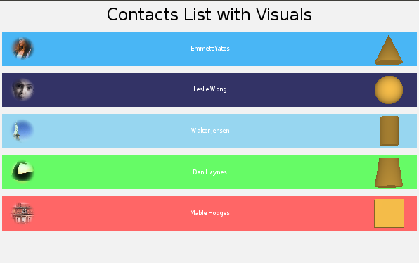

# Visuals
## Dependencies
-   Tizen 4.0 and Higher

Visuals are the main building block for controls. You can create a reusable rendering logic, which can be used by all controls, using visuals. The content rendering can be controlled using properties. Visuals also respond to view size and color changes, and can perform clipping at the renderer level.

As an example, images, icons and text are added to buttons using visuals. A control has 3 states - `NORMAL`, `FOCUSED`, and `DISABLED`. Additionally, buttons have 2 substates: `SELECTED` and `UNSELECTED`. The button's appearance can be modified by setting properties for the various 'state' visuals. Each state and sub-state has mandatory visuals, and several states can share a visual. When the button is clicked, it goes from the unselected state to the selected state. The unselected state visuals are replaced by the selected state visuals. When the button is disabled, the background, button, and selected state visuals are replaced by the disabled state visuals. To learn more about how to build up and transition between visuals for button states using JSON stylesheets, see [Styling Controls with JSON](styling-controls-with-JSON.md).

To create a visual:

1.  Create a property map.
2.  Add the visual type to the property map as the first entry.
3.  Add the required property values to the map.
4.  Create the visual in a 'factory' using the property map.
5.  Register the visual.

<a name="visualproperties"></a>
## Visual Properties

Visual properties are set using a property map.

You can use property maps in 2 ways:

-   Use the specific `xxxProperty` structures for each visual, such as `ColorVisualProperty`, which specify the properties for that visual type.
-   Use the `xxxVisual` [visual maps](#visualmap), such as `ColorVisual`.

<a name="visualtype"></a>
## Visual Type 

You must specify the visual type to use/create in the property map. This is required to avoid ambiguity, as multiple visuals can be capable of rendering the same content.

The following visual types are available:

-   Border
-   Color
-   Gradient
-   Image
    -   NPatch
    -   SVG
    -   Animated Image
-   Mesh
-   Primitive
-   WireFrame
-   Text

<a name="visualcreation"></a>
## Creating and Registering Visuals 

Visuals are created using factory methods.

Visuals must be registered with a unique property index, used for direct access to the visual. The index can be used to link a view to a visual when required. Registration also enables extra functionality, such as connecting the visual to the window. The `RegisterVisual()` method stores the visual 'handle' within the control.

The examples in this topic demonstrate the recommended procedure for visual creation and registration, using explicit calls to the factory and register methods:

``` 
_colorVisual =  VisualFactory.Instance.CreateVisual( colorVisual );

RegisterVisual( ColorVisualPropertyIndex, _colorVisual );

_colorVisual.DepthIndex = ColorVisualPropertyIndex;
```

Where specific visual assignment is possible, factory creation and registration can occur within the API. In the following example, visual factory creation and registration occur within the `Background` property.

``` 
textView.Background = textVisual;
```

The `AddVisual()` method of the `VisualView` class is another example of an API that creates a visual inherently.

The example visuals in this topic use property registration based on a fixed property index range. The NUI code base has been modified to perform property registration based on automatic index generation. For more information, see [Properties in Custom Views](creating-custom-view-controls.md#properties).

<a name="visualdepthindex"></a>
## Visual Depth Index 

The depth index is the draw order for visuals within a view. Whenever a visual is added, the depth index increases automatically. The last registered visual is always on top.

<a name="colorvisual"></a>
## Color Visual

The color visual renders a solid color to the control's quad.

**Figure: Color visual**


The following table lists the supported `ColorVisualProperty` properties. The visual type is `Color` and the visual map is `ColorVisual`.

**Table: ColorVisualProperty properties**

| Property   | Type    | Required | Description         |
| ---------- | ------- | -------- | ------------------- |
| `MixColor` | VECTOR4 | Yes      | The color required. |

**Usage:**

``` 
private const int PROPERTY_REGISTRATION_START_INDEX = 10001000;
private const int ColorVisualPropertyIndex = PROPERTY_REGISTRATION_START_INDEX+1 ;
private const int PrimitiveVisualPropertyIndex = PROPERTY_REGISTRATION_START_INDEX+2;

private VisualBase _colorVisual;

PropertyMap colorVisual = new PropertyMap();
colorVisual.Add( Visual.Property.Type, new PropertyValue( (int)Visual.Type.Color ))
           .Add( ColorVisualProperty.MixColor, new PropertyValue( _color ));
_colorVisual =  VisualFactory.Get().CreateVisual( colorVisual );

RegisterVisual( ColorVisualPropertyIndex, _colorVisual );

// Set the color visual depth index
_colorVisual.DepthIndex = ColorVisualPropertyIndex;
```

<a name="gradientvisual"></a>
## Gradient Visual 

The gradient visual renders a smooth transition of colors to the control's quad. Both linear (left in the following figure) and radial (right in the following figure) gradients are supported.

**Figure: Gradient visual**

 

The following table lists the supported `GradientVisualProperty` properties. The visual type is `Gradient` and the visual map is `GradientVisual`.

**Table: GradientVisualProperty properties**

| Property        | Type              | Required        | Description                              |
| --------------- | ----------------- | --------------- | ---------------------------------------- |
| `StartPosition` | VECTOR2           | For linear only | The start position of the linear gradient. |
| `EndPosition`   | VECTOR2           | For linear only | The end position of the linear gradient. |
| `Center`        | VECTOR2           | For radial only | The center point of the gradient.        |
| `Radius`        | FLOAT             | For radial only | The size of the radius.                  |
| `StopOffset`    | ARRAY of FLOAT    | No              | All the stop offsets. If not supplied, default is 0.0 and 1.0. |
| `StopColor`     | ARRAY of VECTOR4  | Yes             | The color at the stop offsets. At least 2 are required to show a gradient. |
| `Units`         | INTEGER or STRING | No              | The coordinate system.                   |
| `SpreadMethod`  | INTEGER or STRING | No              | Indicates what happens if a gradient starts or ends inside bounds. |

-   The `Units` are used to define the coordinate system for the attributes:
    -   Start (x1, y1) and end (x2, y2) points of a line, if using a linear gradient.
    -   Center point (cx, cy) and radius (r) of a circle, if using a radial gradient.

- The `SpreadMethod` property indicates what happens if the gradient starts or ends inside the bounds of the target rectangle.

    **Table: SpreadMethod values**

    | Enumeration value | Description                              |
    | ----------------- | ---------------------------------------- |
    | `Pad`             | Default. Uses the terminal colors of the gradient to fill the remainder of the quad. |
    | `Reflect`         | Reflects the gradient pattern start-to-end, end-to-start, start-to-end, and so on, until the quad is filled. |
    | `Repeat`          | Repeats the gradient pattern start-to-end, start-to-end, start-to-end, and so on, until the quad is filled. |

**Usage:**

The following example shows how to add a gradient visual to a `VisualView` instance. `_visualView` is a custom view, and the visual is created using the `AddVisual()` method. For more information, see [VisualView Class](#visualview).

``` 
// Radial
_visualView = new VisualView();

GradientVisual gradientVisualMap1 = new GradientVisual();

PropertyArray stopPosition = new PropertyArray();
stopPosition.Add(new PropertyValue(0.0f));
stopPosition.Add(new PropertyValue(0.3f));
stopPosition.Add(new PropertyValue(0.6f));
stopPosition.Add(new PropertyValue(0.8f));
stopPosition.Add(new PropertyValue(1.0f));
gradientVisualMap1.StopOffset = stopPosition;

PropertyArray stopColor = new PropertyArray();
stopColor.Add(new PropertyValue(new Vector4(129.0f, 198.0f, 193.0f, 255.0f) / 255.0f));
stopColor.Add(new PropertyValue(new Vector4(196.0f, 198.0f, 71.0f, 122.0f) / 255.0f));
stopColor.Add(new PropertyValue(new Vector4(214.0f, 37.0f, 139.0f, 191.0f) / 255.0f));
stopColor.Add(new PropertyValue(new Vector4(129.0f, 198.0f, 193.0f, 150.0f) / 255.0f));
stopColor.Add(new PropertyValue(Color.Yellow));

gradientVisualMap1.StopColor = stopColor;
gradientVisualMap1.StartPosition = new Vector2(0.5f, 0.5f);
gradientVisualMap1.EndPosition = new Vector2(-0.5f, -0.5f);
gradientVisualMap1.Center = new Vector2(0.5f, 0.5f);
gradientVisualMap1.Radius = 1.414f;
gradientVisualMap1.Size = new Vector2(100.0f, 100.0f);
gradientVisualMap1.Position = new Vector2(120.0f, 380.0f);
gradientVisualMap1.PositionPolicy = VisualTransformPolicyType.Absolute;
gradientVisualMap1.SizePolicy = VisualTransformPolicyType.Absolute;
gradientVisualMap1.Origin = Visual.AlignType.TopBegin;
gradientVisualMap1.AnchorPoint = Visual.AlignType.TopBegin;

_visualView.AddVisual("gradientVisual1", gradientVisualMap1);
```
<a name="imagevisual"></a>
## Image Visual

The image visual renders an image into the control's quad. There are different rendering visuals depending on the image extension:

-   [Normal (Quad) image](#normal)
-   [N-patch image](#npatch)
-   [SVG image](#svg)
-   [Animated image](#animated)

The visual type is `Image`.

<a name="normal"></a>
### Normal (Quad) Image 

The normal image visual renders a raster image (such as JPG or PNG) into the control's quad.

**Figure: Normal image visual**


The visual map for a normal image is `ImageVisual`.

**Table: ImageVisualProperty properties**

| Property        | Type              | Required | Description                              |
| --------------- | ----------------- | -------- | ---------------------------------------- |
| `URL`           | STRING            | Yes      | The URL of the image.                    |
| `FittingMode`   | INTEGER or STRING | No       | Fitting options, used when resizing images to fit the specified dimensions. |
| `SamplingMode`  | INTEGER or STRING | No       | Filtering options, used when sampling original pixels to resize images. |
| `DesiredWidth`  | INT               | No       | The desired image width. Uses actual image width if not specified. |
| `DesiredHeight` | INT               | No       | The desired image height. Uses actual image height if not specified. |
| `PixelArea`     | VECTOR4           | No       | The image area to be displayed. The default value is [0.0, 0.0, 1.0, 1.0]. |
| `WrapModeU`     | INTEGER or STRING | No       | Wrap mode for the U coordinate.          |
| `WrapModeV`     | INTEGER or STRING | No       | Wrap mode for the V coordinate.          |

**Usage:**

``` 
PropertyMap imageVisual = new PropertyMap();
imageVisual.Add( Visual.Property.Type, new PropertyValue( (int)Visual.Type.Image ))
           .Add( ImageVisualProperty.URL, new PropertyValue( _imageURL ));
_imageVisual = VisualFactory.Get().CreateVisual( imageVisual );

RegisterVisual( ImageVisualPropertyIndex, _imageVisual );

// Set the image visual depth index
_imageVisual.DepthIndex = ImageVisualPropertyIndex;
```

<a name="npatch"></a>
### N-Patch Image

The n-patch image visual renders an n-patch or a 9-patch image. It uses non-quad geometry. Both geometry and texture are cached to reduce memory consumption, if the same n-patch image is used elsewhere.

**Figure: N-patch image visual**


The visual map for an n-patch image is `NPatchVisual`.

<a name="svg"></a>
### SVG Image 

The SVG image visual renders an SVG image into the control's quad. It supports the following features from the [SVG Tiny 1.2 Specification](https://www.w3.org/TR/SVGTiny12):

-   Basic shapes
-   Paths
-   Solid color fill
-   Gradient color fill
-   Solid color stroke

The following features are not supported:

-   Gradient color stroke
-   Dash array stroke
-   View box
-   Text
-   Clip path

**Figure: SVG image visual**

{width="300"}

The visual map for an SVG image is `SVGVisual`.

<a name="animated"></a>
### Animated Image

The animated image visual renders an animated image into the control's quad. Currently, only the GIF format is supported, but an API to enable multiple images to be displayed sequentially is being developed.

**Figure: Animated image visual**


The visual map for an animated image is `AnimatedImageVisual`.

<a name="bordervisual"></a>
## Border Visual 

The border visual renders a solid color as an internal border to the control's quad.

**Figure: Border visual**


The following table lists the supported `BorderVisualProperty` properties. The visual type is `Border` and the visual map is `BorderVisual`.

**Table: BorderVisualProperty properties**

| Property       | Type    | Required | Description                              |
| -------------- | ------- | -------- | ---------------------------------------- |
| `Color`        | VECTOR4 | Yes      | The border color.                        |
| `Size`         | FLOAT   | Yes      | The border width, in pixels.             |
| `AntiAliasing` | BOOLEAN | No       | Whether border anti-aliasing is required. |

**Usage:**

The following example shows how to use a `BorderVisual` visual map. The visual is created in the `AddVisual()` method.

``` 
private BorderVisual borderVisualMap1;

borderVisualMap1 = new BorderVisual();

borderVisualMap1.Color = Color.Red;
borderVisualMap1.BorderSize = 5.0f;

borderVisualMap1.Size = new Vector2(100.0f, 100.0f);
borderVisualMap1.Position = new Vector2(10.0f, 380.0f);
borderVisualMap1.PositionPolicy = VisualTransformPolicyType.Absolute;
borderVisualMap1.SizePolicy = VisualTransformPolicyType.Absolute;
borderVisualMap1.Origin = Visual.AlignType.TopBegin;
borderVisualMap1.AnchorPoint = Visual.AlignType.TopBegin;

_visualView.AddVisual("borderVisual1", borderVisualMap1);
```

<a name="meshvisual"></a>
## Mesh Visual

The mesh visual renders a mesh using a `.obj` file, optionally with textures provided by a `.mtl` file. The mesh is scaled to fit the control.

**Figure: Mesh visual**


The following table lists the supported properties. The visual type is `Mesh` and the visual map is `MeshVisual`.

**Table: MeshVisualProperty properties**

| Property         | Type              | Required          | Description                              |
| ---------------- | ----------------- | ----------------- | ---------------------------------------- |
| `ObjectURL`      | STRING            | Yes               | The location of the `.obj` file.         |
| `MaterialURL`    | STRING            | No                | The location of the `.mtl` file. Leave blank for a textureless object. |
| `TexturesPath`   | STRING            | If using material | The path to the directory the textures (including gloss and normal) are stored in. |
| `ShadingMode`    | INTEGER or STRING | No                | The type of the shading mode that the mesh uses. |
| `UseMipmapping`  | BOOLEAN           | No                | Whether to use mipmaps for textures. By default, `true`. |
| `UseSoftNormals` | BOOLEAN           | No                | Whether to average normals at each point to smooth textures. By default, `true`. |
| `LightPosition`  | VECTOR3           | No                | The position, in stage space, of the point light that applies lighting to the model. |

**Table: Shading mode values**

| Enumeration value                      | Description                              |
| -------------------------------------- | ---------------------------------------- |
| `TexturelessWithDiffuseLighting`       | Simplest. One color that is lit by ambient and diffuse lighting. |
| `TexturedWithSpecularLighting`         | Uses only the visual image textures provided with specular lighting in addition to ambient and diffuse lighting. |
| `TexturedWithDetailedSpecularLighting` | Uses all textures provided including a gloss, normal, and texture map along with specular, ambient, and diffuse lighting. |

**Usage:**

The following example shows how to use a `MeshVisual` visual map. The visual is created in the `AddVisual()` method.

``` 
MeshVisual meshVisualMap1 = new MeshVisual();

meshVisualMap1.ObjectURL = resources + "/models/Dino.obj";
meshVisualMap1.MaterialtURL = resources + "/models/Dino.mtl";
meshVisualMap1.TexturesPath = resources + "/media/";
meshVisualMap1.ShadingMode = MeshVisualShadingModeValue.TexturedWithSpecularLighting;

meshVisualMap1.Size = new Size2D(400, 400);
meshVisualMap1.Position = new Position2D(-50, 600);
meshVisualMap1.PositionPolicy = VisualTransformPolicyType.Absolute;
meshVisualMap1.SizePolicy = VisualTransformPolicyType.Absolute;
meshVisualMap1.Origin = Visual.AlignType.TopBegin;
meshVisualMap1.AnchorPoint = Visual.AlignType.TopBegin;

_visualView.AddVisual("meshVisual1", meshVisualMap1);
```

<a name="primitivevisual"></a>
## Primitive Visual 

The primitive visual renders a simple 3D shape, such as a cube or sphere. The shape is scaled to fit the control. The shapes are generated with clockwise winding and back-face culling on by default.

**Figure: Primitive visual**


The following table lists the supported properties. The visual type is `Primitive` and the visual map is `PrimitiveVisual`.

**Table: PrimitiveVisualProperty properties**

| Property            | Type              | Description                              |
| ------------------- | ----------------- | ---------------------------------------- |
| `Shape`             | INTEGER or STRING | The specific shape to render.            |
| `MixColor`          | VECTOR4           | The color of the shape.                  |
| `Slices`            | INTEGER           | The number of slices as you go around the shape. |
| `Stacks`            | INTEGER           | The number of stacks as you go down the shape. |
| `ScaleTopRadius`    | FLOAT             | The scale of the radius of the top circle of a conical frustrum. |
| `ScaleBottomRadius` | FLOAT             | The scale of the radius of the bottom circle of a conical frustrum. |
| `ScaleHeight`       | FLOAT             | The scale of the height of a conic.      |
| `ScaleRadius`       | FLOAT             | The scale of the radius of a cylinder.   |
| `ScaleDimensions`   | VECTOR3           | The dimensions of a cuboid. Scales in the same fashion as a 9-patch image. |
| `BevelPercentage`   | FLOAT             | Defines how beveled the cuboid is, based on the smallest dimension. |
| `BevelSmoothness`   | FLOAT             | Defines how smooth the beveled edges are. |
| `LightPosition`     | VECTOR3           | The position, in stage space, of the point light that applies lighting to the model. |

-   You can select from 7 `Shape` values, some of which are simplified specializations of another.

    **Table: Shape values**

    | Enumeration value | Description                              |
    | ----------------- | ---------------------------------------- |
    | `Sphere`          | Default.                                 |
    | `ConicalFrustrum` | The area bound between 2 circles (basically, a cone with the tip removed). |
    | `Cone`            | Equivalent to a conical frustrum with a top radius of zero. |
    | `Cylinder`        | Equivalent to a conical frustrum with equal radii for the top and bottom circles. |
    | `Cube`            | Equivalent to a beveled cube with a bevel percentage of 0. |
    | `Octahedron`      | Equivalent to a beveled cube with a bevel percentage of 1. |
    | `BevelledCube`    | A cube/cuboid with all edges flattened to some degree. |

**Usage:**

The following example shows how to create a primitive visual. The shape is set using the `Shape` property.

``` 
public int Shape
{
    get
    {
        return _shape;
    }
    set
    {
        _shape = value;

        // Create and register the primitive visual
        PropertyMap primitiveVisual = new PropertyMap();
        primitiveVisual.Add( Visual.Property.Type, new PropertyValue( (int)Visual.Type.Primitive ))
                       .Add( PrimitiveVisualProperty.Shape, new PropertyValue(_shape))
                       .Add( PrimitiveVisualProperty.BevelPercentage, new PropertyValue(0.3f))
                       .Add( PrimitiveVisualProperty.BevelSmoothness, new PropertyValue(0.0f))
                       .Add( PrimitiveVisualProperty.ScaleDimensions, new PropertyValue(new Vector3(1.0f,1.0f,0.3f)))
                       .Add( PrimitiveVisualProperty.MixColor, new PropertyValue(new Vector4((245.0f/255.0f), (188.0f/255.0f), (73.0f/255.0f), 1.0f)));
        _primitiveVisual =  VisualFactory.Get().CreateVisual( primitiveVisual );
        RegisterVisual( PrimitiveVisualPropertyIndex, _primitiveVisual );

        // Set the primitive visual depth index
        _primitiveVisual.DepthIndex = PrimitiveVisualPropertyIndex;
    }
}
```

### Primitive Visual Examples

-   **Sphere:**

    

- **Conics:**

    | Frustrum                                | Cone                    | Cylinder                        |
    | --------------------------------------- | ----------------------- | ------------------------------- |
    |  |  |  |

- **Bevel:**

    Bevel percentage ranges from 0.0 to 1.0. It affects the ratio of the outer face widths to the width of the overall cube.

    | 0.0 (cube)                               | 0.3                                      |
    | ---------------------------------------- | ---------------------------------------- |
    |                   |  |
    |                  |  |
    |  |       |

- **Slices:**

    For spheres and conical frustrums, "slices" determine how many divisions there are as you go around the object.

    

- **Stacks:**

    For spheres, "stacks" determines how many layers there are as you go down the object.

    

<a name="wireframevisual"></a>
## Wireframe Visual

The wireframe visual renders a wireframe around a control's quad. It is mainly used for debugging and is the visual that replaces all other visuals when **Visual Debug Rendering** is switched on.

**Figure: Wireframe visual**


<a name="textvisual"></a>
## Text Visual 

The text visual renders text within a control.

**Figure: Text visual**


The following table lists the supported properties. The visual type is `Text` and the visual map is `TextVisual`.

**Table: TextVisualProperty properties**

| Property              | Type    | Required | Description                              |
| --------------------- | ------- | -------- | ---------------------------------------- |
| `Text`                | STRING  | Yes      | The text to display in UTF-8 format.     |
| `FontFamily`          | STRING  | No       | The requested font family to use.        |
| `FontStyle`           | MAP     | No       | The requested font style to use.         |
| `PointSize`           | FLOAT   | Yes      | The font size in points.                 |
| `MultiLine`           | BOOLEAN | No       | Whether to use a multi-line layout.      |
| `HorizontalAlignment` | STRING  | No       | The line horizontal alignment (`BEGIN`, `CENTER`, or `END`). |
| `VerticalAlignment`   | STRING  | No       | The line vertical alignment(`TOP`, `CENTER`, or `BOTTOM`). |
| `TextColor`           | VECTOR4 | No       | The text color.                          |
| `EnableMarkup`        | BOOL    | No       | Whether markup processing is enabled.    |

**Usage:**

``` 
PropertyMap textVisual = new PropertyMap();
textVisual.Add(Visual.Property.Type, new PropertyValue((int)Visual.Type.Text))
          .Add(TextVisualProperty.Text, new PropertyValue(_name))
          .Add(TextVisualProperty.TextColor, new PropertyValue(Color.White))
          .Add(TextVisualProperty.PointSize, new PropertyValue(7))
          .Add(TextVisualProperty.HorizontalAlignment, new PropertyValue("CENTER"))
          .Add(TextVisualProperty.VerticalAlignment, new PropertyValue("CENTER"));
_textVisual =  VisualFactory.Get().CreateVisual( textVisual );
RegisterVisual( TextVisualPropertyIndex, _textVisual );

// Set the text visual depth index
_textVisual.DepthIndex = TextVisualPropertyIndex;
```

<a name="visualtransform"></a>
## Visual Transform

The visual transform map allows you to manipulate the visual layout within a control.

The [VisualMap](#visualmap) class contains properties that control the transformation:

-   Transform type

    The `VisualTransformPropertyType` enumeration specifies all the transform property types.

    | Property       | Type              | Required | Description                              |
    | -------------- | ----------------- | -------- | ---------------------------------------- |
    | `Offset`       | VECTOR2           | No       | The visual offset.                       |
    | `Size`         | VECTOR2           | No       | The visual size.                         |
    | `OffsetPolicy` | VECTOR4           | No       | Whether the offset components are relative or absolute. |
    | `SizePolicy`   | VECTOR4           | No       | Whether the size components are relative or absolute. |
    | `Origin`       | INTEGER or STRING | No       | The visual's origin point within the control. |
    | `AnchorPoint`  | INTEGER or STRING | Mo       | The visual's anchor point within the control. |

- Transform offset and size policy

    The `VisualTransformPolicyType` enumeration values specify how to calculate the transform's offset or size.

    | Value      | Description                              |
    | ---------- | ---------------------------------------- |
    | `Relative` | Default. The size or offset value represents a ratio of the control's size. |
    | `Absolute` | The size or offset value represents world units (pixels). |

    For example, if the `OffsetPolicy` is `[RELATIVE, RELATIVE]`, the `SizePolicy` is `[ABSOLUTE, ABSOLUTE]`, the `Offset` is (0, 0.25), and the `Size` is (20, 20), the visual is 20x20 pixels in size, positioned 25% above the center of the control.

- Visual alignment

    The `AlignType` enumeration values specify the visual alignment.

    | Value          | Description                              |
    | -------------- | ---------------------------------------- |
    | `TopBegin`     | Aligns to the top of the vertical axis and the beginning of the horizontal axis (the left or right edge in left-to-right or right-to-left layouts, respectively). |
    | `TopCenter`    | Aligns to the top of the vertical axis and the center of the horizontal axis. |
    | `TopEnd`       | Aligns to the top of the vertical axis and the end of the horizontal axis (the right or left edge in left-to-right or right-to-left layouts, respectively). |
    | `CenterBegin`  | Aligns to the center of the vertical axis and the beginning of the horizontal axis. |
    | `Center`       | Aligns to the center of the control.     |
    | `CentreEnd`    | Aligns to the center of the vertical axis and the end of the horizontal axis. |
    | `BottomBegin`  | Aligns to the bottom of the vertical axis and the beginning of the horizontal axis. |
    | `BottomCenter` | Aligns to the bottom of the vertical axis and the center of the horizontal axis. |
    | `BottomEnd`    | Aligns to the bottom of the vertical axis and the end of the horizontal axis. |

<a name="visualtransformexample"></a>
### Visual Transform Example

In the following example contact list, each of the contact entries are created using a `ContactView` custom view. Each `ContactView` consists of 4 visuals (image, primitive, text, and color).

**Figure: Contacts list example**



All these visuals can be configured using properties: Image URL (Image), Shape (Primitive), Name (Text) and Color. The tap gesture is also enabled on the `ContactView`. Whenever a `ContactView` is tapped, the color visual changes to a random color.
During initial display, the configuration and size of the visuals are set using visual transforms in the `OnRelayout()` method. The following code shows the transforms for the image visual:

``` 
OnRelayout(Vector2 viewSize, ...)

// Configure the image visual transform and size
PropertyMap imageVisualTransform = new PropertyMap();
imageVisualTransform.Add((int)VisualTransformPropertyType.Offset, new PropertyValue(new Vector2(10.0f, 0.0f)))
                    .Add((int)VisualTransformPropertyType.OffsetPolicy, new PropertyValue(new Vector2((int)VisualTransformPolicyType.Absolute, (int)VisualTransformPolicyType.Absolute)))
                    .Add((int)VisualTransformPropertyType.SizePolicy, new PropertyValue(new Vector2((int)VisualTransformPolicyType.Absolute, (int)VisualTransformPolicyType.Absolute)))
                    .Add((int)VisualTransformPropertyType.Size, new PropertyValue(new Vector2(40.0f, 40.0f)))
                    .Add((int)VisualTransformPropertyType.Origin, new PropertyValue((int)Visual.AlignType.CenterBegin))
                    .Add((int)VisualTransformPropertyType.AnchorPoint, new PropertyValue((int)Visual.AlignType.CenterBegin));
_imageVisual.SetTransformAndSize(imageVisualTransform, size);
```

The code for the other visuals in `OnRelayout()` is similar. Although note that the `OffsetPolicy` for the text visual is `VisualTransformPolicyType.Relative`, in both axis.

<a name="visualmap"></a>
## VisualMap Class

The `VisualMap` class is the base class for visuals. It encapsulates various visual properties, such as the size, offset, depth index, shader, mix color, and opacity. It also contains the [transform map](#visualtransform) for the visual.

The following sample code shows part of the derived `ColorVisual` class:

``` 
   public class ColorVisual : VisualMap

   private Color _mixColorForColorVisual = null;

   public Color Color
   {
       get
       {
           return _mixColorForColorVisual;
       }
       set
       {
           _mixColorForColorVisual = value;
           UpdateVisual();
       }
   }
```

The `VisualMap` class also contains the output visual map, used for visual creation.

To create a visual from the output map:

``` 
var colorMap = new ColorVisual{Color=Color.White;};
var _colorVisual = VisualFactory.Instance.CreateVisual(colorMap.OutputVisualMap);
RegisterVisual(ColorVisualPropertyIndex, _colorVisual);
```

To create a visual from the visual map in the `Background` property:

``` 
ColorVisual colorVisualMap1 = new ColorVisual();
colorVisualMap1.Color = Color.Green;
_visualView.Background = colorVisualMap1.OutputVisualMap;

window.GetDefaultLayer().Add(_visualView);
```

Visual maps have a custom `shader` property.

<a name="visualview"></a>
## VisualView Class 

The `VisualView` class is derived from the `CustomView` class, and enables the addition of any visual:

``` 
public class VisualView : CustomView
```

To set up a `VisualView` instance:

``` 
_visualView = new VisualView();
_visualView.ParentOrigin = ParentOrigin.TopLeft;
_visualView.PivotPoint = PivotPoint.TopLeft;
_visualView.Size2D = new Size2D(window.Size.Width, window.Size.Height);
```

The [Gradient Visual](#gradientvisual) usage example shows how to add a gradient visual to a `VisualView` instance.
