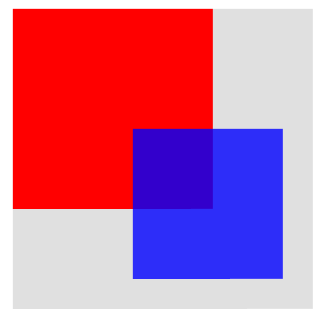

# Visuals

Visuals are the main building blocks for UI components. They provide reusable rendering logic that is controlled by using properties and can be used by all components.
They also respond to view size and color changes, and can perform clipping at the renderer level.


The properties specific to each individual visual are encapsulated in the corresponding class such as a 'Border' visual is defined in a `BorderVisual` class,
a 'Color' visual in a `ColorVisual` class, and so on. 
The properties that are common for all visual types are inherited from a [Tizen.NUI.VisualMap](https://samsung.github.io/TizenFX/latest/api/Tizen.NUI.VisualMap.html) class.
To render a visual it has to be added to a control. A container class [Tizen.NUI.BaseComponents.VisualView](https://samsung.github.io/TizenFX/latest/api/Tizen.NUI.BaseComponents.VisualView.html)
controls any visual that you have added.

Follow the steps in this section to familiarize yourself with visuals:
- [how to create a Visual](#visualCreation)
- [how to use a VisualView](#visualView)
- [common properties for all visuals - VisualMap](#visualMap)
- [visual types available in NUI with examples](#visualTypes) 


 
<!---------------------------------------------------------------------------------------------------------------------------->
<a name="visualCreation"></a>
## Create visual

The creation process of a visual is shown using a `BorderVisual` as an example.
The following steps are required: 

1.  Create a visual object of a desirable type:

    ```csharp
    BorderVisual _borderVisual = new BorderVisual();
    ```

2.  Specify the properties required for the visual type. The following section provides detailed information on which properties are mandatory for a given visual:

    ```csharp
    // Set the border thickness
    _borderVisual.BorderSize = 10.0f;
    // The border color
    _borderVisual.Color = Color.Blue;
    ```

3.  You can specify the optional properties of a given visual, and also specify the properties that are common for all visual types:

    ```csharp
    // The size of a visual given as a percentage of the size of the parent
    _borderVisual.RelativeSize = new RelativeVector2(0.5f, 0.5f);
    // The parent's reference point
    _borderVisual.Origin = Visual.AlignType.TopBegin;
    // The Visual's reference point
    _borderVisual.AnchorPoint = Visual.AlignType.TopBegin;
    // Shift between Origin and AnchorPoint given as a percentage of a parent size 
    _borderVisual.RelativePosition = new RelativeVector2(0.25f, 0.25f);
    ```

4.  To add the visual to an already existing `VisualView` (more details regarding `VisualView` available in the [next section](#visualView)) use the `AddVisual(...)` method:
    ```csharp
    _visualView.AddVisual("name_of_the_visual", _borderVisual);
    ```


<!---------------------------------------------------------------------------------------------------------------------------->
<a name="visualView"></a>
## Use VisualView

`VisualView` is a class that inherits the [Tizen.NUI.BaseComponents.View](https://samsung.github.io/TizenFX/latest/api/Tizen.NUI.BaseComponents.View.html) class,
so it's properties can be used to specify the `VisualView`.
<!-- TO BE DONE:
(the full list of a `View`'s properties can be found in the [View section](https://docs.tizen.org/application/dotnet/guides/nui/view/))
-->

A `VisualView` stores the handles to visuals and maps of their properties.
You can find the total number of visuals that are added to the `VisualView` using the`NumberOfVisuals` getter.
The following are some of the useful methods for working with visuals:

-  To add a visual to the `VisualView`, use the `AddVisual(string, VisualMap)`. The method expects the following two parameters:
   - `string` - specifies the name of the visual, by which it is identified within a given `VisualView`,
   - `VisualMap` - specifies the visual, that will be added to the `VisualView`.
   If the visual with a given name already exists in the `VisualView` it will be updated instead of added.

-  To remove a visual from a `VisualView`, use the `RemoveVisual(string)`, its only parameter specifies the name of the visual.

-  To remove all the visuals from a `VisualView`, use a `RemoveAll()`.
    

The following example shows how to create a `VisualView`, set some of the properties, and use all of the mentioned methods:

   ```csharp
   // Create VisualView
   VisualView _visualView = new VisualView();
   // Set the background color
   _visualView.BackgroundColor = Color.Blue;
   // Set the absolute size of the VisualView
   _visualView.Size2D = new Size2D(300, 300);
   // The parent's reference point
   _visualView.ParentOrigin = ParentOrigin.TopRight;
   // Must be 'true' in order to use the PivotPoint
   _visualView.PositionUsesPivotPoint = true;
   // The VisualView reference point
   _visualView.PivotPoint = PivotPoint.TopRight;
   // Shifting between ParentOrigin and PivotPoint in absolute units
   _visualView.Position2D = new Vector2(-10, 10);

   // Create visual 1
   ColorVisual _colorVisual_1 = new ColorVisual();
   _colorVisual_1.MixColor = Color.Green;
   _colorVisual_1.RelativeSize = new RelativeVector2(0.7f, 0.6f);
   _colorVisual_1.Origin = Visual.AlignType.BottomEnd;
   _colorVisual_1.AnchorPoint = Visual.AlignType.BottomEnd;

   // Add visual 1 to VisualView
   _visualView.AddVisual("colorVisual_1", _colorVisual_1);

   // Create visual 2
   ColorVisual _colorVisual_2 = new ColorVisual();
   _colorVisual_2.MixColor = Color.Magenta;
   _colorVisual_2.RelativeSize = new RelativeVector2(0.2f, 0.3f);
   _colorVisual_2.Origin = Visual.AlignType.Center;
   _colorVisual_2.AnchorPoint = Visual.AlignType.TopBegin;

   // Add visual 2 to VisualView
   _visualView.AddVisual("colorVisual_2", _colorVisual_2);

   // Remove visual 1 - identified by its name
   _visualView.RemoveVisual("colorVisual_1");

   // Remove all visuals if any left
   if (_visualView.NumberOfVisuals > 0)
       _visualView.RemoveAll();

   ```

The results of the above code are as follows:


 | original VisualView                                         | after `RemoveVisual(...)` called                        | after `RemoveAll()` called                                    |
 |-------------------------------------------------------------|:-------------------------------------------------------:|---------------------------------------------------------------|
 |  |  |  |


<!---------------------------------------------------------------------------------------------------------------------------->
<a name="visualMap"></a>
## VisualMap encapsulates common properties of visuals 

The `VisualMap` is a base class for all visuals.

**Table: The VisualMap properties (all are optional)**

| Property            | Type                        | Default Value                    | Description                                                                                                       |
|---------------------|-----------------------------|----------------------------------|-------------------------------------------------------------------------------------------------------------------|
| `Size`              | `Size2D`                    | `(1, 1)`                         | The size of the visual interpreted as the relative or the absolute size, depending on the `SizePolicy`.           |
| `RelativeSize`      | `RelativeVector2`           | `(1.0f, 1.0f)`                   | Specifies the relative size of the visual, given as a percentage of the size of the parent.                       |
| `SizePolicy`<br>`SizePolicyWidth`<br>`SizePolicyHeight` | `VisualTransformPolicyType` | `Relative`   | Specifies whether the visual size or width or height is relative (`Relative`) or absolute (`Absolute`). |
| `Position`          | `Vector2`                   | `(0.0f, 0.0f)`                   | The visual offset (absolute or relative - percentage) specified as the shift of the visual reference point with respect to the parent's reference point (values on x and y axes increase towards right and bottom, respectively). |
| `RelativePosition`  | `RelativeVector2`           | `(0.0f, 0.0f)`                   | The visual offset specified as a percentage of the size of the parent.                                            |
| `PositionPolicy`<br>`PositionPolicyX`<br>`PositionPolicyY` | `VisualTransformPolicyType` | `Relative`   | Specifies whether the x and/or y offsets are relative (`Relative`) or absolute (`Absolute`).   |
| `Origin`            | `Visual.AlignType`          | `Center`                         | Specifies the reference point within the parent's area (possible values: `TopBegin`, `TopCenter`, `TopEnd`, `CenterBegin`, `Center`, `CenterEnd`, `BottomBegin`, `BottomCenter`, `BottomEnd`). |
| `AnchorPoint`       | `Visual.AlignType`          | `Center`                         | Specifies the reference point within the visual's area, this point is used e.g. to define the visual position (possible values as for the `Origin`).  |
| `DepthIndex`        | `int`                       | `0`                              | Specifies the order in which visuals overlap within the parent.                                                   |
| `MixColor`          | `Color`                     | -                                | The blend color for the visual.                                                                                   |
| `Opacity`           | `float`                     | `1.0f`                           | The alpha value from the `MixColor` property (completely transparent for `0.0f`).                                 |
| `PremultipliedAlpha`| `bool`                      | `false`                          | Enables (`true`) or disables (`false`) the premultiplied alpha.                                                   |
| `VisualFittingMode` | `VisualFittingModeType`     | `FitKeepAspectRatio` - for AnimatedImageVisual, MeshVisual, PrimitiveVisual, TextVisual<br>`Fill` - otherwise | Specifies the visual fitting mode (possible values: `FitKeepAspectRatio`, `Fill`, `OverFitKeepAspectRatio`, `Center`, `FitHeight`, `FitWidth`). |
| `CornerRadius`      | `float`                     | `0.0f`                           | The visual corner radius (rounded for values > 0).                                                                |


<!---------------------------------------------------------------------------------------------------------------------------->
<a name="visualTypes"></a>
## Visual types provided by NUI

The following visual types are available in NUI:
[Border](#borderVisual),
[Color](#colorVisual),
[Gradient](#gradientVisual),
[Image](#imageVisual),
[NPatch](#npatchVisual),
[SVG](#svgVisual),
[AnimatedImage](#animatedImageVisual),
[Mesh](#meshVisual),
[Primitive](#primitiveVisual) and
[Text](#textVisual)

<!---------------------------------------------------------------------------------------------------------------------------->
<a name="borderVisual"></a>
### BorderVisual

The rectangular frame with a given thickness. The whole frame is plotted inside the area designated by the `BorderVisual` size as long as it is possible, e.g.
- the `BorderVisual` of size 200x200 and the border width of 100, appears as a square of the size of 200x200, having the color of the border,
- the `BorderVisual` of size 100x200 and the border width of 200, appears as a rectangle of the size of 300x200, having the color of the border.


The following table lists the supported properties:

**Table: BorderVisual properties**

| Property       | Type      | Required | Description                                                                          |
|----------------|-----------|----------|--------------------------------------------------------------------------------------|
| `Color`        | `Color`   | Yes      |  The color of the border.                                                            |
| `BorderSize`   | `float`   | Yes      |  The width of the border in pixels.                                                  |
| `AntiAliasing` | `bool`    | No       |  Specifies whether antialiasing of the border is required (default value - `false`). |


**Usage:**
The following example illustrates how to use a `BorderVisual`:

   ```csharp
   BorderVisual _borderVisual = new BorderVisual();

   // Obligatory properties
   _borderVisual.Color = Color.Red;
   _borderVisual.BorderSize = 5.0f;

   // Optional properties:
   // the size of the border will be interpreted as relative
   _borderVisual.SizePolicy = VisualTransformPolicyType.Relative;
   // The visual size (width and height) are equal half of the parent size             
   _borderVisual.RelativeSize = new RelativeVector2(0.5f, 0.5f);
   // Position interpreted in absolute units
   _borderVisual.PositionPolicy = VisualTransformPolicyType.Absolute;
   // The reference point of the Visual is shifted right (50 pixels) and up (100 pixels) from the parent's reference point
   _borderVisual.Position = new Vector2(50.0f, -100.0f);
   // The parent's reference point
   _borderVisual.Origin = Visual.AlignType.BottomBegin;
   // Point on the parent with respect to which the visual will be placed
   _borderVisual.AnchorPoint = Visual.AlignType.BottomBegin;

   // _visualView is a previously created VisualView
   _visualView.AddVisual("nameOfBorderVisual", _borderVisual);
   ```


**Figure: BorderVisual after implementing example (_visualView background color set to gray).**


<!---------------------------------------------------------------------------------------------------------------------------->
<a name="colorVisual"></a>
### ColorVisual

The `ColorVisual` renders a solid rectangle.


The following table lists the supported properties:

**Table: ColorVisual properties**

| Property              | Type    | Required | Description                                                                                           |
|-----------------------|---------|----------|-------------------------------------------------------------------------------------------------------|
| `Color`               | `Color` | Yes      | The color of the visual.                                                                              |
| `RenderIfTransparent` | `bool`  | No       | Specifies whether to render the visual in case of the `MixColor` being transparent (default `false`). |


**Usage:**
The following example illustrates how to use a `ColorVisual`:


   ```csharp
   ColorVisual _colorVisual_1 = new ColorVisual();

   // Obligatory properties
   _colorVisual_1.Color = Color.Red;

   // Optional properties:
   _colorVisual_1.Size = new Size2D(400,400);
   _colorVisual_1.DepthIndex = 5;

   _visualView.AddVisual("RedRectangle", _colorVisual_1);


   ColorVisual _colorVisual_2 = new ColorVisual();

   // Obligatory properties
   _colorVisual_2.Color = new Color(0.0f, 0.0f, 1.0f, 0.8f);

   // Optional properties:
   _colorVisual_2.Size = new Size2D(300,300);
   _colorVisual_2.Origin = Visual.AlignType.BottomEnd;
   _colorVisual_2.AnchorPoint = Visual.AlignType.BottomEnd;
   // Shifting the visual left and up 
   _colorVisual_2.RelativePosition = new RelativeVector2(-0.1f, -0.1f);
   // For values > 0 corners are rounded
   _colorVisual_2.CornerRadius = 50.0f;
   // Setting a value lower than for the previous object causes it to be covered
   // Without changing this value, the objects are drawn in the order they were added
   _colorVisual_2.DepthIndex = _colorVisual_1.DepthIndex - 1;

   _visualView.AddVisual("BlueRectangle", _colorVisual_2);
   ```


**Figure: ColorVisual after implementing example (_visualView background color set to gray).**

 | default values of the `DepthIndex`                   | changed `DepthIndex` values                                          |
 |------------------------------------------------------|----------------------------------------------------------------------|
 |  |  |


<!---------------------------------------------------------------------------------------------------------------------------->
<a name="gradientVisual"></a>
### GradientVisual

The `GradientVisual` renders a smooth transition of colors to the control. NUI supports both, linear and radial gradients.


The following table lists the supported properties:

**Table: GradientVisualProperty properties**

| Property        | Type                             | Required        | Description                                                                                 |
|-----------------|----------------------------------|-----------------|---------------------------------------------------------------------------------------------|
| `StartPosition` | `Vector2`                        | For linear only | The start position of the linear gradient - coordinate system depends on the `Units` value. |
| `EndPosition`   | `Vector2`                        | For linear only | The end position of the linear gradient - coordinate system depends on the `Units` value.   |
| `Center`        | `Vector2`                        | For radial only | The center point of the radial gradient - coordinate system depends on the `Units` value.   |
| `Radius`        | `float`                          | For radial only | The size of the radial gradient radius - coordinate system depends on the `Units` value.    |
| `StopColor`     | `PropertyArray` of `Color`       | Yes             | The color at the stop offsets. At least two are required to show a gradient.                |
| `StopOffset`    | `PropertyArray` of `floats`      | No              | The stop offsets in relative units (default is 0.0 and 1.0) - to see all colors from the `StopColor` the lengths of these two arrays should be the same. |
| `Units`         | `GradientVisualUnitsType`        | No              | Defines the coordinate system for the attributes: start and end points for a linear gradient, center point and radius for a radial gradient (default value - `ObjectBoundingBox`; see the [below table](#table_grad_possible_values_units) for more details). |
| `SpreadMethod`  | `GradientVisualSpreadMethodType` | No              | Indicates what occurs if a gradient starts or ends inside bounds (default value - `Pad`; see the [below table](#table_grad_possible_values_spread) for more information). |


<a name="table_grad_possible_values_units"></a>
**Table: Possible values of the `Units` property**

| Value               | Description                                                                                                  |
|---------------------|--------------------------------------------------------------------------------------------------------------|
| `ObjectBoundingBox` | The coordinate system in which the top-left is (-0.5, -0.5) and the bottom-right is (0.5, 0.5).              |
| `UserSpace`         | The system with the top-left being (0, 0) and the bottom-right - (control width, control height).            |


<a name="table_grad_possible_values_spread"></a>
**Table: Possible values of the `SpreadMethod` property**

| Value               | Description                                                                                                  |
|---------------------|--------------------------------------------------------------------------------------------------------------|
| `Pad`               | Uses the terminal colors of the gradient to fill the remainder of the area.                                  |
| `Reflect`           | Reflects the gradient pattern start-to-end, end-to-start, start-to-end, and so on, until the area is filled. |
| `Repeat`            | Repeats the gradient pattern start-to-end, start-to-end, start-to-end, and so on, until the area is filled.  |


**Usage:**
The following example illustrates how to set radial and linear `GradientVisual`s.

Be aware of the difference in the radial gradients drawn for different `Units` values. 
In case of `ObjectBoundingBox` value the given radius value is treated independently in the vertical and horizontal direction - for non squared visuals the resulting gradient will look like an ellipse (see case 1 below).
For the value of `UserSpace`, the given radius is applied in all dimensions - it will always look like concentric circles (case 2 below).


The radial GradientVisual in the relative coordinate system - case 1:
   ```csharp
   GradientVisual _radialGradientVisual = new GradientVisual();

   // Obligatory properties
   // Gradient centered to the center of the area
   _radialGradientVisual.Center = new Vector2(0.0f, 0.0f);
   // Radius set to 90% of the visual size - in all directions (the result is ellipse for rectangular visual size)
   _radialGradientVisual.Radius = 0.9f;

   // Optional properties
   // Coordinate system: top-left - (-0.5,-0.5); bottom-right - (0.5,0.5)
   _radialGradientVisual.Units = GradientVisualUnitsType.ObjectBoundingBox;
   // Colors of the gradient
   PropertyArray _stopColor = new PropertyArray();
   _stopColor.Add(new PropertyValue(Color.Yellow));
   _stopColor.Add(new PropertyValue(Color.Blue));
   _stopColor.Add(new PropertyValue(new Color(0, 1, 0, 1)));
   _stopColor.Add(new PropertyValue(new Vector4(120.0f, 0.0f, 255.0f, 255.0f) / 255.0f));
   _radialGradientVisual.StopColor = _stopColor;
   // Colors' limits in a relative coordinate system
   PropertyArray _stopOffset = new PropertyArray();
   _stopOffset.Add(new PropertyValue(0.0f));
   _stopOffset.Add(new PropertyValue(0.25f));
   _stopOffset.Add(new PropertyValue(0.5f));
   _stopOffset.Add(new PropertyValue(0.75f));
   _radialGradientVisual.StopOffset = _stopOffset;

   _visualView.AddVisual("Radial_Gradient", _radialGradientVisual);
   ```

The radial GradientVisual in the absolute coordinate system - case 2 (the variables declaration independent of the case 1 above):
   ```csharp
   GradientVisual _radialGradientVisual = new GradientVisual();

   // Obligatory properties
   _radialGradientVisual.Center = new Vector2(0.0f, 50.0f);
   _radialGradientVisual.Radius = 50.0f;

   // Optional properties
   _radialGradientVisual.Units = GradientVisualUnitsType.UserSpace;
   _radialGradientVisual.SpreadMethod = GradientVisualSpreadMethodType.Reflect;
   PropertyArray stopColor = new PropertyArray();
   stopColor.Add(new PropertyValue(new Color(0.0f, 0.8f, 0.0f, 1)));
   stopColor.Add(new PropertyValue(new Color(0.4f, 0.0f, 0.8f, 1)));
   stopColor.Add(new PropertyValue(new Color(0.0f, 0.6f, 0.8f, 1)));
   _radialGradientVisual.StopColor = stopColor;
   PropertyArray stopOffset = new PropertyArray();
   stopOffset.Add(new PropertyValue(0.0f));
   stopOffset.Add(new PropertyValue(0.5f));
   stopOffset.Add(new PropertyValue(1.0f));
   _radialGradientVisual.StopOffset = stopOffset;

   _visualView.AddVisual("Radial_Gradient", _radialGradientVisual);

   ```

In case of the linear gradient, the end and start points define the direction of the gradient - colors are plotted perpendicular to this line.
In the example below the `SpreadMethod` is set to 'Repeat' so as a result, in the corners below and above the lines passing through the start and end points (respectively bottom left and top right corners), other colors are plotted.
   ```csharp
   GradientVisual _linearGradientVisual = new GradientVisual();

   // Obligatory properties
   // Two points defining the direction of the gradient (colors plotted perpendicular)
   _linearGradientVisual.StartPosition = new Vector2(0.0f, 0.5f);
   _linearGradientVisual.EndPosition = new Vector2(0.5f, -0.5f);

   // Optional properties
   _linearGradientVisual.StopColor = new PropertyArray();
   _linearGradientVisual.StopColor.Add(new PropertyValue(Color.Green));
   _linearGradientVisual.StopColor.Add(new PropertyValue(Color.Blue));

   _linearGradientVisual.Opacity = 0.4f;
   _linearGradientVisual.SpreadMethod = GradientVisualSpreadMethodType.Repeat;

   _visualView.AddVisual("Linear_Gradient", _linearGradientVisual);
   
   ```


**Figure: GradientVisuals obtained for the above code.**

 | radial gradient - case 1                                    | radial gradient - case 2                                    | linear gradient                                    |
 |:-----------------------------------------------------------:|:-----------------------------------------------------------:|:--------------------------------------------------:|
 |  |  |  |


<!---------------------------------------------------------------------------------------------------------------------------->
<a name="imageVisual"></a>
### ImageVisual

The ImageVisual renders a raster image (such as `.jpg` or `.png`) into the control. 

The properties specific for the ImageVisual are listed in the table below: 

**Table: ImageVisual properties**

| Property            | Type               | Required | Description                                                                                                                                            |
|---------------------|--------------------|----------|--------------------------------------------------------------------------------------------------------------------------------------------------------|
| `URL`               | `string`           | Yes      | The URL of the image.                                                                                                                                  |
| `AlphaMaskURL`      | `string`           | No       | The URL of the alpha mask.                                                                                                                             |
| `AuxiliaryImageURL` | `string`           | No       | The URL of the auxiliary image on top of an NPatch image.                                                                                              | 
| `FittingMode`       | `FittingModeType`  | No       | Fitting options, used when resizing images to fit the specified dimensions (`ShrinkToFit`, `ScaleToFill`, `FitWidth`, `FitHeight`). |
| `SamplingMode`      | `SamplingModeType` | No       | Filtering options, used when sampling original pixels to resize images (`Box`, `Nearest`, `Linear`, `BoxThenNearest`, `BoxThenLinear`, `NoFilter`, `DontCare`). |
| `DesiredWidth`      | `int`              | No       | The desired image width - the actual image width used if not specified.                                                                                |
| `DesiredHeight`     | `int`              | No       | The desired image height - the actual image height used if not specified.                                                                              |
| `SynchronousLoading`| `bool`             | No       | Specifies whether to load the image synchronously (`true`) or not (`false` - default). Concerns only Quad images.                                      |
| `PixelArea`         | `Vector4`          | No       | Specifies the image area to be displayed - relative coordinates of the top-left and bottom-right (default value is `[0.0, 0.0, 1.0, 1.0]` - the whole image). |
| `WrapModeU`<br>`WrapModeV` | `WrapModeType` | No    | Specifies the wrap mode for the U/V coordinate -  how the texture should be sampled when the U/V coordinate exceeds the range of 0.0 to 1.0. Possible values: `Default`, `ClampToEdge`, `Repeat`, `MirroredRepeat`. |
| `MaskContentScale`  | `float`            | No       | Specifies the scale factor to apply to the content image before masking.                                                                               |
| `CropToMask`        | `bool`             | No       | Specifies whether to crop image to mask or scale mask to fit image.                                                                                    |
| `AuxiliaryImageAlpha` | `float`          | No       | An alpha value for mixing between the masked main N-patch image and the auxiliary image.                                                               |
| `ReleasePolicy`     | `ReleasePolicyType`| No       | Specifies whether the texture should be released from the cache or kept to reduce the loading time. Possible values: `Detached`, `Destroyed`, `Never`. |
| `LoadPolicy`        | `LoadPolicyType`   | No       | Specifies whether the texture should be loaded immediately after source set or only after the visual is added to the window. Values: `Immediate` or `Attached`. |
| `OrientationCorrection` | `bool`         | No       | Specifies whether to automatically correct the orientation based on the Exchangeable Image File (EXIF) data (default is `true`).)                      |
| `Atlasing`          | `bool`             | No       | Specifies whether to use the texture atlas (`true`) or not (`false` - default).                                                                        |


**Usage:**

The following example illustrates how to use the ImageVisual.
The image is placed in an `image` subdirectory of a directory `res` (the absolute path to the application's shared resource directory is reached 
by `Tizen.Applications.Application.Current.DirectoryInfo.Resource` - for more information see
[Class Application](https://docs.tizen.org/application/dotnet/api/tizenfx/api/Tizen.Applications.Application.html)
and
[Class DirectoryInfo](https://docs.tizen.org/application/dotnet/api/tizenfx/api/Tizen.Applications.DirectoryInfo.html)). 
   ```csharp
   string _imageUrl = Tizen.Applications.Application.Current.DirectoryInfo.Resource + "images/";

   ImageVisual _imageVisual = new ImageVisual();
   _imageVisual.URL = _imageUrl + "picture.jpg";
   _imageVisual.RelativeSize = new RelativeVector2(1, 1);
   _imageVisual.Origin = Visual.AlignType.TopBegin;
   _imageVisual.AnchorPoint = Visual.AlignType.TopBegin;

   _visualView.AddVisual("Image", _imageVisual);   
   ```

**Figure: ImageVisual**


<!---------------------------------------------------------------------------------------------------------------------------->
<a name="npatchVisual"></a>
### NPatchVisual

The N-patch image visual renders an N-patch or a 9-patch image. It uses non quad geometry. Both geometry and texture are cached to reduce memory consumption, if the same N-patch image is used elsewhere.

Properties specific for the NPatchVisual are listed in the table below:

**Table: NPatchVisual properties**

| Property            | Type               | Required | Description                                                     |
|---------------------|--------------------|----------|-----------------------------------------------------------------|
| `URL`               | `string`           | Yes      | The URL of the image.                                           |
| `BorderOnly`        | `bool`             | No       | If `true` only borders are drawn (default is `false`).          | 
| `Border`            | `Rectangle`        | No       | The border of the image in the order - left, right, bottom, top |


**Usage:** 

The code illustrates how to plot N-Patch in NUI (the absolute path to the image is set as in case of the [`ImageVisual`](#imageVisual)):
   ```csharp
   string _imageUrl = Tizen.Applications.Application.Current.DirectoryInfo.Resource + "images/";

   NPatchVisual _nPatchVisual = null;

   _nPatchVisual = new NPatchVisual();
   _nPatchVisual.URL = _imageUrl + "heartsframe.png";
   _nPatchVisual.RelativeSize = new RelativeVector2(1.0f, 0.3f);
   _nPatchVisual.Origin = Visual.AlignType.BottomEnd;
   _nPatchVisual.AnchorPoint = Visual.AlignType.BottomEnd;

   _visualView.AddVisual("NPatch-Image1", _nPatchVisual);

   _nPatchVisual = new NPatchVisual();
   _nPatchVisual.URL = _imageUrl + "heartsframe.png";
   _nPatchVisual.RelativeSize = new RelativeVector2(0.3f, 0.6f);
   _nPatchVisual.Origin = Visual.AlignType.TopCenter;
   _nPatchVisual.AnchorPoint = Visual.AlignType.TopCenter;

   _visualView.AddVisual("NPatch-Image2", _nPatchVisual);

   ```

**Figure: NPatchVisual from the code above - the correct scaling of the NPatch image is shown (_visualView background color set to gray).**


<!---------------------------------------------------------------------------------------------------------------------------->
<a name="svgVisual"></a>
### SVGVisual

The SVG image visual renders an SVG image into the control.
It supports the following features from the [SVG Tiny 1.2 Specification](https://www.w3.org/TR/SVGTiny12):

-   Basic shapes
-   Paths
-   Solid color fill
-   Gradient color fill
-   Solid color stroke

The following features are not supported:

-   Gradient color stroke
-   Dash array stroke
-   View box
-   Text
-   Clip path


**Table: SVGVisual properties**

| Property            | Type               | Required | Description                                                     |
|---------------------|--------------------|----------|-----------------------------------------------------------------|
| `URL`               | `string`           | Yes      | The URL of the image.                                           |


**Usage:**
   The below example shows how to use the SVGVisual: 
   ```csharp
   string _imageUrl = Tizen.Applications.Application.Current.DirectoryInfo.Resource + "images/";

   SVGVisual _svgVisual = new SVGVisual();
   _svgVisual.URL = _imageUrl + "tiger.svg";

   _visualView.AddVisual("SVG-Image", _svgVisual);
   
   ```


**Figure: SVGVisual  (_visualView background color set to gray).**


<!---------------------------------------------------------------------------------------------------------------------------->
<a name="animatedImageVisual"></a>
### AnimatedImageVisual

The animated image visual renders an animated image into the control. 
Currently, only the GIF format is supported.


**Table: AnimatedImageVisual properties**

| Property            | Type               | Required | Description                                                                               |
|---------------------|--------------------|----------|-------------------------------------------------------------------------------------------|
| `URL`               | `string`           | Yes, if `URLS` not specified | The URL of the image.                                                 |
| `URLS`              | `List<string>`     | Yes, if `URL` not specified  | The list of URLS of the animated images.                              |
| `BatchSize`         | `int`              | No       | The batch size for pre-loading images in the visual (default `1`).                        |
| `CacheSize`         | `int`              | No       | The cache size for loading images in the visual (default `1`).                            |
| `FrameDelay`        | `float`            | No       | The number of milliseconds between each frame in the visual (default `0.1`).              |
| `LoopCount`         | `float`            | No       | The number of times the visual will be looped - unlimited for values < `0` (default `-1`).|


**Usage:**
   ```csharp
   string _imageUrl = Tizen.Applications.Application.Current.DirectoryInfo.Resource + "images/";

   AnimatedImageVisual _animatedVisual = new AnimatedImageVisual();
   _animatedVisual.URL = _imageUrl + "animated-image-visual.gif";

   _visualView.AddVisual("Animated-Image", _animatedVisual);

   ```


**Figure: AnimatedImageVisual**


<!---------------------------------------------------------------------------------------------------------------------------->
<a name="meshVisual"></a>
### MeshVisual

The mesh visual renders a mesh using an `.obj` file, optionally with materials provided in an `.mtl` file and corresponding textures. 


The following table lists the supported properties:

**Table: MeshVisual properties**

| Property         | Type                | Required              | Description                              |
|------------------|---------------------|-----------------------|------------------------------------------|
| `ObjectURL`      | `string`            | Yes                   | The location of the `.obj` file.         |
| `MaterialtURL`   | `string`            | No                    | The location of the `.mtl` file. Leave blank for a textureless object. |
| `TexturesPath`   | `string`            | Yes if using materials| The path to the directory where the textures (including gloss and normal) are stored. |
| `ShadingMode`    | `MeshVisualShadingModeValue` | No           | The type of the shading mode that the mesh uses (see tab. [with possible values](#table_mesh_possible_values)). |
| `UseMipmapping`  | `bool`              | No                    | Specifies whether to use mipmaps for textures (by default `true`). |
| `UseSoftNormals` | `bool`              | No                    | Specifies whether to average normals at each point to smoother the textures (by default is `true`). |
| `LightPosition`  | `Vector3`           | No                    | The position, in the stage space, of the point light that applies lighting to the model (all zeros indicate the top-left corner). |

-   The `ShadingMode` property defines the shading mode type used by the mesh.

<a name="table_mesh_possible_values"></a>
**Table: Shading mode values**

| Enumeration value                      | Description                              |
|----------------------------------------|------------------------------------------|
| `TexturelessWithDiffuseLighting`       | Simplest, one color that is lit by ambient and diffuse lighting. |
| `TexturedWithSpecularLighting`         | Uses only the visual image textures provided with specular lighting in addition to ambient and diffuse lighting. |
| `TexturedWithDetailedSpecularLighting` | Uses all textures provided including a gloss, normal, and texture map along with specular, ambient, and diffuse lighting. |


**Usage:**

The following example shows how to use a MeshVisual.
The `.obj` and `.mtl` files and directory with textures used the same path as was used for the [ImageVisual](#imageVisual).
   ```csharp
   string _imageUrl = Tizen.Applications.Application.Current.DirectoryInfo.Resource + "images/";

   MeshVisual _meshVisual = new MeshVisual();

   _meshVisual.ObjectURL    = _imageUrl + "Dino.obj";
   _meshVisual.MaterialtURL = _imageUrl + "Dino.mtl";
   _meshVisual.TexturesPath = _imageUrl + "textures/";

   _visualView.AddVisual("Mesh-Image", _meshVisual);
   ```

**Figure: MeshVisual**


<!---------------------------------------------------------------------------------------------------------------------------->
<a name="primitiveVisual"></a>
## PrimitiveVisual

The PrimitiveVisual renders a simple three-dimensional shape, such as cube or sphere. 
By default, shapes are generated with clockwise winding and back-face culling.


The following table lists the supported properties: 

**Table: PrimitiveVisual properties - all values are optional.**

| Property            | Type                       | Shape to which the property applies  | Description                                                                                                        |
|---------------------|----------------------------|--------------------------------------|--------------------------------------------------------------------------------------------------------------------|
| `Shape`             | `PrimitiveVisualShapeType` | all                                  | The shape to render (see tab. [with possible values](#table_primit_possible_values) - by default is `Sphere`).     |
| `MixColor`          | `Color`                    | all                                  | The color of the shape (default is `[0.5f, 0.5f, 0.5f, 1.0f]`).                                                    |
| `Slices`            | `int` in a range 1-255     | all                                  | The number of slices going around the shape (default `128`).                                                       |
| `Stacks`            | `int`                      | all                                  | The number of layers going down the shape (default `128`).                                                         |
| `ScaleTopRadius`    | `float` >= 0               | conical frustrum                     | The scale of the top circle radius of a conical frustrum (default `1.0`).                                          |
| `ScaleBottomRadius` | `float` >= 0               | conical frustrum<br>cone             | The scale of the bottom circle radius (default `1.5`).                                                             |
| `ScaleHeight`       | `float` >= 0               | conical frustrum<br>cone<br>cylinder | The height scale of the conic (default `3.0`).                                                                     |
| `ScaleRadius`       | `float` >= 0               | cylinder                             | The radius scale of the cylinder (default `1.0`).                                                                  |
| `ScaleDimensions`   | `Vector3`                  | cube<br>octahedron<br>bevelled cube  | The dimensions of the cuboid. Scales in the same way as for a 9-patch image (default `[1, 1, 1]`).                 |
| `BevelPercentage`   | `float` in a range 0-1     | bevelled cube                        | Specifies how bevelled the cuboid should be, based on the smallest dimension. It affects the ratio of the outer face widths to the width of the overall cube (default `0.0` - no bevel).                        |
| `BevelSmoothness`   | `float` in a range 0-1     | bevelled cube                        | Specifies how smooth the bevelled edges should be (default `0.0` - sharp edges).                                   |
| `LightPosition`     | `Vector3`                  | all                                  | The position, in the stage space, of the point light, that apply lighting to the model - vector of zeros indicates the top-left corner (the default is an offset outwards from the center of the screen).        |


There are seven `Shape` values, some of which are specializations as compared to another:

<a name="table_primit_possible_values"></a>
**Table: Shape values**

| Enumeration value | Description                                                                      |
|-------------------|----------------------------------------------------------------------------------|
| `Sphere`          | The default shape.                                                               |
| `ConicalFrustrum` | The area bound between two circles (basically, a cone with the tip removed).     |
| `Cone`            | Equivalent to a conical frustrum with a top radius of 0.                          |
| `Cylinder`        | Equivalent to a conical frustrum with equal radii for the top and bottom circles. |
| `Cube`            | Equivalent to a beveled cube with a bevel percentage of 0.                       |
| `Octahedron`      | Equivalent to a beveled cube with a bevel percentage of 1.                       |
| `BevelledCube`    | A cube/cuboid with all edges flattened to some degree.                           |


Examples of primitives are presented below.

- **Sphere:**

    

- **Conics:**

    | Frustrum                                | Cone                    | Cylinder                        |
    |---------------------------------------|-----------------------|-------------------------------|
    |  |  |  |

- **Bevel:**

   Figures for different value of the `BevelPercentage` property.

    | 0.0 (cube)                                  | 0.3                                       |
    |---------------------------------------------|-------------------------------------------|
    |                      |  |
    | **0.7**                                     | **1.0 (octahedron)**                      |
    |  |        |

- **Slices:**

    For spheres and conical frustrums, `Slices` defines how many divisions there are, going around the shape.

    

- **Stacks:**

    For spheres, `Stacks` defines how many layers there are, going down the shape.

    


**Usage:**

The following example illustrates how to draw a BevelledCube.
   ```csharp
   PrimitiveVisual _primitiveVisual = new PrimitiveVisual();
   _primitiveVisual.Shape = PrimitiveVisualShapeType.BevelledCube;
   _primitiveVisual.MixColor = new Vector4(0.4f, 0.4f, 1.0f, 1.0f);
   // Two initial coord. indicate the top-left corner; the third one indicates the shift toward the observer
   _primitiveVisual.LightPosition = new Vector3(0, 0, 1000);
   _primitiveVisual.ScaleDimensions = new Vector3(1.0f, 0.5f, 1.4f);
   _primitiveVisual.BevelPercentage = 0.5f;
   _primitiveVisual.BevelSmoothness = 0.0f;

   _visualView.AddVisual("BevelledCube", _primitiveVisual);

   ```


**Figure: PrimitiveVisual from the above code**


<!---------------------------------------------------------------------------------------------------------------------------->
<a name="textVisual"></a>
### TextVisual

The TextVisual renders text within a control.


The following table lists the supported properties:

**Table: TextVisual properties**

| Property              | Type                  | Required | Description                                                          |
|-----------------------|-----------------------|----------|----------------------------------------------------------------------|
| `Text`                | `string`              | Yes      | The text to display in UTF-8 encoding.                               |
| `FontFamily`          | `string`              | No       | The requested font family to use.                                    |
| `FontStyle`           | `PropertyMap`         | No       | The requested font style to use.                                     |
| `PointSize`           | `float`               | Yes      | The font size in points.                                             |
| `MultiLine`           | `bool`                | No       | Specifies whether to use a multi-line layout (default - `false`).    |
| `HorizontalAlignment` | `HorizontalAlignment` | No       | The line horizontal alignment: `Begin` (default), `Center` or `End`. |
| `VerticalAlignment`   | `VerticalAlignment`   | No       | The line vertical alignment: `Top` (default), `Center` or `Bottom`.  |
| `TextColor`           | `Color`               | No       | The text color.                                                      |
| `EnableMarkup`        | `bool`                | No       | Specifies whether markup processing is enabled (default is `false`). |
| `Shadow`              | `PropertyMap`         | No       | Specifies the shadow parameters.                                     |
| `Underline`           | `PropertyMap`         | No       | Specifies the underline parameters.                                  |
| `Outline`             | `PropertyMap`         | No       | Specifies the outline parameters.                                    |
| `Background`          | `PropertyMap`         | No       | Specifies the background parameters.                                 | 


**Usage:**

The following example shows how to set a TextVisual.
   ```csharp
   TextVisual _textVisual = new TextVisual();
   _textVisual.Text = "a very long sample text ...";
   _textVisual.PointSize = 18;
   _textVisual.MultiLine = true;
   _textVisual.TextColor = Color.Blue;
   _textVisual.FontFamily = "Arial";
   // Text centered horizontally within its area
   _textVisual.HorizontalAlignment = HorizontalAlignment.Center;
   // Text aligned to the top edge of its area
   _textVisual.VerticalAlignment = VerticalAlignment.Top;
   // Parent's reference point in the top-left corner
   _textVisual.Origin = Visual.AlignType.TopBegin;
   // Visual's reference point - top-center
   _textVisual.AnchorPoint = Visual.AlignType.TopCenter;
   // Visual's reference point shifted to the center (horizontally)
   _textVisual.RelativePosition = new RelativeVector2(0.5f, 0);

   PropertyMap _fontStyle = new PropertyMap();
   _fontStyle.Add("weight", new PropertyValue("extrabold"));
   _fontStyle.Add("width", new PropertyValue("ultracondensed"));
   _fontStyle.Add("slant", new PropertyValue("italic"));
   _textVisual.FontStyle = _fontStyle;

   PropertyMap _underline = new PropertyMap();
   _underline.Insert("enable", new PropertyValue("true"));
   _underline.Insert("color", new PropertyValue(Color.Black));
   _underline.Insert("height", new PropertyValue("10"));
   _textVisual.Underline = _underline;

   PropertyMap _shadow = new PropertyMap();
   _shadow.Insert("color", new PropertyValue(new Color(0.4f, 0.4f, 1.0f, 1.0f)));
   _shadow.Insert("offset", new PropertyValue(new Vector2(5,5)));
   _shadow.Insert("blurRadius", new PropertyValue(3));
   _textVisual.Shadow = _shadow;

   _visualView.AddVisual("sample_text", _textVisual);
   ```


**Figure: TextVisual from the code above (_visualView background color set to gray)**


## Related Information
- Dependencies
  -   Tizen 4.0 and Higher


