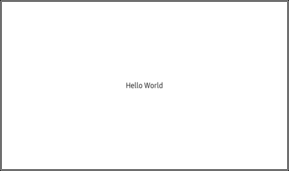
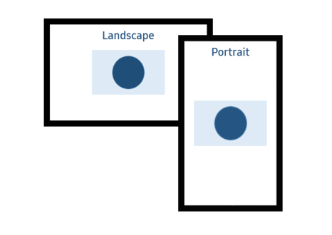
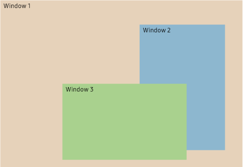

# Window

A window contains the visible content of an application. When an application is created, it automatically creates a default window for building the main user interface of the application. You can also create additional windows as required to display additional content. A window also provides various events such as key event and touch event to the application.

## Create window

When you create an application, the default window is automatically created. The default window size is full screen:
 ```csharp
 class MyApplication : NUIApplication {
     .
     .
     .
    static void Main(string[] args)
    {
        MyApplication myApp = new MyApplication();
        myApp.Run(args);
    }
 }
 ```

You can specify the initial size and position of the default window:

1. Add a `MyApplication` constructor with the `windowSize` and `windowPosition` arguments, which invokes base constructor:

    ```csharp
    public MyApplication(Size2D windowSize, Position2D windowPosition) : base(windowSize, windowPosition) {}
    ```

2. Invoke the `MyApplication` constructor in the `Main` function:

    ```csharp
    MyApplication myApp = new MyApplication(new Size2D(1920, 1080), new Position2D(0, 0));
    ```

The instance of the default window can be retrieved:

```csharp
Window window = Window.Instance;
```

The window itself is just a blank container, and the views can be added to or removed from the window:

```csharp
// Create a new view
View view = new View();

// Add the view to the window
window.Add(view);

// Remove the view from the window
window.Remove(view);
```

The following code shows how to add content to the window:

```csharp
// Get the window instance
Window window = Window.Instance;
window.BackgroundColor = Color.White;

// Create a TextLabel
TextLabel title = new TextLabel("Hello World");
title.Size2D = new Size2D(window.Size.Width, window.Size.Height);
title.HorizontalAlignment = HorizontalAlignment.Center;
title.VerticalAlignment = VerticalAlignment.Center;

// Add the text to the window
window.Add(title);
```



## Resize window

The size of a window can be retrieved, and the window can be resized:

```csharp
// Retrieve the current size of the window
Size2D windowSize = window.WindowSize;

// Resize the window by increasing its width
windowSize.Width += 100;
window.WindowSize = windowSize;
```

When the window size is changed, a resize event is triggered.

## Move window

It is easy to retrieve the current position of a window and move the window to a new position:

```csharp
// Retrieve the current position of the window
Position2D windowPosition = window.WindowPosition;

// Moving the window to the right
windowPosition.X += 100;
window.WindowPosition = windowPosition;
```

## Show and hide window

When a window is created, by default it is in visible state. It is also possible to hide a window by making it invisible:

```csharp
// Hide the window
window.Hide();

// Show the window
window.Show();
```

If all the windows are hidden, updating and rendering of the windows is paused.

## Event handling

It allows you to easily handle various events triggered by the window.
The following are some default events:

### Touch event

If you touch the window, the touch event is triggered. If multi points are touched, touch event is triggered when the first touch occurs and then when the last finger is lifted.

The following code shows how to handle the touch event:

1. Create a `TouchEvent` handler:

    ```csharp
    private void OnWindowTouched(object sender, Window.TouchEventArgs e)
    {
        if (e.Touch.GetState(0) == PointStateType.Down)
        {
            // The window has been touched, do something
        }
    }
    ```
2. Add the `TouchEvent` handler to the window's `TouchEvent` property:

    ```csharp
    window.TouchEvent += OnWindowTouched;
    ```

### Key event

Key event is triggered when the window receives a key event from the window manager.

The following code shows how to handle the key event:

1. Create a `KeyEvent` handler:

    ```csharp
    private void OnWindowKeyEvent(object sender, Window.KeyEventArgs e)
    {
        if (e.Key.State == Key.StateType.Down)
        {
            if (e.Key.KeyPressedName == "Left")
            {
                // The left arrow key is pressed, do something
            }
            else if (e.Key.KeyPressedName == "Right")
            {
                // The right arrow key is pressed, do something
            }
        }
    }
    ```

2. Add the `KeyEvent` handler to the window's `KeyEvent` property:

    ```csharp
    window.KeyEvent += OnWindowKeyEvent;
    ```

### Resize event

Resize event is triggered when the window is resized.

The following code shows how to handle the resize event:

1. Create a Resize Event handler:

    ```csharp
    private void OnWindowResized(object sender, Window.ResizedEventArgs e)
    {
        // Window is resized, do something
    }
    ```

2. Add the Resize Event handler to the window's `Resized` property:

    ```csharp
    window.Resized += OnWindowResized;
    ```


For more information, see [Window](https://samsung.github.io/TizenFX/latest/api/Tizen.NUI.Window.html) API.

## Window rotation
To rotate the orientations:

### Enable or disable orientations

If the device supports rotation, application can rotate the window with specific orientation.

The supported orientations are `Portrait`, `Landscape`, `PortraitInverse` and `LandscapeInverse`.
`Portrait` means the height is larger than the width or same.
`Landscape` means the width is larger than the height.




Application can enable or disable a specific orientation to use orientation functions. The following code shows that `Portrait`, `Landscape`, `PortraitInverse` and `LandscapeInverse` are supported in the application.
If the device's width is larger than the height, then the window will be shown as landscape when application is launched. If the device's width is smaller than the height or same, then the window will be shown as portrait:

```csharp
// To enable Portrait
window.AddAvailableOrientation(Window.WindowOrientation.Portrait);

// To enable Landscape
window.AddAvailableOrientation(Window.WindowOrientation.Landscape);

// To disable PortraitInverse
window.RemoveAvailableOrientation(Window.WindowOrientation.PortraitInverse);

// To enable LandscapeInverse
window.AddAvailableOrientation(Window.WindowOrientation.LandscapeInverse);
```


### Preferred orientation

If you want the window to appear in a specific orientation, the preferred orientation function is supported. The preferred orientation is one of the available orientations. For example, as shown in the following code, the available orientation list has `Portrait`, `Landscape`, and `LandscapeInverse`, and the preferred orientation is set to `Landscape`. This implies that the window will appear in landscape even when the device is rotated with any other orientation:

```csharp
// To enable available orientations
window.AddAvailableOrientation(Window.WindowOrientation.Portrait);
window.AddAvailableOrientation(Window.WindowOrientation.Landscape);
window.AddAvailableOrientation(Window.WindowOrientation.LandscapeInverse);

// To set the preferred orientation with Landscape.
window.SetPreferredOrientation(Window.WindowOrientation.Landscape);
```
> [!NOTE]
> To use `SetPreferredOrientation()`, you must first list up the supported orientation using `AddAvailableOrientation()`. Otherwise, the rotation does not work as expected.
>

## Multi-Window
MultiWindow means that application use additional window except default window.



To Create MultiWindow, the device must support the following features:
- `https://www.tizen.org/feature/opengles.surfaceless_context`

### Create additional window

It is easy to create an additional window in addition to the default window. The size and position of the new window should be specified. Each window can have its own background color and title:

```csharp
Window newWindow = new Window(new Rectangle(0, 0, 1920, 1080))
{
    BackgroundColor = Color.White,
    Title = "new window"
};
```

> [!NOTE]
> To support rotation in multi window, the rotation function must be used for each window.
>

## Change window stacking order

NUI provides support for changing the stacking order of the windows.

A window can be raised to the top of the window stack so that no sibling window obscures it:

```csharp
window.Raise();
```

A window can be lowered to the bottom of the window stack so that it does not obscure any sibling windows:

```csharp
window.Lower();
```

New windows are automatically placed to the top of the window stack at creation time by the window manager.


### Set parent window

To set transient relationship between two windows, use `SetParent()`. After setting the relationship, the two windows are together raised-up, lowered, and iconified or deiconified. Initially, the child window is located on top of the parent. The window can go below parent by calling `Lower()`:
```csharp
// Get the parent window instance
Window parent = Window.Instance;

Window child = new Window(new Rectangle(0, 0, 960, 1080))
{
    BackgroundColor = Color.White,
    Title = "child window"
};

child.SetParent(parent);
```

To unset transient for relationship, call `Unparent()`:
```csharp
child.Unparent();
```

> [!NOTE]
> If parent's window stack is changed by calling `Raise()` or `Lower()`, the child window is located on top of the parent again.
>

## Related information
- Dependencies
  -   Tizen 5.5 and Higher
