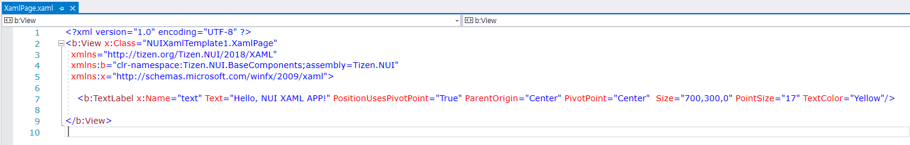

# Get Started with NUI XAML

XAML is a declarative markup language that is used to create UI elements, and the UI definitions are separated from the run-time logic by using C# code-behind files. The standard extension for XAML files is `.xaml`. Follow the instructions in the subsequent sections to get yourself familiarised with creating and using NUI XAML.

## Create solution using Tizen version 5.5

You can create a new Tizen.NUI solution using Visual Studio and then you can edit your first XAML file. For more information, see [Part 1. Getting Started with XAML](https://docs.microsoft.com/en-us/xamarin/xamarin-forms/xaml/xaml-basics/get-started-with-xaml?tabs=windows) in the XAML guide.

To create a new project, follow these steps:

1. In Visual Studio, select **File > New > Project**.

2. In the **Create a new project** dialog that appears, select **C#** from the **All languages** drop-down list.

3. In the **All project types** drop-down list, select **Tizen 5.5**.

4. Select **Tizen NUI Xaml App** and click **Next**.

> [!NOTE]
> If you create a new project with **Tizen NUI Xaml App** template, a XAML file and a C# code-behind file are created.


### Create XAML file

After creating the **NUIXamlTemplate** solution, you can see `XamlPage.xaml` in the `/res/layout` folder.


> [!NOTE]
> If you select other templates or work on lower version than Tizen 5.5, you have to manually create a XAML file.

If your application runs on a target having different resolutions, such as 720x1080, 480x800, or both of them then put XAML files into the corresponding folders. For example, you can create two folders: `/res/layout/720x1080/` and `/res/layout/480x800/`. The former is the folder with a XAML file for 720x1080 resolution, and the latter is the folder with a XAML file for 480x800 resolution.

In the following sample, `XamlPage.xaml` is created and placed in the **/res/layout/** folder:


To add any control you want, edit the XamlPage.xaml file:



XAML uses the `xmlns` XML attribute for namespace declarations.
This article introduces the XAML namespace syntax and demonstrates how to declare a XAML namespace to access a type.

In this sample, the `TextLabel` element is added, and the `Text`, `PointSize`, `TextColor`, and other properties are set.

For more information, see [XAML Support for Tizen.NUI](./xaml-support-for-tizen-nui.md) page.

### Create C# Code-Behind file

After creating the **NUIXamlTemplate** solution, you can see `XamlPage.xaml.cs`, which is a C# code-behind file associated with the XAML file in the project folder.


> [!NOTE]
> If you select other templates or work on lower version than Tizen 5.5, you have to manually create a C# code-behind file.

In the following sample XAML code, the `x:Class` attribute specifies a fully qualified class name, the `XamlPage` class in the `NUIXamlTemplate` namespace. This means that the **XamlPage.xaml** file of **XamlPage.xaml.cs** defines a new class `XamlPage` in the `NUIXamlTemplate` namespace that is derived from `View`:

```csharp
using System;
using Tizen.NUI;
using Tizen.NUI.BaseComponents;

namespace NUIXamlTemplate
{
    public partial class XamlPage : View
    {
        public XamlPage() : base()
        {
            InitializeComponent();
        }
    }
}
```

> [!NOTE]
> The name of the XAML file must be same as the class name.

### Load XAML

To load layout instance using XAML, create a `XamlPage` instance in your code such as `OnCreate()` method that is invoked when the application is started:

```csharp
using System;
using Tizen.NUI;
using Tizen.NUI.BaseComponents;

namespace NUIXamlTemplate
{
    class Program : NUIApplication
    {
        Animation animation;
        protected override void OnCreate()
        {
            base.OnCreate();
            Window.Instance.BackgroundColor = Color.Blue;
            Window.Instance.KeyEvent += OnKeyEvent;

            XamlPage page = new XamlPage();
            page.Size = new Size(720, 1280, 0);
            Window.Instance.Add(page);

            animation = new Animation(2000);
            animation.AnimateTo(page.text, "Orientation", new Rotation(new Radian(new Degree(180.0f)), PositionAxis.X), 0, 500);
            animation.AnimateTo(page.text, "Orientation", new Rotation(new Radian(new Degree(0.0f)), PositionAxis.X), 500, 1000);
            animation.Looping = true;
            animation.Play();
        }

        public void OnKeyEvent(object sender, Window.KeyEventArgs e)
        {
            if (e.Key.State == Key.StateType.Down && (e.Key.KeyPressedName == "XF86Back" || e.Key.KeyPressedName == "Escape"))
            {
                Exit();
            }
        }

        static void Main(string[] args)
        {
            var app = new Program();
            app.Run(args);
        }
    }
}
```

When you compile and run this program, the `TextLabel` element appears on the window. Additionally, you can see the "Hello, NUI XAML APP" text, which is defined in the XAML file that rotates on the x-axis.

## Create solution using Tizen version 5.0 and lower

To create a new project, follow these steps:

1. In Visual Studio, select **File > New > Project**.
2. In the **Create a new project** dialog that appears, select **C#** from the **All languages** drop-down list.
3. In the **All project types** drop-down list, select **Tizen**.
4. Select **Blank App (Tizen.NUI)** and click **Next**.


Select a location for the solution and enter a name, for example, **XamlSamples** and click **OK**.

### Create XAML file

After creating the **XamlSamples** solution, create a XAML file. In the following sample, it is XamlSamplesPage.xaml. Place the XAML file in the **/res/layout/1920x1080/** folder:


If your app runs on a target having different window sizes, such as 720x1080, 480x800, or both then put the XAML file into the corresponding folder. You can also create these folders, for example, **/res/layout/720x1080/** or **/res/layout/480x800/**.
To add any control you want, edit the XamlSamplesPage.xaml file.


In this sample, a simple `TextLabel` is added, and the `Text`, `Position2D`, and `Size2D` properties are set.

### Create C# Code-Behind File
There is a C# code-behind file associated with the XAML file. In the following sample XAML file, the `x:Class` attribute specifies a fully qualified class name, the `XamlSamplesPage` class in the `XamlSamples` namespace. This means that this XAML file of **XamlSamplesPage.xaml.cs** defines a new class named `XamlSamplesPage` in the `XamlSamples` namespace that is derived from `ContentPage`:


``` csharp
using System;
using Tizen.NUI;
namespace XamlSamples
{
    public class XamlSamplesPage : ContentPage
    {
        public XamlSamplesPage (Window win) : base(win)
        {
            InitializeComponent();
        }
        protected override void Dispose(DisposeTypes type)
        {
            if (disposed)
            {
                return;
            }
            base.Dispose(type);
        }
        public override void SetFocus()
        {
            base.SetFocus();
        }
    }
}
```

> [!NOTE]
> The name of the XAML file must be same as the class name.

### Load XAML

After creating the XAML and the C# code-behind files, you can load and show the visual contents that you defined in the XAML file:

``` csharp
using System;
using Tizen.NUI;
using Tizen.NUI.Xaml;
namespace XamlSamples
{
    class Program : NUIApplication
    {
        private Window window;
        private ContentPage myPage;
        protected override void OnCreate()
        {
            base.OnCreate();
            Initialize();
        }
        void Initialize()
        {
            window = Window.Instance;
            myPage = new XamlSamplesPage(window);
            myPage.SetFocus();
        }
        static void Main(string[] args)
        {
            var app = new Program();
            app.Run(args);
        }
    }
}
```

When you compile and run this program, the `TextLabel` element will appear on the window.
For more information, see [Layout Define Example](./layout-define-example.md).
