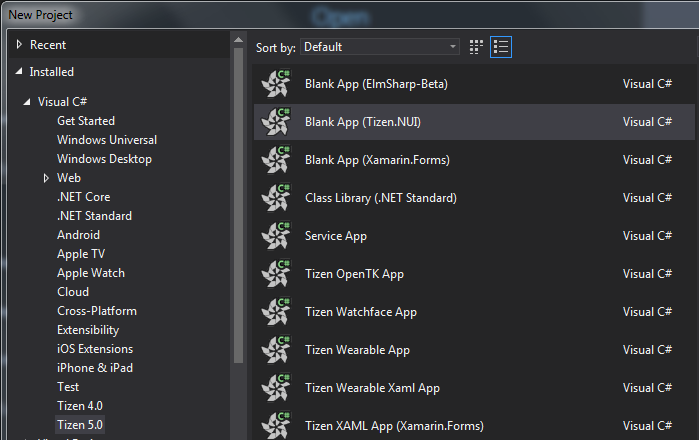
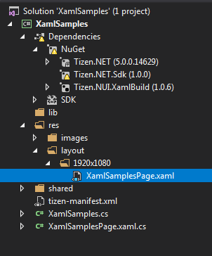
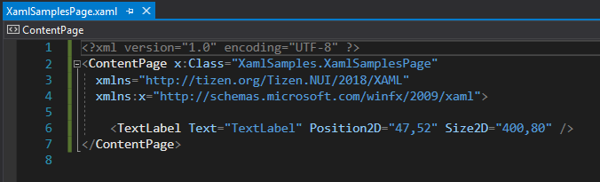
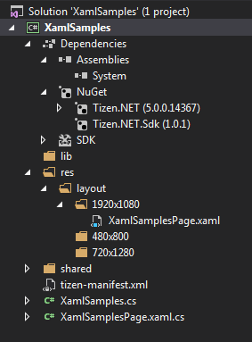

# XAML supported in Tizen.NUI

XAML — the eXtensible Application Markup Language — allows developers to define user interfaces in Tizen.NUI applications using markup rather than code. XAML is never required in a Tizen.NUI program, but it is often more succinct and more visually coherent than equivalent code, and potentially toolable. XAML is particularly well suited for using with the popular MVVM (Model-View-ViewModel) application architecture: XAML defines the View that is linked to ViewModel code through XAML-based data bindings.

# Getting Started with NUI XAML

XAML is mostly used to define the visual contents of a page and works together with a C# code-behind file. The code-behind file provides adding code logics for the markup.

## Creating the Solution

To begin editing your first XAML file, use Visual Studio to create a new Tizen.NUI solution.

Use Visual Studio to select **File** > **New** > **Project** from the menu. In the **New Project** dialog, select **Tizen** > **Native** at the left, and then **Blank App (Tizen.NUI)** from the list.


Select a location for the solution, give it a name of **XamlSamples** (or whatever you prefer), and press **OK**.

## Creating the XAML file

After creating the **XamlSamples** solution, please create a xaml file and put it into "/res/layout/1920x1080/" folder. In this sample, we saved it as **XamlSamplesPage.xaml**:



If your app will be runing on the target with other Window size, such as "720x1080" or "480x800", or both, then please put the xaml file into the corresponding folder. And these folders are created by yourself also.

Then edit the **XamlSamplesPage.xaml** file, you can add any control that you want:



In this little sample, we just add a simple <code>TextLabel</code>, and set the <code>Text</code>, <code>Position2D</code>, and <code>Size2D</code> properties.

## Creating C# code-behind file

There should be a C# code-behind file associated with the XAML file. In the above XAML file, the <code>x:Class</code> attribute specifies a fully qualified class name: the <code>XamlSamplesPage</code> class in the <code>XamlSamples</code> namespace. This means that this XAML file defines a new class named <code>XamlSamplesPage</code> in the <code>XamlSamples</code> namespace that derives from <code>ContentPage</code>.
For this sample, we define that class in **XamlSamplesPage.xaml.cs** file.



Both **XamlSamplesPage.xaml** and **XamlSamplesPage.xaml.cs** contribute to a class named <code>XamlSamplesPage</code> that derives from <code>ContentPage</code>.

``` csharp
using System;
using Tizen.NUI;

namespace XamlSamples
{
    public class XamlSamplesPage : ContentPage
    {
        public XamlSamplesPage (Window win) : base(win)
        {
            InitializeComponent();
        }

        protected override void Dispose(DisposeTypes type)
        {
            if (disposed)
            {
                return;
            }

            base.Dispose(type);
        }

        public override void SetFocus()
        {
            base.SetFocus();
        }
    }
}
```

**Attention**: Please keep in mind that the file name of the xaml file should be same with the class name.

## Load the XAML

After creating the XAML and C# code-behind files, you can load and show the visual contents that you defined in the XAML:

``` csharp
using System;
using Tizen.NUI;
using Tizen.NUI.Xaml;

namespace XamlSamples
{
    class Program : NUIApplication
    {
        private Window window;
        private ContentPage myPage;

        protected override void OnCreate()
        {
            base.OnCreate();
            Initialize();
        }

        void Initialize()
        {
            window = Window.Instance;
            myPage = new XamlSamplesPage(window);
            myPage.SetFocus();
        }

        static void Main(string[] args)
        {
            var app = new Program();
            app.Run(args);
        }
    }
}
```

When you compile and run this program, the TextLabel element will appear on the window.
