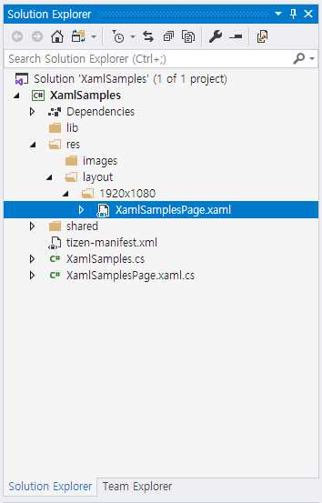

# XAML Support for Tizen.NUI

eXtensible Application Markup Language (XAML) allows you to define user interfaces in the Tizen.NUI applications using markup language rather than code. XAML is never required in a Tizen.NUI program, but it is often more succinct and more visually coherent than equivalent code, and potentially toolable. XAML is particularly well suited for using with the popular Model-View-ViewModel (MVVM) application architecture. XAML defines the View that is linked to the ViewModel code through the XAML-based data bindings.

XAML is mostly used to define the visual contents of a page and works together with a C# code-behind file. The code-behind file provides adding code logics for the markup.

For more information about XAML, see [eXtensible Application Markup Language (XAML)](/docs.microsoft.com/en-us/xamarin/xamarin-forms/xaml/).

## Benefits of XAML

- You can update the UI without compiling and deploying the application.
- You can update the UI and the business logic layer separately as they are not coupled.
- A user can set different layout-xaml files for different configurations, such as resolution 1080 and 720. When the resolution is changed, the display layout is changed automatically.

## Create Solution

To begin editing your first XAML file, use Visual Studio to create a new Tizen.NUI solution.

For more information, see [Part 1. Getting Started with XAML](https://docs.microsoft.com/en-us/xamarin/xamarin-forms/xaml/xaml-basics/get-started-with-xaml?tabs=windows) in the XAML guide.

In Visual Studio, select **File > New > Project** from the menu. In the **Create a new project** dialog that appears, select **C# > Tizen** from the selecting box, and then select **Tizen NUI Xaml App**.

If you create a new project with **Tizen NUI Xaml App** template, a XAML file and a C# code-behind file are created.


## Create XAML file

After creating the **XamlSamples** solution, you can see `XamlPage.xaml` in `/res/layout` folder. 

> **Note**
>
> If you select other templates, you have to create a XAML file manually.

If your application runs on a target having different resolutions, such as 720x1080, 480x800, or both of them then put XAML files into the corresponding folders. For example, you can create two folders: `/res/layout/720x1080/` and `/res/layout/480x800/`. The former is the folder with a XAML file for 720x1080 resolution, and the latter is the folder with a XAML file for 480x800 resolution.

In the following sample, `XamlSamplesPage.xaml` is created and placed in the **/res/layout/1920x1080/** folder:



To add any control you want, edit the XamlSamplesPage.xaml file:


In this sample, the `TextLabel` element is added, and the `Text`, `Position2D`, and `Size2D` properties are set.

## Create C# Code-Behind File

After creating the **XamlSamples** solution, you can see `XamlPage.xaml.cs`, which is a C# code-behind file associated with the XAML file in the project folder. 


> **Note**
>
> If you select other templates, you have to create a C# code-behind file manually.

In the following sample XAML code, the `x:Class` attribute specifies a fully qualified class name, the `XamlSamplesPage` class in the `XamlSamples` namespace. This means that this XAML file of **XamlSamplesPage.xaml.cs** defines a new class named `XamlSamplesPage` in the `XamlSamples` namespace that is derived from `ContentPage`:

```csharp
using System;
using Tizen.NUI;

namespace XamlSamples
{
    public class XamlSamplesPage : ContentPage
    {
        public XamlSamplesPage (Window win) : base(win)
        {
            InitializeComponent();
        }

        protected override void Dispose(DisposeTypes type)
        {
            if (disposed)
            {
                return;
            }

            base.Dispose(type);
        }

        public override void SetFocus()
        {
            base.SetFocus();
        }
    }
}
```

> **Note**
>
> The name of the XAML file must be same as the class name.

## Load XAML

To load layout instance using XAML, create a `XamlSamplesPage` instance in your code such as `OnCreate()` method that is invoked when the application is started:

```csharp
using System;
using Tizen.NUI;
using Tizen.NUI.Xaml;

namespace XamlSamples
{
    class Program : NUIApplication
    {
        private Window window;
        private ContentPage myPage;

        protected override void OnCreate()
        {
            base.OnCreate();
            Initialize();
        }

        void Initialize()
        {
            window = Window.Instance;
            myPage = new XamlSamplesPage(window);
            myPage.SetFocus();
        }

        static void Main(string[] args)
        {
            var app = new Program();
            app.Run(args);
        }
    }
}
```

When you compile and run this program, the `TextLabel` element will appear on the window.
