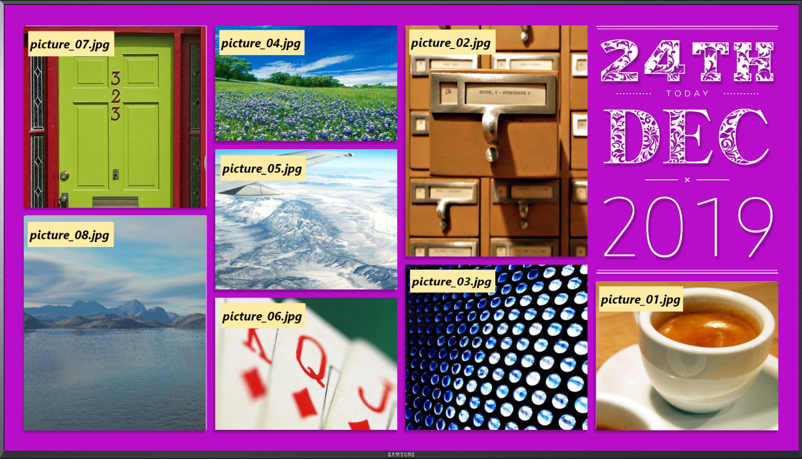

# Layout Define Example

You can use XAML to define the layout of user interface in your applications. To define the layout, follow these steps:
1. Create a XAML file
2. Load the XAML file
3. Put the XAML file in the appropriate file directory

> [!NOTE]
> Tizen NUI XAML application platform provides a XAML application template and you can use XAML since **Tizen.NET API version 7**.

## Create XAML

You can use XAML to easily implement the layout shown in the following figure:



To implement the layout, you can use the following code:

```xml
<View x:Class="Tizen.NUI.Examples.AmbientPage"
  xmlns="http://tizen.org/Tizen.NUI/2018/XAML"
  xmlns:x="http://schemas.microsoft.com/winfx/2009/xaml">

  <ImageView Name="photo1" ResourceUrl="*Resource*/picture_07.jpg" Position2D="47,52" Size2D="440,440" />
  <ImageView Name="photo2" ResourceUrl="*Resource*/picture_08.jpg" Position2D="47,512" Size2D="440,520" />
  <ImageView Name="photo3" ResourceUrl="*Resource*/picture_02.jpg" Position2D="970,50" Size2D="440,560" />
  <ImageView Name="photo4" ResourceUrl="*Resource*/picture_03.jpg" Position2D="970,630" Size2D="440,400" />
  <ImageView Name="photo5" ResourceUrl="*Resource*/picture_04.jpg" Position2D="510,50" Size2D="440,280" />
  <ImageView Name="photo6" ResourceUrl="*Resource*/picture_05.jpg" Position2D="510,350" Size2D="440,340" />
  <ImageView Name="photo7" ResourceUrl="*Resource*/picture_06.jpg" Position2D="510,710" Size2D="440,320" />
  <ImageView Name="photo8" ResourceUrl="*Resource*/picture_01.jpg" Position2D="1431,671" Size2D="440,360" />

  <ImageView Name="photo00" ResourceUrl="*Resource*/bg_textbox_w.png" Position2D="1431,51" Size2D="440,600" />

  <View Name="num_area" Size2D="440,160" Position2D="1431,51">
    <ImageView Name="photo01" ResourceUrl="*Resource*/num_w_2.png" Position2D="0,0" Size2D="110,160" />
    <ImageView Name="photo02" ResourceUrl="*Resource*/num_w_4.png" Position2D="110,0" Size2D="110,160" />
    <ImageView Name="photo03" ResourceUrl="*Resource*/num_w_th.png" Position2D="220,0" Size2D="220,160" />
  </View>

  <View Name="mon_area" Size2D="440,194" Position2D="1431,211">
    <ImageView Name="photo10" ResourceUrl="*Resource*/mon_w_12.png" Position2D="0,0" Size2D="440,194" />
  </View>

  <View Name="year_area" Size2D="440,210" Position2D="1431,425">
    <ImageView Name="photo21" ResourceUrl="*Resource*/year_w_2.png" Position2D="0,0" Size2D="110,210" />
    <ImageView Name="photo22" ResourceUrl="*Resource*/year_w_0.png" Position2D="110,0" Size2D="110,210" />
    <ImageView Name="photo23" ResourceUrl="*Resource*/year_w_1.png" Position2D="220,0" Size2D="110,210" />
    <ImageView Name="photo24" ResourceUrl="*Resource*/year_w_9.png" Position2D="330,0" Size2D="110,210" />
  </View>

</View>
```

In this code, the relative image path from the exe file is used. You can also use the absolute path of the image.

### Requirements

- `x:Class` specifies the namespace and the class name for a class defined in the XAML file. The class name must match the class name of the code-behind file.

- The filename of the XAML file must be same as the class name.

```xml
<View x:Class="Tizen.NUI.Examples.AmbientPage"
    xmlns="http://tizen.org/Tizen.NUI/2018/XAML"
    xmlns:x="http://schemas.microsoft.com/winfx/2009/xaml">
    ...
    ...
</View>
```

```csharp
namespace Tizen.NUI.Examples
{
    public class AmbientPage : View
    {
        public AmbientPage() : base ()
        {
            InitializeComponent();
        }
        ...
    }
}
```

## Load XAML

After creating the layout, you must load the XAML file in your app code.
First, you need to define a class named `AmbientPage` in the `Tizen.NUI.Examples` namespace as shown in the following code:

```csharp
namespace Tizen.NUI.Examples
{
    public class AmbientPage : View
    {
        public AmbientPage() : base ()
        {
            InitializeComponent();
        }

        protected override void Dispose(DisposeTypes type)
        {
            if (disposed)
            {
                return;
            }
            if (type == DisposeTypes.Explicit)
            {
            }
            base.Dispose(type);
        }
    }
}
```

The `AmbientPage` class must inherit from `View`. The objects defined in the XAML file must be added to `View`, and as a result, these objects are added to `Window`.
All the pages in your application must inherit `View`, as the root node of the XAML file is also `View`, which is consistent throughout the code.

Then you can load the XAML file in the app using the following code:

```csharp
namespace Tizen.NUI.Examples
{
    class AmbientPageDemo : NUIApplication
    {
        private Window window;
        private View myPage;
        protected override void OnCreate()
        {
            base.OnCreate();
            window = Window.Instance;
            myPage = new AmbientPage(window);
            myPage.SetFocus();
            window.Add(myPage);
        }
    }
}
```

## Put XAML Files

To support the multi-window size, it is recommended to create different folders to keep the XAML files for devices with various window sizes.

For example, if your application runs on the **1920x1080** and **720X1280** targets, then create the **res/layout/1920x1080/** and **res/layout/720X1280/** folders.
Therefore, when your application runs on the **1920x1080** target, it will load the XAML files from the **res/layout/1920x1080/** folder and when your application runs on the **720X1280** target, it will load the XAML files from the **res/layout/720X1280/** folder.
If you are not considering different window sizes, create the **res/layout/** folder, and put all your XAML files in this folder.

For more information, see [XAML Support for Tizen.NUI](./xaml-support-for-tizen-nui.md).
