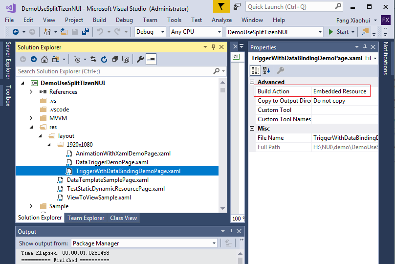

# Nuget to be referenced

To use the xaml of Tizen, user need to reference two nuget: Tizen.NET(Required) and Tizen.NUI.XamlBuild(Optional).

Tizen.NET provide the API of Tizen.NUI and Tizen.NUI.Xaml,
Tizen.NUI.XamlBuild is used to improve the performance.

Attention:
Tizen.NUI.XamlBuild will generate the xaml file to .g.cs, then generate it to IL and inject it to the output file of solution.
The injection is controled by the variable "NeedInjection" （the value is True/False） in .csproj file.

    <PropertyGroup>
        <NeedInjection>True</NeedInjection>
    </PropertyGroup>

## Recommended file structure

Every .xaml file need a root node, this node corresponds to a class (inherit from Tizen.NUI.BaseComponents.View, Tizen.NUI.Layer or Tizen.NUI.ContentPage), we recommend use two files to describe this class: .cs and .xaml.cs.

The .cs file will use this class, such as adding it to Windows as a child.
The .xaml.cs file defines the class's display elements, internal business logic, load itself from .xaml file.

**Attention:**
If the solution reference the Tizen.NUI.XamlBuild, and the .xaml file is "Embedded Resource", it will be generate to .g.cs file.
In the .g.cs, there a function "InitializeComponent" which will do the loading from xaml, and every node with x:Name in XAML has a variable that is generated with the same name as its x:Name.

For Example:
The .xaml file is

``` xml
    <?xml version="1.0" encoding="UTF-8" ?>
    <Layer x:Class="Tizen.NUI.Examples.TestStaticDynamicResourcePage"
      xmlns="http://tizen.org/Tizen.NUI/2018/XAML"
      xmlns:x="http://schemas.microsoft.com/winfx/2009/xaml">

      <Layer.XamlResources>
        <ResourceDictionary x:Name="res1">
          <x:String x:Key="urlKey">
            *DemoRes*/images/ambient/default/picture_m_1.jpg
          </x:String>
          <x:String x:Key="positionKey">
            200, 200
          </x:String>
        </ResourceDictionary>
      </Layer.XamlResources>

      <ImageView x:Name="img1" ResourceUrl="{StaticResource urlKey}" Position2D="{DynamicResource positionKey}" />
    </Layer>
```

Because the node "ImageView" has x:Name (img1), so the code in .g.cs file is:

``` csharp
namespace Tizen.NUI.Examples {
    [Tizen.NUI.Xaml.XamlFilePathAttribute("res\\layout\\TestStaticDynamicResourcePage.xaml")]
    [Tizen.NUI.Xaml.XamlCompilationAttribute(global::Tizen.NUI.Xaml.XamlCompilationOptions.Compile)]
    public partial class TestStaticDynamicResourcePage : global::Tizen.NUI.Xaml.Forms.Layer {

        [global::System.CodeDom.Compiler.GeneratedCodeAttribute("Tizen.NUI.Xaml.Build.Tasks.XamlG", "1.0.0.0")]
        private global::Tizen.NUI.XamlBinding.ResourceDictionary res1;

        [global::System.CodeDom.Compiler.GeneratedCodeAttribute("Tizen.NUI.Xaml.Build.Tasks.XamlG", "1.0.0.0")]
        private global::Tizen.NUI.Xaml.Forms.BaseComponents.ImageView img1;

        [global::System.CodeDom.Compiler.GeneratedCodeAttribute("Tizen.NUI.Xaml.Build.Tasks.XamlG", "1.0.0.0")]

        private void InitializeComponent() {
            global::Tizen.NUI.Xaml.Extensions.LoadFromXaml(this, typeof(TestStaticDynamicResourcePage));
            res1 = global::Tizen.NUI.XamlBinding.NameScopeExtensions.FindByName<global::Tizen.NUI.XamlBinding.ResourceDictionary>(this, "res1");
            img1 = global::Tizen.NUI.XamlBinding.NameScopeExtensions.FindByName<global::Tizen.NUI.Xaml.Forms.BaseComponents.ImageView>(this, "img1");
        }
    }
}
```

The .xaml.cs file shall be

``` csharp
namespace Tizen.NUI.Examples
{
    public partial class TestStaticDynamicResourcePage : Tizen.NUI.Layer
    {
        public TestStaticDynamicResourcePage()
        {
            InitializeComponent();
            //Do something
        }
    }
}
```

The .cs file shall be

``` csharp
namespace Tizen.NUI.Examples
{
    public class TestStaticDynamicResource : NUIApplication
    {
        private Tizen.NUI.Layer rootLayer;
        private Window window;

        protected override void OnCreate()
        {
            window = Window.Instance;
            rootLayer = new TestStaticDynamicResourcePage();
            window.AddLayer(rootLayer.handleInstance as Tizen.NUI.Layer);
        }
    }
}
```

  **Attention:**
  To generate the .xaml to .g.cs, the .xaml must be embedded resource.
  

## Default xmlns

The default xmlns of Tizen.NUI.Xaml is `http://tizen.org/Tizen.NUI/2018/XAML`, it containers several namespaces which include the controls that can be used in xaml.

If user want to use the custom control which has the same name to the base controls (for example: there is a Slider in Tizen.NUI.UIComponents, and user want to use their own Slider which define in their own namespace), there are two method to do it:

1. Add new xmlns and add the prefix to the custom control in xaml.

    Add new xmlns namespace

    ``` xml
        <View x:Class="Tizen.NUI.Examples.AnimationWithXamlDemoPage"
          xmlns="http://tizen.org/Tizen.NUI/2018/XAML"
          xmlns:base="clr-namespace:Tizen.NUI.BaseComponents;assembly=Tizen.NUI.Xaml"
          xmlns:x="http://schemas.microsoft.com/winfx/2009/xaml">
    ```

      xmlns "base" is new xmlns, its assembly is Tizen.NUI.Xaml, namespace is Tizen.NUI.BaseComponents.

      Add prefix to custom control

    ``` xml
    <base:TextLabel x:Name="label" Name ="label" Text="AnimationTest" Position2D="100,500" Size2D="300,50"/>
    ```

2. Override the default xmlns
  
    User shall register their namespace to default xmlns in the AssemblyInfo.cs, the code is:

    ``` csharp
    [assembly: XmlnsDefinition("http://tizen.org/Tizen.NUI/2018/XAML", "Tizen.TV.NUI", "1")]
    ```

    The last param is the level, the level of Tizen.NUI.Xaml's namespace is 0, so that the class in Tizen.TV.NUI will overwrite the one in the assembly Tizen.NUI.Xaml.
