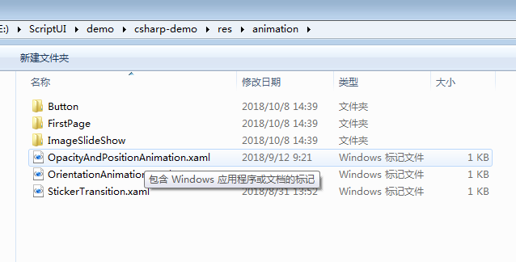

# How to use transtion

User can create transition in XAML and use it in .cs codes.

## The format of transition in XAML is :

``` xml
<?xml version="1.0" encoding="UTF-8" ?>
<Transition xmlns="http://tizen.org/Tizen.NUI/2018/XAML"
            xmlns:x="http://schemas.microsoft.com/winfx/2009/xaml"
            Duration="3000"
            LoopCount="3"
            EndAction="Cancel"
            Name="Type1">
  <Transition.Behaviors>
    <x:Array Type="{x:Type AnimationBehavior}">
      <AnimationBehavior Key="DestOpacity" Property="Opacity" DestValue="0.5" StartTime="0" EndTime="1000" />
      <AnimationBehavior Key="DestPosition" Property="Position" DestValue="300,100,0" StartTime="1000" EndTime="3000" />
    </x:Array>
  </Transition.Behaviors>
</Transition>
```

The Name is the id for transition.
Every transition has a Behaviors, it is a array of behavior.
Each behavior define a target, user can bind it to one animatable object in .cs code.

## The sample of .cs code is :

``` cs
Transition newAnimation = myPage.GetTransition("Type1");

PushButton button = NameScopeExtensions.FindByName<PushButton>(myPage, "Click");

if (null != button)
{
    FocusManager.Instance.SetCurrentFocusView(button);

    button.Clicked += (obj, e) =>
    {
        if (newAnimation != null)
        {
            Console.WriteLine("newAnimation.Duration: {0}", newAnimation.Duration);
            newAnimation.AnimateTo(label, "DestOpacity");
            newAnimation.AnimateTo(label, "DestPosition");
            newAnimation.Play();
        }
        return true;
    };
}
```

Add the codes in page's XAML file to load transition

``` xml
<ContentPage.TransitionNames>
  <x:Array Type="{x:Type x:String}">
    <x:String>OpacityAndPositionAnimation</x:String>
    <x:String>OrientationAnimation</x:String>
  </x:Array>
</ContentPage.TransitionNames>
```

The names (such as OpacityAndPositionAnimation and OrientationAnimation in the sample) are according to the file name of transition's XAML.

## The XAML file shall be put in folder res/Animation


