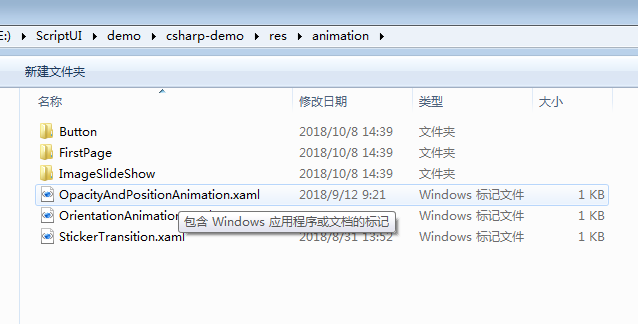

# How to Use Transition
To load a transition, you can create transition in XAML and then use this transition in the **.cs** code.

The format of transition in XAML is:

``` xaml
<?xml version="1.0" encoding="UTF-8" ?>
<Transition xmlns="http://tizen.org/Tizen.NUI/2018/XAML"
            xmlns:x="http://schemas.microsoft.com/winfx/2009/xaml"
            Duration="3000"
            LoopCount="3"
            EndAction="Cancel"
            Name="Type1">
  <Transition.Behaviors>
    <x:Array Type="{x:Type AnimationBehavior}">
      <AnimationBehavior Key="DestOpacity" Property="Opacity" DestValue="0.5" StartTime="0" EndTime="1000" />
      <AnimationBehavior Key="DestPosition" Property="Position" DestValue="300,100,0" StartTime="1000" EndTime="3000" />
    </x:Array>
  </Transition.Behaviors>
</Transition>
```

The ID for transition is `Name`. Every transition has an array of behavior. Each behavior defines a target. You can bind a behavior into one animatable object in the **.cs** code.

The sample of the **.cs** code is:

``` csharp
Transition newAnimation = myPage.GetTransition("Type1");

PushButton button = NameScopeExtensions.FindByName<PushButton>(myPage, "Click");

if (null != button)
{
    FocusManager.Instance.SetCurrentFocusView(button);

    button.Clicked += (obj, e) =>
    {
        if (newAnimation != null)
        {
            Console.WriteLine("newAnimation.Duration: {0}", newAnimation.Duration);
            newAnimation.AnimateTo(label, "DestOpacity");
            newAnimation.AnimateTo(label, "DestPosition");
            newAnimation.Play();
        }
        return true;
    };
}
```

To load transition, add the following code in the XAML file of the page:

``` xaml
<ContentPage.TransitionNames>
  <x:Array Type="{x:Type x:String}">
    <x:String>OpacityAndPositionAnimation</x:String>
    <x:String>OrientationAnimation</x:String>
  </x:Array>
</ContentPage.TransitionNames>
```

In the preceding example, `OpacityAndPositionAnimation` and `OrientationAnimation` are the transition names.
The XAML file must be put in the **res/Animation** folder.


