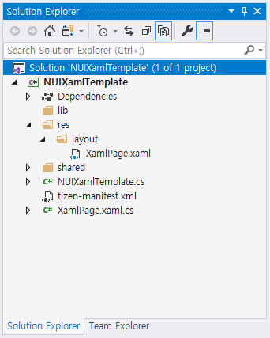

# Tizen.NUI.Xaml Overview

XAML stands for **Extensible Application Markup Language**. It is a simple declarative language based on XML. XAML uses tags to define objects. Tags can be nested within other tags to define objects within objects.

NUI adopts and integrates Xamarin.Forms XAML as NUI XAML. NUI XAML supports almost all the features of Xamarin.Forms XAML along with some additional features that are briefly explained in the subsequent sections. However, to get more information about XAML, see the [Extensible Application Markup Language (XAML)](https://docs.microsoft.com/en-US/xamarin/xamarin-forms/xaml/) guide.

## Benefits of XAML

Following are some of the XAML benefits. You can use XAML to:

- provide a more comprehensive and readable file than the equivalent code.
- update the UI without compiling and deploying the application.
- update the UI and the business logic layer separately as layers are not coupled.
- set different layout-xaml files for different configurations, for example, resolution 1080 and 720. When the resolution is changed, the display layout changes automatically.

## Anatomy of NUI XAML

NUI XAML is structured to include the following pair of files:
 - `XamlPage.xaml` : the XAML file
 - `XamlPage.xaml.cs` : the C# code-behind file associated with the XAML file

The template `NUIXamlTemplate.cs` creates an instance of `XamlPage` by loading the layout instance using XAML.

To get started with NUI XAML development, see [Get Started with NUI XAML](./get-started-xaml.md) page.
