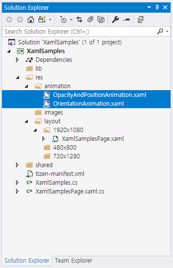

# XAML Support for Tizen.NUI

## XAML Namespaces

To use Tizen.NUI, you must define the default namespace as shown in the following code:

```xml
xmlns="http://tizen.org/Tizen.NUI/2018/XAML"
```
> [!NOTE]
> The default namespace must be the root element of the XAML file.

The following code example shows a XAML namespace declaration:

```xml
xmlns:l="clr-namespace:Tizen.NUI.Examples;assembly=TestXaml"
```

The namespace prefix is specified while declaring an instance of a type from an imported namespace, as shown in the following XAML code example:

```xml
<View x:Name="view" BackgroundColor="{Binding Color}" Size2D="440,400" Position2D="20,10" >
    <View.BindingContext>
      <l:HslViewModel x:Name="hsl" Color="Red" />
    </View.BindingContext>
</View>
```

The default namespace specifies the elements defined within the XAML file with no prefix referring to the Tizen.NUI classes, such as `View`.

In the following XAML code example, namespace declaration uses `x` as prefix:

``` xml
xmlns:x="http://schemas.microsoft.com/winfx/2009/xaml"
```

The `x` namespace declaration specifies the elements defined within the XAML with a prefix of `x`.
The following table outlines the `x` namespace attributes supported by Tizen.NUI:

|Construct|Description|
|:--|:--|
| x:Arguments | Specifies constructor arguments for a non-default constructor, or for a factory method object declaration.|
| x:Class | Specifies the namespace and class name for a class defined in XAML. The class name must match the class name of the code-behind file. It is a must to keep this construct in the root element of a XAML file.|
| x:FactoryMethod | Specifies a factory method that can be used to initialize an object.|
| x:Key | Specifies a unique user-defined key for each resource in a ResourceDictionary. The key's value is used to retrieve the XAML resource and is typically used as the argument for the StaticResource Markup Extension.|
| x:Name | Specifies a runtime object name for the XAML element. Setting **x:Name** is similar to declaring a variable in code.|


For more information, see https://docs.microsoft.com/en-US/xamarin/xamarin-forms/xaml/namespaces.


## Data Binding

Data bindings allow the properties of two objects to be linked together. Therefore, a change in one property causes the corresponding change in the other property that is linked.
There are two objects, the source and the target. The target property must be a bindable property, which means that the target object must derive from `BindableObject`. A property of `TextLabel` such as `Text` is associated with the bindable property `TextProperty`.

### View-to-View Bindings

You can define data bindings to link properties of two views on the same page. You can set the data binding in XAML using the following:

- Set the `BindingContext` property of the target element to an `x:Reference` markup extension that references the source element.
- Set the target property to a `Binding` markup extension that references the source property.

Following is a XAML file that contains a `Slider` and two `TextLabel` views. One of the `TextLabel` view is rotated by the `Slider` value and the other displays the `Slider` value:

```xml
<TextLabel Text="ROTATION" BindingContext="{x:Reference Name=slider}" Position2D="50,50" Rotation="{Binding Path=Value}" Size2D="300,50" HorizontalAlignment="Center" VerticalAlignment="Center" PivotPoint="Center" />

<Slider x:Name="slider" Name="slider" LowerBound="0" UpperBound="360" Value="10" ShowPopup="true" ShowValue="true" ValuePrecision="1" Position2D="50,200" Size2D="300,20" />

<TextLabel BindingContext="{x:Reference slider}" Position2D="50,300" Size2D="300,50" Text="{Binding Value, StringFormat='The angle is {0:F0} degrees'}" />
```

The `Slider` contains an `x:Name` attribute that is referenced by the two `TextLabel` views using the `x:Reference` markup extension.

### Source and BindingContext

The `BindingContext` property is one of the two ways to link the source and target objects. You can include a reference to the source object within the binding expression.
The following code shows how the source object and source property can be specified in the Binding markup extension:

```xml
<TextLabel x:Name="label" Name ="label" Text="Text" Position2D="100,100" Size2D="300,50" PositionX="{Binding Source={x:Reference Name=slider}, Path=Value}" />

<Slider x:Name="slider" Name="slider" LowerBound="100" UpperBound="800" Value="100" ShowPopup="true" ShowValue="false" Position2D="400,400" Size2D="300,20" />
```

The `Binding` markup extension has two arguments, one of which is a markup extension for `x:Reference`. Therefore, a pair of curly braces are nested within the main curly braces:


```xml
PositionX="{Binding Source={x:Reference Name=slider}, Path=Value}"
```

Following are the two ways to specify the link between the source object with the target object:
- Use the `BindingContext` to reference the source object.
- Use the `Source` property of the `Binding` markup extension.

If you specify both, the `Source` property takes precedence over the `BindingContext`.

For more information, see https://docs.microsoft.com/en-US/xamarin/xamarin-forms/xaml/xaml-basics/data-binding-basics.


## How to Handle Object Created by XAML

In order to implement various functions in an Application, the instances of objects created in XAML must be referenced and handled in the C# code.

In the following XAML code, Tizen.NUI supports two ways to access the `ImageView` instance in the sample code:

```xml
<View x:Class="Tizen.NUI.Examples.xNameDemoPage"
  xmlns="http://tizen.org/Tizen.NUI/2018/XAML"
  xmlns:x="http://schemas.microsoft.com/winfx/2009/xaml">

  <ImageView x:Name="ImageOne" Name="title" Position2D="0,0" Size2D="400,400" ResourceUrl="*Resource*/res/xxx.png"/>

</View>
```

- View.FindChildByName
- NameScopeExtensions.FindByName\<T\>

```csharp
View myPage = new xNameDemoPage();
Tizen.NUI.Xaml.Extensions.LoadFromXaml(myPage, typeof(xNameDemoPage));

ImageView title = myPage.FindChildByName("title") as ImageView;

ImageView imageOne = NameScopeExtensions.FindByName<Tizen.NUI.BaseComponents.ImageView>(myPage, "ImageOne");
```

In `View.FindChildByName` method, set the `Name` property of the control as `Name="title"`. In the `NameScopeExtensions.FindByName<T>` method, set `x:Name` of the element as `x:Name="ImageOne"`.
To have a better performance, it is recommended to use the `NameScopeExtensions.FindByName<T>` method.

> [!NOTE]
> If you add the Tizen.NUI.XamlBuild nuget package into a project, and set the XAML file as `Embedded Resource`. It will be generated in the **.g.cs** file.
> In the **.g.cs** file, every node with `x:Name` in XAML has a variable that is generated with a similar name as its `x:Name`. You can use it directly in your **.xaml.cs** file.


## How to Define and Use XAML Resources

XAML resources are definitions of objects that can be shared and reused throughout a Tizen.NUI application. These resource objects are stored in a resource dictionary.

`View` defines a property named as `XamlResources`, which is of type `ResourceDictionary`. The `ResourceDictionary` is a dictionary with `string` keys and values of an object. Items can be added to this dictionary in XAML, and they can be accessed in XAML with the `StaticResource` and `DynamicResource` markup extensions.
`DynamicResource` is for the dictionary keys associated with values that might change during runtime, while `StaticResource` accesses elements from the dictionary only once when the elements on the page are constructed.

### Create and Consume ResourceDictionary

Each resource has a key that is specified using the `x:Key` attribute, which becomes a dictionary key in `ResourceDictionary`.
The following **TestStaticDynamicResource** example explains the usage of `StaticResource` and `DynamicResource`:

```xml
<View x:Class="Tizen.NUI.Examples.TestStaticDynamicResourcePage"
  xmlns="http://tizen.org/Tizen.NUI/2018/XAML"
  xmlns:x="http://schemas.microsoft.com/winfx/2009/xaml">

  <View.XamlResources>
    <ResourceDictionary>
      <x:String x:Key="urlKey">
          *Resource*/res/picture_m_1.jpg
      </x:String>
      <x:String x:Key="positionKey">
          200, 200
      </x:String>
    </ResourceDictionary>
  </View.XamlResources>`

  <ImageView x:Name="img1" ResourceUrl="{StaticResource urlKey}"  Position2D="{DynamicResource positionKey}"/>
</View>
```

`StaticResource` accesses the item in the dictionary only once, while XAML is being parsed and the page is being built. However, `DynamicResource` maintains a link between the dictionary key and the property set from that dictionary item. If the item in the resource dictionary referenced by the key changes, then `DynamicResource` will detect that change and set the new value to the property.
When you change the value of `"positionKey"`, `DynamicResource` will detect that change and set the new value to the `Position2D` property.

```csharp
Tizen.NUI.Binding.ResourceDictionary dict = Tizen.NUI.GetResourcesProvider.Get().XamlResources;
Tizen.NUI.GetResourcesProvider.Get().XamlResources["positionKey"] = positionX.ToString() + "," + positionY.ToString();
```

For more information, see https://docs.microsoft.com/en-US/xamarin/xamarin-forms/xaml/resource-dictionaries.


## TypeConverters

If you want to convert a string to some custom type in XAML, you need to define a TypeConverter. This changes the string format as a XAML format such as converting `Red` to `Color.Red`.
If you write a custom class, and you want instances of your class to be usable as XAML settable attribute values, you might need to write a custom TypeConverter class.

> [!NOTE]
> NUI XAML is very similar to WPF XAML. For more information, see [TypeConverters and XAML]( https://docs.microsoft.com/en-us/dotnet/framework/wpf/advanced/typeconverters-and-xaml ).

### Type Conversion

In the XAML file, all the attribute values are represented as type of string with pure text.
Even primitives (ex: Int, Double) are simple text string and they are needed to be changed as the type that XAML processor can understand.
For instance, **Tizen.NUI** defines some properties that take a value of type `Size2D`.
`Size2D` is a value that describes two-dimensional sizes and has two important properties, width and height.
When you are specifying size2D in XAML, you must specify it as a string with a comma between the width and height values:

```xml
<ImageView PositionX="100" PositionY="320" Size2D="300, 300" ResourceUrl="ImageResourcePath"/>
```

In this scenario, the type converter is the `Size2DTypeConverter` class.
If a type converter is not available, you must use verbose markup as shown in the following code:

```xml
<ImageView PositionX="100" PositionY="320" ResourceUrl="ImageResourcePath">
  <ImageView.Size2D>
    <Size2D Width="300" Height="300"/>
  </ImageView.Size2D>
</ImageView>
```

### NUI TypeConverter

Currently, Tizen.NUI supports the following type converters:
- `ColorTypeConverter`
- `PositionTypeConverter`
- `Position2DTypeConverter`
- `SizeTypeConverter`
- `Size2DTypeConverter`
- `Vector2TypeConverter`
- `Vector3TypeConverter`
- `Vector4TypeConverter`
- `RelativeVector2TypeConverter`
- `RelativeVector3TypeConverter`
- `RelativeVector4TypeConverter`

Therefore, you can define the color, position, Size2D, and so on as string in XAML as shown in the following code:

```xml
<TextLabel Text="HelloWorld!" BackgroundColor="1.0,0.0,0.0,1.0" Position="20,10,0" Size2D="440,400"/>
```

### Implement Type Converter

If you want to convert a string to some custom type in XAML, you need to define a `TypeConverter`.
The most important method in `TypeConverter` is `ConvertFromInvariantString`, which converts the input string to the required object type.
You can see `Size2DTypeConverter` as shown in the following code:

```csharp
internal class Size2DTypeConverter : TypeConverter
{
    public override object ConvertFromInvariantString(string value)
    {
        if (value != null)
        {
            string[] parts = value.Split(',');
            if (parts.Length == 2)
            {
                return new Size2D(Int32.Parse(parts[0].Trim(), CultureInfo.InvariantCulture),
                                Int32.Parse(parts[1].Trim(), CultureInfo.InvariantCulture));
            }
        }

        throw new InvalidOperationException($"Cannot convert \"{value}\" into {typeof(Size2D)}");
    }
}
```

## Property Trigger

The following example shows two triggers that changes `PositionX` of the `ImageView` property when the `ResourceUrl` property is changed to or set equal to `../res/detail.png` or `../res/sendtophone.png`:

```xml
<View x:Class="Tizen.NUI.Examples.StyleDemoPage"
  xmlns="http://tizen.org/Tizen.NUI/2018/XAML"
  xmlns:x="http://schemas.microsoft.com/winfx/2009/xaml">

  <View.XamlResources>
    <ResourceDictionary>
      <Style x:Key="CustomStyle" TargetType="ImageView">
        <Style.Triggers>
          <Trigger TargetType="ImageView" Property="ResourceUrl" Value="../res/detail.png">
            <Trigger.Setters >
              <Setter Property="PositionX" Value="200" />
            </Trigger.Setters>
          </Trigger>
          <Trigger TargetType="ImageView" Property="ResourceUrl" Value="../res/sendtophone.png">
            <Trigger.Setters >
              <Setter Property="PositionX" Value="500" />
            </Trigger.Setters>
          </Trigger>
        </Style.Triggers>
      </Style>
    </ResourceDictionary>
  </View.XamlResources>

  <ImageView Name="ImageView" Position2D="0,0" Size2D="400,400" Style="{StaticResource CustomStyle}">
    <x:Arguments>
      <x:String>../res/traffic_content.png</x:String>
    </x:Arguments>
  </ImageView>

  <PushButton Name="Click" LabelText="Click" Size2D="400,80" Position2D="1000,100" />
</View>
```

- `TargetType`: The control type that the trigger applies to.
- `Property`: The property on the control that is monitored.
- `Value`: The value that occurs for the monitored property that causes the trigger to activate.
- `Setter`: A collection of Setter elements can be added when the trigger condition is met. You must specify `Property` and set `Value`.

> [!NOTE]
> The Property for Trigger and Setter must not be same.

For more information, see [Xamarin.Forms Triggers](https://docs.microsoft.com/en-us/xamarin/xamarin-forms/app-fundamentals/triggers#targetText=Triggers%20allow%20you%20to%20express,on%20events%20or%20property%20changes.&targetText=Property%20Trigger%20%2D%20occurs%20when%20a,the%20properties%20of%20another%20control).


## How to Use Transition

To load a transition, you can create transition in XAML and then use this transition in the **.cs** code.

Following is the format of transition in XAML:

```xml
<?xml version="1.0" encoding="UTF-8" ?>
<Transition xmlns="http://tizen.org/Tizen.NUI/2018/XAML"
            xmlns:x="http://schemas.microsoft.com/winfx/2009/xaml"
            Duration="3000"
            LoopCount="3"
            EndAction="Cancel"
            Name="Type1">
  <Transition.Behaviors>
    <x:Array Type="{x:Type AnimationBehavior}">
      <AnimationBehavior Key="DestOpacity" Property="Opacity" DestValue="0.5" StartTime="0" EndTime="1000" />
      <AnimationBehavior Key="DestPosition" Property="Position" DestValue="300,100,0" StartTime="1000" EndTime="3000" />
    </x:Array>
  </Transition.Behaviors>
</Transition>
```

The ID for transition is `Name`. Every transition has an array of behavior. Each behavior defines a target. You can bind a behavior into one animatable object in the **.cs** code.

Following is the sample of the **.cs** code:

```csharp
Transition newAnimation = myPage.GetTransition("Type1");

PushButton button = NameScopeExtensions.FindByName<PushButton>(myPage, "Click");

if (null != button)
{
    FocusManager.Instance.SetCurrentFocusView(button);

    button.Clicked += (obj, e) =>
    {
        if (newAnimation != null)
        {
            Console.WriteLine("newAnimation.Duration: {0}", newAnimation.Duration);
            newAnimation.AnimateTo(label, "DestOpacity");
            newAnimation.AnimateTo(label, "DestPosition");
            newAnimation.Play();
        }
        return true;
    };
}
```

To load transition, add the following code in the XAML file of the page:

```xml
<View.TransitionNames>
  <x:Array Type="{x:Type x:String}">
    <x:String>OpacityAndPositionAnimation</x:String>
    <x:String>OrientationAnimation</x:String>
  </x:Array>
</View.TransitionNames>
```

In the preceding example, `OpacityAndPositionAnimation` and `OrientationAnimation` are the transition names.
The XAML file must be placed in the **res/animation** folder.


