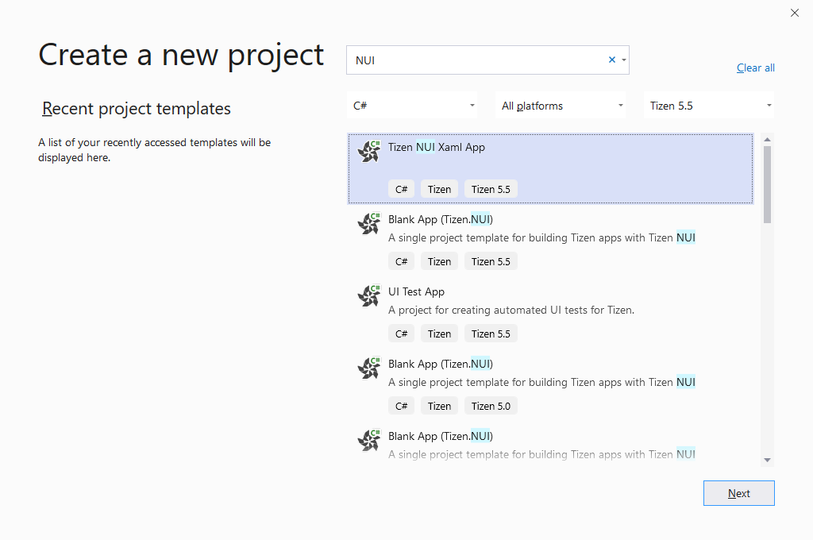
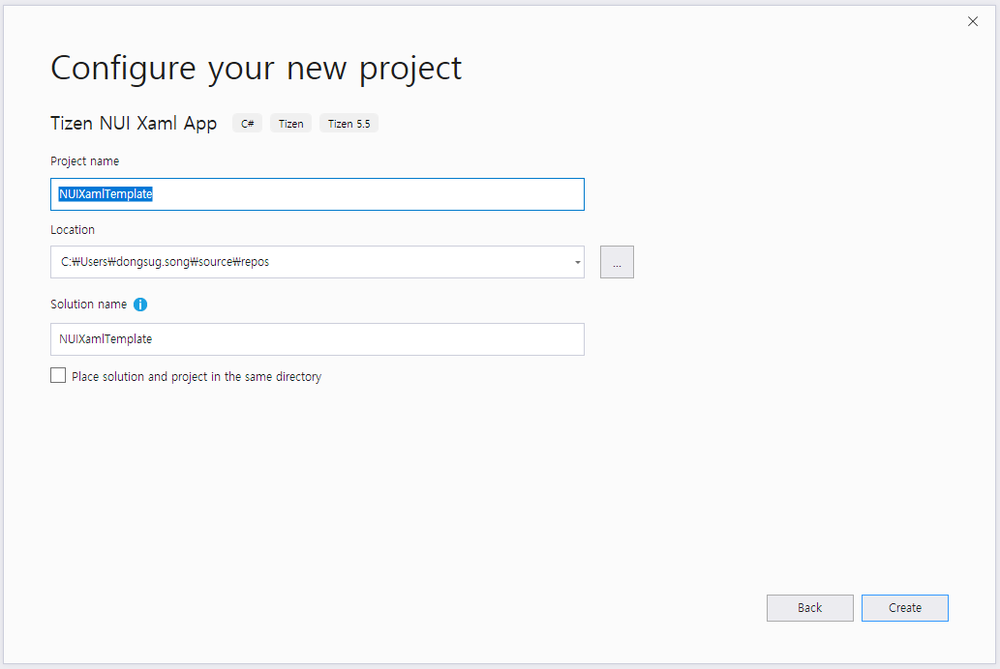
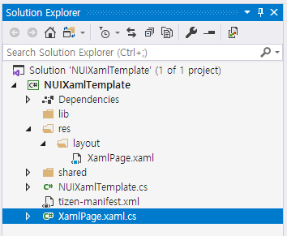
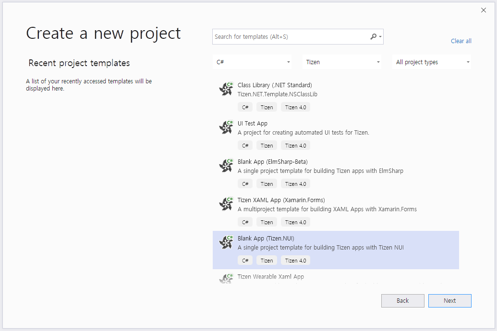
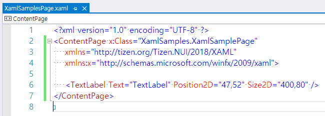

# XAML Support for Tizen.NUI

NUI adopts and integrates Xamarin.Forms XAML as NUI XAML. NUI XAML supports almost all the features of Xamarin.Forms XAML along with some additional features. 
In this file, the additional features are explained. However, to get a basic concept and insight of XAML, it is strongly recommended to go through the [eXtensible Application Markup Language (XAML)](https://docs.microsoft.com/en-US/xamarin/xamarin-forms/xaml/) guide.

## Benefits of XAML

Following are some of the XAML benefits. You can use XAML to:

- Update the UI without compiling and deploying the application.
- Update the UI and the business logic layer separately as they are not coupled.
- Set different layout-xaml files for different configurations, for example, resolution 1080 and 720. When the resolution is changed, the display layout is changed automatically.

## Create Solution Using Tizen Version 5.5

You can create a new Tizen.NUI solution using Visual Studio and then you can edit your first XAML file. For more information, see [Part 1. Getting Started with XAML](https://docs.microsoft.com/en-us/xamarin/xamarin-forms/xaml/xaml-basics/get-started-with-xaml?tabs=windows) in the XAML guide.

To create a new project, follow these steps:

1. In Visual Studio, select **File > New > Project**.

2. In the **Create a new project** dialog that appears, select **C#** from the **All languages** drop-down list.

3. In the **All project types** drop-down list, select **Tizen 5.5**.

4. Select **Tizen NUI Xaml App** and click **Next**.

> **Note**
>
> If you create a new project with **Tizen NUI Xaml App** template, a XAML file and a C# code-behind file are created.




### Create XAML file

After creating the **NUIXamlTemplate** solution, you can see `XamlPage.xaml` in the `/res/layout` folder. 



> **Note**
>
> If you select other templates or work on lower version than Tizen 5.5, you have to manually create a XAML file.

If your application runs on a target having different resolutions, such as 720x1080, 480x800, or both of them then put XAML files into the corresponding folders. For example, you can create two folders: `/res/layout/720x1080/` and `/res/layout/480x800/`. The former is the folder with a XAML file for 720x1080 resolution, and the latter is the folder with a XAML file for 480x800 resolution.

In the following sample, `XamlPage.xaml` is created and placed in the **/res/layout/** folder:


To add any control you want, edit the XamlPage.xaml file:


In this sample, the `TextLabel` element is added, and the `Text`, `PointSize`, `TextColor`, and other properties are set.

### Create C# Code-Behind File

After creating the **NUIXamlTemplate** solution, you can see `XamlPage.xaml.cs`, which is a C# code-behind file associated with the XAML file in the project folder. 



> **Note**
>
> If you select other templates or work on lower version than Tizen 5.5, you have to manually create a C# code-behind file.

In the following sample XAML code, the `x:Class` attribute specifies a fully qualified class name, the `XamlPage` class in the `NUIXamlTemplate` namespace. This means that this XAML file of **XamlPage.xaml.cs** defines a new class named `XamlPage` in the `NUIXamlTemplate` namespace that is derived from `ContentPage`:

```csharp
using System;
using Tizen.NUI;
using Tizen.NUI.BaseComponents;

namespace NUIXamlTemplate
{
    public partial class XamlPage : ContentPage
    {
        public XamlPage(Window win) : base(win)
        {
            InitializeComponent();
        }
    }
}
```

> **Note**
>
> The name of the XAML file must be same as the class name.

### Load XAML

To load layout instance using XAML, create a `XamlPage` instance in your code such as `OnCreate()` method that is invoked when the application is started:

```csharp
using System;
using Tizen.NUI;
using Tizen.NUI.BaseComponents;

namespace NUIXamlTemplate
{
    class Program : NUIApplication
    {
        Animation animation;
        protected override void OnCreate()
        {
            base.OnCreate();
            Window.Instance.BackgroundColor = Color.Blue;
            Window.Instance.KeyEvent += OnKeyEvent;

            XamlPage page = new XamlPage(Window.Instance);

            animation = new Animation(2000);
            animation.AnimateTo(page.text, "Orientation", new Rotation(new Radian(new Degree(180.0f)), PositionAxis.X), 0, 500);
            animation.AnimateTo(page.text, "Orientation", new Rotation(new Radian(new Degree(0.0f)), PositionAxis.X), 500, 1000);
            animation.Looping = true;
            animation.Play();
        }

        public void OnKeyEvent(object sender, Window.KeyEventArgs e)
        {
            if (e.Key.State == Key.StateType.Down && (e.Key.KeyPressedName == "XF86Back" || e.Key.KeyPressedName == "Escape"))
            {
                Exit();
            }
        }

        static void Main(string[] args)
        {
            var app = new Program();
            app.Run(args);
        }
    }
}
```

When you compile and run this program, the `TextLabel` element appears on the window. Additionally, you can see the "Hello, NUI XAML APP" text, which is defined in the XAML file that rotates on the x-axis.

## Create Solution Using Tizen Version 5.0 and Lower

To create a new project, follow these steps:

1. In Visual Studio, select **File > New > Project**.
2. In the **Create a new project** dialog that appears, select **C#** from the **All languages** drop-down list.
3. In the **All project types** drop-down list, select **Tizen**.
4. Select **Blank App (Tizen.NUI)** and click **Next**.



Select a location for the solution and enter a name, for example, **XamlSamples** and click **OK**.

### Create XAML file

After creating the **XamlSamples** solution, create a XAML file. In the following sample, it is XamlSamplesPage.xaml. Place the XAML file in the **/res/layout/1920x1080/** folder:


If your app runs on a target having different window sizes, such as 720x1080, 480x800, or both then put the XAML file into the corresponding folder. You can also create these folders, for example, **/res/layout/720x1080/** or **/res/layout/480x800/**.
To add any control you want, edit the XamlSamplesPage.xaml file.



In this sample, a simple `TextLabel` is added, and the `Text`, `Position2D`, and `Size2D` properties are set.

### Create C# Code-Behind File
There is a C# code-behind file associated with the XAML file. In the following sample XAML file, the `x:Class` attribute specifies a fully qualified class name, the `XamlSamplesPage` class in the `XamlSamples` namespace. This means that this XAML file of **XamlSamplesPage.xaml.cs** defines a new class named `XamlSamplesPage` in the `XamlSamples` namespace that is derived from `ContentPage`:


``` csharp
using System;
using Tizen.NUI;
namespace XamlSamples
{
    public class XamlSamplesPage : ContentPage
    {
        public XamlSamplesPage (Window win) : base(win)
        {
            InitializeComponent();
        }
        protected override void Dispose(DisposeTypes type)
        {
            if (disposed)
            {
                return;
            }
            base.Dispose(type);
        }
        public override void SetFocus()
        {
            base.SetFocus();
        }
    }
}
```

> **Note**
>
> The name of the XAML file must be same as the class name.

### Load XAML

After creating the XAML and the C# code-behind files, you can load and show the visual contents that you defined in the XAML file:

``` csharp
using System;
using Tizen.NUI;
using Tizen.NUI.Xaml;
namespace XamlSamples
{
    class Program : NUIApplication
    {
        private Window window;
        private ContentPage myPage;
        protected override void OnCreate()
        {
            base.OnCreate();
            Initialize();
        }
        void Initialize()
        {
            window = Window.Instance;
            myPage = new XamlSamplesPage(window);
            myPage.SetFocus();
        }
        static void Main(string[] args)
        {
            var app = new Program();
            app.Run(args);
        }
    }
}
```

When you compile and run this program, the `TextLabel` element will appear on the window.
For more information, see [Layout Define Example](./layout-define-example.md).

## XAML Namespaces

To use Tizen.NUI, you must define the default namespace as shown in the following code:

```xml
xmlns="http://tizen.org/Tizen.NUI/2018/XAML"
```
> **Note**
>
> It must be the root element of the XAML file.

The following code example shows a XAML namespace declaration:

```xml
xmlns:l="clr-namespace:Tizen.NUI.Examples;assembly=TestXaml"
```

The namespace prefix is specified while declaring an instance of a type from an imported namespace, as shown in the following XAML code example:

```xml
<View x:Name="view" BackgroundColor="{Binding Color}" Size2D="440,400" Position2D="20,10" >
    <View.BindingContext>
      <l:HslViewModel x:Name="hsl" Color="Red" />
    </View.BindingContext>
</View>
```

The default namespace specifies the elements defined within the XAML file with no prefix referring to the Tizen.NUI classes, such as `View`.

For more information, see https://docs.microsoft.com/en-US/xamarin/xamarin-forms/xaml/namespaces.


## Data Binding

Data bindings allow the properties of two objects to be linked together. Therefore, a change in one property causes the corresponding change in the other property that is linked.
There are two objects, the source and the target. The target property must be a bindable property, which means that the target object must derive from `BindableObject`. A property of `TextLabel` such as `Text` is associated with the bindable property `TextProperty`.

### View-to-View Bindings

You can define data bindings to link properties of two views on the same page. You can set the data binding in XAML using the following:

- Set the `BindingContext` property of the target element to an `x:Reference` markup extension that references the source element.
- Set the target property to a `Binding` markup extension that references the source property.

Following is a XAML file that contains a `Slider` and two `TextLabel` views. One of the `TextLabel` view is rotated by the `Slider` value and the other displays the `Slider` value:

```xml
<TextLabel Text="ROTATION" BindingContext="{x:Reference Name=slider}" Position2D="50,50" Rotation="{Binding Path=Value}" Size2D="300,50" HorizontalAlignment="Center" VerticalAlignment="Center" PivotPoint="Center" />

<Slider x:Name="slider" Name="slider" LowerBound="0" UpperBound="360" Value="10" ShowPopup="true" ShowValue="true" ValuePrecision="1" Position2D="50,200" Size2D="300,20" />

<TextLabel BindingContext="{x:Reference slider}" Position2D="50,300" Size2D="300,50" Text="{Binding Value, StringFormat='The angle is {0:F0} degrees'}" /> 
```

The `Slider` contains an `x:Name` attribute that is referenced by the two `TextLabel` views using the `x:Reference` markup extension.

### Source and BindingContext

The `BindingContext` property is one of the two ways to link the source and target objects. You can include a reference to the source object within the binding expression.
The following code shows how the source object and source property can be specified in the Binding markup extension:

```xml
<TextLabel x:Name="label" Name ="label" Text="Text" Position2D="100,100" Size2D="300,50" PositionX="{Binding Source={x:Reference Name=slider}, Path=Value}" />

<Slider x:Name="slider" Name="slider" LowerBound="100" UpperBound="800" Value="100" ShowPopup="true" ShowValue="false" Position2D="400,400" Size2D="300,20" />
```

The `Binding` markup extension has two arguments, one of which is a markup extension for `x:Reference`. Therefore, a pair of curly braces are nested within the main curly braces:


```xml
PositionX="{Binding Source={x:Reference Name=slider}, Path=Value}"
```

Following are the two ways to specify the link between the source object with the target object:
- Use the `BindingContext` to reference the source object.
- Use the `Source` property of the `Binding` markup extension.

If you specify both, the `Source` property takes precedence over the `BindingContext`.

For more information, see https://docs.microsoft.com/en-US/xamarin/xamarin-forms/xaml/xaml-basics/data-binding-basics.


## How to Handle Object Created by XAML

In order to implement various functions in an Application, the instances of objects created in XAML must be referenced and handled in the C# code.

In the following XAML code, Tizen.NUI supports two ways to access the `ImageView` instance in the sample code:

```xml
<ContentPage x:Class="Tizen.NUI.Examples.xNameDemoPage"
  xmlns="http://tizen.org/Tizen.NUI/2018/XAML"
  xmlns:x="http://schemas.microsoft.com/winfx/2009/xaml">

  <ImageView x:Name="ImageOne" Name="title" Position2D="0,0" Size2D="400,400" ResourceUrl="*Resource*/res/xxx.png"/>

</ContentPage>
```

- View.FindChildByName
- NameScopeExtensions.FindByName\<T\>

```csharp
ContentPage myPage = new xNameDemoPage(window);
Extensions.LoadFromXaml(myPage, typeof(xNameDemoPage));

ImageView title = myPage.Root.FindChildByName("title") as ImageView;

ImageView imageOne = NameScopeExtensions.FindByName<Tizen.NUI.BaseComponents.ImageView>(myPage, "ImageOne");
```

In `View.FindChildByName` method, set the `Name` property of the control as `Name="title"`. In the `NameScopeExtensions.FindByName<T>` method, set `x:Name` of the element as `x:Name="ImageOne"`.
To have a better performance, it is recommended to use the `NameScopeExtensions.FindByName<T>` method.

> **Note**
>
> If you add the Tizen.NUI.XamlBuild nuget package into a project, and set the XAML file as `Embedded Resource`. It will be generated in the **.g.cs** file.
>
> In the **.g.cs** file, every node with `x:Name` in XAML has a variable that is generated with a similar name as its `x:Name`. You can use it directly in your **.xaml.cs** file.


## How to Define and Use XAML Resources

XAML resources are definitions of objects that can be shared and reused throughout a Tizen.NUI application. These resource objects are stored in a resource dictionary.

`ContentPage` defines a property named `Resources` that is of type `ResourceDictionary`. `ResourceDictionary` is a dictionary with `string` keys and values of an object. Items can be added to this dictionary in XAML, and they can be accessed in XAML with the `StaticResource` and `DynamicResource` markup extensions.
`DynamicResource` is for the dictionary keys associated with values that might change during runtime, while `StaticResource` accesses elements from the dictionary only once when the elements on the page are constructed.
 
### Create and Consume ResourceDictionary

Each resource has a key that is specified using the `x:Key` attribute, which becomes a dictionary key in `ResourceDictionary`.
The following **TestStaticDynamicResource** example explains the usage of `StaticResource` and `DynamicResource`:

```xml
<ContentPage x:Class="Tizen.NUI.Examples.TestStaticDynamicResourcePage"
  xmlns="http://tizen.org/Tizen.NUI/2018/XAML"
  xmlns:x="http://schemas.microsoft.com/winfx/2009/xaml">

  <ContentPage.XamlResources>
    <ResourceDictionary>
      <x:String x:Key="urlKey">
          *Resource*/res/picture_m_1.jpg
      </x:String>
      <x:String x:Key="positionKey">
          200, 200
      </x:String>
    </ResourceDictionary>
  </ContentPage.XamlResources>`

  <ImageView x:Name="img1" ResourceUrl="{StaticResource urlKey}"  Position2D="{DynamicResource positionKey}/>
</ContentPage>
```

`StaticResource` accesses the item in the dictionary only once, while XAML is being parsed and the page is being built. However, `DynamicResource` maintains a link between the dictionary key and the property set from that dictionary item. If the item in the resource dictionary referenced by the key changes, then `DynamicResource` will detect that change and set the new value to the property.
When you change the value of `"positionKey"`, `DynamicResource` will detect that change and set the new value to the `Position2D` property.

```csharp
Tizen.NUI.Binding.ResourceDictionary dict = Tizen.NUI.GetResourcesProvider.Get().Resources;
Tizen.NUI.GetResourcesProvider.Get().Resources["positionKey"] = positionX.ToString() + "," + positionY.ToString();
```

For more information, see https://docs.microsoft.com/en-US/xamarin/xamarin-forms/xaml/resource-dictionaries.


## TypeConverters

If you want to convert a string to some custom type in XAML, you need to define a TypeConverter. This changes the string format as a XAML format such as converting `Red` to `Color.Red`.
If you write a custom class, and you want instances of your class to be usable as XAML settable attribute values, you might need to write a custom TypeConverter class.

> **Note**
> 
> NUI XAML is very similar to WPF XAML. For more information on basic concepts, see
https://docs.microsoft.com/en-us/dotnet/framework/wpf/advanced/typeconverters-and-xaml.

### Type Conversion

In the XAML file, all the attribute values are represented as type of string with pure text.
Even primitives (ex: Int, Double) are simple text string and they are needed to be changed as the type that XAML processor can understand.
For instance, **Tizen.NUI** defines some properties that take a value of type `Size2D`. 
`Size2D` is a value that describes two-dimensional sizes and has two important properties, width and height. 
When you are specifying size2D in XAML, you must specify it as a string with a comma between the width and height values:

```xml
<ImageView PositionX="100" PositionY="320" Size2D="300, 300" ResourceUrl="ImageResourcePath"/>
```

In this scenario, the type converter is the `Size2DTypeConverter` class.
If a type converter is not available, you must use verbose markup as shown in the following code:

```xml
<ImageView PositionX="100" PositionY="320" ResourceUrl="ImageResourcePath">
  <ImageView.Size2D>
    <Size2D Width="300" Height="300"/>
  </ImageView.Size2D>
</ImageView>
```

### NUI TypeConverter

Currently, Tizen.NUI supports the following type converters:
- `ColorTypeConverter`
- `PositionTypeConverter`
- `Position2DTypeConverter`
- `SizeTypeConverter`
- `Size2DTypeConverter`
- `Vector2TypeConverter`
- `Vector3TypeConverter`
- `Vector4TypeConverter`
- `RelativeVector2TypeConverter`
- `RelativeVector3TypeConverter`
- `RelativeVector4TypeConverter`

Therefore, you can define the color, position, Size2D, and so on as string in XAML as shown in the following code:

```xml
<TextLabel Text="HelloWorld!" BackgroundColor="1.0,0.0,0.0,1.0" Position="20,10,0" Size2D="440,400"/>
```

### Implement Type Converter

If you want to convert a string to some custom type in XAML, you need to define a `TypeConverter`.
The most important method in `TypeConverter` is the `ConvertFromInvariantString` which converts the input string to the required object type. 
You can see `Size2DTypeConverter` as shown in the following code:

```csharp
internal class Size2DTypeConverter : TypeConverter
{
    public override object ConvertFromInvariantString(string value)
    {
        if (value != null)
        {
            string[] parts = value.Split(',');
            if (parts.Length == 2)
            {
                return new Size2D(Int32.Parse(parts[0].Trim(), CultureInfo.InvariantCulture), 
                                Int32.Parse(parts[1].Trim(), CultureInfo.InvariantCulture));
            }
        }

        throw new InvalidOperationException($"Cannot convert \"{value}\" into {typeof(Size2D)}");
    }
}
```

## Property Trigger

The following example shows two triggers that changes `PositionX` of the `ImageView` property when the `ResourceUrl` property is changed to or set equal to `../res/detail.png` or `../res/sendtophone.png`:

```xml
<ContentPage x:Class="Tizen.NUI.Examples.StyleDemoPage"
  xmlns="http://tizen.org/Tizen.NUI/2018/XAML"
  xmlns:x="http://schemas.microsoft.com/winfx/2009/xaml">

  <ContentPage.Resources>
    <ResourceDictionary>
      <Style x:Key="CustomStyle" TargetType="ImageView">
        <Style.Triggers>
          <Trigger TargetType="ImageView" Property="ResourceUrl" Value="../res/detail.png">
            <Trigger.Setters >
              <Setter Property="PositionX" Value="200" />
            </Trigger.Setters>
          </Trigger>
          <Trigger TargetType="ImageView" Property="ResourceUrl" Value="../res/sendtophone.png">
            <Trigger.Setters >
              <Setter Property="PositionX" Value="500" />
            </Trigger.Setters>
          </Trigger>
        </Style.Triggers>
      </Style>
    </ResourceDictionary>
  </ContentPage.Resources>

  <ImageView Name="ImageView" Position2D="0,0" Size2D="400,400" Style="{StaticResource CustomStyle}">
    <x:Arguments>
      <x:String>../res/traffic_content.png</x:String>
    </x:Arguments>
  </ImageView>

  <PushButton Name="Click" LabelText="Click" Size2D="400,80" Position2D="1000,100" />
</ContentPage>
```

- `TargetType`: The control type that the trigger applies to.
- `Property`: The property on the control that is monitored.
- `Value`: The value that occurs for the monitored property that causes the trigger to activate.
- `Setter`: A collection of Setter elements can be added when the trigger condition is met. You must specify `Property` and set `Value`.

> **Note**
>
> The Property for Trigger and Setter must not be same.

For more information, see [Xamarin.Forms Triggers](https://docs.microsoft.com/en-us/xamarin/xamarin-forms/app-fundamentals/triggers#targetText=Triggers%20allow%20you%20to%20express,on%20events%20or%20property%20changes.&targetText=Property%20Trigger%20%2D%20occurs%20when%20a,the%20properties%20of%20another%20control).


## How to Use Transition

To load a transition, you can create transition in XAML and then use this transition in the **.cs** code.

Following is the format of transition in XAML:

```xml
<?xml version="1.0" encoding="UTF-8" ?>
<Transition xmlns="http://tizen.org/Tizen.NUI/2018/XAML"
            xmlns:x="http://schemas.microsoft.com/winfx/2009/xaml"
            Duration="3000"
            LoopCount="3"
            EndAction="Cancel"
            Name="Type1">
  <Transition.Behaviors>
    <x:Array Type="{x:Type AnimationBehavior}">
      <AnimationBehavior Key="DestOpacity" Property="Opacity" DestValue="0.5" StartTime="0" EndTime="1000" />
      <AnimationBehavior Key="DestPosition" Property="Position" DestValue="300,100,0" StartTime="1000" EndTime="3000" />
    </x:Array>
  </Transition.Behaviors>
</Transition>
```

The ID for transition is `Name`. Every transition has an array of behavior. Each behavior defines a target. You can bind a behavior into one animatable object in the **.cs** code.

Following is the sample of the **.cs** code:

```csharp
Transition newAnimation = myPage.GetTransition("Type1");

PushButton button = NameScopeExtensions.FindByName<PushButton>(myPage, "Click");

if (null != button)
{
    FocusManager.Instance.SetCurrentFocusView(button);

    button.Clicked += (obj, e) =>
    {
        if (newAnimation != null)
        {
            Console.WriteLine("newAnimation.Duration: {0}", newAnimation.Duration);
            newAnimation.AnimateTo(label, "DestOpacity");
            newAnimation.AnimateTo(label, "DestPosition");
            newAnimation.Play();
        }
        return true;
    };
}
```

To load transition, add the following code in the XAML file of the page:

```xml
<ContentPage.TransitionNames>
  <x:Array Type="{x:Type x:String}">
    <x:String>OpacityAndPositionAnimation</x:String>
    <x:String>OrientationAnimation</x:String>
  </x:Array>
</ContentPage.TransitionNames>
```

In the preceding example, `OpacityAndPositionAnimation` and `OrientationAnimation` are the transition names.
The XAML file must be placed in the **res/animation** folder.


## How to Define UI Component in XAML

### XAML Object Elements

Object element syntax always starts with an opening angle bracket (<). This is followed by the name of the type where you want to create an instance. After this, you can optionally declare attributes on the object element. To complete the object element tag, end with a forward slash and closing angle bracket in succession (/>). The following example shows how to write an object element syntax:

```xml
<TextLabel Text="TextLabel"/>
```

The `TextLabel` instance is created by calling the default constructor of the underlying type when parsing and loading the XAML.

### Parent and Child

The following example shows how to add a child view to the parent view:

```xml
<View>
  <TextLabel Text="TextLabel"/>
</View>
```

The `TextLabel` instance will be added to the `View` instance.

### Attribute Syntax Properties

An attribute syntax names the property that is being set in the attribute syntax, followed by the assignment operator (=). The value of an attribute is always specified as a string that is contained within the quotation marks. For example, the following markup creates a `TextLabel` that has a red text and a blue background in addition to the display text specified as `TextLabel`.

```xml
<TextLabel TextColor="Red" BackgroundColor="Blue" Text="TextLabel" />
```

In the preceding sample, we can use the string **Red** and **Blue** to set color, because there is a **TypeConverter**.

### Property Element Syntax

The syntax for the property element start tag is `<typeName.propertyName>`. The content of that tag is an object element of the type that the property takes as its value . After specifying content, you must close the property element with an end tag. The syntax for the end tag is `</typeName.propertyName>`.

The following example shows the same properties being set as in the previous attribute syntax example, but this time by using property element syntax for all properties of the `TextLabel`:

```xml
<TextLabel>
  <TextLabel.TextColor>
    Red
  </TextLabel.TextColor>
  <TextLabel.BackgroundColor>
    Blue
  </TextLabel.BackgroundColor>
  <TextLabel.Text>
    TextLabel
  </TextLabel.Text>
</TextLabel>
```

### Collection Syntax

In some cases, particular property takes a collection type, such as the `ImageView.Image` property. The following example shows the syntax to set the property in the collection type:

```xml
<ImageView PositionX="10" PositionY="320" Size2D="300, 300" PixelArea="0.1,0.0,0.4,0.6" >
  <ImageView.Image>
    <PropertyMap>
      <KeyValue Key="Visual.Property.Type" Value="{VisualType Image}" />
      <KeyValue Key="ImageVisualProperty.URL" Value="{x:String ImageResourcepatch}" />
    </PropertyMap>
  </ImageView.Image>
</ImageView>
```

If the type of the property is an array, you can use the `x:Array` markup extension to implement it.  

For more information, see https://docs.microsoft.com/en-US/xamarin/xamarin-forms/xaml/markup-extensions/consuming.

### Events and Callback

Attribute syntax can also be used for events. In this case, the attribute's name is the name of the event. In the Tizen.NUI implementation of events for XAML, the attribute's value is the name of a handler that implements that event's delegate. 
For example, the following markup assigns a handler for the `Click` event to a `PushButton` created in markup:

```xml
<ContentPage x:Class="Tizen.NUI.Examples.TestEventHandler"
  xmlns="http://tizen.org/Tizen.NUI/2018/XAML"
  xmlns:x="http://schemas.microsoft.com/winfx/2009/xaml">

  <PushButton Name="PushButton" PositionX="100" PositionY="100" LabelText="PushButton" Size2D="260, 84" Clicked="OnClicked" />
</ContentPage>
```

You must define the event handle in the partial class within the CLR namespace identified by `x:Class`:

```csharp
public class TestEventHandler : ContentPage
{

    public TestEventHandler(Window win) : base(win)
    {
       InitializeComponent();
    }

    private bool OnClicked(object sender, EventArgs e)
    {
        if (sender is Button)
        {
            Button button = sender as Button;
            button.LabelText = "Click Me";
        }
        return true;
    }
}
```

### x:Arguments

In the preceding examples explained in this file, each element in the XAML file is instantiated with a call. 
The XAML file can either instantiate a call to the parameterless constructor of the corresponding class or to a structure. 
The `x:Arguments` element supports to instantiate objects with constructors that require arguments.  
The following code example demonstrates using the `x:Arguments` attribute with `ImageView`:

```xml
<ImageView Name="img1" Position2D="0,0" Size2D="400,400" >
  <x:Arguments>
    <x:String>*Resource*/res/traffic_content.png</x:String>
  </x:Arguments>
</ImageView>
```

For more information, see https://docs.microsoft.com/en-US/xamarin/xamarin-forms/xaml/passing-arguments.


