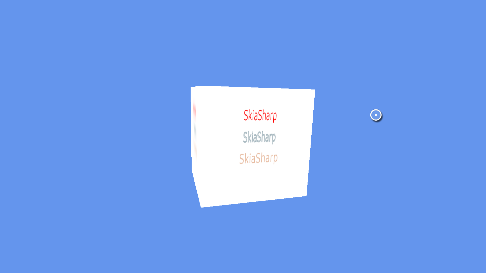

# Create Applications with SkiaSharp

SkiaSharp is a cross-platform 2D graphics API for .NET platforms based on the Skia Graphics Library of Google. It provides a comprehensive 2D API that is used across mobiles, servers, and desktop models to render images.

In OpenTK app, you can use SkiaSharp to draw geometries, texts, or images. For more information about the SkiaSharp APIs, see [SkiaSharp API document](https://docs.microsoft.com/en-us/dotnet/api/skiasharp?view=skiasharp-1.60.3).

To draw a text using SkiaSharp in the OpenTK application, use the following guidelines:

-   Allocate a memory block as a canvas for SkiaSharp.
-   Create a SKCanvas on this memory block, and render text or image that you want on this SKCanvas.
-   Create a 2D texture from this memory block.
-   Draw a 2D texture with graphics APIs of OpenTK.

## Allocate Memory Block

Allocate a specific size of the memory block. The size of memory block must be same as the size of the canvas you want.

```csharp
private IntPtr pBitMap;                   // memory handle
private int rowByte;                      // bytes of one row
private int bitmapHeight, bitmapWidth;    // height and width of the canvas

private void CreateBitmap()
{
    bitmapHeight = (int)(skiaPercent * mainWindow.Height);
    bitmapWidth = (int)(skiaPercent * mainWindow.Width);
    pBitMap = Marshal.AllocHGlobal(bitmapWidth * bitmapHeight * 4);     // allocate a memory block

    rowByte = bitmapWidth * 4;
}

private void FreeBitmap()
{
    if (pBitMap != IntPtr.Zero)
    {
        Marshal.FreeHGlobal(pBitMap);   // free the allocated memory block
        pBitMap = IntPtr.Zero;
    }
}
```

## Create SKCanvas on Memory Block

Create SKSurface on the memory block and then you can get the SKCanvas from the SKSurface:

```csharp
private SKSurface surface;
private SKCanvas canvas;

private void CreateSKCanvas()
{
    GL.PixelStore(All.UnpackAlignment, 4);

    // create the surface
    var info = new SKImageInfo(bitmapWidth, bitmapHeight, SKImageInfo.PlatformColorType, SKAlphaType.Premul);
    surface = SKSurface.Create(info, pBitMap, rowByte);
    if (surface != null)
    {
        canvas = surface.Canvas;
    }
}
```

## Draw Text on SKCanvas

Set a color and draw text on the canvas:

```csharp
private void DrawTextBySkiaSharp(SKCanvas canvas, int canvasWidth, int canvasHeight)
{
    canvas.DrawColor(SKColors.White);                                   // Change the canvas as white

    using (var paint = new SKPaint())
    {
        paint.TextSize = 64.0f;
        paint.IsAntialias = true;
        paint.Color = SKColors.Red;
        paint.IsStroke = false;
        paint.TextAlign = SKTextAlign.Center;

        canvas.DrawText("SkiaSharp", width / 2f, 144.0f, paint);        // Draw text "SkiaSharp" on the canvas
    }
}

private void DrawTextOnSkCanvas()
{
    if (canvas != null)
    {
        DrawTextBySkiaSharp(canvas, bitmapWidth, bitmapHeight);
        canvas.Flush();
    }
}
```

## Create 2D Texture from Memory Block

Call `GL.TexImage2D` of `OpenTK.Graphics.ES20` to generate 2D texture from the memory block:

```csharp
private void Create2DTextureFromMemory()
{
    GL.TexImage2D(
                All.Texture2D,
                0,
                All.BgraExt,
                bitmapWidth,
                bitmapHeight,
                0,
                All.BgraExt,
                All.UnsignedByte,
                pBitMap
            );

    GL.TexParameter(All.Texture2D, All.TextureMinFilter, (float)All.LinearMipmapLinear);
    GL.TexParameter(All.Texture2D, All.TextureMagFilter, (float)All.Linear);
    GL.GenerateMipmap(All.Texture2D);
}
```

## Draw 2D Texture

Draw a 2D texture with graphics APIs of OpenTK:

```csharp
private IGameWindow mainWindow;     // window

private float[] vertices;           // vertex array
private float[] textCoord;          // texture coordinate array

private int mProgramHandle;         // program handle

protected override void OnCreate()
{
    mainWindow = Window;
    mainWindow.RenderFrame += OnRenderFrame;
}

private void OnRenderFrame(Object sender, FrameEventArgs e)
{
    GL.Viewport(0, 0, mainWindow.Width, mainWindow.Height);

    GL.ClearColor(Color4.CornflowerBlue);
    GL.Enable(All.DepthTest);
    GL.Clear(ClearBufferMask.ColorBufferBit | ClearBufferMask.DepthBufferBit);

    GL.UseProgram(mProgramHandle);
    positionLoc = GL.GetAttribLocation(mProgramHandle, "a_position");
    texCoordLoc = GL.GetAttribLocation(mProgramHandle, "a_texCoord");

    textureLoc = GL.GetUniformLocation(mProgramHandle, "s_texture");
    GL.Uniform1(textureLoc, 0);

    unsafe
    {
        fixed (float* pvertices = vertices)
        {
            // Prepare the triangle coordinate data
            GL.VertexAttribPointer(positionLoc, 3, VertexAttribPointerType.Float, false, 6 * sizeof(float), new IntPtr(pvertices));
            GL.EnableVertexAttribArray(positionLoc);
        }
        fixed (float* texCoord = textCoord)
        {
            GL.VertexAttribPointer(texCoordLoc, 2, VertexAttribPointerType.Float, false, 2 * sizeof(float), new IntPtr(texCoord));
            GL.EnableVertexAttribArray(texCoordLoc);
        }
    }
    mvpLoc = GL.GetUniformLocation(mProgramHandle, "u_mvpMatrix");

    // Apply the projection and view transformation
    GL.UniformMatrix4(mvpLoc, false, ref mvpMatrix);

    GL.DrawArrays(All.Triangles, 0, 36);
    GL.Finish();

    // Disable vertex array
    GL.DisableVertexAttribArray(positionLoc);
    GL.DisableVertexAttribArray(inColorLoc);
    mainWindow.SwapBuffers();
}
```

## Sample Application

There is a [OpenTK sample application](https://github.com/Samsung/Tizen-CSharp-Samples/tree/master/TV/CubeWithSkiaSharp) that uses SkiaSharp to draw text on a rotating cube.

**Figure: Sample application running on TV emulator**



For more information, see [Tizen-CSharp-Samples](https://github.com/Samsung/Tizen-CSharp-Samples/tree/master/TV/CubeWithSkiaSharp) repository on GitHub.

## Related Information
- Dependencies
  -   Tizen 5.0 and Higher
