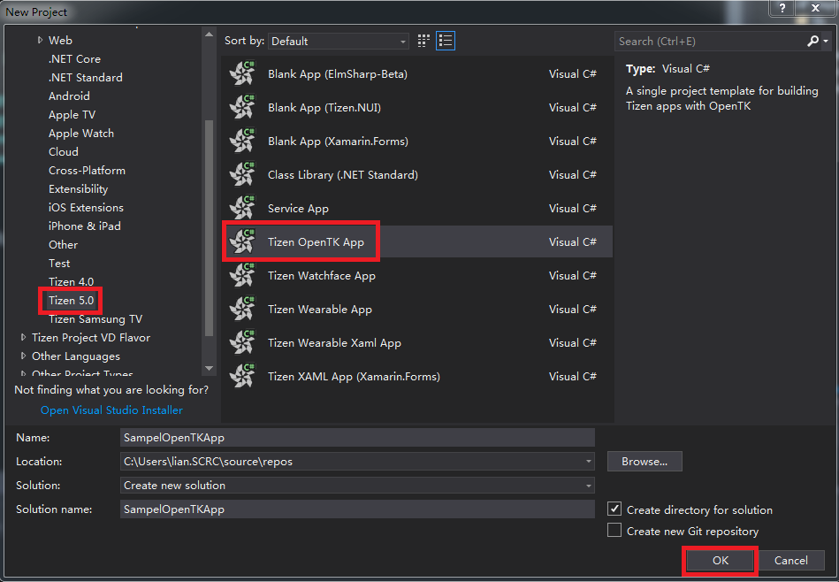
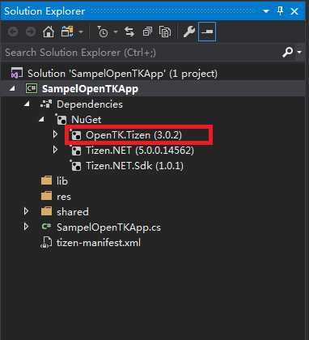
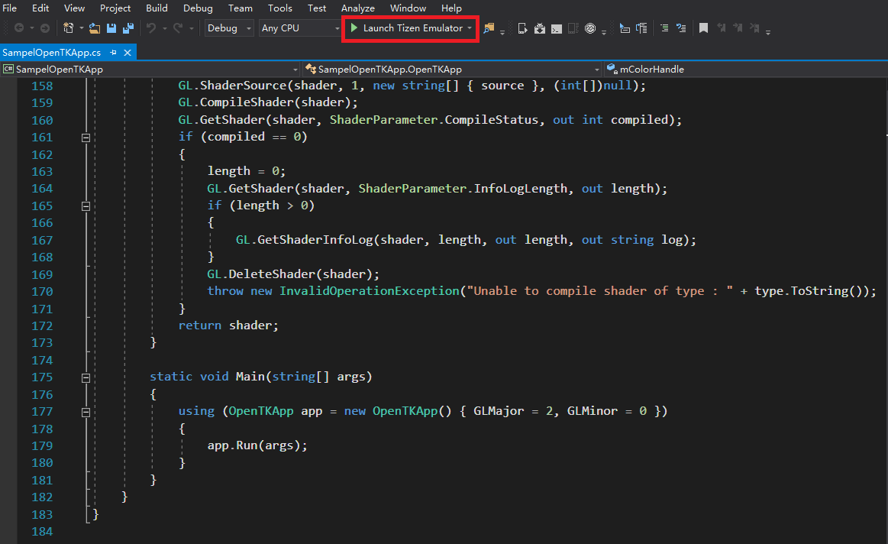
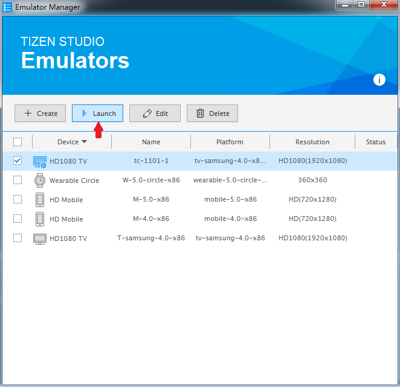
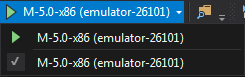
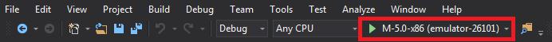
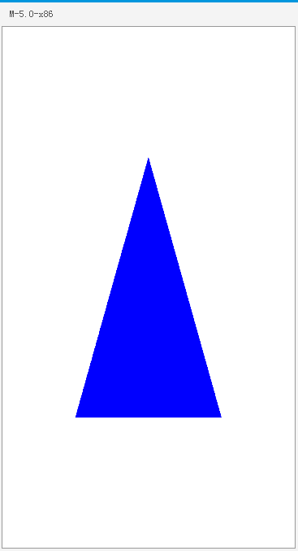
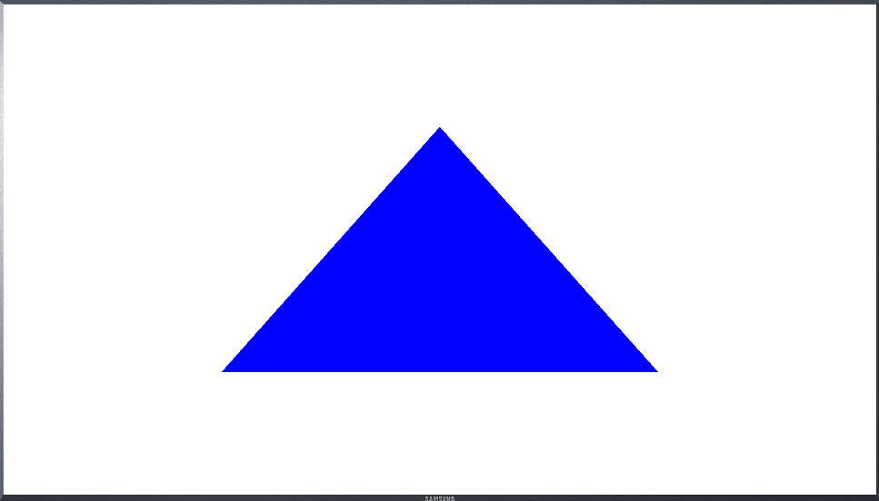

# Quickstart

The quick guide explains how to create a .NET application with OpenTK on Tizen.

## Prerequisites

- Visual Studio 2017
- [Visual Studio tools for Tizen](../../../vstools/install.md)
- Tizen Emulator image (supports Tizen 5.0 and higher)

## Create a Project

To create a Tizen OpenTK app, proceed as follows:

1.  In **New project** menu, select **Tizen 5.0** > **Tizen OpenTK App**. Click **OK**:

    

2.  The new project `SampleOpenTKApp` is shown in the **Solution Explorer** view:

    

    If OpenTK.Tizen (3.0.2) is available in NuGet packages then you can use the OpenTK APIs.

## Add OpenTK App Code

The `SampleOpenTKApp` is generated by Tizen project template. The project draws a triangle that defines vertex, color, and shaders and registers event handles on `Window` for drawing this triangle.

You can add your code in **SampleOpenTKApp.cs** file:

```csharp
using System;
using OpenTK;
using OpenTK.Graphics;
using OpenTK.Graphics.ES20;
using OpenTK.Platform;
using OpenTK.Platform.Tizen;
using Tizen.Applications;

namespace SampelOpenTKApp
{
    public class OpenTKApp : TizenGameApplication
    {
        private IGameWindow mainWindow;

        private int mProgramHandle;
        private int mColorHandle;
        private int mPositionHandle;

        private float[] mVertexes;          // Vertex of triangle
        private float[] mColor;             // Color of triangle

        private string mVertexShaderSrc;    // Vertex shader
        private string mFragmentShaderSrc;  // Fragment shader

        public OpenTKApp()
        {
            mVertexes = new float[] {
                    0.0f, 0.5f, 0.0f,
                    -0.5f, -0.5f, 0.0f,
                    0.5f, -0.5f, 0.0f
                };

            mColor = new float[] { 0.0f, 0.0f, 1.0f, 1.0f };

            mVertexShaderSrc = "attribute vec4 vPosition;        \n" +
                              "void main()                       \n" +
                              "{                                 \n" +
                              "   gl_Position = vPosition;       \n" +
                              "}                                 \n";
            mFragmentShaderSrc = "precision mediump float;       \n" +
                               "uniform vec4 vColor;             \n" +
                               "void main()                      \n" +
                               "{                                \n" +
                               "  gl_FragColor = vColor;         \n" +
                               "}                                \n";
        }

        protected override void OnCreate()
        {
            // Handle when your app is created
            // At this point, GraphicsContext, Surface, Window had been created
            base.OnCreate();

            mainWindow = Window;

            mainWindow.Load += InitShader;                      // InitApp is called before the window is displayed for the first time
            mainWindow.RenderFrame += RenderTriangle;           // RenderTriangle is called for every frame
        }

        protected override void OnPause()
        {
            // Handle when your app pause
        }

        private void InitShader(object sender, EventArgs e)
        {
            // Create program and link it
            mProgramHandle = BuildProgram(mVertexShaderSrc, mFragmentShaderSrc);
            GL.LinkProgram(mProgramHandle);
            int linkStatus;
            GL.GetProgram(mProgramHandle, GetProgramParameterName.LinkStatus, out linkStatus);
            if (linkStatus == 0)
            {
                // link failed
                int infoLogLength;
                GL.GetProgram(mProgramHandle, GetProgramParameterName.InfoLogLength, out infoLogLength);
                if (infoLogLength > 0)
                {
                    String infoLog;
                    GL.GetProgramInfoLog(mProgramHandle, infoLogLength, out infoLogLength, out infoLog);
                    Console.WriteLine("GL2", "Couldn't link program: " + infoLog.ToString());
                }
                GL.DeleteProgram(mProgramHandle);
                throw new InvalidOperationException("Unable to link program");
            }
        }

        private void RenderTriangle(object ob, FrameEventArgs e)
        {
            GL.ClearColor(Color4.White);
            GL.Clear(ClearBufferMask.ColorBufferBit);

            GL.UseProgram(mProgramHandle);

            // Set vertex of triangle
            mPositionHandle = GL.GetAttribLocation(mProgramHandle, "vPosition");
            GL.EnableVertexAttribArray(mPositionHandle);
            unsafe
            {
                fixed (float* pvertices = mVertexes)
                {
                    GL.VertexAttribPointer(mPositionHandle, 3, All.Float, false, 0, new IntPtr(pvertices));
                }
            }

            // Set color of triangle
            mColorHandle = GL.GetUniformLocation(mProgramHandle, "vColor");
            GL.Uniform4(mColorHandle, 1, mColor);

            // Draw the triangle
            GL.DrawArrays(All.Triangles, 0, 3);

            Window.SwapBuffers();

            // Disable vertex array
            GL.DisableVertexAttribArray(mPositionHandle);
        }

        public static int BuildProgram(string vertexShaderSrc, string fragmentShaderSrc)
        {
            int vertexShader = LoadShader(ShaderType.VertexShader, vertexShaderSrc);
            int fragmentShader = LoadShader(ShaderType.FragmentShader, fragmentShaderSrc);
            int mProgramHandle = GL.CreateProgram();
            if (mProgramHandle == 0)
                throw new InvalidOperationException("Unable to create program");
            GL.AttachShader(mProgramHandle, vertexShader);
            GL.AttachShader(mProgramHandle, fragmentShader);
            return mProgramHandle;
        }

        static int LoadShader(ShaderType type, string source)
        {
            int shader = GL.CreateShader(type);
            if (shader == 0)
                throw new InvalidOperationException("Unable to create shader:" + type.ToString());
            int length = 0;
            GL.ShaderSource(shader, 1, new string[] { source }, (int[])null);
            GL.CompileShader(shader);
            GL.GetShader(shader, ShaderParameter.CompileStatus, out int compiled);
            if (compiled == 0)
            {
                length = 0;
                GL.GetShader(shader, ShaderParameter.InfoLogLength, out length);
                if (length > 0)
                {
                    GL.GetShaderInfoLog(shader, length, out length, out string log);
                }
                GL.DeleteShader(shader);
                throw new InvalidOperationException("Unable to compile shader of type : " + type.ToString());
            }
            return shader;
        }

        static void Main(string[] args)
        {
            using (OpenTKApp app = new OpenTKApp() { GLMajor = 2, GLMinor = 0 })
            {
                app.Run(args);
            }
        }
    }
}
```

- `OpenTKApp` class is derived from `TizenGameApplication` class.

    `TizenGameApplication` class creates OpenGL&reg; ES running environment, which includes window, OpenGL&reg; ES context, and so on.

    `TizenGameApplication` class inherits from `Tizen.Applications.CoreUIApplication`, and you can override the methods of the base class including `OnCreate`, `OnPause`, `OnResume`, `OnAppControlReceived`, and `OnTerminate`. For more information about these methods, see [Applications](../applications/ui-app.md).

- `InitShader` is an event handler of `Window.Load` event. It initializes shaders of triangle in this sample.

- `RenderTriangle` is an event handler of `Window.RenderFrame` event. It draws the triangle in this sample.

- `app.Run()` runs the main loop of OpenTK app.

## Build and Run your Application

1.  Building the solution:

    - In the Visual Studio menu, select **Build** > **Build Solution**.

    - In the Solution Explorer view, right-click the solution name and select **Build**.

2.  Launching Tizen Emulator:

    - In the Visual Studio menu, select **Tools &gt; Tizen &gt; Tizen Emulator Manager**.

    - Alternatively, click **Launch Tizen Emulator** in the Visual Studio toolbar to launch the Tizen Emulator Manager:

      

    - In the Emulator Manager, select an emulator from the list, and click **Launch**:

      

    - You must update the following emulator images to use the latest version (Tizen 5.0).

3.  After you launch an emulator instance, you can select the target from the drop-down list to change the deployment target in the Visual Studio toolbar:

    

    You can deploy your OpenTK app to the target, using the following:

    1. Press the **F5** or **Ctrl+F5** key.

    2. In the Visual Studio menu, select **Debug > Start Debugging** or **Start Without Debugging**.

    3. On the Visual Studio toolbar, click an emulator instance:

       

4.  If the deployment is successful, then the application is launched on the target emulator.

    The following are snapshots of launching this OpenTK app on mobile and TV emulators:

    **Figure: OpenTK app on TV emulator**

    

    **Figure: OpenTK app on TV emulator**

    

    Visual Studio uses the Smart Development Bridge (SDB) to communicate with the target device or emulator.

    You can also deploy your OpenTK application with SDB manually:

    1.  Copy the application .tpk file from the project binary path to the SDB tool path:

        - The `SampelOpenTKApp` tpk file(`org.tizen.example.SampelOpenTKApp-1.0.0.tpk`) is located in `ProjectPath\SampelOpenTKApp\SampelOpenTKApp\bin\Debug\tizen50`.

        - To locate the project path in the Solution Explorer view, right-click the solution name and click **Open Folder in File Explorer**.

        - SDB tool is located in `c:\tizen\tools\sdb.exe`.

    2.  Launch the Tizen SDB command prompt:

        - For Windows OS, launch the Tizen SDB command prompt (**Tool** > **Tizen** > **Tizen Sdb Command Prompt**).

        - For Linux, you can use the SDB command directly in your project path.

    3.  Install your application with the SDB command:

        ```
        sdb install org.tizen.example.SampleOpenTKApp-1.0.0.tpk
        ```


## Related Information

- Dependencies
  - Tizen 5.0 and Higher
