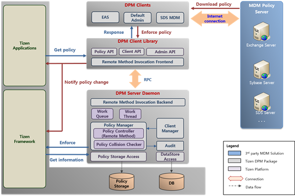

# Device Policy Management


The Device Policy Management (DPM) framework supports enterprise applications by providing IT administrator functions to create security-aware applications. These applications are useful in scenarios where IT administrators require rich control over employee devices.

DPM framework consists of:

- **Device policy client library**: This contains all the device administration functions that a client application can call. The device policy client library communicates with the device policy manager using a built-in remote method invocation (RMI) engine.
- **Device policy manager**: This manages all the device policies. It also provides interfaces for the device policy client library.

The main features of the [Tizen.Security.DevicePolicyManager](/application/dotnet/api/TizenFX/master/api/Tizen.Security.DevicePolicyManager.html) namespace are:

- Managing policies

  You can [track the state between the device admin client and the device policy manager](#client_application) using the `DevicePolicyManager` class provided by [Tizen.Security.DevicePolicyManager](/application/dotnet/api/TizenFX/master/api/Tizen.Security.DevicePolicyManager.html).

- Checking restrictions

  You can [check the restriction states of the device](#client_application), such as camera, microphone, Wi-Fi, Bluetooth, and USB, using the properties of the policy classes. [Tizen.Security.DevicePolicyManager](/application/dotnet/api/TizenFX/master/api/Tizen.Security.DevicePolicyManager.html) provides these policy classes.

The following figure illustrates the DPM framework process:

**Figure: DPM framework process**



## Prerequisites

To use the methods and properties of the [Tizen.Security.DevicePolicyManager](/application/dotnet/api/TizenFX/master/api/Tizen.Security.DevicePolicyManager.html) namespace, include it in your application:

```csharp
using Tizen.Security.DevicePolicyManager;
```

<a name="client_application"></a>
## Managing Device Policies

To manage device policies:

1. Create a `DevicePolicyManager` instance:

   ```csharp
       DevicePolicyManager dpm = new DevicePolicyManager();
   ```

2. Get the policy instance using `getPolicy<T>()` of the DevicePolicyManager instance:
   ```csharp
       MediaPolicy mediaPolicy = dpm.getPolicy<MediaPolicy>();
   ```
   > **Note**
   >
   > The DevicePolicyManager instance must exist when you use the policy instance.

3. Register an event handler to manage the policies of the policy instance:

   ```csharp
   try
   {
       DevicePolicyManager dpm = new DevicePolicyManager();
       MediaPolicy mediaPolicy = dpm.getPolicy<MediaPolicy>();

       /// Register the event handler
       mediaPolicy.CameraPolicyChanged += onCameraPolicyChanged;
   }
   catch (Exception e)
   {
       /// Handle exception
   }

   /// Create the event handler
   void onCameraPolicyChanged(Object Sender, PolicyChangedEventArgs args)
   {
       Console.WriteLine("PolicyName: " + args.PolicyName + ", Current policy state: " + args.IsAllowed);
   }
   ```

4. Check the device restriction state:

   ```csharp
   /// Check the restriction state of the camera
   /// false: using the camera is not allowed
   /// true: using the camera is allowed
   bool cameraPolicyState = mediaPolicy.IsCameraAllowed;
   ```

5. When no longer needed, destroy the policy instance and DPM instance:

   ```csharp
   mediaPolicy.Dispose();
   dpm.Dispose();
   ```
   > **Note**
   >
   > The policy instance must be destroyed before the DPM instance.

## Related Information
- Dependencies
  - Tizen 5.5 and Higher
