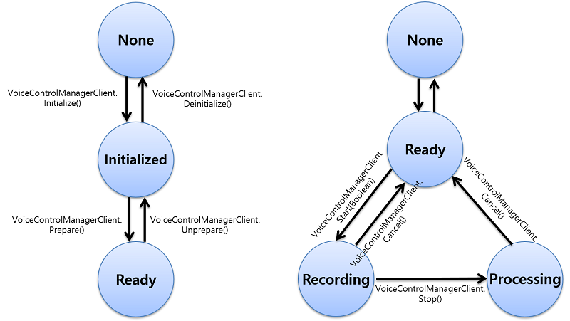

# Voice Control Manager
Voice control manager features allow you to record voice and give responses for the recognized voice commands. You can register general and system voice commands such as "power on", "power off", "music play", "music stop", and so on. In addition, you can start and stop voice recording. When recording voice is finished, you can receive multiple recognition results such as Automatic Speech Recognition (ASR) result and matched commands among commands list which is registered by application using voice control client.


The main features of the [Tizen.Uix.VoiceControlManager](https://samsung.github.io/TizenFX/latest/api/Tizen.Uix.VoiceControlManager.html) namespace include:

-   Creating a handle and registering event handlers.
    -   You can create a voice control manager handle and only one voice control manager instance can work on the device.
    -   You can [get notifications](#callback) of state changes, language changes, recognition results, and errors by registered event handlers.
-   Managing commands
    -    You can register commands as foreground, background and system type on the voice control service. When you speak a registered command, the callback returns the recognition result.
-   Starting, stopping, and canceling recognition.
    -   You can [start and stop recording the user voice](#start_and_stop_recording) by microphone.
    -   You can set to stop recording manually or automatically. If automatic stop is set, voice control manager stops recording when end of speech is detected.
    -   When the voice recording finishes, the voice control service recognizes the speech data and finds matching commands among the registered commands.
-   Getting the recognition result.
    -   The recognition result is invoked by the registered event handler.
    -   You can get matched command list from voice control engine.
    -   You can select command among matched commands.

-   Retrieving information
    -   You can [get various information](#information) from the voice control manager.
    -   Voice control manager state
        -   The state is changed by method calls and applied as a precondition of each method call.
    -   Voice control service state
        -    The voice control service states are controlled by starting and stopping command recognition.
    -   Current language
        -    A command is valid only when the command language is the same as the current language. The current language can be changed by changing the application or display language on the device.
        -    You can get a notification of the language change in a callback. If the display language is changed to a non-supported one, the voice control service language changes to the first language supported by voice control engine.
    -   Supported language
        -    You can retrieve a list of supported languages to check whether the language that you want is supported.


To use the voice control manager, follow these steps:

1.  Create a handle and [register event handlers](#callback).

    The initialization allows the voice control to distinguish your application from any other application that also uses voice control. Only one voice control manager instance can work on the device. Therefore, if other application including voice control manager exists, your application cannot work properly on one same device.

    The registered callbacks can be notified of the changes in service status, current language, recognition results, and errors.

2.  Set commands.

    You can create a command list, and add or remove individual commands in the list. While creating an individual command, set the command text and type for each command handle. When all the commands are created and added to the command list, set the command list to the voice control manager for recognition.

3.  Prepare the voice control manager.

    The preparation connects the voice control service for background work, such as recording and recognizing the user voice.

    When the application initializes and prepares the voice control manager, the voice control service is invoked and connected for the background work. The service and the application communicate as server and client.

4.  Get the recognized command result and ASR.

    The recognized command result and ASR are sent through a registered callback.
    You can receive the command matching result that the user uttered.
    And if the registered command is duplicated or the user speaks multiple commands, the recognition result can contain multiple results. In this case, you can select one or reject in the `VoiceControlManagerClient.SetRecognizedCommandsSelectionDelegate()` callbacks

5.  When no longer needed, unset the voice control manager.

    You must disconnect the voice control service and deinitialize the voice control manager using the `Unprepare()` and `Deinitialize()` methods of the [Tizen.Uix.VoiceControlManager](https://samsung.github.io/TizenFX/latest/api/Tizen.Uix.VoiceControlManager.html) class.

The following figure illustrates the voice control manager life-cycle:

**Figure: Voice control manager life-cycle**



The user controls the voice control manager service state. In a general scenario:
1.  The user starts recording for recognition by using a voice control manager application, button, or voice trigger. If the start is successful, the voice control service state changes to `Recording`. For more information on service states, see [Tizen.Uix.VoiceControlManager.ServiceState](https://samsung.github.io/TizenFX/latest/api/Tizen.Uix.VoiceControlManager.ServiceState.html) enumration.
2.  After recording is completed, the service state changes to `Processing` for recognition processing.
3.  After recognition is completed, the service state changes to `Ready`.


## Prerequisites

To enable your application to use the voice control functionality:

1.  To use the [Tizen.Uix.VoiceControlManager](https://samsung.github.io/TizenFX/latest/api/Tizen.Uix.VoiceControlManager.html) class, the application has to request permission by adding the following privileges to the `tizen-manifest.xml` file:

    ```
    <privileges>
        <privilege>http://tizen.org/privilege/recorder</privilege>
        <privilege>http://tizen.org/privilege/voicecontrol.manager</privilege>
    </privileges>
    ```

2.  To use the methods and properties of the [Tizen.Uix.VoiceControlManager](https://samsung.github.io/TizenFX/latest/api/Tizen.Uix.VoiceControlManager.html) class, include it in your application:

    ```
    using Tizen.Uix.VoiceControlManager;
    ```

    > **Note**   
    >
    > To use this privilege, your application must be signed with a platform-level certificate.

3.  Initialize the voice control manager with the `Initialize()` method of the `Tizen.Uix.VoiceControlManager.VoiceControlManagerClient` class:

    ```
    void InitializeVoiceControlManager()
    {
        VoiceControlManagerClient.Initialize();
    }
    ```

    If the method call is successful, the voice control state changes to Initialized. The states are defined in the [Tizen.Uix.VoiceControlManager.State](https://samsung.github.io/TizenFX/latest/api/Tizen.Uix.VoiceControlManager.State.html) enumeration.

    > **Note**   
    >
    > The `Tizen.Uix.VoiceControlManager` class is not thread-safe.

4.  Prepare the voice control service with the `Prepare()` method of the `Tizen.Uix.VoiceControlManager.VoiceControlManagerClient` class, which connects the background voice control service. The service records and recognizes the audio data and converts sound to text:

    ```
    void PrepareVoiceControlManager()
    {
        VoiceControlManagerClient.Prepare();
    }
    ```

    The `Prepare()` method is asynchronous and when the preparation succeeds the voice control state changes from `Initialized` to `Ready`. If the `Prepare()` method fails the error callback is triggered.

5.  When the voice control manager is no longer needed, unprepare and deinitialize it:

    ```
    void UnpreparedVoiceControlManager()
    {
        VoiceControlManagerClient.Unprepare();
    }

    void DeinitializeVoiceControlManager()
    {
        VoiceControlManagerClient.Deinitialize();
    }
    ```

    When the `Unprepare()` method of the `Tizen.Uix.VoiceControlManager.VoiceControlManagerClient` class succeeds, the voice control state changes from `Ready` to `Initialized`.

    > **Note**   
    >
    > Do not call the `Deinitialize()` method of the `Tizen.Uix.VoiceControlManager.VoiceControlManagerClient` class in a callback. Within a callback, the `Deinitialize()` method fails and returns `ErrorCode.OperationFailed`.


<a name="callback"></a>
## Manage Callbacks

To set and unset callbacks to be notified of recognition results, state changes, errors and so on :
You can set or unset callbacks such as notified of recognition results, state changes, errors, and so on :

> **Note**   
>
> Set and unset all callbacks when the voice control manager state is `Initialized`. For more information on the `Initialized` states, see [Tizen.Uix.VoiceControlManager.VoiceControlManagerClient.State](https://samsung.github.io/TizenFX/latest/api/Tizen.Uix.VoiceControlManager.State.html) enumeration.

-   Set the state changed callback that is invoked when the voice control manager state changes:
    ```
    /// callback
    void stateChanged(object sender, StateChangedEventArgs e)
    {
        /// Your code
    }

    void SetUnsetStateChangedCb()
    {
        try
        {
            /// Set the callback
            VoiceControlManagerClient.StateChanged += stateChanged;

            /// Unset the callback
            VoiceControlManagerClient.StateChanged -= stateChanged;
        }
        catch (Exception e)
        {
            /// Error handling
        }
    }
    ```

-   Set the service state changed callback to be invoked when the voice control manager service state changes:
    ```
    /// callback
    void serviceStateChanged(object sender, ServiceStateChangedEventArgs e)
    {
        /// Your code
    }

    void SetUnsetServiceStateChangedCb()
    {
        try
        {
            /// Set the callback
            VoiceControlManagerClient.ServiceStateChanged += serviceStateChanged;

            /// Unset the callback
            VoiceControlManagerClient.ServiceStateChanged -= serviceStateChanged;
        }
        catch (Exception e)
        {
            /// Error handling
        }
    }
    ```

-   Set the current language changed callback invoked when the voice control settings language changes:
    ```
    /// callback
    void currentLanguageChanged(object sender, CurrentLanguageChangedEventArgs e)
    {
        /// Your code
    }

    void SetUnsetCurrentLanguageChangedCb()
    {
        try
        {
            /// Set the callback
            VoiceControlManagerClient.CurrentLanguageChanged += currentLanguageChanged;

            /// Unset the callback
            VoiceControlManagerClient.CurrentLanguageChanged -= currentLanguageChanged;
        }
        catch (Exception e)
        {
            /// Error handling
        }
    }
    ```

-   Set the error callback to be invoked when an error occurs in the voice control manager process:
    ```
    /// callback
    void errorOccurred(object sender, ErrorOccurredEventArgs e)
    {
        /// Your code
    }

    void SetUnsetErrorOccurredCb()
    {
        try
        {
            /// Set the callback
            VoiceControlManagerClient.ErrorOccurred += errorOccurred;

            /// Unset the callback
            VoiceControlManagerClient.ErrorOccurred -= errorOccurred;
        }
        catch (Exception e)
        {
            /// Error handling
        }
    }
    ```

-   Set the speech detected callback invoked when beginning of speech or end of speech is detected:
    ```
    /// callback
    void speechDetected(object sender, EventArgs e)
    {
        /// Your code
    }

    void SetUnsetSpeechDetectedCb()
    {
        try
        {
            /// Set the callback
            VoiceControlManagerClient.SpeechDetected += speechDetected;

            /// Unset the callback
            VoiceControlManagerClient.SpeechDetected -= speechDetected;
        }
        catch (Exception e)
        {
            /// Error handling
        }
    }
    ```

-   Set the conversation requested callback invoked when conversation requests in the speech control manager process:
    ```
    /// callback
    void conversationRequested(object sender, ConversationRequestedEventArgs e)
    {
        /// Your code
    }

    void SetUnsetConversationRequestedCb()
    {
        try
        {
            /// Set the callback
            VoiceControlManagerClient.ConversationRequested += conversationRequested;

            /// Unset the callback
            VoiceControlManagerClient.ConversationRequested -= conversationRequested;
        }
        catch (Exception e)
        {
            /// Error handling
        }
    }
    ```

-   Set the private data updated callback invoked when voice control engine set private data to voice control manager:
    ```
    /// callback
    void privateDataUpdated(object sender, PrivateDataUpdatedEventArgs e)
    {
        /// Your code
    }

    void SetUnsetPrivateDataUpdatedCb()
    {
        try
        {
            /// Set the callback
            VoiceControlManagerClient.PrivateDataUpdated += privateDataUpdated;

            /// Unset the callback
            VoiceControlManagerClient.PrivateDataUpdated -= privateDataUpdated;
        }
        catch (Exception e)
        {
            /// Error handling
        }
    }
    ```


-   Set the specific engine result callback invoked when voice control engine set specific engine's result to voice control manager:

    ```
    /// callback
    void specificEngineResult(object sender, SpecificEngineResultEventArgs e)
    {
        /// Your code
    }

    void SetUnsetSpecificEngineResultCb()
    {
        try
        {
            /// Set the callback
            VoiceControlManagerClient.SpecificEngineResult += specificEngineResult;

            /// Unset the callback
            VoiceControlManagerClient.SpecificEngineResult -= specificEngineResult;
        }
        catch (Exception e)
        {
            /// Error handling
        }
    }
    ```


-   Set the pre recognition result updated callback invoked when voice control engine set the pre recognition results(partial ASR) to voice control manager.

    You can get the results of pre result event type and the pre recognition results, the partial ASR.

    ```
    /// callback
    void preRecognitionResultUpdated(object sender, PreRecognitionResultUpdatedEventArgs e)
    {
        /// Your code
    }

    void SetUnsetPreRecognitionResultUpdatedCb()
    {
        try
        {
            /// Set the callback
            VoiceControlManagerClient.PreRecognitionResultUpdated += preRecognitionResultUpdated;

            /// Unset the callback
            VoiceControlManagerClient.PreRecognitionResultUpdated -= preRecognitionResultUpdated;
        }
        catch (Exception e)
        {
            /// Error handling
        }
    }
    ```


-   Set the all recognition result received callback invoked when voice control engine set the all recognition result received to voice control manager.

    You can get the recognized result, recognized text, and engine message results in this callback.

    ```
    /// callback
    void allRecognitionResultReceived(object sender, AllRecognitionResultEventArgs e)
    {
        /// Your code
    }

    void SetUnsetAllRecognitionResultReceivedCb()
    {
        try
        {
            /// Set the callback
            VoiceControlManagerClient.AllRecognitionResultReceived += allRecognitionResultReceived;

            /// Unset the callback
            VoiceControlManagerClient.AllRecognitionResultReceived -= allRecognitionResultReceived;
        }
        catch (Exception e)
        {
            /// Error handling
        }
    }
    ```


-   Set the recognition result updated callback invoked when voice control engine set the recognition result updated to voice control manager.

    You can get the recognized result, recognized text, and recognized command list in this callback.

    If no commands are matched, the callback returns `RecognizedResult.Rejected`.

    ```
    /// callback
    void recognitionResultUpdated(object sender, RecognitionResultUpdatedEventArgs e)
    {
        /// Your code
    }

    void SetUnsetRecognitionResultUpdatedCb()
    {
        try
        {
            /// Set the callback
            VoiceControlManagerClient.RecognitionResultUpdated += recognitionResultUpdated;

            /// Unset the callback
            VoiceControlManagerClient.RecognitionResultUpdated -= recognitionResultUpdated;
        }
        catch (Exception e)
        {
            /// Error handling
        }
    }
    ```


-   Set the recognized commands selection callback invoked when voice command is recognized to the voice control manager:

    You can selects valid command results. If you return true. release command to client.

    > **Note**   
    >
    > If multiple commands are matched, select valid results in this callback.
    ```
    /// callback
    IEnumerable<VoiceCommand> recognizedCommandsSelection(IEnumerable<VoiceCommand> commands, string recognizedText, string message)
    {
        /// Your code
        return null;    /// release commands.

        /// Select valid results
    }

    void SetUnsetRecognizedCommandsSelectionCb()
    {
        try
        {
            /// Set the callback
            VoiceControlManagerClient.SetRecognizedCommandsSelectionDelegate(recognizedCommandsSelection);

            /// Unset the callback
            VoiceControlManagerClient.SetRecognizedCommandsSelectionDelegate(null);
        }
        catch (Exception e)
        {
            /// Error handling
        }
    }
    ```


-   Set a callback function to be called when engine sends audio formats necessary for playing TTS feedback:
    ```
    /// callback
    void feedbackAudioFormatChanged(object sender, FeedbackAudioFormatEventArgs e)
    {
        /// Your code
    }

    void SetUnsetFeedbackAudioFormatChangedCb()
    {
        try
        {
            /// Set the callback
            VoiceControlManagerClient.FeedbackAudioFormatChanged += feedbackAudioFormatChanged;

            /// Unset the callback
            VoiceControlManagerClient.FeedbackAudioFormatChanged -= feedbackAudioFormatChanged;
        }
        catch (Exception e)
        {
            /// Error handling
        }
    }
    ```


-   Set a callback function to be called when engine sends audio streaming for TTS feedback:
    ```
    /// callback
    void feedbackStreaming(object sender, FeedbackStreamingEventArgs e)
    {
        /// Your code
    }

    void SetUnsetFeedbackStreamingCb()
    {
        try
        {
            /// Set the callback
            VoiceControlManagerClient.FeedbackStreaming += feedbackStreaming;

            /// Unset the callback
            VoiceControlManagerClient.FeedbackStreaming -= feedbackStreaming;
        }
        catch (Exception e)
        {
            /// Error handling
        }
    }
    ```


-   Set TTS streaming callback function is called when the vc client sends audio streaming for TTS feedback:
    ```
    /// callback
    void vcTtsStreaming(object sender, VcTtsStreamingEventArgs e)
    {
        /// Your code
    }

    void SetUnsetVcTtsStreamingCb()
    {
        try
        {
            /// Set the callback
            VoiceControlManagerClient.VcTtsStreaming += vcTtsStreaming;

            /// Unset the callback
            VoiceControlManagerClient.VcTtsStreaming -= vcTtsStreaming;
        }
        catch (Exception e)
        {
            /// Error handling
        }
    }
    ```


<a name="start_and_stop_recording"></a>
## Start and stop recording

You can start, stop, or cancel in voice control manager:

-   To start recording, use the `Start()` method with `exclusiveCommandOption` as the parameter.
    The connected voice control service starts recording and the voice control manager state is changed to `Recording`.
    If the parameter `exclusiveCommandOption` value is true, voice control service recognizes in only exclusive commands.
    This method must be called when the voice control manager is in the `Ready` state:

    > **Note**   
    >
    > If the `Start()` method fails, check the error code and take appropriate action.
    ```
    void StartManager(bool exclusiveCommandOption)
    {
        try
        {
            VoiceControlManagerClient.Start(exclusiveCommandOption);
        }
        catch (Exception e)
        {
            /// Error handling
        }
    }
    ```

-   To stop recording, use the `Stop()` method.
    The recording stops and the voice control manager state is changed to `Processing`.
    When the recognition command result has been processed, the `RecognitionResult` event triggers, and the state changes back to `Ready`.
    This method must be called when the voice control manager is in the `Recording` state:

    ```
    void StopManager()
    {
        try
        {
            VoiceControlManagerClient.Stop();
        }
        catch (Exception e)
        {
            /// Error handling
        }
    }
    ```

-   To cancel recording, use the `Cancel()` method.
    This method must be called when the voice control manager is in the `Recording` and `Processing` state:

    ```
    void CancelManager()
    {
        try
        {
            VoiceControlManagerClient.Cancel();
        }
        catch (Exception e)
        {
            /// Error handling
        }
    }
    ```


<a name="send_requests"></a>
## Send requests

You can request in voice control manager:

-   The do action is send event message for using the voice control engine, use the `DoAction()` method.
    This method must be called when the voice control manager is in the `Ready` state:

    ```
    void SendDoAction(SendEventType type, string sendEvent)
    {
        try
        {
            VoiceControlManagerClient.DoAction(type, sendEvent);
        }
        catch (Exception e)
        {
            /// Error handling
        }
    }
    ```

-   The send specific engine request is event and request message for using the voice control engine, use the `SendSpecificEngineRequest()` method.
    This method must be called when the voice control manager is in the `Ready` state:

    ```
    void SendSpecificEngineRequest(string engineAppId, string evt, string request)
    {
        try
        {
            VoiceControlManagerClient.SendSpecificEngineRequest(engineAppId, evt, request);
        }
        catch (Exception e)
        {
            /// Error handling
        }
    }
    ```


<a name="information"></a>
## Retrieve Voice Control Manager Information

To get information about the current states, service states, current, and supported languages:

-   Get the current voice control manager state using the `State` property of the [Tizen.Uix.VoiceControlManager.VoiceControlManagerClient](https://samsung.github.io/TizenFX/latest/api/Tizen.Uix.VoiceControlManager.VoiceControlManagerClient.html) class.
    The voice control manager state changes according to method calls:
    ```
    void GetState()
    {
        State currentState;
        currentState = VoiceControlManagerClient.State;
    }
    ```

-   Get the current voice control manager service state using the `ServiceState` property.

    If the application uses continuous recognition, the voice control service state can be changed from `Processing` directly to `Recording`:
    ```
    void GetServiceState()
    {
        ServiceState currentServiceState;
        currentServiceState = VoiceControlManagerClient.ServiceState;
    }
    ```

-   Get the supported languages.
    You can use the `GetSupportedLanguages` Methods of the [Tizen.Uix.VoiceControlManager.VoiceControlManagerClient](https://samsung.github.io/TizenFX/latest/api/Tizen.Uix.VoiceControlManager.VoiceControlManagerClient.html) class.
    This function is used when the voice control manager is in the `Ready` or `Initialized` state:
    ```
    void GetSupportedLanguages()
    {
        try
        {
            List<string> list = (List<string>)VoiceControlManagerClient.GetSupportedLanguages();
        }
        catch (Exception e)
        {
            /// Error handling
        }
    }
    ```

-   Get the current language.
    You can use the `CurrentLanguage` property of the [Tizen.Uix.VoiceControlManager.VoiceControlManagerClient](https://samsung.github.io/TizenFX/latest/api/Tizen.Uix.VoiceControlManager.VoiceControlManagerClient.html) class.
    Use the language change callback to be notified of language changes.
    This function is not used when the voice control manager is in the `None` service status:

    ```
    void GetCurrentLanguage()
    {
        try
        {
            string currentLanguage = VoiceControlManagerClient.CurrentLanguage;
        }
        catch (Exception e)
        {
            /// Error handling
        }
    }
    ```

-   Get the microphone volume during recording.
    You can use the `RecordingVolume` property of the [Tizen.Uix.VoiceControlManager.VoiceControlManagerClient](https://samsung.github.io/TizenFX/latest/api/Tizen.Uix.VoiceControlManager.VoiceControlManagerClient.html) class.
    The recording volume value is retrieved periodically with the short-term recorded sound data as decibels (dB).
    The recording volume normally has a negative value, and 0 is the maximum value.
    This function is used when the voice control manager is in the `Recording` service state:

    ```
    void GetRecordingVolume()
    {
        try
        {
            float recordingVolume = VoiceControlManagerClient.RecordingVolume;
        }
        catch (Exception e)
        {
            /// Error handling
        }
    }
    ```

-   Get or set the audio in type.
    You can use the `AudioType` property of the [Tizen.Uix.VoiceControlManager.VoiceControlManagerClient](https://samsung.github.io/TizenFX/latest/api/Tizen.Uix.VoiceControlManager.VoiceControlManagerClient.html) class.
    The audio type values of the strings can be `VC_AUDIO_ID_BLUETOOTH` or `VC_AUDIO_ID_MSF`
    This function is used when the voice control manager is in the `Ready` state:

    ```
    void GetSetAudioType()
    {
        try
        {
            /// Get
            string audioType = VoiceControlManagerClient.AudioType;

            /// Set 
            VoiceControlManagerClient.AudioType = audioType;
        }
        catch (Exception e)
        {
            /// Error handling
        }
    }
    ```

-   Get or set the recognition mode.
    You can use the `RecognitionModeType` enumeration of the [Tizen.Uix.VoiceControlManager.RecognitionModeType](https://samsung.github.io/TizenFX/latest/api/Tizen.Uix.VoiceControlManager.RecognitionModeType.html) enumeration as a parameter.
    The default value of `RecognitionModeType` is `RecognitionModeType.StopBySilence`.
    If you set the manual mode as `RecognitionModeType.Manual`.    
    This function is used when the voice control manager is in the `Ready` state:

    ```
    void GetSetRecognitionMode()
    {
        try
        {
            /// Get
            RecognitionModeType recognitionModeType = VoiceControlManagerClient.RecognitionMode;

            /// Set
            VoiceControlManagerClient.RecognitionMode = recognitionModeType;
        }
        catch (Exception e)
        {
            /// Error handling
        }
    }
    ```

-   Get or set private data between voice control manager and voice control engine.
    You can use the `GetPrivateData` and `SetPrivateData` Methods of the [Tizen.Uix.VoiceControlManager.VoiceControlManagerClient](https://samsung.github.io/TizenFX/latest/api/Tizen.Uix.VoiceControlManager.VoiceControlManagerClient.html) class.
    This option must be set when the voice control manager is in the `Ready` state:

    ```
    void GetSetPrivateData()
    {
        try
        {
            /// Get
            string privateData = VoiceControlManagerClient.GetPrivateData("privateKey");

            /// Set
            VoiceControlManagerClient.SetPrivateData("privateKey", "privateData");
        }
        catch (Exception e)
        {
            /// Error handling
        }
    }
    ```


<a name="commands"></a>
## Manage Commands

To create a command group and commands:

1.  Create a command group with a command group handle.
    The command group can have multiple commands. Each command has a text and a type.
    The group can have `Background`, `Exclusive`, `Foreground`, `System`, `SystemBackground`, and `Widget` type commands. For more information on the command types, see [Tizen.Uix.VoiceControlManager.CommandType](https://samsung.github.io/TizenFX/latest/api/Tizen.Uix.VoiceControlManager.CommandType.html) enumeration.

    > **Note**   
    >
    > It has command priority in order of `system`, `widget`, `foreground`, `system_background` and `background`.
    Normally, The `system` and `system_background` commands is only registered in voice control manager.
    The `foreground` and `background` commands are used in the vc client app.
    The `exclusive` coomands is used starting with `VoiceControlManagerClient.Start(true)`.
    The `widget` command is automatically registered in the elementary on the screen.

    You can create the command group:

    ```
    void CreateCommandGroup()
    {
        try
        {
            VoiceCommandsGroup group = new VoiceCommandsGroup();
        }
        catch (Exception e)
        {
            /// Error handling
        }
    }
    ```

2.  Create a command.

    First create a command handle, and then define the command and type:

    ```
    void CreateCommand()
    {
        try
        {
            VoiceCommand command = new VoiceCommand();

            command.Command = "open";
            command.Type = CommandType.Foreground;
        }
        catch (Exception e)
        {
            /// Error handling
        }
    }
    ```

3.  Add the command to the command group:

    ```
    void AddCommand()
    {
        try
        {
            VoiceCommandsGroup group = new VoiceCommandsGroup();
            VoiceCommand command = new VoiceCommand();
            command.Command = "open";
            command.Type = CommandType.Foreground;
            group.Commands.Add(command);
        }
        catch (Exception e)
        {
            /// Error handling
        }
    }
    ```

    If necessary, you can also remove commands from the command group:

    ```
    void RemoveCommand()
    {
        try
        {
            VoiceCommand command = new VoiceCommand();
            command.Command = "open";
            command.Type = CommandType.Foreground;
            /// Other actions
            group.Commands.Remove(command);
        }
        catch (Exception e)
        {
            /// Error handling
        }
    }
    ```

    To retrieve the commands, you have to add the command list:

    -   You can use the `GetCurrentCommands()` method of the [Tizen.Uix.VoiceControlManager.VoiceControlManagerClient](https://samsung.github.io/TizenFX/latest/api/Tizen.Uix.VoiceControlManager.VoiceControlManagerClient.html) class to get all commands from the command list:

        ```
        void ForeachCommand()
        {
            try
            {
                IEnumerable<VoiceCommand> command = VoiceControlManagerClient.GetCurrentCommands();
            }
            catch (Exception e)
            {
                /// Error handling
            }
        }
        ```

    -   You can use the `Commands` property of the `Tizen.Uix.VoiceControlManager.VoiceCommandsGroup` class to get the current commands in an output parameter.
        ```
        void GetCommands()
        {
            try
            {
                VoiceCommand current_command = new VoiceCommand();
                VoiceCommandsGroup group = new VoiceCommandsGroup();

                /// Other actions

                current_commands = group.Commands;
            }
            catch (Exception e)
            {
                /// Error handling
            }
        }
        ```

4.  Register the commands for recognition by setting the command group to the voice control service.

    If you want to update the registered commands, set the command group again with the updated commands:

    ```
    void SetCommand()
    {
        try
        {
            VoiceCommandsGroup group = new VoiceCommandsGroup();
            VoiceCommand command = new VoiceCommand();
            command.Command = "test";
            command.Type = CommandType.Foreground;

            group.Commands.Add(command);

            VoiceControlManagerClient.SetCommands(group);
        }
        catch (Exception e)
        {
            /// Error handling
        }
    }
    ```

5.  When no longer needed, unset the command group:

    ```
    /// Unset the command group
    void UnsetCommand()
    {
        try
        {
            VoiceCommandsGroup group = new VoiceCommandsGroup();
            VoiceCommand command = new VoiceCommand();
            command.Command = "test";
            command.Type = CommandType.Foreground;

            group.Commands.Remove(command);

            VoiceControlManagerClient.SetCommands(group);
            ///or
            VoiceControlManagerClient.ClearCommands();
        }
        catch (Exception e)
        {
            /// Error handling
        }
    }
    ```


<a name="register_command"></a>
## Register Command

- Register the commands for recognition by setting the command group to the voice control service from file.
    If you want to update the registered commands, set the command group again with the updated commands:

    ```
    void SetCommandsFromFile(string commandFilePath)
    {
        try
        {
            /// file path contents.
            /*
                {
                    "foreground": [
                        {
                        "format": "0",
                        "domain": "0",
                        "cmd": "open"
                        },
                        {
                        "format": "0",
                        "domain": "0",
                        "cmd": "test"
                        }
                    ]
                }
            */

            VoiceControlManagerClient.SetCommandsFromFile(commandFilePath, CommandType.Foreground);
        }
        catch (Exception e)
        {
            /// Error handling
        }
    }
    ```

- Checks the command format is supported:

    ```
    void GetSupportedCommandFormat()
    {
        try
        {
            bool isSupported = VoiceControlManagerClient.IsSupportedCommandFormat(CommandFormat.Action);
        }
        catch (Exception e)
        {
            /// Error handling
        }
    }
    ```

- Enable or disable command type as candidate command:

    ```
    void EnableDisableCommandType(CommandType cmdType)
    {
        try
        {
            VoiceControlManagerClient.EnableCommandType(cmdType);
            VoiceControlManagerClient.DisableCommandType(cmdType);
        }
        catch (Exception e)
        {
            /// Error handling
        }
    }
    ```


## Related Information
* Dependencies
  -   Tizen 5.5 and Higher

