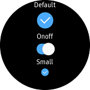

# Check
`Check` provides Tizen Wearable specific CheckBox widget. Check accepts user input by the method of toggling.
`Check` derives from [Xamarin.Forms.Switch](https://developer.xamarin.com/api/type/Xamarin.Forms.Switch/).



## Create Check
You can easily add `Check` control with C# or XAML file. Tizen wearable device supports 3 styles of `DisplayStyle` (`Default`, `Onoff`, `Small`).
Each shape of DisplayStyle depends on the device model. You can set the default value of check with `IsToggled` property. `True` value set `Check` selected. `False` value set `Check` unselected. `Toggled` event is raised when `Check` is toggled. You must add code for handling `Toggled` event.

For more information, see the following links:
 - [Check  API reference](https://samsung.github.io/Tizen.CircularUI/api/Tizen.Wearable.CircularUI.Forms.Check.html)
 - [Xamarin.Forms.Switch  API reference](https://developer.xamarin.com/api/type/Xamarin.Forms.Switch/)

**C# file**
```cs
 var check = new Check
 {
     HorizontalOptions = LayoutOptions.Center,
     VerticalOptions = LayoutOptions.Center,
     DisplayStyle = "Onoff"
 }

 check.Toggled += (s, e) => {
     Console.WriteLine("Check is now {0}", e.Value);
 }
```

**XAML file**

_Refer to TCCheck code at the test\WearableUIGallery\WearableUIGallery\TC\TCCeck.xaml_

```cs
     <StackLayout Orientation="Vertical">
        <Label HorizontalOptions="CenterAndExpand" Text="Default" />
        <w:Check
            DisplayStyle="Default"
            HorizontalOptions="CenterAndExpand"
            IsToggled="False"
            Toggled="OnToggledDefault" />

        <Label HorizontalOptions="CenterAndExpand" Text="Onoff" />
        <w:Check
            DisplayStyle="Onoff"
            HorizontalOptions="FillAndExpand"
            IsToggled="True"
            Toggled="OnToggledOnOff" />

        <Label HorizontalOptions="CenterAndExpand" Text="Small" />
        <w:Check
            DisplayStyle="Small"
            HorizontalOptions="CenterAndExpand"
            IsToggled="False"
            Toggled="OnToggledSmall" />
     </StackLayout>
```
