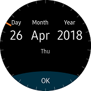
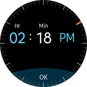

# CircleDateTimeSelector

`CircleDateTimeSelector` is a view for Date Picker and Time Picker.
You can scroll it by [Bezel interaction](https://developer.tizen.org/design/wearable/interaction/bezel-interactions).
This view is the size that covers the entire screen.
In order to receive [Rotary event](https://developer.tizen.org/development/training/native-application/understanding-tizen-programming/event-handling#rotary), it must be registered as `RotaryFocusObject` property of [CirclePage](xref:Tizen.Wearable.CircularUI.doc.CirclePage).

In the Date type, you can change value of the item by touching the item and rotating bezel to set value of the year: month: day.
For the Time type, you can change value of the hour: minute: AM / PM.

 | | |
 |:--------------------------------------------------:|:--------------------------------------------------:|
 |                      Date                          |                           Time                     |

**WARNING: [CircleListView](xref:Tizen.Wearable.CircularUI.doc.CircleListView), [CircleDateTimeSelector](xref:Tizen.Wearable.CircularUI.doc.CircleDateTimeSelector), [CircleScrollView](xref:Tizen.Wearable.CircularUI.doc.CircleScrollView), [CircleStepper](xref:Tizen.Wearable.CircularUI.doc.CircleStepper) must be contained by `CirclePage` or [CircleSurfaceEffectBehavior](xref:Tizen.Wearable.CircularUI.doc.CircleSurfaceEffectBehavior) should be added in [Behaviors](https://developer.xamarin.com/api/type/Xamarin.Forms.Behavior/) of [Page](https://developer.xamarin.com/api/type/Xamarin.Forms.Page/) that contains these controls. If other `pages` contain these controls, it may cause exception or can't display control.**

## Adding CircleDateTimeSelector at CirclePage

You can set `CircleDateTimeSelector` at [CirclePage.Content](xref:Tizen.Wearable.CircularUI.doc.CirclePage). If you want to know how to add [CirclePage](xref:Tizen.Wearable.CircularUI.doc.CirclePage), please refer to [CirclePage guide](https://samsung.github.io/Tizen.CircularUI/guide/CirclePage.html#create-circlepage).
The following code shows [CirclePage](xref:Tizen.Wearable.CircularUI.doc.CirclePage) with `CircleDateTimeSelector`.
`RotaryFocusTargetName` attribute sets the currently focused control that is handled by rotating and display the focused control's circle object.
If you don't set this property, control can't receive the [Rotary Event](https://developer.tizen.org/development/training/native-application/understanding-tizen-programming/event-handling#rotary).

`CircleDateTimeSelector` has the following properties:

- ValueType : Time can be changed if it is Time and if it is a Date, the date can be changed.
- DateTime : Sets or gets date/time.
- MaximumDate : Sets or gets maximum date.
- MimimumDate : Sets or gets minimum date.

The example below sets the time picker by putting the `ValueType` value "Time". And set the current time to the `DateTime` property.
The current time will be displayed on the screen when it is executed. Since the hour item is shown as having focus, the hour is changed when the bezel is turned. If you touch the minute item and turn the bezel, you can change the minute.

For more information. Please refer to [CircleDateTimeSelector  API reference](https://samsung.github.io/Tizen.CircularUI/api/Tizen.Wearable.CircularUI.Forms.CircleDateTimeSelector.html)

_This guide's code example uses XUIComponent's CircleTime of CircleDateTime code at the sample\XUIComponents\UIComponents\UIComponents\Samples\CircleDateTime/DateTimeViewModel.cs and CircleTime.xaml_

**C# file**

```cs
    public class DateTimeViewModel : INotifyPropertyChanged
    {
        static DateTime _dateTime = DateTime.Now;

        public DateTime Datetime
        {
            get => _dateTime;
            set
            {
                //Console.WriteLine($"Set Datetime value : {value.ToString()}");
                if (_dateTime == value) return;
                _dateTime = value;
                OnPropertyChanged();
            }
        }

```

**XAML file**

```xml
<w:CirclePage
    x:Class="UIComponents.Samples.CircleDateTime.CircleTime"
    xmlns="http://xamarin.com/schemas/2014/forms"
    xmlns:x="http://schemas.microsoft.com/winfx/2009/xaml"
    xmlns:local="clr-namespace:UIComponents.Samples.CircleDateTime"
    xmlns:sys="clr-namespace:System;assembly=netstandard"
    xmlns:w="clr-namespace:Tizen.Wearable.CircularUI.Forms;assembly=Tizen.Wearable.CircularUI.Forms"
    RotaryFocusTargetName="timeSelector">
    <w:CirclePage.BindingContext>
        <local:DateTimeViewModel />
    </w:CirclePage.BindingContext>
    <w:CirclePage.Content>
        <StackLayout
            BackgroundColor="Black"
            HorizontalOptions="FillAndExpand"
            Orientation="Vertical"
            VerticalOptions="FillAndExpand">
            <w:CircleDateTimeSelector
                x:Name="timeSelector"
                DateTime="{Binding Datetime, Mode=TwoWay}"
                MaximumDate="1/1/2022"
                MinimumDate="1/12/2010"
                ValueType="Time" />
        </StackLayout>
    </w:CirclePage.Content>
    <w:CirclePage.ActionButton>
        <w:ActionButtonItem Command="{Binding ButtonPressedExit}" Text="OK" />
    </w:CirclePage.ActionButton>
</w:CirclePage>

```