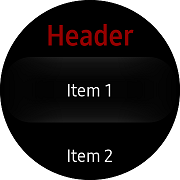
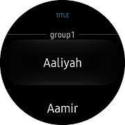
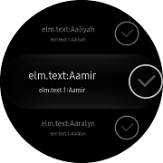

# CircleListView

`CircleListView` is a view for presenting lists of data, a short list that does not require scrolling, and a long list that requires scrolling.
This view is an extension of [Xamarin.Forms.ListView](https://developer.xamarin.com/api/type/Xamarin.Forms.ListView/). Similar to [Xamarin.Forms.ListView](https://developer.xamarin.com/api/type/Xamarin.Forms.ListView/), but the Scroller is rendered to [CircleSurface](https://developer.tizen.org/development/guides/native-application/user-interface/efl/ui-components/wearable-ui-components/circle-surface).
You can move the list using [Bezel interaction](https://developer.tizen.org/design/wearable/interaction/bezel-interactions) and [Drag](https://developer.tizen.org/design/wearable/interaction/touch#swipe).
To receive [Rotary event](https://developer.tizen.org/development/training/native-application/understanding-tizen-programming/event-handling#rotary), it must be registered as `RotaryFocusObject`, property of [CirclePage](xref:Tizen.Wearable.CircularUI.doc.CirclePage).

||||
|:----------------------------------------------:|:------------------------------------------:|:------------------------------------------------------------:|
|                   Normal list                  |               Group list                   |                      2 texts and 1 icon list                 |

## Components

- [Header](https://docs.microsoft.com/en-us/xamarin/xamarin-forms/user-interface/listview/customizing-list-appearance#Headers_and_Footers) : Text or view that is displayed at the beginning of a list.
- [Cells](https://docs.microsoft.com/en-us/xamarin/xamarin-forms/user-interface/listview/customizing-cell-appearance#custom-cells) : Data in a `CircleListView` is presented in cells. Each cell corresponds to a row of data.
- [Footer](https://docs.microsoft.com/en-us/xamarin/xamarin-forms/user-interface/listview/customizing-list-appearance#Headers_and_Footers) : Text or view that is displayed at end of a list.

**WARNING: [CircleListView](xref:Tizen.Wearable.CircularUI.doc.CircleListView), [CircleDateTimeSelector](xref:Tizen.Wearable.CircularUI.doc.CircleDateTimeSelector), [CircleScrollView](xref:Tizen.Wearable.CircularUI.doc.CircleScrollView), [CircleStepper](xref:Tizen.Wearable.CircularUI.doc.CircleStepper) must be confined in the `CirclePage` container or [Page](https://developer.xamarin.com/api/type/Xamarin.Forms.Page/) with [CircleSurfaceEffectBehavior](xref:Tizen.Wearable.CircularUI.doc.CircleSurfaceEffectBehavior). If you add these controls in any other way,  it may cause an exception or cannot display the controls.**

## Add CircleListView in CirclePage

You can set `CircleListView` in the [CirclePage.Content](xref:Tizen.Wearable.CircularUI.doc.CirclePage). For more information on how to add a [CirclePage](xref:Tizen.Wearable.CircularUI.doc.CirclePage), see [CirclePage guide](https://samsung.github.io/Tizen.CircularUI/guide/CirclePage.html#create-circlepage).
`RotaryFocusTargetName` property sets the currently focused control using the rotating interaction, and displays the focused control's circle object.
If the value is not set properly,  the control will not receive the [Rotary Event](https://developer.tizen.org/development/training/native-application/understanding-tizen-programming/event-handling#rotary).

You can either set the `Header` and/or `Footer` to a simple text, or to a more complex layout. Using `HeaderTemplate` and `FooterTemplate` properties you can create more complex layouts for the header and footer that support data binding.

The following example has cells, header, footer.
And use the [DataTemplate](https://docs.microsoft.com/en-us/xamarin/xamarin-forms/app-fundamentals/templates/data-templates/) to format a data object for display.

For more information, see the following links:

- [CircleListView  API reference](https://samsung.github.io/Tizen.CircularUI/api/Tizen.Wearable.CircularUI.Forms.CircleListView.html)
- [Xamarin.Forms.ListView  API reference](https://developer.xamarin.com/api/type/Xamarin.Forms.ListView/)
- [Xamarin.Forms.ListView  Guide](https://docs.microsoft.com/en-us/xamarin/xamarin-forms/user-interface/listview/)

_The code example of this guide uses TCCircleListView code of WearableUIGallery. The code is available in test\WearableUIGallery\WearableUIGallery\TC\TCCircleListView.xaml_

The following code shows CirclePage with CircleListView:

**XAML file**

```xml
<?xml version="1.0" encoding="utf-8" ?>
<w:CirclePage
    x:Class="WearableUIGallery.TC.TCCircleListView"
    xmlns="http://xamarin.com/schemas/2014/forms"
    xmlns:x="http://schemas.microsoft.com/winfx/2009/xaml"
    xmlns:local="clr-namespace:WearableUIGallery"
    xmlns:sys="clr-namespace:System;assembly=netstandard"
    xmlns:w="clr-namespace:Tizen.Wearable.CircularUI.Forms;assembly=Tizen.Wearable.CircularUI.Forms"
    RotaryFocusTargetName="mylist">
    <w:CirclePage.Content>
        <w:CircleListView x:Name="mylist">
            <w:CircleListView.ItemsSource>
                <x:Array x:Key="array" Type="{x:Type sys:String}">
                    <x:String>Item 1</x:String>
                    <x:String>Item 2</x:String>
                    <x:String>Item 3</x:String>
                    <x:String>Item 4</x:String>
                    <x:String>Item 5</x:String>
                    <x:String>Item 6</x:String>
                    <x:String>Item 7</x:String>
                    <x:String>Item 8</x:String>
                    <x:String>Item 9</x:String>
                    <x:String>Item 10</x:String>
                    <x:String>Item 11</x:String>
                    <x:String>Item 12</x:String>
                </x:Array>
            </w:CircleListView.ItemsSource>
            <w:CircleListView.Header>
                <x:String>Header</x:String>
            </w:CircleListView.Header>
            <w:CircleListView.Footer>
                <x:String>Footer</x:String>
            </w:CircleListView.Footer>
            <w:CircleListView.ItemTemplate>
                <DataTemplate>
                    <TextCell Text="{Binding .}" />
                </DataTemplate>
            </w:CircleListView.ItemTemplate>
            <w:CircleListView.HeaderTemplate>
                <DataTemplate>
                    <Label
                        FontAttributes="Bold"
                        FontSize="Large"
                        HorizontalTextAlignment="Center"
                        Text="{Binding .}"
                        TextColor="Red" />
                </DataTemplate>
            </w:CircleListView.HeaderTemplate>
            <w:CircleListView.FooterTemplate>
                <DataTemplate>
                    <Label
                        FontAttributes="Bold"
                        FontSize="Large"
                        HorizontalTextAlignment="Center"
                        Text="{Binding .}"
                        TextColor="Blue" />
                </DataTemplate>
            </w:CircleListView.FooterTemplate>
        </w:CircleListView>
    </w:CirclePage.Content>
</w:CirclePage>
```

## Add Group List as list contents

You can add group list as contents of `CircleListView`.

To enable grouping:

- Create a list of List<>.
- Set [ItemsSource](https://developer.xamarin.com/api/property/Xamarin.Forms.ItemsView%3CTVisual%3E.ItemsSource/) to that list.
- Set [IsGroupingEnabled](https://developer.xamarin.com/api/property/Xamarin.Forms.ListView.IsGroupingEnabled/) to true.
- Set [GroupDisplayBinding](https://developer.xamarin.com/api/property/Xamarin.Forms.ListView.GroupDisplayBinding/) to bind to the property of the groups that is being used as the title of the group.

_The code example of this guide uses TCGroupList code of WearableUIGallery. The code is available in test\WearableUIGallery\WearableUIGallery\TC\TCGroupList.xaml_


**C# file**

```cs
namespace WearableUIGallery.TC
{
    ...
    public class GroupModel : List<NamedList<string>>
    {
        public GroupModel()
        {
            Add(new NamedList<string>("group1") { "Aaliyah", "Aamir", "Aaralyn ", "Aaron", "Abagail", "Babitha", "Bahuratna", "Bandana", "Bulbul", "Cade", "Caldwell" });
            Add(new NamedList<string>("group2") { "Chandan", "Caster", "Dagan ", "Daulat", "Dag", "Earl", "Ebenzer", "Ellison", "Elizabeth", "Filbert", "Fitzpatrick", "Florian", "Fulton" });
            Add(new NamedList<string>("group3") { "Frazer", "Gabriel", "Gage", "Galen", "Garland", "Gauhar", "Hadden", "Hafiz", "Hakon", "Haleem", "Hank", "Hanuman" });
            Add(new NamedList<string>("group4") { "Jabali ", "Jaimini", "Jayadev", "Jake", "Jayatsena", "Jonathan", "Kamaal", "Jeirk", "Jasper", "Jack", "Mac", "Macy", "Marlon", "Milson" });
        }
    }

    public class NamedList<T> : List<T>
    {
        public NamedList(string name) => Name = name;
        public string Name { get; set; }
    }}
```

**XAML file**

```xml
<?xml version="1.0" encoding="utf-8" ?>
<w:CirclePage
    x:Class="WearableUIGallery.TC.TCGroupList"
    xmlns="http://xamarin.com/schemas/2014/forms"
    xmlns:x="http://schemas.microsoft.com/winfx/2009/xaml"
    xmlns:local="clr-namespace:WearableUIGallery.TC"
    xmlns:w="clr-namespace:Tizen.Wearable.CircularUI.Forms;assembly=Tizen.Wearable.CircularUI.Forms">
    <w:CirclePage.BindingContext>
        <local:GroupModel />
    </w:CirclePage.BindingContext>
    <w:CirclePage.Content>
        <w:CircleListView
            x:Name="mylist"
            GroupDisplayBinding="{Binding Name}"
            IsGroupingEnabled="True"
            ItemsSource="{Binding .}">
            <w:CircleListView.Header>
                <x:String>TITLE</x:String>
            </w:CircleListView.Header>
            <w:CircleListView.HeaderTemplate>
                <DataTemplate>
                    <Label
                        FontAttributes="Bold"
                        FontSize="10"
                        HeightRequest="120"
                        HorizontalTextAlignment="Center"
                        Text="{Binding .}"
                        TextColor="#6CC3F1" />
                </DataTemplate>
            </w:CircleListView.HeaderTemplate>
        </w:CircleListView>
    </w:CirclePage.Content>
</w:CirclePage>

```

## Add a list with 2 texts and 1 icon as list contents

You can add a list with two texts and one icon as contents of `CircleListView`.

This can easily be done using [ViewCell](https://docs.microsoft.com/en-us/xamarin/xamarin-forms/user-interface/listview/customizing-cell-appearance#custom-cells).
It is nested inside a [DataTemplate](https://docs.microsoft.com/en-us/xamarin/xamarin-forms/app-fundamentals/templates/data-templates/), which is inside `CircleListView.ItemTemplate`. The Layout of [ViewCell](https://docs.microsoft.com/en-us/xamarin/xamarin-forms/user-interface/listview/customizing-cell-appearance#custom-cells) is managed by a [StackLayout](https://docs.microsoft.com/en-us/xamarin/xamarin-forms/user-interface/layouts/stack-layout). You can place it in the [StackLayout](https://docs.microsoft.com/en-us/xamarin/xamarin-forms/user-interface/layouts/stack-layout) with your desired configuration.

_The code example of this guide uses XUIComponent's CircleList of Style2text1icon1 code. The code is available in sample\XUIComponents\UIComponents\UIComponents\Samples\CircleList/ListViewModel.cs and Style2text1icon1.xaml_


**C# file**

```cs
namespace WearableUIGallery.TC
{
    public class ListViewModel : INotifyPropertyChanged
    {
        static List<string> _names = new List<string>
        {
            "Aaliyah", "Aamir", "Aaralyn", "Aaron", "Abagail",
            "Babitha", "Bahuratna", "Bandana", "Bulbul", "Cade", "Caldwell",
            "Chandan", "Caster", "Dagan ", "Daulat", "Dag", "Earl", "Ebenzer",
            "Ellison", "Elizabeth", "Filbert", "Fitzpatrick", "Florian", "Fulton",
            "Frazer", "Gabriel", "Gage", "Galen", "Garland", "Gauhar", "Hadden",
            "Hafiz", "Hakon", "Haleem", "Hank", "Hanuman", "Jabali ", "Jaimini",
            "Jayadev", "Jake", "Jayatsena", "Jonathan", "Kamaal", "Jeirk",
            "Jasper", "Jack", "Mac", "Macy", "Marlon", "Milson"
        };
...
        public List<string> Names => _names;
        public ObservableCollection<CheckableName> CheckableNames { get; private set; }

        public int CheckedNamesCount
        {
            get => _checkedNamesCount;
            private set
            {
                if (_checkedNamesCount != value)
                {
                    _checkedNamesCount = value;
                    OnPropertyChanged();

                    UpdateSelectOptionMessage();
                }
            }
        }

        public ListViewModel()
        {
            CheckableNames = new ObservableCollection<CheckableName>();
            foreach (var name in _names)
            {
                var data = new CheckableName(name, false);
                data.PropertyChanged += (s, e) =>
                {
                    if (e.PropertyName == "Checked")
                    {
                        CheckedNamesCount += data.Checked ? 1 : -1;
                    }
                };
                CheckableNames.Add(data);
            }
...
        }
   }

    public class CheckableName : INotifyPropertyChanged
    {
        string _name;
        bool _checked;

        public CheckableName(string name, bool isChecked)
        {
            _name = name;
            _checked = isChecked;
        }

        public event PropertyChangedEventHandler PropertyChanged;

        public string Name
        {
            get => _name;
            set
            {
                if (_name != value)
                {
                    _name = value;
                    OnPropertyChanged();
                }
            }
        }
        public bool Checked
        {
            get => _checked;
            set
            {
                if (_checked != value)
                {
                    _checked = value;
                    OnPropertyChanged();
                }
            }
        }
...
    }
```

**XAML file**

```xml
<w:CirclePage
    x:Class="UIComponents.Samples.CircleList.Style2text1icon1"
    xmlns="http://xamarin.com/schemas/2014/forms"
    xmlns:x="http://schemas.microsoft.com/winfx/2009/xaml"
    xmlns:local="clr-namespace:UIComponents.Samples.CircleList"
    xmlns:sys="clr-namespace:System;assembly=netstandard"
    xmlns:w="clr-namespace:Tizen.Wearable.CircularUI.Forms;assembly=Tizen.Wearable.CircularUI.Forms"
    RotaryFocusTargetName="mylist">
    <w:CirclePage.BindingContext>
        <local:ListViewModel />
    </w:CirclePage.BindingContext>
    <w:CirclePage.Content>
        <w:CircleListView x:Name="mylist" ItemsSource="{Binding Names}">
            <w:CircleListView.ItemTemplate>
                <DataTemplate>
                    <ViewCell>
                        <StackLayout
                            HeightRequest="120"
                            HorizontalOptions="FillAndExpand"
                            Orientation="Horizontal"
                            VerticalOptions="FillAndExpand"
                            WidthRequest="360">
                            <StackLayout
                                HorizontalOptions="CenterAndExpand"
                                Orientation="Vertical"
                                VerticalOptions="Center">
                                <Label
                                    FontSize="8"
                                    HorizontalOptions="Center"
                                    HorizontalTextAlignment="Center"
                                    Text="{Binding ., StringFormat='elm.text:{0}'}"
                                    VerticalOptions="Center"
                                    VerticalTextAlignment="Center" />
                                <Label
                                    FontSize="5"
                                    HorizontalOptions="Center"
                                    HorizontalTextAlignment="Center"
                                    Text="{Binding ., StringFormat='elm.text.1:{0}'}"
                                    VerticalOptions="Center"
                                    VerticalTextAlignment="Center" />
                            </StackLayout>
                            <w:Check
                                DisplayStyle="Default"
                                HorizontalOptions="End"
                                VerticalOptions="Center" />
                        </StackLayout>
                    </ViewCell>
                </DataTemplate>
            </w:CircleListView.ItemTemplate>
        </w:CircleListView>
    </w:CirclePage.Content>
</w:CirclePage>

```
