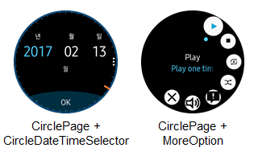
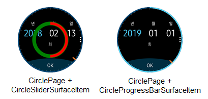
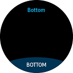
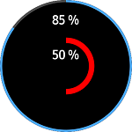
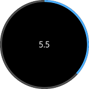
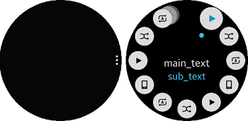
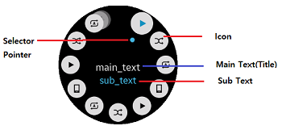

# CirclePage
CirclePage, is a visual element, which is derived from [Xamarin.Forms.Page](https://developer.xamarin.com/api/type/Xamarin.Forms.Page/). This occupies entire wearable screen.

 

## Overview
`CirclePage` is a container of any control that uses circle object or [Rotary Event](https://developer.tizen.org/development/training/native-application/understanding-tizen-programming/event-handling#rotary).
If you want to use any circle control or you want to handle the `Rotary Event`, you must use `CirclePage`.
`CirclePage` can set BOTTOM button (`ActionButtonItem`), `CircleProgressBar`, `CircleSlider` and `MoreOption` on its own.

**WARNING: [CircleListView](xref:Tizen.Wearable.CircularUI.doc.CircleListView), [CircleDateTimeSelector](xref:Tizen.Wearable.CircularUI.doc.CircleDateTimeSelector), [CircleScrollView](xref:Tizen.Wearable.CircularUI.doc.CircleScrollView), [CircleStepper](xref:Tizen.Wearable.CircularUI.doc.CircleStepper) must be confined in the `CirclePage` container or [Page](https://developer.xamarin.com/api/type/Xamarin.Forms.Page/) with [CircleSurfaceEffectBehavior](xref:Tizen.Wearable.CircularUI.doc.CircleSurfaceEffectBehavior). If you add these controls in any other way,  it may cause an exception or cannot display the controls.**

* BOTTOM button (ActionButtonItem)
    - A semicircular button is shown at bottom of screen. See the following image:

    

* CircleProgressBar
    - CircleProgressBar displays the progress status of a given task with the circular design.

    

* CircleSlider
    - CircleSlider changes value corresponding to the `Rotary Event`. This displays a circle bar at the edge of the circle screen.
    You can change the radius of circle bar by modifying radius value.

    

* MoreOption
    - MoreOption contains a cue button (in the figure on the left).
     When the cue button is clicked, the rotary selector view opens from the cue location (in the figure on the right).
     The rotary selector arranges multiple items around the circular edge of the screen. The focus switches between items when you rotate the bezel.

    

## Create CirclePage
To create CirclePage, you must download Tizen.Wearable.CircularUI NuGet package in your application project. For more information, see [QuickStart](Quickstart.md).

1. Add a new XAML page to the Tizen Xamarin.Forms application.
2. Import Tizen.Wearable.CircularUI.Forms and change the base class from ContentPage to CirclePage.
3. This must be done in both the C# and XAML.

In a XAML file, import CircularUI and define namespace as `xmlns:w="clr-namespace:Tizen.Wearable.CircularUI.Forms;assembly=Tizen.Wearable.CircularUI.Forms"`

_The code example of this guide uses TCCirclePage code of WearableUIGallery. The code is available in test\WearableUIGallery\WearableUIGallery\TC\TCCirclePage.xaml_


**C# file**
```cs
using Tizen.Wearable.CircularUI.Forms;
using Xamarin.Forms.Xaml;


namespace WearableUIGallery.TC
{
    [XamlCompilation(XamlCompilationOptions.Compile)]
    public partial class TCCirclePage : CirclePage
    {
        public TCCirclePage()
        {
            InitializeComponent();
        }
    }
}
```

**XAML file**
```xml
<?xml version="1.0" encoding="utf-8" ?>
<w:CirclePage
    x:Class="WearableUIGallery.TC.TCCirclePage"
    xmlns="http://xamarin.com/schemas/2014/forms"
    xmlns:x="http://schemas.microsoft.com/winfx/2009/xaml"
    xmlns:local="clr-namespace:WearableUIGallery.TC"
    xmlns:w="clr-namespace:Tizen.Wearable.CircularUI.Forms;assembly=Tizen.Wearable.CircularUI.Forms"
    RotaryFocusTargetName="{Binding RotaryFocusName}">
    <w:CirclePage.Content>

```

## Add content in CirclePage
You can set content in the `CirclePage.Content`. In the XAML file, code explains that CirclePage adds content with `CircleDateTimeSelector`.
`RotaryFocusTargetName` property sets the currently focused control that is handled by rotating and display the circle object of the focused control.
If the value is not set properly, the control will not receive the [Rotary Event](https://developer.tizen.org/development/training/native-application/understanding-tizen-programming/event-handling#rotary).

For more information, see the following links:
- [CirclePage API reference](https://samsung.github.io/Tizen.CircularUI/api/Tizen.Wearable.CircularUI.Forms.CirclePage.html)
- [Xamarin.Forms.Page guide](https://docs.microsoft.com/en-us/xamarin/xamarin-forms/user-interface/controls/pages)

**XAML file**
```xml
<w:CirclePage
    x:Class="WearableUIGallery.TC.TCCirclePage"
    xmlns="http://xamarin.com/schemas/2014/forms"
    xmlns:x="http://schemas.microsoft.com/winfx/2009/xaml"
    xmlns:local="clr-namespace:WearableUIGallery.TC"
    xmlns:w="clr-namespace:Tizen.Wearable.CircularUI.Forms;assembly=Tizen.Wearable.CircularUI.Forms"
    RotaryFocusTargetName="{Binding RotaryFocusName}">
    <w:CirclePage.BindingContext>
        <local:TCCirclePageViewModel />
    </w:CirclePage.BindingContext>
    <w:CirclePage.Content>
        <StackLayout
            BackgroundColor="Black"
            HorizontalOptions="FillAndExpand"
            Orientation="Vertical"
            VerticalOptions="FillAndExpand">
            <w:CircleDateTimeSelector
                x:Name="DateSelector"
                IsVisibleOfDate="{Binding DateVisiblity}"
                MaximumDate="1/1/2020"
                MinimumDate="1/12/2015"
                ValueType="Date" />
        </StackLayout>
    </w:CirclePage.Content>

```

## Add ActionButtonItem in CirclePage
The `ActionButtonItem` in CirclePage displays BOTTOM button. The ActionButtonItem is derives from [Xamarin.Forms.Menuitem](https://developer.xamarin.com/api/type/Xamarin.Forms.MenuItem/).
`ActionButtonItem` has the following properties:
- `Command`: Gets or sets the `ICommand` to be invoked on activation (item clicked).
- `Text`: Gets or sets text of button.

For more information, see the following links:
- [ActionButtonItem API reference](https://samsung.github.io/Tizen.CircularUI/api/Tizen.Wearable.CircularUI.Forms.ActionButtonItem.html)
- [Xamarin.Forms.MenuItem API reference](https://developer.xamarin.com/api/type/Xamarin.Forms.MenuItem/)

**XAML file**
```xml
    <w:CirclePage.ActionButton>
        <w:ActionButtonItem Command="{Binding ProgressBarVisibleCommand}" Text="OK" />
    </w:CirclePage.ActionButton>
```

## Add ToolbarItems in CirclePage
CirclePage `ToolbarItems` set items of rotary selector views. You can set each item with `CircleToolbarItem` property.
CircleToolbarItem derives from [Xamarin.Forms.ToolbarItem](https://developer.xamarin.com/api/type/Xamarin.Forms.ToolbarItem/).

`CircleToolbarItem` has the following properties:
- `Command`: Gets or sets the `ICommand` to be invoked on activation (item clicked).
- `Icon`: Gets or sets image of item.
- `Text`: Gets or sets title of item.

For more information, see the following links:
- [CircleToolbarItem API reference](https://samsung.github.io/Tizen.CircularUI/api/Tizen.Wearable.CircularUI.Forms.CircleToolbarItem.html)
- [Xamarin.Forms.ToolbarItem API reference](https://developer.xamarin.com/api/type/Xamarin.Forms.ToolbarItem/)



**XAML file**
```xml
    <w:CirclePage.ToolbarItems>
        <w:CircleToolbarItem
            Command="{Binding Play.Action}"
            Icon="{Binding Play.Icon}"
            SubText="{Binding Play.SubText}"
            Text="{Binding Play.Text}" />
        <w:CircleToolbarItem
            Command="{Binding Stop.Action}"
            Icon="{Binding Stop.Icon}"
            SubText="{Binding Stop.SubText}"
            Text="{Binding Stop.Text}" />

    ...

    </w:CirclePage.ToolbarItems>
```

## Add CircleProgressBarSurfaceItem in CirclePage

CirclePage `CircleSurfaceItems` can set `CircleProgressBarSurfaceItem` and `CircleSliderSurfaceItem`.
`CircleProgressBarSurfaceItem` represents Circle ProgressBar.
`progress1` at XAML code represents the outer circle of following image. `progress2` represents the inner circle.
If you use CircleProgressbar, you do not need to set the `RotaryFocusTargetName` property of CirclePage.
When `Value` property is increased or decreased, circle object extends or shrinks the following to the `Value` property.

`CircleProgressBarSurfaceItem` has the following properties:

- `Value`: Gets or sets the value of the progress bar.
- `IsVisible`: Gets or sets the visibility value of circle surface item.
- `BarRadius`: Gets or sets the bar radius value.
- `BackgroundRadius`: Gets or sets the background radius value.
- `BarLineWidth`: Gets or sets the bar line width value.
- `BackgroundLineWidth`: Gets or sets the background line width value.
- `BarColor`: Gets or sets the bar color value.
- `BackgroundLineWidth`: Gets or sets the background color value.

For more information, see the following links:

- [CircleSurfaceItem API reference](https://samsung.github.io/Tizen.CircularUI/api/Tizen.Wearable.CircularUI.Forms.CircleSurfaceItem.html)
- [CircleProgressBarSurfaceItem  API reference](https://samsung.github.io/Tizen.CircularUI/api/Tizen.Wearable.CircularUI.Forms.CircleProgressBarSurfaceItem.html)


_The code example of this guide uses CircleProgressBar.xaml code of XUIComponent. The code is available in sample\XUIComponents\UIComponents\UIComponents\Samples\CircleProgressBar.xaml_

**XAML file**
```xml
<w:CirclePage
    x:Class="UIComponents.Samples.CircleProgressBar"
    xmlns="http://xamarin.com/schemas/2014/forms"
    xmlns:x="http://schemas.microsoft.com/winfx/2009/xaml"
    xmlns:local="clr-namespace:UIComponents.Samples"
    xmlns:sys="clr-namespace:System;assembly=netstandard"
    xmlns:w="clr-namespace:Tizen.Wearable.CircularUI.Forms;assembly=Tizen.Wearable.CircularUI.Forms"
    NavigationPage.HasNavigationBar="False">
    <w:CirclePage.BindingContext>
        <local:CircleProgressBarViewModel />
    </w:CirclePage.BindingContext>
    <w:CirclePage.Content>
        <StackLayout
            Padding="0,30,0,0"
            BackgroundColor="Black"
            HorizontalOptions="Center"
            Orientation="Vertical"
            VerticalOptions="FillAndExpand">
            <Label
                x:Name="label1"
                FontAttributes="Bold"
                FontSize="12"
                Text="{Binding ProgressLabel1}"
                TextColor="White" />
            <Label
                x:Name="label2"
                Margin="0,40"
                FontAttributes="Bold"
                FontSize="12"
                Text="{Binding ProgressLabel2}"
                TextColor="White" />
        </StackLayout>
    </w:CirclePage.Content>
    <w:CirclePage.CircleSurfaceItems>
        <w:CircleProgressBarSurfaceItem
            x:Name="progress1"
            IsVisible="True"
            Value="{Binding ProgressValue1}" />
        <w:CircleProgressBarSurfaceItem
            x:Name="progress2"
            BackgroundColor="Black"
            BackgroundLineWidth="15"
            BackgroundRadius="70"
            BarColor="Red"
            BarLineWidth="15"
            BarRadius="70"
            IsVisible="True"
            Value="{Binding ProgressValue2}" />
    </w:CirclePage.CircleSurfaceItems>
</w:CirclePage>
```
