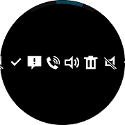
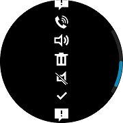

# CircleScrollView

`CircleScrollView` can be used to ensure that larger views display well on smaller wearable devices.
It is an extension of [Xamarin.Forms.ScrollView](https://developer.xamarin.com/api/type/Xamarin.Forms.ScrollView/).
Same as [Xamarin.Forms.ScrollView](https://developer.xamarin.com/api/type/Xamarin.Forms.ScrollView/), scroller is rendered to [CircleSurface](https://developer.tizen.org/development/guides/native-application/user-interface/efl/ui-components/wearable-ui-components/circle-surface) and scrolling is possible with [Bezel interaction](https://developer.tizen.org/design/wearable/interaction/bezel-interactions).
In order to receive [Rotary Event](https://developer.tizen.org/development/training/native-application/understanding-tizen-programming/event-handling#rotary), it must be registered as `RotaryFocusObject` property of [CirclePage](xref:Tizen.Wearable.CircularUI.doc.CirclePage).

|||
|:-----------------------------------------------:|:-----------------------------------------------:|
|                      Horizontal                 |                    Vertical                     |

**WARNING: [CircleListView](xref:Tizen.Wearable.CircularUI.doc.CircleListView), [CircleDateTimeSelector](xref:Tizen.Wearable.CircularUI.doc.CircleDateTimeSelector), [CircleScrollView](xref:Tizen.Wearable.CircularUI.doc.CircleScrollView), [CircleStepper](xref:Tizen.Wearable.CircularUI.doc.CircleStepper) must be contained by `CirclePage` or [CircleSurfaceEffectBehavior](xref:Tizen.Wearable.CircularUI.doc.CircleSurfaceEffectBehavior) should be added in [Behaviors](https://developer.xamarin.com/api/type/Xamarin.Forms.Behavior/) of [Page](https://developer.xamarin.com/api/type/Xamarin.Forms.Page/) that contains these controls. If other `pages` contain these controls, it may cause exception or can't display control.**

## Adding CircleScrollView at CirclePage

You can set `CircleScrollView` at [CirclePage.Content](xref:Tizen.Wearable.CircularUI.doc.CirclePage). If you want to know how to add [CirclePage](xref:Tizen.Wearable.CircularUI.doc.CirclePage), please refer to [CirclePage guide](https://samsung.github.io/Tizen.CircularUI/guide/CirclePage.html#create-circlepage).
The following XAML code shows [CirclePage](xref:Tizen.Wearable.CircularUI.doc.CirclePage) with `CircleScrollView`.
`RotaryFocusTargetName` attribute sets the currently focused control that is handled by rotating and display the focused control's circle object.
If you don't set this property, control can't receive the [Rotary Event](https://developer.tizen.org/development/training/native-application/understanding-tizen-programming/event-handling#rotary).

The direction of the scroller depends on the setting of the `Orientation` value.

In the example below, we set the `Orientation` of the `CircleScrollView` to `Horizontal` and place it in the `StackLayout` to contain many images.

For more information. Please refer to below links

- [CircleScrollView API reference](https://samsung.github.io/Tizen.CircularUI/api/Tizen.Wearable.CircularUI.Forms.CircleScrollView.html)
- [Xamarin.Forms.ScrollView API reference](https://developer.xamarin.com/api/type/Xamarin.Forms.ScrollView/)
- [Xamarin.Forms.ScrollView Guide](https://docs.microsoft.com/en-us/xamarin/xamarin-forms/user-interface/layouts/scroll-view)

_This guide's code example use XUIComponent's HorizontalScroller.xaml code at the sample\XUIComponents\UIComponents\UIComponents\Samples\CircleScroller/HorizontalScroller.xaml_

**XAML file**

```xml
<w:CirclePage
    x:Class="UIComponents.Samples.CircleScroller.HorizontalScroller"
    xmlns="http://xamarin.com/schemas/2014/forms"
    xmlns:x="http://schemas.microsoft.com/winfx/2009/xaml"
    xmlns:local="clr-namespace:UIComponents.Samples.CircleScroller"
    xmlns:sys="clr-namespace:System;assembly=netstandard"
    xmlns:w="clr-namespace:Tizen.Wearable.CircularUI.Forms;assembly=Tizen.Wearable.CircularUI.Forms"
    RotaryFocusTargetName="myscroller">
    <w:CirclePage.Content>
        <w:CircleScrollView x:Name="myscroller" Orientation="Horizontal">
            <StackLayout
                HorizontalOptions="FillAndExpand"
                Orientation="Horizontal"
                VerticalOptions="FillAndExpand">
                <Image Source="tw_btn_delete_holo_dark.png" VerticalOptions="CenterAndExpand" />
                <Image Source="tw_number_controller_icon_ringtone_mute.png" VerticalOptions="CenterAndExpand" />
                <Image Source="tw_ic_popup_btn_check.png" VerticalOptions="CenterAndExpand" />
                <Image Source="tw_number_controller_icon_alert.png" VerticalOptions="CenterAndExpand" />
                <Image Source="tw_number_controller_icon_bell.png" VerticalOptions="CenterAndExpand" />
                <Image Source="tw_number_controller_icon_ringtone_sound.png" VerticalOptions="CenterAndExpand" />
                <Image Source="tw_btn_delete_holo_dark.png" VerticalOptions="CenterAndExpand" />
                <Image Source="tw_number_controller_icon_ringtone_mute.png" VerticalOptions="CenterAndExpand" />
                <Image Source="tw_ic_popup_btn_check.png" VerticalOptions="CenterAndExpand" />
                <Image Source="tw_number_controller_icon_alert.png" VerticalOptions="CenterAndExpand" />
                <Image Source="tw_number_controller_icon_bell.png" VerticalOptions="CenterAndExpand" />
                <Image Source="tw_number_controller_icon_ringtone_sound.png" VerticalOptions="CenterAndExpand" />
                <Image Source="tw_btn_delete_holo_dark.png" VerticalOptions="CenterAndExpand" />
                <Image Source="tw_number_controller_icon_ringtone_mute.png" VerticalOptions="CenterAndExpand" />
                <Image Source="tw_ic_popup_btn_check.png" VerticalOptions="CenterAndExpand" />
                <Image Source="tw_number_controller_icon_alert.png" VerticalOptions="CenterAndExpand" />
                <Image Source="tw_number_controller_icon_bell.png" VerticalOptions="CenterAndExpand" />
                <Image Source="tw_number_controller_icon_ringtone_sound.png" VerticalOptions="CenterAndExpand" />
            </StackLayout>
        </w:CircleScrollView>
    </w:CirclePage.Content>
</w:CirclePage>

```