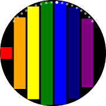
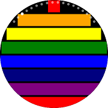
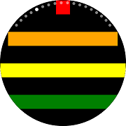

# CircleStackLayout

`CircleStackLayout` organizes views in a one-dimensional line ("stack"), either horizontally or vertically. CircleStackLayout is similar to [Xamarin.Forms.StackLayout](https://developer.xamarin.com/api/type/Xamarin.Forms.StackLayout/), but it arranges internal components in a form that fits the circular screen. Rectangular components are placed in close proximity to the circle. Margin is calculated after placement.

If `Orientation` is not set, `Vertical` is used. The larger the `Spacing` value, the greater the distance between the components placed. At the right end of the following figure, the `Spacing` value is 50:

||||
|:--------------------------------------------------:|:----------------------------------------------:|:--------------------------------------------:|
|                   Horizontal                       |                     Vertical                   |                     Spacing                  |

## Add CircleStackLayout in ContentPage

You can set `CircleStackLayout` in [ContentPage](https://developer.xamarin.com/api/type/Xamarin.Forms.ContentPage/).

In the following example, there is a large number of [BoxView](https://docs.microsoft.com/en-us/xamarin/xamarin-forms/user-interface/boxview).  Therefore, the entire content is larger than the screen size and uses `CircleStackLayout` in [ScrollView](https://docs.microsoft.com/en-us/xamarin/xamarin-forms/user-interface/layouts/scroll-view).

For more information, see the following links:

- [CircleStackLayout API reference](https://samsung.github.io/Tizen.CircularUI/api/Tizen.Wearable.CircularUI.Forms.CircleStackLayout.html)
- [Xamarin.Forms.StackLayout API reference](https://developer.xamarin.com/api/type/Xamarin.Forms.StackLayout/)
- [Xamarin.Forms.StackLayout Guide](https://docs.microsoft.com/en-us/xamarin/xamarin-forms/user-interface/layouts/stack-layout)

_The code example of this guide uses TCCircleStackLayout.xaml code of WearableUIGallery. The code is available in test\WearableUIGallery\WearableUIGallery\TC\TCCircleStackLayout.xaml_

**XAML file**

```xml
<?xml version="1.0" encoding="utf-8" ?>
<w:IndexPage
    x:Class="WearableUIGallery.TC.TCCircleStackLayout"
    xmlns="http://xamarin.com/schemas/2014/forms"
    xmlns:x="http://schemas.microsoft.com/winfx/2009/xaml"
    xmlns:local="clr-namespace:WearableUIGallery"
    xmlns:w="clr-namespace:Tizen.Wearable.CircularUI.Forms;assembly=Tizen.Wearable.CircularUI.Forms">
    ...
    <ContentPage>
        <ScrollView>
            <w:CircleStackLayout>
                <BoxView BackgroundColor="Red" />
                <BoxView BackgroundColor="Orange" />
                <BoxView BackgroundColor="Yellow" />
                <BoxView BackgroundColor="Green" />
                <BoxView BackgroundColor="Blue" />
                <BoxView BackgroundColor="Navy" />
                <BoxView BackgroundColor="Purple" />
                <BoxView BackgroundColor="Red" />
                <BoxView BackgroundColor="Orange" />
                <BoxView BackgroundColor="Yellow" />
                <BoxView BackgroundColor="Green" />
                <BoxView BackgroundColor="Blue" />
                <BoxView BackgroundColor="Navy" />
                <BoxView BackgroundColor="Purple" />
            </w:CircleStackLayout>
        </ScrollView>
    </ContentPage>
    ...
</w:IndexPage>
```