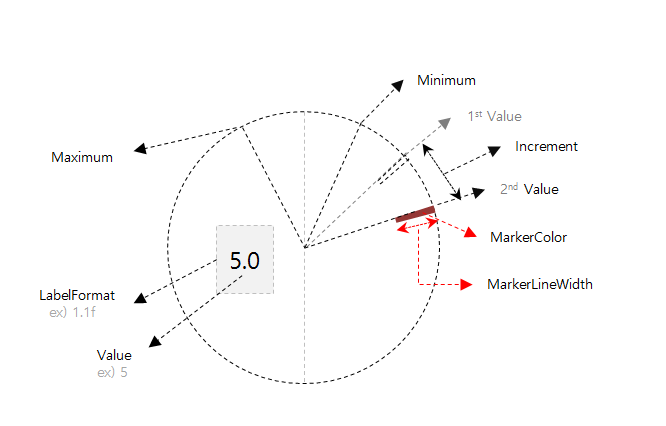
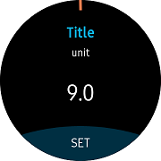

# CircleStepper

`CircleStepper` allows you to select a value from a range of incremental values specified with `Minimum`, `Maximum`, and `Increment` properties.
It is an extension of [Xamarin.Forms.Stepper](https://developer.xamarin.com/api/type/Xamarin.Forms.Stepper/). MarkerColor, MarkerLineWidth, and LabelFormat have been added to the [Xamarin.Forms.Stepper](https://developer.xamarin.com/api/type/Xamarin.Forms.Stepper/).
You can modify the value with [Bezel interaction](https://developer.tizen.org/design/wearable/interaction/bezel-interactions).
To receive [Rotary event](https://developer.tizen.org/development/training/native-application/understanding-tizen-programming/event-handling#rotary), it must be registered as `RotaryFocusObject`, property of [CirclePage](xref:Tizen.Wearable.CircularUI.doc.CirclePage).



**WARNING: [CircleListView](xref:Tizen.Wearable.CircularUI.doc.CircleListView), [CircleDateTimeSelector](xref:Tizen.Wearable.CircularUI.doc.CircleDateTimeSelector), [CircleScrollView](xref:Tizen.Wearable.CircularUI.doc.CircleScrollView), [CircleStepper](xref:Tizen.Wearable.CircularUI.doc.CircleStepper) must be confined in the `CirclePage` container or [Page](https://developer.xamarin.com/api/type/Xamarin.Forms.Page/) with [CircleSurfaceEffectBehavior](xref:Tizen.Wearable.CircularUI.doc.CircleSurfaceEffectBehavior). If you add these controls in any other way,  it may cause an exception or cannot display the controls.**

## Add CircleStepper in CirclePage

You can set the `CircleStepper` in the [CirclePage.Content](xref:Tizen.Wearable.CircularUI.doc.CirclePage). For more information on how to add [CirclePage](xref:Tizen.Wearable.CircularUI.doc.CirclePage), see [CirclePage guide](https://samsung.github.io/Tizen.CircularUI/guide/CirclePage.html#create-circlepage).
`RotaryFocusTargetName` property sets the currently focused control that is handled by rotating and displaying the focused control's circle object.
If this value properly is not set, then control can not receive [Rotary Event](https://developer.tizen.org/development/training/native-application/understanding-tizen-programming/event-handling#rotary).

`CircleStepper` has the following properties:

- LabelFormat: This property gets or sets the format in which the value is shown.
- MarkerColor: This property changes the color of the marker to the value selected.
- MarkerLineWidth: This property gets and sets the length of the marker.

This example consists of `StackLayout` with a `CircleStepper` and two Labels in the `CirclePage`.
Since 9 is set to `Minimum` and `LabelFormat` is set to "% 1.1f", "9.0" appears on the screen. Since the `Increment` is 7.5, it increases by 7.5 when you turn the bezel and increase the `Value`. The `Maximum` defined value is 99, hence the marker does not exceed this value. Since the `MarkerColor` is set to "Coral", it will be displayed as the corresponding color.



For more information, see the following links:

- [CircleStepper API reference](https://samsung.github.io/Tizen.CircularUI/api/Tizen.Wearable.CircularUI.Forms.CircleStepper.html)
- [Xamarin.Forms.Stepper API reference](https://developer.xamarin.com/api/type/Xamarin.Forms.Stepper/)
- [Xamarin.Forms.Stepper Guide](https://docs.microsoft.com/en-us/xamarin/xamarin-forms/user-interface/controls/views#stepper)

_The code example of this guide uses XUIComponent's SpinnerDefault of CircleSpinner code. The code is available in sample\XUIComponents\UIComponents\UIComponents\Samples\CircleSpinner\SpinnerViewModel.cs and SpinnerDefault.xaml_

The following code shows CirclePage with CircleStepper:

**C# file**

```cs

    public class SpinnerViewModel : INotifyPropertyChanged
    {
        double _value= 9.0;
        ...

        public double Value
        {
            get => _value;
            set
            {
                if (_value == value) return;
                _value = value;
                OnPropertyChanged();
            }
        }
```

**XAML file**

```xml

<w:CirclePage
    x:Class="UIComponents.Samples.CircleSpinner.SpinnerDefault"
    xmlns="http://xamarin.com/schemas/2014/forms"
    xmlns:x="http://schemas.microsoft.com/winfx/2009/xaml"
    xmlns:local="clr-namespace:UIComponents.Samples.CircleSpinner"
    xmlns:sys="clr-namespace:System;assembly=netstandard"
    xmlns:w="clr-namespace:Tizen.Wearable.CircularUI.Forms;assembly=Tizen.Wearable.CircularUI.Forms"
    RotaryFocusTargetName="stepper">
    <w:CirclePage.BindingContext>
        <local:SpinnerViewModel />
    </w:CirclePage.BindingContext>
    <w:CirclePage.Content>
        <StackLayout Padding="0,50,0,0" Orientation="Vertical">
            <Label
                FontAttributes="Bold"
                FontSize="11"
                HorizontalTextAlignment="Center"
                Text="Title"
                TextColor="#0FB4EF" />
            <Label
                FontSize="8"
                HorizontalTextAlignment="Center"
                Text="unit"
                TextColor="White" />
            <w:CircleStepper
                x:Name="stepper"
                HorizontalOptions="CenterAndExpand"
                Increment="7.5"
                LabelFormat="%1.1f"
                MarkerColor="Coral"
                Maximum="99.0"
                Minimum="9.0"
                Value="{Binding Value}" />
        </StackLayout>
    </w:CirclePage.Content>
    <w:CirclePage.ActionButton>
        <w:ActionButtonItem Command="{Binding ButtonPressedExit}" Text="SET" />
    </w:CirclePage.ActionButton>
</w:CirclePage>
```