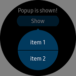

# ContextPopup
`ContextPopup` represents Tizen wearable context popup that has one or two items.
`ContextPopup` has the same shape as `ConfirmPopupEffect`. `ConfirmPopupEffect` can be attached any control (such as a button).

*`ContextPopup` is displayed separately from any control. So you can't set this in XAML file.*
*If you want to attach context popup in XAML file, please use [ConfirmPopupEffect](xref:Tizen.Wearable.CircularUI.doc.ConfirmPopupEffect) instead.*



## Create ContextPopup
`ContextPopupItem` is each item of `ContextPopup`. `ContextPopupItem` parameter of constructor set item text.
One or two `ContextPopupItem` can be attached at `ContextPopup` using `ContextPopup.Items.Add()`. `ItemSelected` event is occurred when user select item. `SelectedItem` gets the value which item selected.

*It is possible to add more than 2 items, but any items from the 3rd item are hidden. So one or two items are recommended.*

_This guide's code example use WearableUIGallery's TCContextPopup code at the test\WearableUIGallery\WearableUIGallery\TC\TCContextPopup.xaml.cs_

For more information. Please refer to [ContextPopup  API reference](https://samsung.github.io/Tizen.CircularUI/api/Tizen.Wearable.CircularUI.Forms.ContextPopup.html)

**C# file**
```cs
            var item1 = new ContextPopupItem("item 1");
            var item2 = new ContextPopupItem("item 2");

            _popup.Items.Add(item1);
            _popup.Items.Add(item2);

            _popup.ItemSelected += (s, e) =>
            {
                Console.WriteLine($"{_popup.SelectedItem?.Label} is selected");
                /*  insert code when user select item */
            };
```
