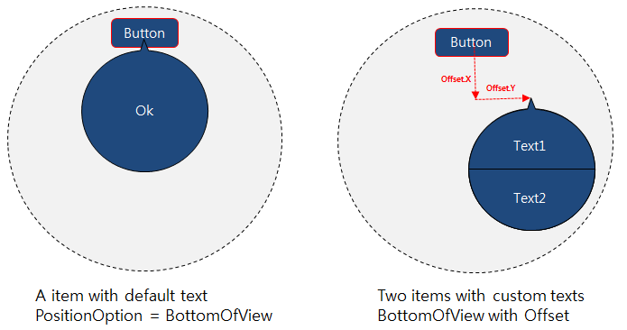
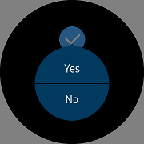
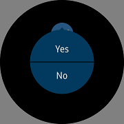
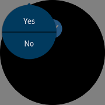
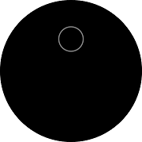
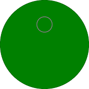

# ContextPopupEffectBehavior

`ContextPopupEffectBehavior` is a [Behavior](https://docs.microsoft.com/en-us/xamarin/xamarin-forms/app-fundamentals/behaviors/) for Xamarin.Forms that is used to create the [View](https://docs.microsoft.com/dotnet/api/xamarin.forms.view) with one or two buttons.
A popup with only one button will have an **Accept** button only. The default text for **Accept** button is OK.

When `Visibility` is set to `True`, the popup appears on the screen. The popup displayed with the **Accept** or **Cancel** button is executed automatically. Accept command is executed when click **Accept** button. After the command is executed, popup disappears and `Visibility` is set to `False`.
If you touch outside of the popup, the popup is removed. It is same to execute Cancel command. You can adjust the X and Y value to change the position of popup.



## Add popup with ContextPopupEffectBehavior in CirclePage

You can set popup with the `ContextPopupEffectBehavior` in any `View`. For more information on how to add [CirclePage](xref:Tizen.Wearable.CircularUI.doc.CirclePage), see [CirclePage guide](https://samsung.github.io/Tizen.CircularUI/guide/CirclePage.html#create-circlepage).

`ContextPopupEffectBehavior` has the following properties:

- AcceptCommand : [System.Windows.Input.ICommand](https://developer.xamarin.com/api/type/System.Windows.Input.ICommand/). This command is executed when Accept.
- CancelCommand : [System.Windows.Input.ICommand](https://developer.xamarin.com/api/type/System.Windows.Input.ICommand/). This command is executed when Cancel. It is also executed when the popup disappears on touching an area outside the popup.
- Visibility : This property when set to `True`, the popup appears and when set to `False`, the popup disappears. The `CancelCommand` works even when the popup disappears and the `Visibility` is set to `False`.

- PositionOption : The popup has the following position type
  - `BottomOfView` : The popup appears at the bottom of the view with `ContextPopupEffectBehavior`. The position is changed by offset in the center of view.
  - `CenterOfParent` : In the center of the screen, you can move the values of offset to adjust position of popup.
  - `Absolute` : The value of offset is X, Y and popup is placed on the screen.
  - `Relative` : Set the width of the screen to Offset.X * Window.Width and height of the screen to Offset.Y * Window.Height.

In the example, you can see a `Check` with the `ContextPopupEffectBehavior` in the `AbsoluteLayout` set into the `CirclePage`.
The text for the `AcceptText` and the `CancelText` are set. Also, the commands for `AcceptCommand` and `CancelCommand` are set. When selected, **Yes** will change the background color to green and **No** will change the background color to red.
The `PositionOption` is set as `CenterOfParent`. The value of `Visibility` is set to `IsToggled`.

||||
|:----------------------------------------------------:|:--------------------------------------------------:|:-----------------------------:|
|                       BottomOfView                   |                    CenterOfParent                  |         Absolute/Relative     |

For more information, see the following links:

- [ContextPopupEffectBehavior  API reference](https://samsung.github.io/Tizen.CircularUI/api/Tizen.Wearable.CircularUI.Forms.ContextPopupEffectBehavior.html)
- [Xamarin.Forms.Behaviors Guide](https://docs.microsoft.com/en-us/xamarin/xamarin-forms/app-fundamentals/behaviors/)

_The code example of this guide uses TCConfirm code of WearableUIGallery. The code is available in test\WearableUIGallery\WearableUIGallery\TC\TCConfirm.xaml_

To create a context popup in CirclePage, use the following code:

**C# file**

```cs
    [XamlCompilation(XamlCompilationOptions.Compile)
    public partial class TCConfirm : CirclePage
    {
        public TCConfirm ()
        {
            AcceptedCommand = new Command(() => BackgroundColor = Color.Green);
            CancelCommand = new Command(() => BackgroundColor = Color.Red);

            InitializeComponent ();

            CtxCheck.PropertyChanged += (s, e) =>
            {
                if (e.PropertyName == Check.IsToggledProperty.PropertyName)
                    System.Diagnostics.Debug.WriteLine($"IsToggled = {CtxCheck.IsToggled}");
            };
        }

        public ICommand AcceptedCommand { get; private set; }
        public ICommand CancelCommand { get; private set; }
    }
```

**XAML file**

```xml
<?xml version="1.0" encoding="utf-8" ?>
<w:CirclePage
    x:Class="WearableUIGallery.TC.TCConfirm"
    xmlns="http://xamarin.com/schemas/2014/forms"
    xmlns:x="http://schemas.microsoft.com/winfx/2009/xaml"
    xmlns:w="clr-namespace:Tizen.Wearable.CircularUI.Forms;assembly=Tizen.Wearable.CircularUI.Forms"
    x:Name="mypage">
    <ContentPage.Content>
        <AbsoluteLayout>
            <w:Check
                x:Name="CtxCheck"
                AbsoluteLayout.LayoutBounds="0.5, 0.2, 1, 0.25"
                AbsoluteLayout.LayoutFlags="All"
                HorizontalOptions="CenterAndExpand"
                IsToggled="False"
                VerticalOptions="CenterAndExpand">
                <w:Check.Behaviors>
                    <w:ContextPopupEffectBehavior
                        AcceptCommand="{Binding AcceptedCommand, Source={x:Reference mypage}}"
                        AcceptText="Yes"
                        CancelCommand="{Binding CancelCommand, Source={x:Reference mypage}}"
                        CancelText="No"
                        Visibility="{Binding IsToggled, Source={x:Reference CtxCheck}, Mode=TwoWay}"
                        PositionOption="BottomOfView"/>
                </w:Check.Behaviors>
            </w:Check>
        </AbsoluteLayout>
    </ContentPage.Content>
</w:CirclePage>
```

**Screenshot**

|| ||
|:----------------------------------------------------:|:-------------------------------------------------------------------:|:-----------------------------------------:|
|                       1st scene with Check            |                    2nd scene with context popup                |         3rd scene when selects 'Yes' |

