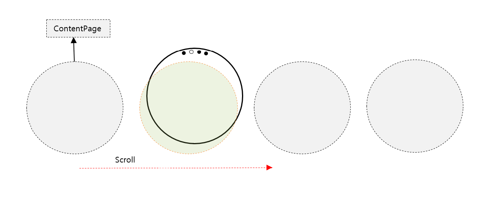
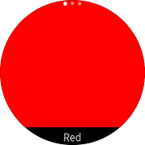

# IndexPage

The `IndexPage` allows you to know in advance the number of pages you have when you configure the application on multiple pages. It also shows the number of pages you are viewing.
It is an extension of [Xamarin.Forms.MultiPage](https://developer.xamarin.com/api/type/Xamarin.Forms.MultiPage%3CT%3E/). When the [Page](https://docs.microsoft.com/en-us/xamarin/xamarin-forms/user-interface/controls/pages) is added and removed in the [Xamarin.Forms.MultiPage](https://developer.xamarin.com/api/type/Xamarin.Forms.MultiPage%3CT%3E/), the number of dot marks increases or decreases automatically at the top of window.
It is similar to the [CarouselPage](https://docs.microsoft.com/en-us/xamarin/xamarin-forms/user-interface/controls/pages#carouselpage) in the Xamarin.Forms, with the addition of `Index`.
When the [Page](https://docs.microsoft.com/en-us/xamarin/xamarin-forms/user-interface/controls/pages) is scrolled, the `Index` operates internally.



## Add IndexPage

You can add as many pages you want, and this will increase the number of dot mark by index accordingly.
In the illustrated example, three pages are added. The number of dot mark is three. Since, it is on the first page, only the first dot mark is shown as white, and the remaining dot marks are shown as grey.



For more information, see the following links:

- [IndexPage  API reference](https://samsung.github.io/Tizen.CircularUI/api/Tizen.Wearable.CircularUI.Forms.IndexPage.html)
- [Xamarin.Forms.MultiPage  API reference](https://developer.xamarin.com/api/type/Xamarin.Forms.MultiPage%3CT%3E/)

_The code example of this guide uses TCIndexPage code of WearableUIGallery. The code is available in test\WearableUIGallery\WearableUIGallery\TC\TCIndexPage.xaml_

**XAML file**

```xml

<?xml version="1.0" encoding="utf-8" ?>
<w:IndexPage
    x:Class="WearableUIGallery.TC.TCIndexPage"
    xmlns="http://xamarin.com/schemas/2014/forms"
    xmlns:x="http://schemas.microsoft.com/winfx/2009/xaml"
    xmlns:local="clr-namespace:WearableUIGallery"
    xmlns:w="clr-namespace:Tizen.Wearable.CircularUI.Forms;assembly=Tizen.Wearable.CircularUI.Forms">
    <ContentPage>
        <StackLayout>
            <BoxView VerticalOptions="FillAndExpand" Color="Red" />
            <Label HorizontalOptions="CenterAndExpand" Text="Red" />
        </StackLayout>
    </ContentPage>
    <ContentPage>
        <StackLayout>
            <BoxView VerticalOptions="FillAndExpand" Color="Green" />
            <Label HorizontalOptions="CenterAndExpand" Text="Green" />
        </StackLayout>
    </ContentPage>
    <ContentPage>
        <StackLayout>
            <BoxView VerticalOptions="FillAndExpand" Color="Blue" />
            <Label HorizontalOptions="CenterAndExpand" Text="Blue" />
        </StackLayout>
    </ContentPage>
</w:IndexPage>
```