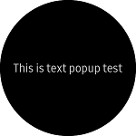
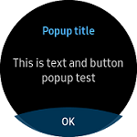
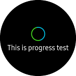

# InformationPopup
`InformationPopup` can represent three types of Tizen Wearable EFL popup style shown in the following figures. This popup is used to display any information or warning.

*Since `InformationPopup` does not adhere as a control, this popup cannot be set in the XAML file.*

| |  |  |
|:---------:|:-----------:|:------:|
|Single text|Bottom button|Progress|

## Create single text InformationPopup
Single text `InformationPopup` is used for displaying text. It is similar to the `Toast` popup, but this popup does not disappear automatically.

 `Text` property can be set with text. When you press the back button of the device, `BackButtonPressed` event occurs. To dismiss the popup that occurs during this event, add `Dismiss()` in the `BackButtonPressed` event handle code.

For more information, see [InformationPopup  API reference](https://samsung.github.io/Tizen.CircularUI/api/Tizen.Wearable.CircularUI.Forms.InformationPopup.html).

_The code example of this guide uses TCInformationPopup code of WearableUIGallery. The code is available in test\WearableUIGallery\WearableUIGallery\TC\TCInformationPopup.xaml.cs_

**C# file**
```cs
            _textPopUp = new InformationPopup();
            _textPopUp.Text = "This is text popup test";

            _textPopUp.BackButtonPressed += (s, e) =>
            {
                _textPopUp.Dismiss();
                label1.Text = "text popup is dismissed";
            };
```

## Create bottom button InformationPopup
You can set `BottomButton` property with `MenuItem`. The bottom button is used for confirmation dialog purpose, that asks user to approve requested operation.
InformationPopup has `Title` property for displaying title.
When you click the bottom button, `BottomButton.Clicked` event occurs.

**C# file**
```cs
            var bottomButton = new MenuItem()
            {
                Text = "OK",
                Command = new Command(() =>
                {
                     /* must insert code when user press left button */
                })
            };

            _textButtonPopUp = new InformationPopup();
            _textButtonPopUp.Title = "Popup title";
            _textButtonPopUp.Text = "This is text and button popup test";
            _textButtonPopUp.BottomButton = bottomButton;

            _textButtonPopUp.BottomButton.Clicked += (s, e) =>
            {
                _textButtonPopUp.Dismiss();
                label1.Text = "text&button is dismissed";
            };
```

## Create progress InformationPopup
`InformationPopup`  has `IsProgressRunning` property. If this property sets `true`, small circle progress bar is displayed in the center of the screen.

**C# file**
```cs
            _progressPopUp = new InformationPopup();
            _progressPopUp.Title = "Popup title";
            _progressPopUp.Text = "This is progress test";
            _progressPopUp.IsProgressRunning = true;
```
