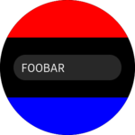
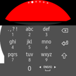
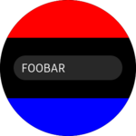
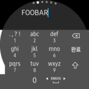

# PopupEntry

[PopupEntry](xref:Tizen.Wearable.CircularUI.Forms.PopupEntry) is a control that allows you to enter text with the IME when you click on [Entry](https://developer.xamarin.com/api/type/Xamarin.Forms.Entry/).

# Overview

`PopupEntry` control has exactly the same usage as the `Entry`.
However, in the case of a regular `Entry` in a circular screen, the input text gets hidden behind the IME at the time of input.
The `PopupEntry` allows the input to be on a pop up, hence the written text is visible.

The following images shows a screen with a normal `Entry` and a screen with the text on the IME when you click on `Entry`.




The `Entry` is not visible because it is masked by the IME.




The above image is the same as using `PopupEntry`, It can type text while watching it properly.

When PopupEntry is used:
- The `BackgroundColor` of the input pop up is the same as the `BackgroundColor` of the `PopupEntry`.
- The `TextColor` inside the input pop up is also the same as the `TextColor` of the `PopupEntry`.
- The [IsPassword](https://developer.xamarin.com/api/property/Xamarin.Forms.Entry.IsPassword/) property of the input pop up is also the same as the `PopupEntry`.

# How to use

`PopupEntry` uses the same method as the `Entry`.

```xml
<?xml version="1.0" encoding="utf-8" ?>
<ContentPage xmlns="http://xamarin.com/schemas/2014/forms"
             xmlns:x="http://schemas.microsoft.com/winfx/2009/xaml"
             xmlns:w="clr-namespace:Tizen.Wearable.CircularUI.Forms;assembly=Tizen.Wearable.CircularUI.Forms"
             x:Class="WearableUIGallery.TC.TCPopupEntry">
    <ContentPage.Content>
        <w:CircleStackLayout>
            <w:PopupEntry BackgroundColor="Gray" TextColor="Blue" VerticalOptions="CenterAndExpand" HorizontalOptions="CenterAndExpand" />
            <w:PopupEntry Placeholder="Foobar" VerticalOptions="CenterAndExpand" HorizontalOptions="CenterAndExpand" />
            <w:PopupEntry IsPassword="True" VerticalOptions="CenterAndExpand" HorizontalOptions="CenterAndExpand" />
        </w:CircleStackLayout>
    </ContentPage.Content>
</ContentPage>
```