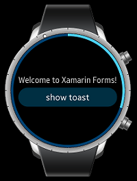

# Quickstart

This guide explains how to create an application that represents `Toast` and `CircleSlider`. If you press the button, `Toast` pops up and it automatically disappears after timeout (in seconds).
If you rotate the bezel of Tizen wearable device, `CircleSlider` bar is moves forward or backward direction.

## 1. Set up development environment and create project
- Create a Tizen Xamarin Forms application. For more information, see [Tizen.org guide](https://developer.tizen.org/development/training/.net-application/creating-your-first-tizen-.net-application).

  In this guide, project name is `SampleCircleApp`

- Select only wearable device at Tizen project wizard.

    

- Add myget (https://tizen.myget.org/F/dotnet/api/v3/index.json) package source at Tools > Options > Nuget Package Manager > Pakage Sources.
   
    

- Search Xamarin.Forms NuGet package and install latest version
(supports version 3.1.0.469394-pre1 and higher) via NuGet package manager. Package source is [Nuget.org](https://api.nuget.org/v3/index.json).

    

- Search Tizen.Wearable.CircularUI NuGet package and install latest version via NuGet package manager. Package source is [myget](https://tizen.myget.org/F/dotnet/api/v3/index.json).

    

- Install Tizen.Wearable.CircularUI NuGet at portable class library (PCL) project.

    

## 2. Insert CircularUI control code
- Remove SampleCircleApp.cs that is generated automatically at PCL. Then add App.xaml and App.xaml.cs using add item.

- In App.xaml file, remove all of the template code and replace it with the following code. This code defines the user interface for the page:

  - `xmlns:w=clr-namespace:Tizen.Wearable.CircularUI.Forms` : `w` prefix means `Tizen.Wearable.CircularUI.Forms` namespace.
  - `<w:CirclePage>` : `CirclePage` derive from `Xamarin.Forms.Page`. This Page content area has `Label` and `Button`.
  - `<w:CirclePage.CircleSurfaceItems>` : `CircleSliderSurfaceItem` attached for `CircleSurfaceItem` of  `CirclePage`.
  - `RotaryFocusTargetName` is set `slider` name. `CircleSliderSurfaceItem` has rotary focus. `CircleSliderSurfaceItem` can receive a Rotary Event from the wearable device's bezel interaction.

   For more information, see [CirclePage guide](CirclePage.md)

**App.xaml file**
```xml
<?xml version="1.0" encoding="utf-8" ?>
<Application
    x:Class="SampleCircleApp.App"
    xmlns="http://xamarin.com/schemas/2014/forms"
    xmlns:x="http://schemas.microsoft.com/winfx/2009/xaml"
    xmlns:local="clr-namespace:SimpleCircleApp"
    xmlns:w="clr-namespace:Tizen.Wearable.CircularUI.Forms;assembly=Tizen.Wearable.CircularUI.Forms">
    <Application.MainPage>
        <NavigationPage x:Name="MainNavigation">
            <x:Arguments>
                <w:CirclePage
                    x:Name="page"
                    NavigationPage.HasNavigationBar="False"
                    RotaryFocusTargetName="slider">
                    <w:CirclePage.Content>
                        <StackLayout
                            HorizontalOptions="Center"
                            Orientation="Vertical"
                            VerticalOptions="Center">
                            <Label HorizontalTextAlignment="Center" Text="Welcome to Xamarin Forms!" />
                            <Button Clicked="OnButtonClicked" Text="show toast" />
                        </StackLayout>
                    </w:CirclePage.Content>
                    <w:CirclePage.CircleSurfaceItems>
                        <w:CircleSliderSurfaceItem
                            x:Name="slider"
                            Increment="0.5"
                            IsVisible="True"
                            Maximum="15"
                            Minimum="0"
                            Value="3" />
                    </w:CirclePage.CircleSurfaceItems>
                </w:CirclePage>
            </x:Arguments>
        </NavigationPage>
    </Application.MainPage>
</Application>
```

<br><br>
- In App.xaml.cs, remove all of the template code and replace it with the following code:
    - `OnButtonClicked` is an event handler of `Button` `Clicked` event. The following code simply displays Toast popup during three seconds:
    
**App.xaml.cs file**
```cs
using Tizen.Wearable.CircularUI.Forms;
using System;

using Xamarin.Forms;
using Xamarin.Forms.Xaml;

namespace SampleCircleApp
{
    [XamlCompilation(XamlCompilationOptions.Compile)]
    public partial class App : Application
    {
        public App()
        {
            InitializeComponent();
        }

        public void OnButtonClicked(object sender, EventArgs e)
        {
            Toast.DisplayText("Toast popup", 3000);
        }
    }
}
```

<br><br>
- For initializing CircularUI instance, insert `FormsCircularUI.Init()` code in the Main method in `SampleCircleApp.Tizen.Wearable.cs`.
You must import `Tizen.Wearable.CircularUI.Forms.Renderer` with `using` directives.

**SampleCircleApp.Tizen.Wearable.cs file**
```cs
using Tizen.Wearable.CircularUI.Forms.Renderer;


        static void Main(string[] args)
        {
            var app = new Program();
            global::Xamarin.Forms.Platform.Tizen.Forms.Init(app);
            FormsCircularUI.Init();  //must insert this initialize code
            app.Run(args);
        }
```

<br><br>
## 3. Build and launch your application.
- Build the solution.  
    - In the Visual Studio menu, select Build > Build Solution.
    - In the Solution Explorer view, right-click the solution name and select Build.

- Launch Tizen Emulator
    - Click `Launch Tizen Emulator` button, as displayed in the following image:

    
    


- For Windows OS, copy the application tpk file from the project binary path to sdb tool path.
    - `SampleCircleApp` tpk: The file is located in `ProjectPath\SampleCircleApp.Tizen.Wearable\bin\Debug\tizen40\org.tizen.example.SampleCircleApp.Tizen.Wearable-1.0.0.tpk`.
    - Project path: To locate the project path, in the Solution Explorer view, right-click the solution name and click `open folder in file explorer`.
    - sdb tool: This is located in `c:\tizen\tools\sdb.exe`

- For Windows OS, launch Tizen Sdb Command Prompt (Tool > Tizen > Tizen Sdb Command Prompt).
  For Linux, you can use sdb command directly in your project path.

- Install your app with sdb command

```
sdb install org.tizen.example.SampleCircleApp.Tizen.Wearable-1.0.0.tpk
```

- Launch wearable emulator to verify the application<br>
  <br>

  <br>
