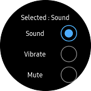

# Radio
`Radio` displays one or more options. You can select only one of the options having same GroupName property.
`Radio` can select only one item among items having same `GroupName` property.



## Create Radio

The `GroupName` property specifies mutually exclusive Radio controls. If you select one Radio control of radio control group, other items are not selected.
`IsSelected` property sets default selected value of Radio control. `Selected` event occurs when the Radio selection is changed.
`Value` property sets any value of Radio control. `Value` property is useful to distinguish which item is selected if all Radio control has the same `Selected` event handler.
The following code explains the process of creating `Radio`.

For more information, see [Radio  API reference](https://samsung.github.io/Tizen.CircularUI/api/Tizen.Wearable.CircularUI.Forms.Radio.html).

_The code example of this guide uses TCRadio code of WearableUIGallery. The code is available in test\WearableUIGallery\WearableUIGallery\TC\TCRadio.xaml.cs_

**XAML file**

```xml
   <w:CirclePage.Content>
        <w:CircleScrollView x:Name="myscroller" Orientation="Vertical">
            <StackLayout Padding="50,50" Orientation="Vertical">
                <Label
                    x:Name="label"
                    FontSize="Medium"
                    HorizontalOptions="CenterAndExpand"
                    Text="Selected : Sound" />
                <StackLayout Orientation="Horizontal">
                    <Label
                        HorizontalOptions="CenterAndExpand"
                        Text="Sound"
                        VerticalOptions="Center" />
                    <w:Radio
                        GroupName="SoundMode"
                        HorizontalOptions="End"
                        IsSelected="True"
                        Selected="OnSelected"
                        Value="Sound" />
                </StackLayout>

                <StackLayout Orientation="Horizontal">
                    <Label
                        HorizontalOptions="CenterAndExpand"
                        Text="Vibrate"
                        VerticalOptions="Center" />
                    <w:Radio
                        GroupName="SoundMode"
                        HorizontalOptions="End"
                        Selected="OnSelected"
                        Value="Vibrate" />
                </StackLayout>

                <StackLayout Orientation="Horizontal">
                    <Label
                        HorizontalOptions="CenterAndExpand"
                        Text="Mute"
                        VerticalOptions="Center" />
                    <w:Radio
                        GroupName="SoundMode"
                        HorizontalOptions="End"
                        Selected="OnSelected"
                        Value="Mute" />
                </StackLayout>
            </StackLayout>
        </w:CircleScrollView>
    </w:CirclePage.Content>
```

**C# file**
```cs
        public void OnSelected(object sender, SelectedEventArgs args)
        {
            Console.WriteLine($"OnSoundSelected!! value:{args.Value}");
            Radio radio = sender as Radio;
            if (radio != null)
            {
                if (args.Value) label.Text = "Selected : " + radio.Value;
            }
        }
```