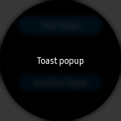
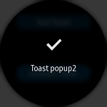

# Toast
`Toast` provides simple information. `Toast` automatically disappears after timeout (in seconds).
Tizen Wearable `Toast` fills the entire screen with display message and image.

|||
|:---------:|:-----------:|
|Single text|Icon and text|

## Create Toast
`Toast` is a static method. Therefore, you do not need any container or parent control for using this control. `Toast` provides two methods, `Toast.DisplayText()` displays simple text message and `Toast.DisplayIconText()` displays simple icon and simple text message.

The first parameter of `Toast.DisplayText()` method is message text. The second parameter is timeout duration (milliseconds). The second parameter is optional. If you do not set this value, the default value is set to 3000 milliseconds (three seconds).

The first parameter of `Toast.DisplayIconText()` method is message text. The second parameter is icon file path. You can set file path with `new FileImageSource`. The third parameter is timeout duration, which is optional.

For more information, see [Toast  API reference](https://samsung.github.io/Tizen.CircularUI/api/Tizen.Wearable.CircularUI.Forms.Toast.html).

**C# file**
```cs
 Toast.DisplayText("Toast popup", 3000);

 Toast.DisplayIconText("Toast popup2", new FileImageSource { File = "image/tw_ic_popup_btn_check.png" }, 2000);
```
