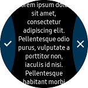
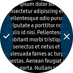

# TwoButtonPage
`TwoButtonPage` is derived from [Xamarin.Forms.Page](https://developer.xamarin.com/api/type/Xamarin.Forms.Page/). TwoButtonPage has two semicircular buttons that are located at the left side and the right side of the circle.

||
|:------------:|:--------:|
|Non-overlapped|Overlapped|

## Create TwoButtonPage
You can set controls in the `TwoButtonPage.Content` tag. In the XAML file example, a long text Label and two buttons are set as the content.
If the `Overlap` property is set to `true`, the `Content` area occupies the entire screen. If the `Overlap` property is set to `false`, the `Content` area occupies the available area on the screen excluding the button area. The default value of `Overlap` property is always `false`.
`TwoButtonPage.firstButton` sets left side button. `TwoButtonPage.SecondButton` sets right side button. You can add buttons using `MenuItem`.

For more information, see the following links:
- [TwoButtonPage  API reference](https://samsung.github.io/Tizen.CircularUI/api/Tizen.Wearable.CircularUI.Forms.TwoButtonPage.html)
- [Xamarin.Forms.Page guide](https://docs.microsoft.com/en-us/xamarin/xamarin-forms/user-interface/controls/pages)
- [Xamarin.Forms.MenuItem API reference](https://developer.xamarin.com/api/type/Xamarin.Forms.MenuItem/)

_The code example of this guide uses TCTwoButtonPage code of WearableUIGallery. The code is available in test\WearableUIGallery\WearableUIGallery\TC\TCTwoButtonPage.xaml_

**XAML file**
```xml
<?xml version="1.0" encoding="utf-8" ?>
<w:TwoButtonPage
    x:Class="WearableUIGallery.TC.TCTwoButtonPage"
    xmlns="http://xamarin.com/schemas/2014/forms"
    xmlns:x="http://schemas.microsoft.com/winfx/2009/xaml"
    xmlns:local="clr-namespace:WearableUIGallery.TC"
    xmlns:w="clr-namespace:Tizen.Wearable.CircularUI.Forms;assembly=Tizen.Wearable.CircularUI.Forms">
    <w:TwoButtonPage.BindingContext>
        <local:TCTwoButtonPageViewModel />
    </w:TwoButtonPage.BindingContext>
    <w:TwoButtonPage.Content>
        <ScrollView>
            <StackLayout HorizontalOptions="FillAndExpand" VerticalOptions="FillAndExpand">
                <Label
                    HorizontalOptions="FillAndExpand"
                    HorizontalTextAlignment="Center"
                    Text="{Binding Text}"
                    VerticalOptions="FillAndExpand" />
                <Button Clicked="OnRemove1" Text="Remove 1" />
                <Button Clicked="OnRemove2" Text="Remove 2" />
            </StackLayout>
        </ScrollView>
    </w:TwoButtonPage.Content>
    <w:TwoButtonPage.FirstButton>
        <MenuItem Command="{Binding Command1}" Icon="image/tw_ic_popup_btn_check.png" />
    </w:TwoButtonPage.FirstButton>
    <w:TwoButtonPage.SecondButton>
        <MenuItem Command="{Binding Command2}" Icon="image/tw_ic_popup_btn_delete.png" />
    </w:TwoButtonPage.SecondButton>
</w:TwoButtonPage>
```

