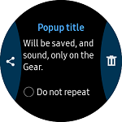
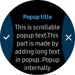

# TwoButtonPopup
The `TwoButtonPopup` represents The Tizen Wearable EFL two button popup style. The `TwoButtonPopup` is used to select one of the two options such as cancel or done, and share or delete.

*Since `TwoButtonPopup` does not adhere as a control, this popup cannot be set in the XAML file.*



## Create TwoButtonPopup
The `TwoButtonPopup.Title` property sets the title of the popup. You can set the `Content` property with layouts such as `StackLayout` or `ScrollView`.
The `TwoButtonPopup.FirstButton` property sets the left side button. The `TwoButtonPopup.SecondButton` property sets the right side button. You can set` FirstButton` and `SecondButton` using the `MenuItem`. You must add code at `Command` or `Clicked` event handler for controlling `MenuItem` clicked.

For more information, see [TwoButtonPopup  API reference](https://samsung.github.io/Tizen.CircularUI/api/Tizen.Wearable.CircularUI.Forms.TwoButtonPopup.html).

_The code example of this guide uses TCTwoButtonPopup code of WearableUIGallery. The code is available in test\WearableUIGallery\WearableUIGallery\TC\TCTwoButtonPopup.xaml.cs_

**C# file**
```cs
            var leftButton = new MenuItem()
            {
                Icon = new FileImageSource
                {
                    File = "image/b_option_list_icon_share.png",
                },
                Command = new Command(() =>
                {
                    /* must insert code when user press left button */
                })
            };

            ...

            _popUp1 = new TwoButtonPopup();
            _popUp1.FirstButton = leftButton;
            _popUp1.SecondButton = rightButton;
            _popUp1.Title = "Popup title";
            _popUp1.Content = new StackLayout()
            {
                HorizontalOptions = LayoutOptions.FillAndExpand,
                Children =
                {
                    new Label
                    {
                        Text = "Will be saved, and sound, only on the Gear.",
                    },
                    new StackLayout
                    {
                        Orientation = StackOrientation.Horizontal,
                        Padding = new Thickness(0, 30, 0, 30),
                        Children =
                        {
                            checkbox,
                            new Label
                            {
                                Text = "Do not repeat",
                            }
                        }
                    }
                }
            };
    }
```

## How to Set Long Text in TwoButtonPopup
The `TwoButtonPopup` has `Text` property. This property is useful to set long text.
If a long text is set using the `Text` property, you do not need to add `StackLayout`, `ScrollView`, `Label` to display long text.

*The area of the `Text` property overlaps the area of the `Content` property. Therefore, do not use two properties at the same time.*



**C# file**
```cs
            _popUp2 = new TwoButtonPopup();
            _popUp2.FirstButton = leftButton2;
            _popUp2.SecondButton = rightButton2;
            _popUp2.Title = "Popup title";
            _popUp2.Text = @"This is scrollable popup text.
This part is made by adding long text in popup. Popup internally added
scroller to this layout when size of text is greater than total popup
height. This has two button in action area and title text in title area";
```