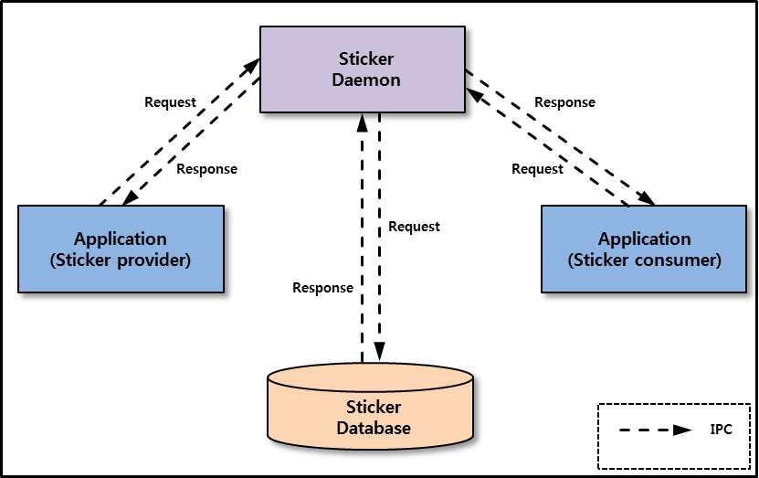

# Sticker


The Sticker feature provides users with fun experiences to share sticker information. The Sticker applications are composed of a [Sticker provider application](#provider_application) and [Sticker consumer applications](#consumer_application). The Sticker provider creates stickers and you can create your own Sticker consumer applications that use the stickers created by the Sticker provider. The Sticker provider application can store sticker details such as URI, keyword, and group name in the Sticker database. The Sticker consumer applications can retrieve sticker information using the Sticker API.

The main features of the Tizen.Uix.Sticker namespace include the following:

- Preparing the Sticker service for use

  You can connect the Sticker daemon to operate the Sticker service.

- Sticker data

  You can use the `Tizen.Uix.Sticker.StickerData` class to [store the sticker information](#set_sticker_data) and to [get the sticker information](#get_sticker_data) stored in it.

- [Inserting the sticker information](#insert_sticker)

  - You can store the sticker information using the `Tizen.Uix.Sticker.StickerProvider` class at application runtime, and [use the JSON file](#set_json) to store the sticker information at a time.
  - You can store sticker information automatically when the Sticker provider application is installed without using the `Tizen.Uix.Sticker` methods.

- Retrieving the sticker information

  You can [retrieve the sticker information](#retrieve_sticker), which includes URI, keyword, group name, and so on.

**Figure: Sticker Mechanism**



## Prerequisites

To enable your Sticker provider application to use the Sticker functionality, follow these steps:

1. To use the `Tizen.Uix.Sticker.StickerProvider` class, the following category must be added to the `tizen-manifest.xml` file:

    ```
    <category name="http://tizen.org/category/sticker"/>
    ```

2. To use the methods and properties of the Tizen.Uix.Sticker namespace, include it in your application:

    ```csharp
    using Tizen.Uix.Sticker;
    ```

3. Initialize the Sticker provider with the `Initialize()` method of the `Tizen.Uix.Sticker.StickerProvider` class:

    ```csharp
    void Initialize()
    {
        StickerProvider.Initialize();
    }
    ```

4. When the Sticker provider is no longer needed, deinitialize it:

    ```csharp
    void Deinitialize()
    {
        StickerProvider.Deinitialize();
    }
    ```

To enable your Sticker consumer application to use the Sticker functionality, follow these steps:

1. To use the `Tizen.Uix.Sticker.StickerConsumer` class, the application has to request permission by adding the following privilege to the `tizen-manifest.xml` file:

    ```
    <privileges>
       <privilege>http://tizen.org/privilege/mediastorage</privilege>
    </privileges>
    ```

2.  To use the methods and properties of the Tizen.Uix.Sticker namespace, include it in your application:

    ```csharp
    using Tizen.Uix.Sticker;
    ```

3. Initialize the Sticker consumer with the `Initialize()` method of the `Tizen.Uix.Sticker.StickerConsumer` class:

    ```csharp
    void Initialize()
    {
        StickerConsumer.Initialize();
    }
    ```

4. When the Sticker consumer is no longer needed, deinitialize it:

    ```csharp
    void Deinitialize()
    {
        StickerConsumer.Deinitialize();
    }
    ```


<a name="provider_application"></a>
## Create Sticker provider application

You can provide the sticker information to applications that use stickers. If you store the stickers in the Sticker database, the Sticker consumer applications can search for them.

<a name="set_sticker_data"></a>
### Set sticker information to StickerData class

To store the sticker information in the Sticker database without using the JSON file, the sticker information must be set into the `Tizen.Uix.Sticker.StickerData` class:

```csharp
StickerData SetStickerData()
{
    try
    {
        /* Creates the StickerData class instance */
        StickerData stickerData = new StickerData();

        /* Sets the URI and URI type of the sticker */
        stickerData.SetUri(UriType.WebResource, "www.StickerProvider.com/emoji/smile");

        /* Adds a keyword of the sticker to the list */
        stickerData.AddKeyword("smile");
        stickerData.AddKeyword("cute");

        /* Sets the group name of the sticker */
        stickerData.GroupName = "Tizen";

        /* Sets the description of the sticker */
        stickerData.Description = "A yellow face with smiling eyes and full-toothed grin, as if saying Cheese! for the camera.";

        return stickerData;
    }
    catch (Exception e)
    {
        /* Error handling */
    }
}
```

<a name="set_json"></a>
### Set sticker information in JSON file

The following JSON file shows how to set the sticker information to be stored in the Sticker database:

```json
{
    "sticker":
    [
        {
            "type" : 1,  /* Sets the URI type of the sticker */
            "uri" : "/res/face/slightly_smiling_face.png",  /* Sets the URI of the sticker */
            "keyword" : ["face", "smile"],  /* Adds a keyword of the sticker to the list */
            "group" : "face",  /* Sets the group name of the sticker */
            "thumbnail" : "/res/thumbnail/face/slightly_smiling_face.png",  /* Sets the thumbnail local path of the sticker */
            "description" : "A yellow face with simple, open eyes and a thin, closed smile."  /* Sets the description of the sticker */
        },
        {
            "type" : 1,
            "uri" : "/res/face/heart_eyes.png",
            "keyword" : ["face", "love", "adoration"],
            "group" : "face",
            "thumbnail" : "/res/thumbnail/face/heart_eyes.png",
            "description" : "A yellow face with an open smile, sometimes showing teeth, and red, cartoon-styled hearts for eyes."
        },
        ...
        {
            ...
        }
    ]
}
```

<a name="insert_sticker"></a>
### Insert sticker information

You can use the following methods to store sticker information in the Sticker database:

- To store one sticker information, use `InsertData(StickerData data)`:

    ```csharp
    void InsertStickerData(StickerData stickerData)
    {
        try
        {
            StickerProvider.InsertData(stickerData);
        }
        catch (Exception e)
        {
            /* Error handling */
        }
    }
    ```

- To store multiple sticker information, use `InsertData(string jsonPath)`:

    ```csharp
    async Task InsertStickerData(string jsonPath)
    {
        try
        {
            await StickerProvider.InsertData(jsonPath);
        }
        catch (Exception e)
        {
            /* Error handling */
        }
    }
    ```

- To store sticker information without using `InsertData(StickerData data)` and `InsertData(string jsonPath)`, add the following metadata to the `tizen-manifest.xml` file:

  ```
  <category name="http://tizen.org/category/sticker"/>
  <!-- Sets the JSON local path -->
  <metadata key="http://tizen.org/metadata/sticker" value="/res/json/sticker.json"/>
  ```

  If you set the path of the JSON file to the value in metadata, sticker information of the JSON file is automatically stored when the Sticker provider application is installed.

  > [!NOTE]
  > The metadata must be added after category.

### Update sticker information

You can update the sticker information stored in the Sticker database using the following method:

```csharp
void UpdateStickerData(StickerData stickerData)
{
    try
    {
        StickerProvider.UpdateData(stickerData);
    }
    catch (Exception e)
    {
        /* Error handling */
    }
}
```


<a name="consumer_application"></a>
## Create Sticker consumer application

You can create the Sticker consumer application using `Tizen.Uix.Sticker.StickerConsumer` class to use sticker information. You can search for stickers and get details of stickers.

<a name="retrieve_sticker"></a>
### Retrieve sticker information

You can retrieve all the stickers stored in the Sticker database and use keyword, group name, and type of URI to retrieve stickers.

The following example shows how to retrieve stickers using the group name:

```csharp
void GetStickersByGroup(int offset, int count, string groupName)
{
    try
    {
        IEnumerable<StickerData> stickers = StickerConsumer.GetStickersByGroup(offset, count, groupName);
        foreach(StickerData sticker in stickers)
        {
            /* Your code */
        }
    }
    catch (Exception e)
    {
        /* Error handling */
    }
}
```

You can retrieve the keywords and the group name of the stickers.

The following example shows how to retrieve the keyword list:

```csharp
void GetKeywords()
{
    try
    {
        IEnumerable<string> keywords = StickerConsumer.GetAllKeywords();
        foreach(string keyword in keywords)
        {
            /* Your code */
        }
    }
    catch (Exception e)
    {
        /* Error handling */
    }
}
```

<a name="get_sticker_data"></a>
### Get sticker information

To obtain sticker information, use the methods and properties of the `Tizen.Uix.Sticker.StickerData` class.

The following example shows how to get the sticker information from the `Tizen.Uix.Sticker.StickerData` class instance:

```csharp
void GetStickerData(StickerData stickerData)
{
    string appId;
    string uri;
    UriType uriType;
    IEnumerable<string> keywords;
    string groupName;
    string thumbnail;
    string description;
    DateTime updatedTime;
    DisplayType displayType;

    try
    {
        /* Gets the name of the sticker provider application */
        appId = stickerData.AppId;

        /* Gets the URI and URI type of the sticker */
        uri = stickerData.Uri;
        uriType = stickerData.UriType;

        /* Gets all the keywords of the sticker */
        keywords = stickerData.GetAllKeywords();

        /* Gets the group name of the sticker */
        groupName = stickerData.GroupName;

        /* Gets the thumbnail local path of the sticker */
        thumbnail = stickerData.Thumbnail;

        /* Gets the description of the sticker */
        description = stickerData.Description;

        /* Gets the last updated time of the sticker */
        updatedTime = stickerData.LastUpdated;

        /* Gets the display type of the sticker */
        displayType = stickerData.DisplayType;

        /* Your code */

    }
    catch (Exception e)
    {
        /* Error handling */
    }
}
```

## Related information
- Dependencies
  - Tizen 7.0 and Higher
- API References
  - [Tizen.Uix.Sticker](/application/dotnet/api/TizenFX/latest/api/Tizen.Uix.Sticker.html) class