# Advanced Animation Methods

## Path Animation

The `Path` class is a three-dimensional parametric curve that is used to animate the position and orientation of actors.

The `Path` consists of several points and each adjacent pair of points becomes a segment of the path. Each segment can be curved by adding control points to it.

In the following example, the P1, P2 and P3 form the path where the blue circle travels. The C1 and C2 are the control points for a first segment `[P1-P2]`, where C3 and C4 are for a second segment `[P2-P3]`. The control points express the curvature of the path.

<div style="text-align:center;width:100%;"></div>

To generate the `Path` object, use the following code:

```csharp
Path path = new Path();

// Path Points
path.AddPoint(new Position(0, 100));   // P1
path.AddPoint(new Position(100, 100)); // P2
path.AddPoint(new Position(200, 100)); // P3

// Control Points for a first segment
path.AddControlPoint(new Position(40, 20)); // C1
path.AddControlPoint(new Position(60, 20)); // C2

// Control Points for a second segment
path.AddControlPoint(new Position(140, 180)); // C3
path.AddControlPoint(new Position(160, 180)); // C4
```

To animate `View` along this path, use the following function:

```csharp
Animation animation = new Animation(3000/*duration*/);

animation.AnimatePath(view, path, Vector3.Zero);

animation.Play();
```

The third parameter is the forward vector in a local space coordinate system and is oriented with the tangent direction of the path.

## Related Information
- Dependencies
  -   Tizen 4.0 and Higher
