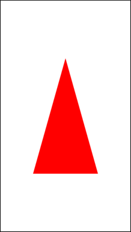

# GLView

GLView is a common component that is used to render the view with OpenGL&reg; ES.

**Figure: GLView rendering a triangle with OpenGL&reg; ES**




## Add namespace
To use GLView, include `Tizen.NUI.Components`  and `OpenTK.Graphics` namespace in your application. You should refer to the `OpenTK` usage:

```csharp
using Tizen.NUI;
using Tizen.NUI.Components;
using OpenTK.Graphics.ES30;
```
This guide uses OpenTK.Tizen.

## Create a GLView

To create a GLView, follow these steps:

1.  Put ColorFormat in the GLView constructor:

    ```csharp
    glView = new GLView(GLView.ColorFormat.RGBA8888);
    ```

2. Set the rendering mode. There are Continuous and OnDemand modes. When you set OnDemand, you have to call RenderOnce() method to invoke the GLRenderFrame callback in the render thread:

    ```csharp
    glView.RenderingMode = Tizen.NUI.GLRenderingMode.Continuous;
    ```

3. Set graphics configuration. You have to set surface configuration and GLES version:
    
    ```csharp
    glView.SetGraphicsConfig(true, true, 0, Tizen.NUI.GLESVersion.Version30);
    ```

4. Register GLInit, GLRender, GLTerminate callbacks:
    
    ```csharp
    glView.RegisterGLCallbacks(this.InitializeGL, this.RenderFrameGL, this.Terminate.GL);
    ```

5. Set resize callback. You can get the resized size of the GLView on the render thread:
    
    ```csharp
    glView.SetResizeCallback(this.ResizeCallback);
    ```

## Callbacks

Callbacks are invoked on the GLView render thread:

```csharp
public delegate void GLInitializeDelegate();
public delegate int GLRenderFrameDelegate();
public delegate void GLTerminateDelegate();
public delegate void ViewResizeDelegate(int w, int h);
```

These snippets just clear the buffer to white.

### Initialize callback

Initialize callback by using the following code:

```csharp
public void InitializeGL()
{
    //Set the ClearColor to white
    GL.ClearColor(1.0f, 1.0f, 1.0f, 1.0f);
}
```

### Render callback

Render callback by using the following code:

```csharp
public int RenderFrameGL()
{
    //Set the viewport size
    GL.Viewport(0, 0, width, height);
    //Clear the buffer with the ClearColor.
    GL.Clear(ClearBufferMask.ColorBufferBit);

    //When returning not 0, the eglSwapBuffers is called.
    return 1;
}
```

### Terminate callback

Terminate callback with the following code:

```csharp
public void TerminateGL()
{
    // Destroy GL resources
}
```

### Resize callback

Resize callback with the following code:

```csharp
public void ResizeCallback(int w, int h)
{
    width = w;
    height = h;
}
```

## GLView properties
The following table defines the GLView class control properties:

Table: ImageView control properties

| Property             | Type        | Description                              |
|--------------------|-----------|----------------------------------------|
| `RenderingMode`        | `GLRenderingMode`    | The rendering mode of GLView        |


## Triangle example

The following code shows how a triangle is rendered using GLView with OpenGL&reg; ES:

```csharp
using System;
using Tizen.NUI;
using Tizen.NUI.BaseComponents;
using OpenTK.Graphics.ES30;
 
namespace GLViewSample
{
    class Program : NUIApplication
    {
        private int glProgram;
        private int width;
        private int height;
        private float[] vVertices;
        private GLView glView;
 
        protected override void OnCreate()
        {
            base.OnCreate();
            Initialize();
        }
 
        void Initialize()
        {
            glView = new GLView(GLView.ColorFormat.RGBA8888);
            glView.WidthResizePolicy = ResizePolicyType.FillToParent;
            glView.HeightResizePolicy = ResizePolicyType.FillToParent;
 
            glView.SetGraphicsConfig(true, true, 0, GLESVersion.Version30);
            glView.RenderingMode = GLRenderingMode.Continuous;
            glView.RegisterGLCallbacks(this.InitializeGL, this.RenderFrameGL, this.TerminateGL);
            glView.SetResizeCallback(this.ResizeCallback);
 
            Window.Instance.KeyEvent += OnKeyEvent;
            Window.Instance.BackgroundColor = Color.White;
            Window.Instance.GetDefaultLayer().Add(glView);
        }
 
        public void ResizeCallback(int w, int h)
        {
            width = w;
            height = h;
        }
 
        int LoadShader(ShaderType type, string shaderSrc)
        {
            int shader;
 
            // Create the shader object
            shader = GL.CreateShader(type);
 
            if (shader == 0)
            {
                return 0;
            }
 
            // Load the shader source
            GL.ShaderSource(shader, 1, new string[] { shaderSrc }, (int[])null);
 
            // Comoppile the shader
            GL.CompileShader(shader);
 
            // Check the compile status
            GL.GetShader(shader, ShaderParameter.CompileStatus, out int compiled);
 
            if (compiled == 0)
            {
                int length = 0;
 
                GL.GetShader(shader, ShaderParameter.InfoLogLength, out length);
 
                if (length > 0)
                {
                    GL.GetShaderInfoLog(shader, length, out length, out string log);
                }
 
                GL.DeleteShader(shader);
                throw new InvalidOperationException("Unable to compile shader of type : " + type.ToString());
            }
 
            return shader;
        }
 
        public void InitializeGL()
        {
            //Load the shaders and get a linked program object
            string vShaderStr =
                "#version 300 es                          \n" +
                "layout(location = 0) in vec4 vPosition;  \n" +
                "void main()                              \n" +
                "{                                        \n" +
                "   gl_Position = vPosition;              \n" +
                "}                                        \n";
 
            string fShaderStr =
                "#version 300 es                            \n" +
                "precision mediump float;                   \n" +
                "out vec4 fragColor;                        \n" +
                "void main()                                \n" +
                "{                                          \n" +
                "   fragColor = vec4 ( 1.0, 0.0, 0.0, 1.0 );\n" +
                "}                                          \n";
 
            int vertexShader;
            int fragmentShader;
            int programObject;
 
            // Load the vertex/fragment shaders
            vertexShader = LoadShader(ShaderType.VertexShader, vShaderStr);
            fragmentShader = LoadShader(ShaderType.FragmentShader, fShaderStr);
 
            // Create the program object
            programObject = GL.CreateProgram();
 
            if (programObject == 0)
            {
                return;
            }
 
            GL.AttachShader(programObject, vertexShader);
            GL.AttachShader(programObject, fragmentShader);
 
            //Link the program
            GL.LinkProgram(programObject);
 
            // Check the link status
            int linkStatus;
            GL.GetProgram(programObject, GetProgramParameterName.LinkStatus, out linkStatus);
 
            if (linkStatus == 0)
            {
                int infoLogLength;
                GL.GetProgram(programObject, GetProgramParameterName.InfoLogLength, out infoLogLength);
 
                if (infoLogLength > 0)
                {
                    String infoLog;
                    GL.GetProgramInfoLog(programObject, infoLogLength, out infoLogLength, out infoLog);
                    Tizen.Log.Debug("GLViewSsample", "Couldn't link program: " + infoLog.ToString());
                }
 
                GL.DeleteProgram(programObject);
                return;
            }
 
            // Store the program obejct
            glProgram = programObject;
 
            vVertices = new float[] { 0.0f, 0.5f, 0.0f, -0.5f, -0.5f, 0.0f, 0.5f, -0.5f, 0.0f };
            GL.VertexAttribPointer(0, 3, VertexAttribPointerType.Float, false, 0, vVertices);
            GL.EnableVertexAttribArray(0);
        }
 
        public int RenderFrameGL()
        {
            Tizen.Log.Debug("GLViewSample", "RenderFrameGL");
 
            GL.ClearColor(1.0f, 1.0f, 1.0f, 1.0f);
 
            // Set the viewport
            GL.Viewport(0, 0, width, height);
 
            // Clear the color buffer
            GL.Clear(ClearBufferMask.ColorBufferBit);
 
            // Use the program object
            GL.UseProgram(glProgram);
 
            // Load the vertex data
            GL.DrawArrays(PrimitiveType.Triangles, 0, 3);
 
            return 1;
        }
 
        public void TerminateGL()
        {
            GL.DeleteProgram(glProgram);
        }
 
        public void OnKeyEvent(object sender, Window.KeyEventArgs e)
        {
            if (e.Key.KeyPressedName == "XF86Back" || e.Key.KeyPressedName == "Escape")
            {
                Exit();
            }
        }
 
        static void Main(string[] args)
        {
            var app = new Program();
            app.Run(args);
        }
    }
}
```

## Related information
- Dependencies
  -   Tizen 7.0 and Higher

- API References
  - [GLView API](/application/dotnet/api/TizenFX/latest/api/Tizen.NUI.BaseComponents.GLView.html)
