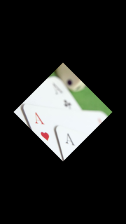

# ImageView

An `ImageView` is a NUI control that displays an image. It is implemented through the [ImageView](/application/dotnet/api/TizenFX/latest/api/Tizen.NUI.BaseComponents.ImageView.html) class. NUI supports different kinds of image formats, such as `.jpg`, `.png`, `.bmp`, `.svg` and `.gif`.

## Create an ImageView

To create an image view, follow these steps:

**Figure: ImageView**

 

1.  To use the `ImageView` class, add the following namespaces:

    ```xaml
    xmlns:base="clr-namespace:Tizen.NUI.BaseComponents;assembly=Tizen.NUI"
    xmlns:comp="clr-namespace:Tizen.NUI.Components;assembly=Tizen.NUI.Components"
    ```

2.  It is assumed that image is in the resources directory. Create an instance of the `ImageView` class and pass the path to image file like below:

    ```xaml
    <base:ImageView x:Name="img" ResourceUrl="*Resource*/images/your-image.jpg"/>
    ```

2.  To change the image path after the instance has been created, use the `SetImage()` method of the `ImageView` class:

    ```csharp
    imageView = new ImageView();
    imageView.SetImage(DirectoryInfo.Resource + "your-image.jpg");
    Window.Instance.Add(imageView);
    ```
## Manipulate an ImageView


**Figure: Manipulated ImageView**

 

1.  Create an object, set `Size2D` property, and display it at the center of the window by setting `ParentOrigin` and `Position2D` properties:

    ```xaml
    <base:ImageView x:Name="img" ResourceUrl="*Resource*/images/your-image.jpg"
        Size2D="400, 400" ParentOrigin="Center" Position2D="-200,-200"/>
    ```

2.  Use `PixelArea` property to apply the zoom effect:

    ```csharp
    <base:ImageView x:Name="img" ResourceUrl="*Resource*/images/your-image.jpg"
        PixelArea="0.25, 0.25, 0.5, 0.5" />
    ```

3.  To rotate the image by 45 degrees, set the `Orientation` property as follows:

    ```csharp
    img.Orientation = new Rotation(new Radian((float)System.Math.PI / 4), 
                                         new Vector3(0.0f, 0.0f, 1.0f));
    ```

## ImageView event

After all the required resources are loaded and ready, you can perform some actions:

1. Create handler:

    ```csharp
    public void onResourceReady(object sender, ImageView.ResourceReadyEventArgs e)
    {
        // Resource is ready, do something
    } 
    ```

2. Add handler to `ImageView` by using the `ResourceReady` property:

    ```xaml
    <base:ImageView x:Name="img" ResourceUrl="*Resource*/images/your-image.jpg"
        ResourceReady="onResourceReady"/>
    ```

## ImageView properties


The following table defines the `ImageView` class control properties:

**Table: ImageView control properties**

| Property             | Type        | Description                              |
|--------------------|-----------|----------------------------------------|
| `ResourceUrl`        | `string`    | The file path of the Image.        |
| `Image`              | `Map`       | Property map associated with a given image. |
| `PreMultipliedAlpha` | `bool`      | The image should be opacity-adjusted.<br>If `PreMultipliedAlpha` is `true`, the RGB  components represent the color of the object or pixel, adjusted for its opacity by multiplication.<br>If `false`, the opacity is ignored.  |
| `PixelArea`          | `Vector4`   | Image subarea defined with relative area  values: x coordinate for the top-left corner, y coordinate for the top-left corner, width, and height. To set the subarea as the whole image area, use `[0.0, 0.0, 1.0, 1.0]`.<br>For example, on a 200 x 200 pixel image, the  value `[0.25, 0.5, 0.5, 0.5]` represents a subarea of   that image with the  following coordinates:<br><br>-   Top left: 50, 100<br>-   Top right: 150, 100<br>-   Bottom left: 50, 200<br>-   Bottom right: 150, 200        |
| `Border`             | `Rectangle` | Image border, specified  in the following order:  left, right, bottom, and  top. For N-Patch images only.         |
| `BorderOnly`         | `bool`      | Whether to draw only the borders. For N-Patch  images only.  |
| `SynchronosLoading`  | `bool`      | Whether the image is synchronous. For N-Patch images only.     |


## Related information
- Dependencies
  -   Tizen 6.5 and Higher
