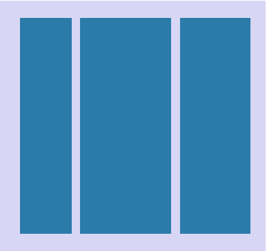
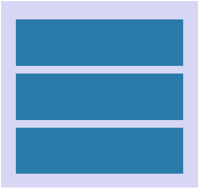
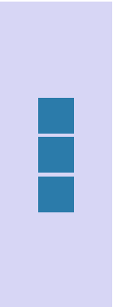
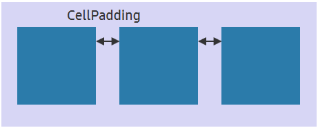
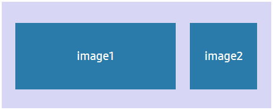

<style>
    .tabcontent img {
        border: 1px solid #555;
        max-width: 100% !important;
        max-height: 100%;
    }
</style>

# Linear Layout

`LinearLayout` is a linear box layout in which the children of a layout are arranged vertically or horizontally by using [`LinearOrientation`](#orientation) property.


`HorizontalAlignment` defines where you can start positioning children from beginning to end. It can be used when children do not use all the horizontal space of a parent.

`VerticalAlignment` defines where you can start positioning children from top to bottom. It can be used when children do not use all the vertical space of a parent.

While positioning children in a linear form that is one after the other, you can use [`CellPadding`](#cellPadding) to insert a space between each child. Unlike generic padding, `CellPadding` does not insert a space at the start, end, top, or bottom of the layout.

Here are the properties of `LinearLayout`:

| Property               | Type            | Description  |
| -----------------------| --------------- | ------------ |
| `LinearOrientation`    | LinearLayout.Orientation | Gets or sets the vertical or horizontal orientation of the linear layout. |
| `HorizontalAlignment`  | HorizontalAlignment      | Gets or sets the horizontal alignment of children in the linear layout. |
| `VerticalAlignment`    | VerticalAlignment        | Gets or sets the vertical alignment of children in the linear layout. |
| `CellPadding`          | Size2D      | Gets or sets the horizontal or vertical spacing between the cells. |


<a name="orientation"></a>
## Orientation

`LinearOrientation` indicates the direction of a child's layout such as horizontal or vertical. The default value is horizontal.

| Horizontal | Vertical |
| -----------------------| --------------- |
|  |   |

<div id="TabSection1">
    <div class="sampletab " id="ProjectCreateTab">
        <button id="LinearLayout-Orientation-CSharp" class="tablinks " onclick="openTabSection(event, 'LinearLayout-Orientation-CSharp', 'TabSection1') ">C#</button>
        <button id="LinearLayout-Orientation-Xaml" class="tablinks " onclick="openTabSection(event, 'LinearLayout-Orientation-Xaml', 'TabSection1') ">Xaml</button>
    </div>
    <div id="LinearLayout-Orientation-CSharp" class="tabcontent">
        <table>
            <tbody>
                <tr>
<span style="display:block">

```csharp
View layoutView = new View();
var linearLayout = new LinearLayout();
linearLayout.LinearOrientation = LinearLayout.Orientation.Horizontal;
layoutView.Layout = layout;
```

</span>
                </tr>
            </tbody>
        </table>
    </div>
    <div id="LinearLayout-Orientation-Xaml" class="tabcontent">
        <table>
            <tbody>
                <tr>
<span style="display:block">

```xaml
<View>
    <View.Layout>
        <LinearLayout LinearOrientation="Horizontal"/>
    </View.Layout>
</View>
```

</span>
                </tr>
            </tbody>
        </table>
    </div>
</div>

<a name="alignment"></a>
## Alignment

`HorizontalAlignment` handles how the layout items are positioned horizontally within their parent layout. By default, items are aligned at **Begin**.
You can choose from the following horizontal alignment options:

| HorizontalAlignment  | Description        |
| ---------- | ------------------ |
| Begin      | At the left or right edge of the container, according to Left to Right (LTR) or Right to Left (RTL) direction for horizontal orientation. |
| End        | At the right or left edge of the container, according to LTR or RTL direction for horizontal orientation. |
| Center     | At the horizontal center of the container. |

The following example shows how to set the layout horizontal alignment to `Center`:


<div id="TabSection2">
    <div class="sampletab " id="ProjectCreateTab">
        <button id="LinearLayout-HorizontalAlignment-CSharp" class="tablinks " onclick="openTabSection(event, 'LinearLayout-HorizontalAlignment-CSharp', 'TabSection2') ">C#</button>
        <button id="LinearLayout-HorizontalAlignment-Xaml" class="tablinks " onclick="openTabSection(event, 'LinearLayout-HorizontalAlignment-Xaml', 'TabSection2') ">Xaml</button>
    </div>
    <div id="LinearLayout-HorizontalAlignment-CSharp" class="tabcontent">
        <table>
            <tbody>
                <tr>
<span style="display:block">

```csharp
View layoutView = new View();
var linearLayout = new LinearLayout();
linearLayout.HorizontalAlignment = HorizontalAlignment.Center;
layoutView.Layout = layout;
```

</span>
                </tr>
            </tbody>
        </table>
    </div>
    <div id="LinearLayout-HorizontalAlignment-Xaml" class="tabcontent">
        <table>
            <tbody>
                <tr>
<span style="display:block">

```xaml
<View>
    <View.Layout>
        <LinearLayout HorizontalAlignment="Center"/>
    </View.Layout>
</View>
```

</span>
                </tr>
            </tbody>
        </table>
    </div>
</div>

`VerticalAlignment` handles how the layout items are positioned vertically within their parent layout. By default, items are aligned at **Top**.
You can choose from the following vertical alignment options:

| VerticalAlignment  | Description        |
| ---------- | ------------------ |
| Top        | At the top edge of the container. |
| Bottom     | At the bottom edge of the container. |
| Center     | At the vertical center of the container. |

The following example shows how to set the layout vertical alignment to `Center`:



<div id="TabSection3">
    <div class="sampletab " id="ProjectCreateTab">
        <button id="LinearLayout-VerticalAlignment-CSharp" class="tablinks " onclick="openTabSection(event, 'LinearLayout-VerticalAlignment-CSharp', 'TabSection3') ">C#</button>
        <button id="LinearLayout-VerticalAlignment-Xaml" class="tablinks " onclick="openTabSection(event, 'LinearLayout-VerticalAlignment-Xaml', 'TabSection3') ">Xaml</button>
    </div>
    <div id="LinearLayout-VerticalAlignment-CSharp" class="tabcontent">
        <table>
            <tbody>
                <tr>
<span style="display:block">

```csharp
View layoutView = new View();
var linearLayout = new LinearLayout();
linearLayout.VerticalAlignment = VerticalAlignment.Center;
layoutView.Layout = layout;
```

</span>
                </tr>
            </tbody>
        </table>
    </div>
    <div id="LinearLayout-VerticalAlignment-Xaml" class="tabcontent">
        <table>
            <tbody>
                <tr>
<span style="display:block">

```xaml
<View>
    <View.Layout>
        <LinearLayout VerticalAlignment="Center"/>
    </View.Layout>
</View>
```

</span>
                </tr>
            </tbody>
        </table>
    </div>
</div>

<a name="cellPadding"></a>
## CellPadding

`CellPadding` is to set the padding between cells in the layout. It is used to insert a space between each child.
The type of `CellPadding` is [Size2D](/application/dotnet/api/TizenFX/latest/api/Tizen.NUI.Size2D.html), which is two-dimensional. Height and width values are considered in `CellPadding`.
After setting `CellPadding` to parent view, the interval between children is located by the width of CellPadding in the case of horizontal layout or by the height of `CellPadding` in the case of vertical layout.

The type of `CellPadding` is not `Extents` which has start, end, top, and bottom, but `Size2D` which has float width and float height. In the following image, the arrow is the width (10) because the orientation of the container layout is horizontal.



<div id="TabSection4">
    <div class="sampletab " id="ProjectCreateTab">
        <button id="LinearLayout-CellPadding-CSharp" class="tablinks " onclick="openTabSection(event, 'LinearLayout-CellPadding-CSharp', 'TabSection4') ">C#</button>
        <button id="LinearLayout-CellPadding-Xaml" class="tablinks " onclick="openTabSection(event, 'LinearLayout-CellPadding-Xaml', 'TabSection4') ">Xaml</button>
    </div>
    <div id="LinearLayout-CellPadding-CSharp" class="tabcontent">
        <table>
            <tbody>
                <tr>
<span style="display:block">

```csharp
View layoutView = new View();
var linearLayout = new LinearLayout();
linearLayout.CellPadding = new Size2D(10, 20);
layoutView.Layout = layout;
```

</span>
                </tr>
            </tbody>
        </table>
    </div>
    <div id="LinearLayout-CellPadding-Xaml" class="tabcontent">
        <table>
            <tbody>
                <tr>
<span style="display:block">

```xaml
<View>
    <View.Layout>
        <LinearLayout CellPadding="10,20">
    </View.Layout>
</View>
```

</span>
                </tr>
            </tbody>
        </table>
    </div>
</div>

<a name="weight"></a>
## Weight

`Weight` is used to determine how much space is occupied by a view and how a view shares the available space in a layout with its siblings.

Depending on each weight, children take up their parent's view space. Therefore, child views can set the `Weight` value to float type. The default weight value is zero. If the weight is zero, then the size of the child would be its natural size or the specific size the user sets.

The following example shows how to set the layout weight for each child. The weight of `imageView1` is 0.75f and the weight of `imageView2` is 0.25f. According to the weight, children are arranged in the parent view space.



<div id="TabSection5">
    <div class="sampletab " id="ProjectCreateTab">
        <button id="LinearLayout-Weight-CSharp" class="tablinks " onclick="openTabSection(event, 'LinearLayout-Weight-CSharp', 'TabSection5') ">C#</button>
        <button id="LinearLayout-Weight-Xaml" class="tablinks " onclick="openTabSection(event, 'LinearLayout-Weight-Xaml', 'TabSection5') ">Xaml</button>
    </div>
    <div id="LinearLayout-Weight-CSharp" class="tabcontent">
        <table>
            <tbody>
                <tr>
<span style="display:block">

```csharp
View layoutView = new View();
var linearLayout = new LinearLayout();
layoutView.Layout = linearLayout;

ImageView imageView1 = new ImageView();
imageView1.Weight = 0.75f;

ImageView imageView2 = new ImageView();
imageView2.Weight = 0.25f;

layoutView.Add(imageView1);
layoutView.Add(imageView2);
```

</span>
                </tr>
            </tbody>
        </table>
    </div>
    <div id="LinearLayout-Weight-Xaml" class="tabcontent">
        <table>
            <tbody>
                <tr>
<span style="display:block">

```xaml
<View>
    <View.Layout>
        <LinearLayout />
    </View.Layout>

    <ImageView Weight="0.75"/>
    <ImageView Weight="0.25"/>
</View>
```

</span>
                </tr>
            </tbody>
        </table>
    </div>
</div>

## Related information

- Dependencies
  -  Tizen 5.5 and Higher

<script>
    function openTabSection(evt, profileName, sectionId) {
        var i, tabcontent, tablinks, section;
        let selected = 0;

        section = document.getElementById(sectionId);
        tabcontent = section.getElementsByClassName("tabcontent");

        for (i = 0; i < tabcontent.length; i++) {
            tabcontent[i].style.display = "none";
            if (tabcontent[i].id == profileName) {
                selected = i;
            }
        }

        tablinks = section.getElementsByClassName("tablinks");

        for (i = 0; i < tablinks.length; i++) {
            tablinks[i].className = tablinks[i].className.replace(" active", "");
        }

        tabcontent[selected].style.display = "block";
        evt.currentTarget.className += " active";
    }
    document.getElementById("LinearLayout-Orientation-CSharp").click();
    document.getElementById("LinearLayout-HorizontalAlignment-CSharp").click();
    document.getElementById("LinearLayout-VerticalAlignment-CSharp").click();
    document.getElementById("LinearLayout-CellPadding-CSharp").click();
    document.getElementById("LinearLayout-Weight-CSharp").click();

</script>
