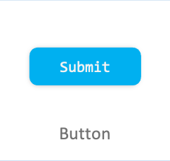

# Button

Button is a common component and describes what action occurs when you select it.  
A Button can either contain a text or an icon, and can be created using property.



## Add namespace

To implement Button, include `Tizen.NUI.Components` and namespace in your application:

```xaml
xmlns:comp="clr-namespace:Tizen.NUI.Components;assembly=Tizen.NUI.Components"
```

## Create with property

To create a Button using property, follow these steps:

1. Create Button using the default constructor with properties:

    ```xaml
    <comp:Button x:Name="btn"
        Text="BasicButton" WidthSpecification="300"
        HeightSpecification="80" IsSelectable="True"
        PointSize = "20"/>
    ```

    ```csharp
    btn.TextColorSelector = new ColorSelector
    {
        Normal = new Color(0, 0, 0, 1),
        Pressed = new Color(0, 0, 0, 0.7f),
        Selected = new Color(0.058f, 0.631f, 0.92f, 1),
        Disabled = new Color(0, 0, 0, 0.4f)
    };
    ```

2. The following output is generated when the Button is created using property:


## Respond to clicked event

When you click a Button, the Button instance receives a clicked event.
You can declare the clicked event handler as follows:

```csharp
btn.Clicked += OnClicked;
```

```csharp
private void OnClicked(object sender, ClickedEventArgs e)
{
    // Do something in response to button click
}
```

## Respond to state changed event

Button has eight different states as `Normal`, `Focused`, `Disabled`, `Selected`, `Pressed`, `DisabledFocused`, `SelectedFocused`, and `DisabledSelected`.  
When you change the Button state to focus or disable, the Button instance receives a state changed event:

```csharp
btn.ControlStateChangedEvent += OnStateChange;
```

```csharp
private void OnStateChange(object sender, Control.ControlStateChangedEventArgs e)
{
    // Do something in response to state change
}
```

## Related information

- Dependencies
  -   Tizen 6.5 and Higher 
