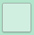
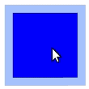
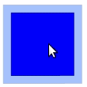
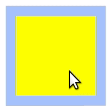

# CheckBox

Checkbox is a UI component connected with the click events. The base class for a `CheckBox` class is a [Tizen.NUI.Components.Button](/application/dotnet/api/TizenFX/latest/api/Tizen.NUI.Components.Button.html). The `Button` properties can be used to specify the checkbox. In opposite to a button, that can contain both an icon and a text, a checkbox can only contain an icon. The default checkbox created with NUI is as follows:

 

## Create with property

To create checkbox using property, follow these steps:

1. Create an instance of a `CheckBox` class using the default constructor:
   ```xaml
   <comp:CheckBox x:Name="_checkBox"/>
   ```

2. Set the checkbox properties:
   ```xaml
   <comp:CheckBox x:Name="_checkBox" 
	Text="False"
	WidthSpecification="200"
	HeightSpecification="200"
	IsSelected="False"
	/>
   ```
   ```csharp
   // Path to the directory with images
   string _URL = Tizen.Applications.Application.Current.DirectoryInfo.Resource + "images/";
   // Set the icon images for different checkbox states 
   StringSelector _iconURL = new StringSelector()
   {
      Normal           = _URL + "blue.png",
      Selected         = _URL + "blue_checked.png",
      Pressed          = _URL + "red.png",
      Disabled         = _URL + "green.png",
      DisabledSelected = _URL + "yellow.png"
   };
   _checkBox.IconURLSelector = _iconURL;
   _checkBox.Icon.Opacity = 1.0f;
   _checkBox.Icon.Size = new Size2D(160,160);
   _checkBox.BackgroundColor = new Color(0.57f, 0.7f, 1.0f, 0.8f);

   ```

   To set the absolute path of the images that are used, the `Tizen.Applications.Application.Current.DirectoryInfo.Resource` path is used. For more information, see [Class Application](/application/dotnet/api/TizenFX/latest/api/Tizen.Applications.Application.html) and [Class DirectoryInfo](/application/dotnet/api/TizenFX/latest/api/Tizen.Applications.DirectoryInfo.html).

The following output is generated when the checkbox is created using properties:

 

A checkbox selection can be disabled by adding the following property:
   ```xaml
   IsSelectable="False"
   ```
The result is as follows:

 

To disable the checkbox completely, use the following property:
   ```xaml
   // CheckBox is disabled
   IsEnabled="False"
   ```
This sets the checkbox state to `Disabled` or `DisabledSelected`, depending on the `IsSelected` value. Adding the preceding option changes the checkbox appearance as follows:

|              |                |
|:--------------------------------------------------------:|:---------------------------------------------------------:|
| `IsEnabled` set to `False`<br>`IsSelected` set to `True` | `IsEnabled` set to `False`<br>`IsSelected` set to `False` |

## Respond to clicked event

When you click a checkbox, the `CheckBox` instance receives a clicked event. You can declare the clicked event handler as follows:
   ```xaml
   <comp:CheckBox x:Name="_checkBox" 
	Text="False"
	WidthSpecification="200"
	HeightSpecification="200"
	IsSelected="False"
	Clicked="OnClicked"
	/>
   ```
where `OnClicked` is a function defined by the user:
   ```cs
   private void OnClicked(object sender, EventArgs e)
   {
      // Do something in response to checkbox click
   }
   ```

## Related information
- Dependencies
  -   Tizen 6.5 and Higher

