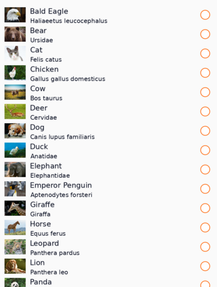
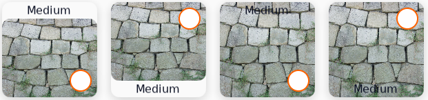
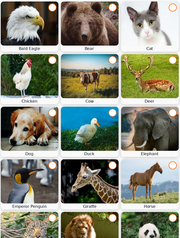

# CollectionView

[Tizen.NUI.Components.CollectionView](/application/dotnet/api/TizenFX/latest/api/Tizen.NUI.Components.CollectionView.html) is a class for presenting collection of data using different layout specifications. It aims to provide a more flexible, and performant scrollable items view with lower memory usage.

`CollectionView` should be used for presenting collections of data that require scrolling or selection.
While CollectionView manages the appearance of the layout, the appearance of each item is defined by a [Tizen.NUI.Binding.DataTemplate](/application/dotnet/api/TizenFX/latest/api/Tizen.NUI.Binding.DataTemplate.html) class that uses a [Tizen.NUI.Components.RecyclerViewItem](/application/dotnet/api/TizenFX/latest/api/Tizen.NUI.Components.RecyclerViewItem.html) class to display items. NUI includes item types to display combinations of text and images, and you can also define custom items that display any content you want. `CollectionView` also includes support for displaying header, footer, and grouped data.

**Figure: UI components**

 

## CollectionView properties

The `CollectionView` class derives from the [Tizen.NUI.Components.RecyclerView](/application/dotnet/api/TizenFX/latest/api/Tizen.NUI.Components.RecyclerView.html) class, from which it inherits the following properties:

**Table: RecyclerView properties**

| Property                  | Type               | Description                                          |
|---------------------------|--------------------|------------------------------------------------------|
| `ItemSource`              | `IEnumerable`      | The data source for collection of item               |
| `ItemTemplate`            | `DataTemplate`     | The template for apply each item to be displayed.    |


`CollectionView` defines the following properties:


**Table: CollectionView properties**

| Property                  | Type               | Description                                                              |
|---------------------------|--------------------|--------------------------------------------------------------------------|
| `ItemsLayouter`           | `ItemsLayouter`    | To layout items flexibly with scrolling geometry.                        |
| `Header`                  | `RecyclerViewItem` | The header of CollectionView. It is also in the scrollable area.|
| `Footer`                  | `RecyclerViewItem` | The footer of CollectionView. It is also in the scrollable area.         |
| `IsGrouped`               | `bool`             | The boolean flag to set group mode.                                      |
| `GroupHeaderTemplate`     | `DataTemplate`     | The template to apply each group header items.                           |
| `GroupFooterTemplate`     | `DataTemplate`     | The template to apply each group footer items.                           |
| `SelectionMode`           | `ItemSelectionMode`| The selection mode for single and multi selection.                       |
| `SelectedItem`            | `object`           | The last selected item.                                                  |
| `SelectedItems`           | `IList<object>`    | The list of selected items in multi-selection mode.                      |


[Tizen.NUI.Components.ScrollableBase](/application/dotnet/api/TizenFX/latest/api/Tizen.NUI.Components.ScrollableBase.html) class is the indirect base class of the `CollectionView`, and you can also use its properties and methods such as `ScrollingDirection` or `ScrollPosition`.


## Create item source

To use `CollectionView` class, the item source needs to be created first. Item source is the collection of data on each item, which can notify the changes on demand.

1. Create an model class of item data:
    ```csharp
    class Animal
    {
        private string _name;
        private string _scientificName;
        private string _imageResource;
        private string _imageUrl = Tizen.Applications.Application.Current.DirectoryInfo.Resource + "/animals/";

        public Animal(string name, string scientificName, string imageResource)
        {
            _name = name;
            _scientificName = scientificName;
            _imageResource = imageResource;
        }

        public string Name
        {
            get => _name;
            set => _name = value;
        }

        public string ScientificName
        {
            get => _scientificName;
            set => _scientificName = value;
        }

        public string ImagePath
        {
            get => _imageUrl + _imageResource;
        }
    }
    ```
    To apply property changes dynamically in the `CollectionView`, you need to implement [System.ComponentModel.INotifyPropertyChanged](https://learn.microsoft.com/En-us/dotnet/api/system.componentmodel.inotifypropertychanged?view=netstandard-2.0){:target="_blank"} interface:

    ```csharp
    class Animal : INotifyPropertyChanged
    {
        public event PropertyChangedEventHandler PropertyChanged;

        public string Name
        {
            get => _name;
            set
            {
                _name = value;
                //Invoke property changed event when property changed.
                PropertyChanged?.Invoke(this, new PropertyChangedEventArgs("Name"));
            }
        }
    }
    ```

2. Create [System.Collections.Generic.IEnumerable](https://learn.microsoft.com/en-us/dotnet/api/system.collections.ienumerable?view=netstandard-2.0){:target="_blank"} data collection for items. For simple collection, [System.Collections.Generic.List\<T\>](https://learn.microsoft.com/En-us/dotnet/api/system.collections.generic.list-1?view=netstandard-2.0){:target="_blank"} can be useful:

    ```csharp
    var animals = new List<Animal>();
    animals.Add(new Animal("Cat", "Felis catus", "cat.png"));
    animals.Add(new Animal("Dog", "Canis lupus familiaris", "dog.png"));
    animals.Add(new Animal("Fox", "Vulpes" "fox.png"));
    animals.Add(new Animal("Horse", "Equus ferus", "horse.png"));
    ```

    To apply data changes dynamically in the `CollectionView`, you need to implement [System.ComponentModel.INotifyPropertyChanged](https://learn.microsoft.com/En-us/dotnet/api/system.componentmodel.inotifypropertychanged?view=netstandard-2.0){:target="_blank"} and [System.Collections.Specialized.INotifyCollectionChanged](https://learn.microsoft.com/en-us/dotnet/api/system.collections.specialized.inotifycollectionchanged?view=netstandard-2.0){:target="_blank"} interface.
   [System.Collections.ObjectModel.ObservableCollection\<T\>](https://learn.microsoft.com/en-us/dotnet/api/system.collections.objectmodel.observablecollection-1?view=netstandard-2.0){:target="_blank"} can be useful for this purpose:

    ```csharp
    var animals = new ObservableCollection<Animal>();
    ```

## Create grouped item source

`CollectionView` supports grouped item source with  [System.Collections.ObjectModel.ObservableCollection\<T\>](https://learn.microsoft.com/en-us/dotnet/api/system.collections.objectmodel.observablecollection-1?view=netstandard-2.0){:target="_blank"}:
1. Create `System.Collections.ObjectModel.ObservableCollection<T>` data collection for a group:

    ```csharp
    class Family : ObservableCollection<Animal>
    {
        private string _name;
        public Family(string name)
        {
            _name = name;
        }

        public Name
        {
            get => _name;
            set
            {
                _name = value;
                OnPropertyChanged(new PropertyChangedEventArgs("Name"));
            }
        }
    }
   ```
2. To add a group into group collection:

    ```csharp

    var families = new ObservableCollection<Family>();

    var falidae = new Family("Falidae");
    falidae.Add(new Animal("Cat", "Felis catus", "cat.png"));
    falidae.Add(new Animal("Cheetah", "Acinonyx jubatus", "cheetah.png"));
    falidae.Add(new Animal("Leopard", "Panthera pardus", "leopard.png"));
    falidae.Add(new Animal("Lion", "Panthera leo", "lion.png"));
    falidae.Add(new Animal("Tiger", "Panthera tigris", "tiger.png"));
    families.Add(falidae);

    var canidae = new Family("Canidae");
    canidae.Add(new Animal("Coyote", "Canis latrans" "coyote.png"));
    canidae.Add(new Animal("Dog", "Canis lupus familiaris", "dog.png"));
    canidae.Add(new Animal("Fox", "Vulpes" "fox.png"));
    canidae.Add(new Animal("Raccoon dog", "Nyctereutes procyonoides" "raccoondog.png"));
    canidae.Add(new Animal("Wolf", "Canis lupus" "wolf.png"));
    families.Add(canidae);
    ```

To use grouped item source in `CollectionView`, `IsGrouped` property must be true.


## Create items

1. To create items in `CollectionView`, use `Tizen.NUI.Binding.DataTemplate` class as `ItemTemplate` of `CollectionView`:

    <div id="TabSection1">
        <div class="sampletab " id="ProjectCreateTab">
            <button id="ItemTemplate-CSharp" class="tablinks " onclick="openTabSection(event, 'ItemTemplate-CSharp', 'TabSection1') ">C#</button>
            <button id="ItemTemplate-Xaml" class="tablinks " onclick="openTabSection(event, 'ItemTemplate-Xaml', 'TabSection1') ">Xaml</button>
        </div>
        <div id="ItemTemplate-CSharp" class="tabcontent">
            <table>
                <tbody>
                    <tr>
    <span style="display:block">

    ```csharp
    var collectionView = new CollectionView()
    {
        ItemTemplate = new DataTemplate(() =>
        {
            /// Create item here. This method is CreateContent() of DataTemplate.
        });
    }
   ```

    </span>
                    </tr>
                </tbody>
            </table>
        </div>
        <div id="ItemTemplate-Xaml" class="tabcontent">
            <table>
                <tbody>
                    <tr>
    <span style="display:block">


    ```xaml
    <CollectionView>
        <ItemTemplate>
            <DataTemplate>
                <!-- Create item here -->
            </DataTemplate>
        </ItemTemplate>
    </CollectionView>
    ```


    </span>
                    </tr>
                </tbody>
            </table>
        </div>
    </div>

2. Create an item as the content of the `Tizen.NUI.Binding.DataTemplate` class.<br>
    `CollectionView` accepts `Tizen.NUI.Components.RecyclerViewItem` class as an item. Developers can create a new class inherited from abstract `Tizen.NUI.Components.RecyclerViewItem` class, or use pre-defined default item classes.<br>
    The following classes are pre-defined default item classes:


    **Figure: Tizen.NUI.Components.DefaultLinearItem**

    

    `Tizen.NUI.Components.DefaultLinearItem` is for LinearLayout items. It provides the following contents:

    **Table: Tizen.NUI.Components.DefaultLinearItem**

    | Property                  | Type               | Description                                                              |
    |---------------------------|--------------------|--------------------------------------------------------------------------|
    | `Text`                    | `string`           | The main text. It uses `Label` to get `TextLabel` object.                |
    | `SubText`                 | `string`           | The substitute text. It uses `SubLabel` to get `TextLabel` object.       |
    | `Icon`                    | `View`             | The left icon content of item.                                           |
    | `Extra`                   | `View`             | The right icon content of item.                                          |


    **Figure: Tizen.NUI.Components.DefaultGridItem**

    

    `Tizen.NUI.Components.DefaultGridItem` is for GridLayout items. It provides the following contents:

    **Table: Tizen.NUI.Components.DefaultGridItem**

    | Property                  | Type               | Description                                                                     |
    |---------------------------|--------------------|---------------------------------------------------------------------------------|
    | `Text`                    | `string`           | The main text. It uses `Label` to get `TextLabel` object.               |
    | `Image`                   | `ImageView`        | The image content of item. To set resource on an image use ResourceUrl. |
    | `Badge`                   | `View`             | The top-right badge icon content of item.                               |
    | `LabelOrientationType`    | `DefaultGridItem.LabelOrientation` | The enum type for label orientation. The label can be placed on the outer/inner side of the image and on the top/bottom side of the image. |


    **Figure: Tizen.NUI.Components.DefaultTitleItem**

    

    `Tizen.NUI.Components.DefaultTitleItem` is for group header items. It provides the following contents:

    **Table: Tizen.NUI.Components.DefaultTitleItem**
    | Property                  | Type               | Description                                                              |
    |---------------------------|--------------------|--------------------------------------------------------------------------|
    | `Text`                    | `string`           | The main text. It uses `Label` to get `TextLabel` object.                |
    | `Icon`                    | `View`             | The left icon content of item.                                           |
    | `Seperator`               | `View`             | The bottom separator of group title for dividing from it's chlidren.     |


    Use data binding for property update.

    <div id="TabSection2">
        <div class="sampletab " id="ProjectCreateTab">
            <button id="ItemCreate-CSharp" class="tablinks " onclick="openTabSection(event, 'ItemCreate-CSharp', 'TabSection2') ">C#</button>
            <button id="ItemCreate-Xaml" class="tablinks " onclick="openTabSection(event, 'ItemCreate-Xaml', 'TabSection2') ">Xaml</button>
        </div>
        <div id="ItemCreate-CSharp" class="tabcontent">
            <table>
                <tbody>
                    <tr>
    <span style="display:block">


    ```csharp
    var collectionView = new CollectionView()
    {
        ItemTemplate = new DataTemplate(() =>
        {
            var item =  DefaultLinearItem()
            {
                WidthSpecification = LayoutParamPolicies.MatchParent
            };

            item.SetBinding(DefaultLinearItem.TextProperty, "Name");
            item.SetBinding(DefaultLinearItem.SubTextProperty, "ScientificName");
            item.Icon = new ImageView()
            {
                WidthSpecification = 80,
                HeightSpecification = 80,
            };
            item.Icon.SetBinding(ImageView.ResourceUrlProperty, "ImagePath");

            return item;
        });
    }
   ```

    </span>
                    </tr>
                </tbody>
            </table>
        </div>
        <div id="ItemCreate-Xaml" class="tabcontent">
            <table>
                <tbody>
                    <tr>
    <span style="display:block">

    ```xaml
    <CollectionView>
        <CollectionView.ItemTemplate>
            <DataTemplate>
                <DefaultLinearItem
                    WidthSpecification="{Static LayoutParamPolicies.MatchParent}"
                    Text="{Binding Path=Name}"
                    SubText="{Binding Path=ScientificName}">
                    <DefaultLinearItem.Icon>
                        <ImageView
                            WidthSpecification="80"
                            HeightSpecification="80"
                            ResourceUrl="{Binding Path=ImagePath}" />
                    </DefaultLinearItem.Icon>
                </DefaultLinearItem>
            </DataTemplate>
        </CollectionView.ItemTemplate>
    </CollectionView>
    ```

    </span>
                    </tr>
                </tbody>
            </table>
        </div>
    </div>


`CreateContent()` will be performed internally with `CollectionView` class and [Tizen.NUI.Components.ItemsLayouter](/application/dotnet/api/TizenFX/latest/api/Tizen.NUI.Components.ItemsLayouter.html) class, Here, generated items can be cached, and recycled on different positions.

`GroupHeader` and `GroupFooter` also can be created with `Tizen.NUI.Binding.DataTemplate` class.


## Set layout on CollectionView

`CollectionView` allows changing items layout using `Tizen.NUI.Components.ItemsLayouter`.

NUI provides the following pre-defined ItemsLayouter:

**Table: ItemsLayouter derivded class**

| Class                     | Figure                     | Description                                                              |
|---------------------------|----------------------------|--------------------------------------------------------------------------|
| `Tizen.NUI.Components.LinearLayouter` | | Layout items on linear position such as list view.       |
| `Tizen.NUI.Components.GridLayouter` |     | Layout items on grid rows and columns.<br>The row and column count will be automatically calculated by item's size. |


<div id="TabSection3">
    <div class="sampletab " id="ProjectCreateTab">
        <button id="ItemLayouter-CSharp" class="tablinks " onclick="openTabSection(event, 'ItemLayouter-CSharp', 'TabSection3') ">C#</button>
        <button id="ItemLayouter-Xaml" class="tablinks " onclick="openTabSection(event, 'ItemLayouter-Xaml', 'TabSection3') ">Xaml</button>
    </div>
    <div id="ItemLayouter-CSharp" class="tabcontent">
        <table>
            <tbody>
                <tr>
<span style="display:block">


```csharp
var collectionView = new CollectionView()
{
    ItemsLayouter = new LinearLayouter(),
    ScrollingDirection = Tizen.NUI.Components.ScrollableBase.Direction.Vertical
}
```

</span>
                </tr>
            </tbody>
        </table>
    </div>
    <div id="ItemLayouter-Xaml" class="tabcontent">
        <table>
            <tbody>
                <tr>
<span style="display:block">

```xaml
<CollectionView ScrollingDirection="Vertical">
    <ItemsLayouter>
        <LinearLayouter />
    </ItemsLayouter>
</CollectionView>
```

</span>
                </tr>
            </tbody>
        </table>
    </div>
</div>


<script>
    function openTabSection(evt, profileName, sectionId) {
        var i, tabcontent, tablinks, section;
        let selected = 0;

        section = document.getElementById(sectionId);
        tabcontent = section.getElementsByClassName("tabcontent");
        for (i = 0; i < tabcontent.length; i++) {
            tabcontent[i].style.display = "none";
            if (tabcontent[i].id == profileName) {
                selected = i;
            }
        }

        tablinks = section.getElementsByClassName("tablinks");

        for (i = 0; i < tablinks.length; i++) {
            tablinks[i].className = tablinks[i].className.replace(" active", "");
        }

        tabcontent[selected].style.display = "block";
        evt.currentTarget.className += " active";
    }
    document.getElementById("ItemTemplate-CSharp").click();
    document.getElementById("ItemCreate-CSharp").click();
    document.getElementById("ItemLayouter-CSharp").click();
</script>


## Selection in CollectionView

The `CollectionView` provides item selection feature. Selection can be controlled by [`SelectionMode`](/application/dotnet/api/TizenFX/latest/api/Tizen.NUI.Components.CollectionView.html#Tizen_NUI_Components_CollectionView_SelectionMode), which provides you with single or multi-selection.

**Table: ItemSelectionMode**
| Mode           | Description                                                                                   |
|----------------|-----------------------------------------------------------------------------------------------|
| `None`         | It is the default mode where none of the items can be selected.                               |
| `Single`       | Allows exclusive single selection. Any previously selected item will be deselected.           |
| `SingleAlways` | Allows only a single selection. It's not possible to deselect item, so once the user selects an item, there is always exactly one item selected. |
| `Multiple`     | Allows multiple selections without deselecting previous selected items.                       |

Selection can be handled by user interactions such as key or touch inputs.
Changing selection will initiate [SelectionChanged](/application/dotnet/api/TizenFX/latest/api/Tizen.NUI.Components.CollectionView.html#Tizen_NUI_Components_CollectionView_SelectionChanged) event.<br>
The [Tizen.NUI.Components.SelectionChangedEventArgs](/application/dotnet/api/TizenFX/latest/api/Tizen.NUI.Components.SelectionChangedEventArgs.html) object that accompanies the [SelectionChanged](/application/dotnet/api/TizenFX/latest/api/Tizen.NUI.Components.CollectionView.html#Tizen_NUI_Components_CollectionView_SelectionChanged) event has two properties, both of type [System.Collections.Generic.IReadOnlyList\<object\>](https://learn.microsoft.com/en-us/dotnet/api/system.collections.generic.ireadonlylist-1?view=netstandard-2.0){:target="_blank"}, wihch are described below:

- `PreviousSelection`: The list of items that were selected, before the selection changed.
- `CurrentSelection`: The list of items that are selected, after the selection changed.


1. Single selection

    [SelectionMode](/application/dotnet/api/TizenFX/latest/api/Tizen.NUI.Components.CollectionView.html#Tizen_NUI_Components_CollectionView_SelectionMode) is `Single` or `SingleAlways`, `CollectionView` only selects single items and previously selected item will be deselected.
    To get or set currently selected item, use [SelectedItem](/application/dotnet/api/TizenFX/latest/api/Tizen.NUI.Components.CollectionView.html#Tizen_NUI_Components_CollectionView_SelectedItem) property:

    ```csharp
    var collectionView = new CollectionView()
    {
        ItemSource = animalSource;
        SelectionMode = ItemSelectionMode.Single, // itemSelectionMode.SingleAlways,
        SelectedItem = animalSource[10]; // 10th item will be selected.
    }

    collectionView.SelectionChanged = ((object o, SelectionChangedEventArgs ev) => {
        Animal animal = null;
        // Single Selection Only have 1 or nil object in the list.
        foreach (object item in ev.PreviousSelection)
        {
            animal = item as Animal;
            if (animal == null) break;

            Console.WriteLine($"Previous selected item {animal.Name}");
        }
        foreach (object item in ev.CurrentSelection)
        {
            animal = item as Animal;
            if (animal == null) break;

            Console.WriteLine($"Current selected item {animal.Name}");
        }
    });
   ```


2. Multiple selection

    `SelectionMode` is `Multiple`, `CollectionView` selects multiple items.
    To get currently selected items, use [`SelectedItems`](/application/dotnet/api/TizenFX/latest/api/Tizen.NUI.Components.CollectionView.html#Tizen_NUI_Components_CollectionView_SelectedItems) property.
    To set new selection, use [`UpdateSelectedItems()`](/application/dotnet/api/TizenFX/latest/api/Tizen.NUI.Components.CollectionView.html#Tizen_NUI_Components_CollectionView_UpdateSelectedItems_System_Collections_Generic_IList_System_Object__) method:

    ```csharp
    var collectionView = new CollectionView()
    {
        ItemSource = animalSource;
        SelectionMode = ItemSelectionMode.Multiple,
    }

    collectionView.SelectionChanged = ((object o, SelectionChangedEventArgs ev) => {
        Animal animal = null;
        foreach (object item in ev.PreviousSelection)
        {
            animal = item as Animal;
            if (animal == null) break;

            Console.WriteLine($"Previous selected item {animal.Name}");
        }
        foreach (object item in ev.CurrentSelection)
        {
            animal = item as Animal;
            if (animal == null) break;

            Console.WriteLine($"Current selected item {animal.Name}");
        }
    });

    var newSelection = new List<Animal>();
    for(int i = 3; int i < 10; i++)
    {
        newSelection.Add(animalSource[i]);
    }

    collectionView.UpdateSelectedItems(newSelection);
   ```

 ## Other features

`CollectionView` can use not only scroll-related features and events as it is a descendant of `Tizen.NUI.Components.ScrollableBase`, but also provide an extended method of [ScrollTo()](/application/dotnet/api/TizenFX/latest/api/Tizen.NUI.Components.CollectionView.html#Tizen.NUI.Components.CollectionView.html#Tizen_NUI_Components_CollectionView_ScrollTo_System_Single_System_Boolean_) which requires [`Tizen.NUI.Component.ItemScrollTo](/application/dotnet/api/TizenFX/latest/api/Tizen.NUI.Components.CollectionView.ItemScrollTo.html) type:

```csharp
var collectionView = new CollectionView();
collectionView.ScrollTo(10, true, ItemScrollTo.Nearest);
```

## Related information

- Dependencies
  -   Tizen 7.0 and Higher
