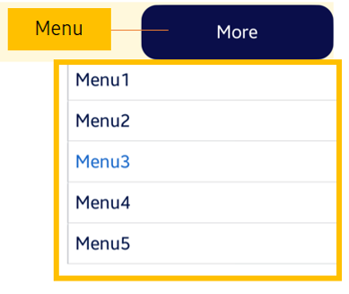

# Menu

Menu is a class which contains a set of MenuItems and has one of them selected.



## Create Menu

To create a Menu, follow these steps:

1. Define the Menu in XAML:

    ```xaml
    <comp:Menu.Items>
        <Array Type="{x:Type MenuItem}">
            <MenuItem x:Name="menuItem1" Text="Menu1" Clicked="MenuItem1Clicked"/>
            <MenuItem x:Name="menuItem2" Text="Menu2" Clicked="MenuItem2Clicked"/>
            <MenuItem x:Name="menuItem3" Text="Menu3" Clicked="MenuItem3Clicked"/>
            <MenuItem x:Name="menuItem4" Text="Menu4" Clicked="MenuItem4Clicked"/>
            <MenuItem x:Name="menuItem5" Text="Menu5" Clicked="MenuItem5Clicked"/>
        </Array>
    </comp:Menu.Items>

    ```
2. Define own Menu in C#:

   ```csharp
    public partial class MenuTestMenu : Menu
    {
        public MenuTestMenu()
        {
            InitializeComponent();
        }

        private void MenuItem1Clicked(object sender, ClickedEventArgs args)
        {
            this.Dismiss();
        }

        private void MenuItem2Clicked(object sender, ClickedEventArgs args)
        {
            this.Dismiss();
        }

        private void MenuItem3Clicked(object sender, ClickedEventArgs args)
        {
            this.Dismiss();
        }

        private void MenuItem4Clicked(object sender, ClickedEventArgs args)
        {
            this.Dismiss();
        }

        private void MenuItem5Clicked(object sender, ClickedEventArgs args)
        {
            this.Dismiss();
        }
    }
   ```

3. Set the Menu properties:

   ```csharp
   MenuTestMenu menu;
   menu.Anchor = btn;
   menu.HorizontalPositionToAnchor = Menu.RelativePosition.Center;
   menu.VerticalPositionToAnchor = Menu.RelativePosition.End;
   menu.Post();

   ```

4. Define the callback to handle click event arguments sent to user:

   ```csharp
   private void MenuItemClicked(object sender, ClickedEventArgs e)
   {
       menu.Dismiss();
   }
   ```


## Related information

- Dependencies
  -   Tizen 6.5 and Higher 

- API References
  - [Menu API](/application/dotnet/api/TizenFX/latest/api/Tizen.NUI.Components.Menu.html)
