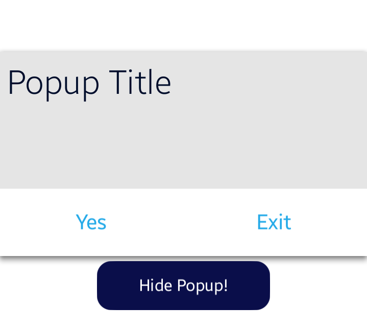

# Popup
Popup is a common component that is used as a popup window. You can manage a popup button count, head title, and content area.

A popup can be created using property.


## Add namespace
To implement popup, include `Tizen.NUI.Components` namespace in your application:

```xaml
xmlns:base="clr-namespace:Tizen.NUI.BaseComponents;assembly=Tizen.NUI"
xmlns:comp="clr-namespace:Tizen.NUI.Components;assembly=Tizen.NUI.Components"
```

## Create with property

To create a popup using property, follow these steps:

1. Create popup using the default constructor:

    ```xaml
    <comp:Popup x:Name="popup" TitleText="Popup!" WidthSpecification="-1" HeightSpecification="400" Position="0,0"/>
    ```

2. Set the popup property:

    ```xaml
    //set Popup property
    <comp:Popup x:Name="popup" TitleText="Popup Title" WidthSpecification="-1" HeightSpecification="400"
        Position="0, 0" TitleTextColor="Black" TitleTextHorizontalAlignment="Begin"
        TitleHeight="120" TitleTextHorizontalAlignment="Begin" ButtonTextColor="0.05f, 0.63f, 0.9f, 1"
        ButtonHeight="132" ButtonCount="2"/>
    ```

    ```xaml
    popup.SetButtonText(0, "Yes");
    popup.SetButtonText(1, "Exit");
    ```

The following output is generated when the popup is created using property:



## Respond to popup button click event
When you click the popup button, the popup instance receives a popup button click event.
You can declare the event handler as follows:

```xaml
PopupButtonClickEvent="PopupButtonClickEvent"
```

```csharp
private void PopupButtonClickEvent(object sender, Popup.ButtonClickEventArgs e)
{
   // popup click action
}
```

## Related information
- Dependencies
  -   Tizen 6.5 and Higher

