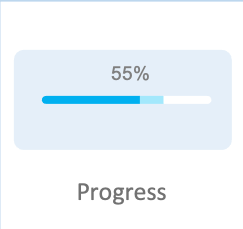

# Progress

Progress is a common component that is used to show the ongoing status using a long narrow bar.

The following are the instances where Progress is used:

- To show the processing time
- To show the number of items in Progress
- To show the Progress rate depending on the screen layout



## Add namespace
To implement Progress, include `Tizen.NUI.Components` namespace in your application:

```xaml
  xmlns:base="clr-namespace:Tizen.NUI.BaseComponents;assembly=Tizen.NUI"
  xmlns:comp="clr-namespace:Tizen.NUI.Components;assembly=Tizen.NUI.Components"
```

## Create with property

To create a Progress using property, follow these steps:

1. Create Progress using the default constructor:

    ```xaml
    <Progress x:Name="progress"/>
    ```

2. Set the Progress property:

    ```xaml
    <Progress x:Name="progress"
        WidthSpecification="-1" 
        MinValue="0.0"
        MaxValue="100.0"
        CurrentValue="0.45"
        TrackColor="Green"
        ProgressColor="Black"/>
    ```

The following output is generated when the Progress is created using property:


## Related information

- Dependencies
  -   Tizen 6.5 and Higher
