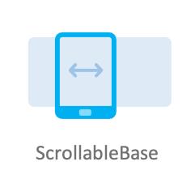
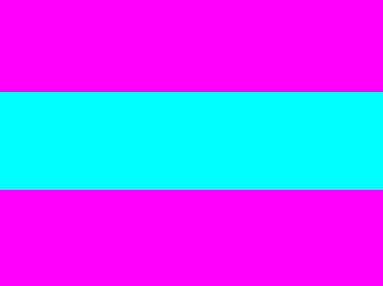

# ScrollableBase

ScrollableBase is a common component that supports scrolling. You can add several views to the ScrollableBase component.
You can use a mouse or finger on the touch screen to drag a ScrollableBase component.


## Create with property

To create a ScrollableBase using various properties, follow these steps:

1. Create `ScrollableBase` using the default constructor:

    ```xaml
    <comp:ScrollableBase x:Name="scroller"/>
    ```

2. Set the `ScrollableBase` property:

    ```xaml
    <comp:ScrollableBase x:Name="scroller" ScrollingDirection="Vertical" WidthSpecification="400" HeightSpecification="300">
    ```

3. Add child views for `ScrollableBase`:

    ```csharp
    View[] items = new View[5];
    for (int i = 0; i < items.Length; i++)
    {
        items[i] = new View
        {
            Position = new Position(0, i * 100),
            Size = new Size(400, 100),
        };
        if (i % 2 == 0)
        {
            items[i].BackgroundColor = Color.Magenta;
        }
        else
        {
            items[i].BackgroundColor = Color.Cyan;
        }
        scroller.Add(items[i]);
    }
    ```

The following output is generated when the ScrollableBase is created using property:



## Scroll drag events responses

When a ScrollableBase is dragged, the ScrollableBase instance receives a scroll drag started event.
When the ScrollBase dragging is stopped, the ScrollableBase instance receives a scroll drag ended event.
You can declare the events handlers as follows:

```xaml
<comp:ScrollableBase x:Name="scroller" ScrollDragStarted="ScrollDragStarted" ScrollDragEnded="ScrollDragEnded"/>
```

```csharp
private void ScrollDragStarted(object sender, ScrollEventArgs e)
{
    // Do something in response to scroll drag started
}

private void ScrollDragEnded(object sender, ScrollEventArgs e)
{
    // Do something in response to scroll drag ended
}
```

The following output is generated when the ScrollableBase is dragged:



## Related information

- Dependencies
  -   Tizen 6.5 and Higher

