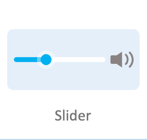
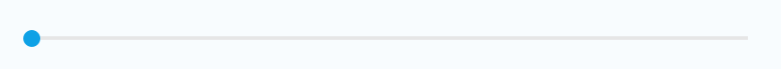

# Slider

A Slider enables you to select a value from a continuous or discrete range of values by moving the Slider thumb.

Sliders are classified into a horizontal type and a vertical type, depending on their orientation, and the number of sliders that are adjusted simultaneously.

Using a Slider you can adjust the steps or strength of settings, such as brightness and contrast.

 

## Add namespace
To implement Slider, include `Tizen.NUI.Components` namespace in your application:

```xaml
 xmlns:base="clr-namespace:Tizen.NUI.BaseComponents;assembly=Tizen.NUI"
 xmlns:comp="clr-namespace:Tizen.NUI.Components;assembly=Tizen.NUI.Components"
```

## Create with property

To create a Slider using property, follow these steps:

1. Create Slider using the default constructor:

    ```xaml
    <comp:Slider WidthSpecification="-1" HeightSpecification="-1"/>
    ```

2. Set the Slider property:

    ```xaml
    <comp:Slider x:Name="slider"
        MinValue="0"
        MaxValue="100"
        CurrentValue="10"
        WidthSpecification="-1" 
        HeightSpecification="-1" 
        TrackThickness="4"
        BgTrackColor="#b1b1b1"
        SlidedTrackColor="#3db9cc"
        Direction="Vertical"/>
    ```

The following output is generated when the Slider is created using property:


## Respond to value changed event

When you touch or pan a Slider, the Slider instance receives a value changed event.
You can declare the value changed event handler as follows:

```csharp
slider.ValueChanged += OnValueChanged;
```

```csharp
private void OnValueChanged(object sender, SliderValueChangedEventArgs args)
{
    // Do something in response to Slider click
}
```


## Respond to state changed event

Slider has eight different states as: `Normal`, `Focused`, `Disabled`, `Selected`, `Pressed`, `DisabledFocused`, `SelectedFocused`, and `DisabledSelected`.  
When you change the Slider state as change focus or disable a Slider, the Slider instance receives a state changed event. You can declare the state changed event handler as follows:

```csharp
slider.ControlStateChangedEvent += OnStateChanged;
```

```csharp
private void OnStateChanged(object sender, Control.ControlStateChangedEventArgs e)
{
    // Do something in response to state change
}
```

## Respond to slide finished event

As you finish a touch or a pan operation on a Slider, the Slider instance receives a slide finished event. You can declare the slide finished event handler as follows:

```csharp
slider.SlidingFinished += OnSlidingFinished;
```

```csharp
private void OnSlidingFinished(object sender, SliderSlidingFinishedEventArgs args)
{
    // Do something in response to slide finished
}
```

## Related information

- Dependencies
  -   Tizen 6.5 and Higher 

- API References
  - [Slider API](/application/dotnet/api/TizenFX/latest/api/Tizen.NUI.Components.Slider.html)
